<p align="center">
  
</p>

<p align="center">
  Ship faster. Ship better. Ship with <b>The Agentic Startup</b>.
</p>

<p align="center">
  <a href="https://github.com/rsmdt/the-startup/releases/latest">
    
  </a>

  <a href="https://github.com/hesreallyhim/awesome-claude-code">
    
  </a>
</p>

---

## 🤖 What is The Agentic Startup?

**The Agentic Startup** is a spec-driven development framework for Claude Code that transforms how you build software. Think of it as having instant access to expert developers, architects, and engineers - all working together in parallel to turn your ideas into shipped code.

We follow **[Spec-Driven Development](https://www.perplexity.ai/?q=Spec+Driven+Development)**, where comprehensive specifications are created before coding begins, ensuring clarity and reducing rework.

**The workflow**:

1. **📋 Specify** - Turn ideas into comprehensive specification documents (requirements, design, and implementation plan)
2. **⚡ Implement** - Execute plans phase-by-phase with parallel agent coordination
3. **📚 Document** - Automatically capture patterns and knowledge as you build
4. **🔄 Refactor** - Improve code quality while preserving behavior

The framework leverages **Claude Code's plugin system** to provide workflow commands, autonomous skills, specialized agents, and quality templates - all working together like a high-velocity startup team.

---

> [!NOTE]
> **The Agentic Startup v2.0** is a complete rewrite for the Claude Code marketplace plugin system. The previous version (v1.x) used a Go-based bash script installer. See [MIGRATION.md](MIGRATION.md) if upgrading.

### What's New in 2.0

✨ **Native Claude Code Integration**
- Distributed as official Claude Code marketplace plugins
- Two plugins: `start` (workflows) + `team` (agents)
- Seamless installation via Claude Code plugin system
- Zero manual configuration required

🤖 **Autonomous Skills System**
- Model-invoked skills that activate based on natural language
- Progressive disclosure for optimal token efficiency
- Skills for documentation, agent delegation, and more

👥 **Specialized Agent Team**
- 11 agent roles across 6 professional categories
- 39+ activity-based specializations
- Install optionally via `team@the-startup` plugin

🎯 **Streamlined Architecture**
- Commands orchestrate high-level workflows
- Skills provide autonomous capabilities
- Agents deliver specialized expertise
- Rules define operational patterns

### Migrating from 1.x

> **📌 Upgrading from the bash script installer (pre-2.0)?**
> See the [complete migration guide](MIGRATION.md) for step-by-step instructions.

---

## 🚀 Quick Start

### Installation

**Requirements**: Claude Code v2.0+ with marketplace support

```bash
# Add The Agentic Startup marketplace
/plugin marketplace add rsmdt/the-startup

# Install the Start plugin (core workflows)
/plugin install start@the-startup

# (Optional) Install the Team plugin (specialized agents)
/plugin install team@the-startup
```

Alternatively, browse and install interactively via `/plugin`

### Initialize Your Environment

Configure output style and statusline (one-time setup):

```bash
/start:init
```

This sets up:
- **The Startup** output style (high-energy parallel execution)
- Git-aware statusline
- Interactive preferences

### Your First Workflow

**1. Create a specification:**
```bash
/start:specify Add user authentication with OAuth support
```

Creates `docs/specs/001-user-authentication/` with product-requirements.md, solution-design.md, and implementation-plan.md documents.

**2. Execute the implementation:**
```bash
/start:implement 001
```

Runs phase-by-phase with parallel agents, validation gates, and progress tracking.

**3. Analyze patterns:**
```bash
/start:analyze security patterns in authentication
```

Discovers and documents patterns in `docs/patterns/`, `docs/domain/`, `docs/interfaces/`

---

## 🎯 Claude Code Features Explained

The Agentic Startup leverages Claude Code's powerful extensibility features:

### 🔌 Plugins (Marketplace)

**What:** Distributable packages of commands, skills, agents, and rules

**How we use it:**
- `start` - Workflow orchestration plugin
- `team` - Specialized agent library

**Install:**
```bash
/plugin marketplace add rsmdt/the-startup
/plugin install start@the-startup
```

### ⚡ Commands (User-Invoked)

**What:** Slash commands you explicitly run (e.g., `/start:specify`)

**How we use it:**
- 5 workflow commands for specification, implementation, analysis, refactoring, initialization
- Commands orchestrate multi-step processes
- User decides when to invoke

**Example:** `/start:specify Add real-time notifications`

### 🤖 Skills (Model-Invoked)

**What:** Autonomous capabilities Claude activates based on context

**How we use it:**
- `documentation` - Automatically documents patterns/interfaces when discovered
- `agent-delegation` - Breaks down tasks and coordinates agents

**Activation:** Natural language (e.g., "break down this complex task")

### 👥 Agents (Team Plugin)

**What:** Specialized personas with focused expertise

**How we use it:**
- `team@the-startup` plugin provides 11 agent roles
- Activity-based specialization (requirements, architecture, implementation, QA, design, platform engineering)
- Launched via Task tool for specialist work

**Install:** `/plugin install team@the-startup`

### 📊 Statusline (Hooks)

**What:** Dynamic status bar showing context at bottom of Claude Code

**How we use it:**
- Git branch integration
- Current command state
- Configured via `/start:init`

**Example:** `[main] | /start:specify running...`

### 🎨 Output Style

**What:** Personality and communication style for Claude

**How we use it:**
- **The Startup** - High-energy, parallel-execution orchestration style
- Automatically included with plugin
- Activated via `/start:init`

**Style:** Y Combinator energy meets operational excellence

---

## 📋 Commands Reference

Quick reference for all workflow commands. Click command names for detailed documentation.

| Command | Description |
|---------|-------------|
| [`/start:init`](#startinit) | Initialize environment (output style, statusline) |
| [`/start:specify`](#startspecify-description) | Create specification documents from brief description |
| [`/start:implement`](#startimplement-spec-id) | Execute implementation plan phase-by-phase |
| [`/start:analyze`](#startanalyze-area) | Discover and document patterns, rules, interfaces |
| [`/start:refactor`](#startrefactor-description) | Improve code quality while preserving behavior |

---

## 📖 Detailed Command Documentation

### Commands

#### `/start:specify <description>`

Create comprehensive specifications from brief descriptions through deep research and specialist agent coordination.

**Purpose:** Transform ideas into implementation-ready specifications with product requirements, solution design, and implementation plan documents

**Usage:**
```bash
/start:specify Build a real-time notification system with WebSocket support
/start:specify 001  # Resume existing specification work
```

**Key Features:**
- **Auto-incrementing Spec IDs** - Automatically creates numbered directories (001, 002, etc.)
- **Resume Capability** - Can resume work on existing specifications by ID
- **Pattern Documentation** - Automatically documents discovered patterns in `docs/patterns/`
- **Interface Documentation** - Captures external service contracts in `docs/interfaces/`
- **Domain Documentation** - Records business rules in `docs/domain/`
- **Confidence Scoring** - Provides implementation readiness assessment with risk analysis
- **Quality Gates** - Requires user approval between major phases

<details>
<summary><strong>View Details</strong></summary>

**What you get:** Three comprehensive documents in `docs/specs/[ID]-[name]/`:

- **product-requirements.md** - User stories, feature specifications, success criteria, non-functional requirements
- **solution-design.md** - Technical architecture, system components, data models, technology stack, security and performance considerations
- **implementation-plan.md** - Phased task breakdown, dependencies, acceptance criteria, risk assessment


</details>

---

#### `/start:implement <spec-id>`

Execute implementation plans phase-by-phase with parallel specialist agents and continuous validation.

**Purpose:** Transform validated specifications into working code with quality gates and progress tracking

**Usage:**
```bash
/start:implement 001
/start:implement path/to/custom/implementation-plan.md
```

**Key Features:**
- **Parallel Execution** - Multiple agents work simultaneously within phases
- **Sequential Phases** - Phases execute in order with validation gates
- **Rollback on Failure** - Automatic reversion if tests fail
- **Specification Compliance** - Continuous validation against product-requirements.md/solution-design.md
- **Pattern Recognition** - Documents implementation patterns discovered
- **Real-time Updates** - TodoWrite tracking shows live progress
- **Custom Plans** - Can implement any implementation-plan.md file, not just specs

<details>
<summary><strong>View Details</strong></summary>

Loads implementation-plan.md and executes phase-by-phase with approval gates between phases. Multiple specialist agents work in parallel within each phase when tasks are independent. All changes are validated against acceptance criteria and tests run after each task.

```mermaid
flowchart TD
    A([📄 *implementation-plan.md*]) --> |load| B[**Initialize Plan**<br/>Parse phases & tasks]
    B --> |approve| C{Phases<br>Remaining?}
    C --> |yes| D[**Execute Phase N**<br/>⚡ *Parallel agent execution*<br/>✓ *Run tests after each task*]
    D --> |validate| E[**Phase Review**<br/>Check test results<br/>Review changes]
    E --> |continue| C
    C --> |no| F[**Final Validation**<br/>Run full test suite<br/>Verify all requirements]
    F --> END[✅ **Implementation Complete**]
```



</details>

---

#### `/start:analyze <area>`

Discover and document business rules, technical patterns, and system interfaces through iterative exploration.

**Purpose:** Extract organizational knowledge from existing codebase and create reusable documentation

**Usage:**
```bash
/start:analyze security patterns in authentication
/start:analyze business rules for user permissions
/start:analyze technical patterns in our microservices architecture
```

<details>
<summary><strong>View Details</strong></summary>

Uses cyclical discovery-documentation-review workflow to extract organizational knowledge. Specialist agents explore the codebase to identify patterns, rules, and interfaces across business, technical, security, performance, integration, data, testing, and deployment areas. Documentation is automatically organized into `docs/domain/`, `docs/patterns/`, and `docs/interfaces/` directories.

```mermaid
flowchart TD
    A([Analysis Request]) --> |initialize| B[**Scope Definition**<br/>Clarify analysis area<br/>Set cycle plan]
    B --> |start cycle| C[**Discovery Phase**<br/>⚡ *Specialist analysis*<br/>🔍 *Pattern identification*]
    C --> |document| D[**Documentation Phase**<br/>📄 *Create domain docs*<br/>📄 *Create pattern docs*<br/>📄 *Create interface docs*]
    D --> |review| E[**Review & Validation**<br/>Check completeness<br/>Identify gaps]
    E --> |continue?| F{More Cycles<br>Needed?}
    F --> |yes| C
    F --> |no| G[**Final Summary**<br/>📊 *Analysis report*<br/>🎯 *Recommendations*<br/>📋 *Next steps*]
    G --> END[✅ **Analysis Complete**]
```



</details>

---

#### `/start:refactor <description>`

Improve code quality while strictly preserving all existing behavior through test-validated incremental changes.

**Purpose:** Safe, systematic refactoring with automatic rollback on test failures

**Usage:**
```bash
/start:refactor Simplify the authentication middleware for better testability
/start:refactor Improve the WebSocket connection manager
```

<details>
<summary><strong>View Details</strong></summary>

Strictly preserves behavior through test-validated incremental changes. All tests must pass before refactoring begins and after each change. Automatic rollback on test failures. For simple refactorings, applies changes directly with continuous validation. For complex refactorings, creates specification documents and defers to `/start:implement` for planned execution.

```mermaid
flowchart TD
    A([Refactoring Request]) --> |analyze| B[**Goal Clarification**<br/>Define objectives<br/>Analyze codebase]
    B --> |assess| C{**Complexity<br>Check**}
    C --> |simple| D[**Direct Refactoring**<br/>✓ *Run tests first*<br/>🔧 *Apply changes*<br/>✓ *Validate each step*]
    D --> |review| E[**Specialist Review**<br/>Code quality check<br/>Performance impact]
    E --> DONE[✅ **Refactoring Complete**]
    C --> |complex| F[**Create Specification**<br/>📄 *Generate solution-design.md*<br/>📄 *Generate implementation-plan.md*<br/>Document approach]
    F --> |defer| G[🚀 **Ready for /start:implement**<br/>Execute via planned phases]
```



</details>

---

#### `/start:init`

Initialize The Agentic Startup framework in your Claude Code environment with interactive setup.

**Purpose:** One-time setup for optimal configuration of output style and statusline

**Usage:**
```bash
/start:init
```

<details>
<summary><strong>View Details</strong></summary>

Activates "The Startup" output style (high-energy, execution-focused communication with parallel agent orchestration mindset) and configures git-aware statusline with real-time command tracking. Interactive setup asks for preferences and confirms each change before applying. Safe to run multiple times.

</details>

---

### Skills (Autonomous)

#### `documentation`

**Activates when:** Patterns, interfaces, or domain rules are discovered

**Trigger terms:** "pattern", "interface", "domain rule", "document", "reusable"

**What it does:**
- Checks for existing documentation (prevents duplicates)
- Categorizes correctly (domain/patterns/interfaces)
- Uses appropriate templates
- Creates cross-references
- Reports what was documented

**Example activation:**
```
Agent discovers: "I found a reusable caching pattern using Redis"
↓
Documentation skill activates automatically
↓
Creates: docs/patterns/caching-strategy.md
```

**Progressive disclosure:**
- `SKILL.md` - Core documentation logic (~7 KB)
- `reference.md` - Advanced protocols (~11 KB, loads when needed)
- `templates/` - Pattern, interface, domain templates (~6 KB each)

---

#### `agent-delegation`

**Activates when:** Task decomposition, agent coordination, or template generation needed

**Trigger terms:** "break down", "launch agents", "FOCUS/EXCLUDE", "parallel", "coordinate"

**What it does:**
- Decomposes complex tasks into activities
- Determines parallel vs sequential execution
- Generates FOCUS/EXCLUDE templates for agents
- Coordinates file creation (prevents collisions)
- Validates agent responses for scope compliance
- Generates retry strategies for failed agents

**Example activation:**
```
User: "Break down this authentication task"
↓
Agent-delegation skill activates
↓
Outputs:
- Activity breakdown
- Dependency analysis
- Parallel/sequential recommendation
- FOCUS/EXCLUDE templates for each activity
```

**Progressive disclosure:**
- `SKILL.md` - Core delegation logic (~24 KB)
- `reference.md` - Advanced patterns (~19 KB, loads when needed)
- `examples/` - Real-world scenarios (~38 KB, loads when relevant)

---

### Rules (Operational Workflows)

#### `cycle-pattern.md`

**What:** Discovery → Documentation → Review workflow pattern

**Used by:** All iterative commands (specify, analyze)

**Process:**
1. **Discovery Phase** - Launch parallel specialist agents to research
2. **Documentation Phase** - Document findings and update main document
3. **Review Phase** - Present findings to user, get confirmation
4. **Repeat** - Until work is complete

**Purpose:** Ensures consistent iterative workflow across commands

---

### Templates

Rich templates for structured documentation:

```
plugins/start/templates/
├── product-requirements.md      # Product requirements structure
├── solution-design.md            # Solution design structure
├── implementation-plan.md        # Implementation plan structure
├── definition-of-ready.md        # Quality gate
├── definition-of-done.md         # Quality gate
└── task-definition-of-done.md   # Task-level quality gate
```

**Usage:** Automatically used by `/start:specify` when creating specifications

---

### Hooks

#### SessionStart Hook

**When:** Every new Claude Code session

**What it does:**
- Displays welcome banner (first session only)
- Shows available commands
- Confirms plugin is active

#### StatuslineComplete Hook

**When:** After statusline updates

**What it does:**
- Adds git branch information
- Shows current command state
- Updates dynamically during execution

**Configure via:** `/start:init`

---

## 🏗️ Documentation Structure

The plugin encourages structured knowledge management:

```
docs/
├── specs/
│   └── [3-digit-number]-[feature-name]/
│       ├── product-requirements.md         # What to build
│       ├── solution-design.md              # How to build it
│       └── implementation-plan.md          # Implementation tasks
│
├── domain/                                  # Business rules
│   ├── user-permissions.md
│   ├── order-workflow.md
│   └── pricing-rules.md
│
├── patterns/                                # Technical patterns
│   ├── authentication-flow.md
│   ├── caching-strategy.md
│   └── error-handling.md
│
└── interfaces/                              # External integrations
    ├── stripe-payments.md
    ├── sendgrid-webhooks.md
    └── oauth-providers.md
```

### Auto-Documentation

The `documentation` skill automatically creates files in the correct location when patterns, interfaces, or domain rules are discovered during:
- Specification creation (`/start:specify`)
- Implementation (`/start:implement`)
- Analysis (`/start:analyze`)

### Deduplication

The skill always checks existing documentation before creating new files, preventing duplicates.

---

## 🎨 The Startup Output Style

Included with the plugin, activated via `/start:init`.

### Personality

**The Startup** embodies:
- **The Visionary Leader** - "We'll figure it out" - execute fast, iterate faster
- **The Rally Captain** - Turn challenges into team victories
- **The Orchestrator** - Run parallel execution like a conductor
- **The Pragmatist** - MVP today beats perfect next quarter

### Communication Style

**How The Startup communicates:**
- High energy, high clarity ("Let's deliver this NOW!")
- Execution mentality ("We've got momentum, let's push!")
- Celebrate wins ("That's what I'm talking about!")
- Own failures fast ("That didn't work. Here's the fix.")
- Always forward motion ("Next, we're tackling...")

### Workflow Patterns

**What you get:**
- Parallel-first mindset (launches multiple agents simultaneously)
- TodoWrite obsession (tracks every task religiously)
- "Ask yourself" checkpoints (self-validation at key decision points)
- Investor update summaries (comprehensive status reports)

### When to Use

**Perfect for:**
- Fast-paced development
- Complex multi-step workflows
- Parallel agent coordination
- High-energy execution

**Maybe not for:**
- Simple single-step tasks
- Exploratory conversations
- Learning/tutorial sessions

---

## 🔄 Typical Development Workflow

Here's how to use The Agentic Startup end-to-end:

### 1. **Initial Setup** (Once per project)

```bash
/start:init
```

Configures output style and statusline.

### 2. **Create Specification**

```bash
/start:specify Add real-time notification system with WebSocket support and email fallback
```

**What happens:**
- Creates `docs/specs/001-notification-system/`
- Generates product-requirements.md (requirements and use cases)
- Generates solution-design.md (technical architecture and design)
- Generates implementation-plan.md (implementation tasks and phases)
- Documents discovered patterns/interfaces

**Duration:** 15-30 minutes (depending on complexity)

### 3. **Review Specification**

Read generated files:
- `docs/specs/001-notification-system/product-requirements.md`
- `docs/specs/001-notification-system/solution-design.md`
- `docs/specs/001-notification-system/implementation-plan.md`

Provide feedback if needed, Claude will revise.

### 4. **Execute Implementation**

```bash
/start:implement 001
```

**What happens:**
- Loads implementation-plan.md
- Executes Phase 1 tasks
- Waits for user confirmation
- Executes Phase 2 tasks
- Continues phase-by-phase until complete

**Duration:** Varies by complexity (hours to days)

### 5. **Analyze Patterns** (During or after implementation)

```bash
/start:analyze technical patterns in notification system
```

**What happens:**
- Discovers patterns used in implementation
- Documents in `docs/patterns/`
- Creates cross-references
- Prevents future duplication

### 6. **Refactor** (As needed)

```bash
/start:refactor Simplify the WebSocket connection manager
```

**What happens:**
- Establishes test baseline
- Analyzes code for improvements
- Applies incremental refactorings
- Validates tests after each change

### 7. **Document Learnings**

Patterns and interfaces are automatically documented throughout the process by the `documentation` skill.

---

## 🤖 Autonomous Skills in Action

### Example 1: Documentation Skill

**Scenario:** During implementation, an agent discovers a pattern

```
Agent output: "I implemented a retry mechanism with exponential backoff for API calls"
```

**What happens automatically:**
1. Documentation skill recognizes "pattern" trigger
2. Checks `docs/patterns/` for existing retry patterns
3. Not found → Creates `docs/patterns/api-retry-strategy.md`
4. Uses pattern template
5. Reports: "📝 Created docs/patterns/api-retry-strategy.md"

**You didn't have to:** Manually request documentation or specify the path

---

### Example 2: Agent-Delegation Skill

**Scenario:** Complex task needs breakdown

```
User: "Implement user authentication - break this down into activities"
```

**What happens automatically:**
1. Agent-delegation skill recognizes "break this down"
2. Analyzes task complexity
3. Generates output:

```
Task: Implement user authentication

Activities:
1. Analyze security requirements
2. Design database schema
3. Create API endpoints
4. Build login UI

Dependencies: 1 → 2 → (3 & 4 parallel)

Execution: Sequential (1→2), then Parallel (3&4)

Agent Prompts Generated: ✅
```

**You didn't have to:** Manually create FOCUS/EXCLUDE templates or plan execution strategy

---

## 📦 Plugin Architecture

### Directory Structure

```
plugins/start/
├── .claude-plugin/
│   └── plugin.json              # Plugin manifest
│
├── commands/                     # Slash commands (user-invoked)
│   ├── analyze.md
│   ├── implement.md
│   ├── init.md
│   ├── refactor.md
│   ├── spec.md
│   └── specify.md
│
├── skills/                       # Skills (model-invoked)
│   ├── documentation/
│   │   ├── SKILL.md
│   │   ├── reference.md
│   │   └── templates/
│   └── agent-delegation/
│       ├── SKILL.md
│       ├── reference.md
│       └── examples/
│
├── rules/                        # Operational workflows
│   └── cycle-pattern.md
│
├── output-styles/                # Communication styles
│   └── the-startup.md
│
├── hooks/                        # Lifecycle hooks
│   ├── session-start.sh
│   └── statusline-complete.sh
│
├── scripts/                      # Utility scripts
│   └── spec.py
│
└── templates/                    # Document templates
    ├── product-requirements.md
    ├── solution-design.md
    ├── implementation-plan.md
    ├── definition-of-ready.md
    ├── definition-of-done.md
    └── task-definition-of-done.md
```

### How Components Work Together

**Commands** orchestrate workflows:
- Launch specialist agents
- Use trigger language to activate skills
- Reference rules for process patterns

**Skills** provide autonomous capabilities:
- Activate based on natural language
- No explicit invocation needed
- Progressive disclosure (load details only when needed)

**Rules** define operational patterns:
- Process workflows (e.g., cycle-pattern)
- Referenced by commands
- Lightweight (just principles)

---

## 🔐 Security & Privacy

### Security Approach

The plugin assists with **defensive security tasks only**:
- ✅ Security analysis and assessment
- ✅ Vulnerability identification
- ✅ Security pattern documentation
- ✅ Incident response planning

**It will refuse:**
- ❌ Creating malicious code
- ❌ Exploiting vulnerabilities
- ❌ Bypassing security controls
- ❌ Any offensive security tasks

### Privacy

**No data collection:**
- Plugin runs entirely locally in Claude Code
- No telemetry or analytics
- No external API calls
- Your code never leaves your machine

---

## 🚧 Roadmap

### Available Now

**Team Plugin** (`team@the-startup`) ✅
- 11 specialized agent roles across 6 professional categories
- Activity-based specialization (39+ activities)
- Install via `/plugin install team@the-startup`

**Start Plugin** (`start@the-startup`) ✅
- 5 workflow commands
- 2 autonomous skills (documentation, agent-delegation)
- Output style and statusline integration

### Coming Soon

**Additional Skills**
- `specification-review` - Validate implementation against specs
- `quality-gates` - Execute DOR/DOD validations
- `iterative-cycles` - Orchestrate discovery-documentation-review loops

**Enhanced Commands**
- `/start:test` - Generate comprehensive test suites
- `/start:deploy` - Deployment orchestration
- `/start:monitor` - Setup monitoring and observability

---

## 📖 Version History

### 2.0.0 (Current - Claude Code Marketplace)
- ✨ Complete rewrite for Claude Code marketplace
- 🔌 Two plugins: `start` (workflows) + `team` (11 specialized agents)
- 🤖 Autonomous skills system (documentation, agent-delegation)
- ⚡ 5 workflow commands (specify, implement, analyze, refactor, init)
- 👥 Activity-based agent specialization (39+ activities across 6 roles)
- 🎨 The Startup output style included
- 📊 Statusline integration with git branch
- 📝 Progressive disclosure for optimal token usage
- 🎯 DRY architecture (82% rules reduction)

### 1.0.0 (Deprecated - Bash Script Installer)
- Initial release with curl-based installation
- Interactive CLI installation script
- Manual component installation
- **No longer maintained** - See [MIGRATION.md](MIGRATION.md)

---

## 🔄 Migrating from v1.x

**The Agentic Startup v1.x** was distributed via bash script installer. If you have the old version installed, migration to v2.0 (marketplace version) requires removing old files and reinstalling through the plugin system.

**📚 See [MIGRATION.md](MIGRATION.md) for complete step-by-step instructions.**

### Quick Summary

**Key changes in v2.0:**
- Command prefix: `/s:*` → `/start:*`
- Distribution: Bash installer → Claude Code marketplace
- Agents: Static files → Dynamic skills system
- Configuration: Manual editing → `/start:init` wizard

---

## 🤝 Contributing

Contributions welcome! Here's how:

### Report Issues

[GitHub Issues](https://github.com/rsmdt/the-startup/issues)

### Contribute Code

1. Fork the repository
2. Create a feature branch
3. Make your changes
4. Submit a pull request

### Extend the Framework

**Create new commands:**
- Add to `plugins/start/commands/`
- Follow existing command structure
- Use trigger language for skills

**Create new skills:**
- Add to `plugins/start/skills/`
- Include SKILL.md with proper frontmatter
- Use progressive disclosure (reference.md, examples/)

**Create new templates:**
- Add to `plugins/start/templates/`
- Follow markdown format
- Include placeholder sections

---

## 🎯 Philosophy

### The Problem We Solve

Development often moves too fast without proper planning:
- Features built without clear requirements
- Architecture decisions made ad-hoc during coding
- Technical debt accumulates from lack of upfront design
- Teams struggle to maintain consistency across implementations

### Our Approach: Spec-Driven Development

**The Agentic Startup** enforces a disciplined workflow that balances speed with quality:

**1. Specify First** - Create comprehensive specifications before writing code
- **product-requirements.md** - What to build and why
- **solution-design.md** - How to build it technically
- **implementation-plan.md** - Executable tasks and phases

**2. Review & Refine** - Validate specifications with stakeholders
- Catch issues during planning, not during implementation
- Iterate on requirements and design cheaply
- Get alignment before costly development begins

**3. Implement with Confidence** - Execute validated plans phase-by-phase
- Clear acceptance criteria at every step
- Parallel agent coordination for speed
- Built-in validation gates and quality checks

**4. Document & Learn** - Capture patterns for future reuse
- Automatically document discovered patterns
- Build organizational knowledge base
- Prevent reinventing solutions

### Core Principles

**Measure twice, cut once** - Investing time in specifications saves exponentially more time during implementation.

**Documentation as code** - Specs, patterns, and interfaces are first-class artifacts that evolve with your codebase.

**Parallel execution** - Multiple specialists work simultaneously within clear boundaries, maximizing velocity without chaos.

**Quality gates** - Definition of Ready (DOR) and Definition of Done (DOD) ensure standards are maintained throughout.

**Progressive disclosure** - Skills and agents load details only when needed, optimizing token efficiency while maintaining power.

---

## 📚 Further Reading

### Documentation

- **[Skills Pattern Documentation](docs/patterns/claude-code-skills-integration.md)** - How skills work
- **[Agent Delegation Analysis](docs/patterns/agent-delegation-skill-extraction.md)** - Delegation architecture

### External Resources

- **[Claude Code Documentation](https://docs.claude.com/claude-code)** - Official Claude Code docs
- **[Claude Code Skills Guide](https://docs.claude.com/claude-code/skills)** - How to create skills

---

## 📜 License

MIT License - see [LICENSE](LICENSE) file for details

---

## 🎯 Get Started Now

### Install

```bash
# Add The Agentic Startup marketplace
/plugin marketplace add rsmdt/the-startup

# Install the Start plugin (required)
/plugin install start@the-startup

# (Optional) Install the Team plugin for specialized agents
/plugin install team@the-startup
```

### Configure

```bash
/start:init
```

### Build Something

```bash
/start:specify Build a real-time chat application with WebSocket support
```

---

<p align="center">
  <strong>Ready to 10x your development workflow?</strong><br>
  Let's ship something incredible! 🚀
</p>
