<p align="center"></p>

<p align="center">Ship faster. Ship better. Ship with <b>The Agentic Startup</b>.</p>

## What is The Agentic Startup?

The Agentic Startup brings you instant access to expert developers, architects, and engineers - all working together to turn your ideas into shipped code.

The Agentic Startup is an orchestration system for Claude Code that gives you a virtual engineering team. Instead of one AI trying to do everything, you get specialized experts who collaborate like a real startup team - pragmatic, fast, and focused on shipping.

Think of it as having a CTO, architects, developers, and DevOps engineers on-demand, each bringing their expertise to your project.

### Core Philosophy

**Think twice, ship once.** Proper planning accelerates delivery more than jumping straight into code.

- **Humans decide, AI executes** - Critical decisions stay with you; AI handles implementation details
- **Specialist delegation** - Pull in the right expert for each task
- **Documentation drives clarity** - Specs prevent miscommunication and scope creep
- **Parallel execution** - Multiple experts work simultaneously when possible
- **Review everything** - No AI decision goes unreviewed; you stay in control

When you use The Agentic Startup, Claude Code becomes your **technical co-founder** that gathers context first, consults specialists, generates reviewable documentation, then implements with confidence.

### Research Foundation

**Task specialization consistently outperforms role-based organization for LLM agents:**

- **Performance Impact**: Studies show 2.86% to 21.88% accuracy improvement with specialized agents vs single broad agents ([Multi-Agent Collaboration, 2025](https://arxiv.org/html/2501.06322v1))
- **Industry Consensus**: Leading frameworks (CrewAI, Microsoft AutoGen, LangGraph) organize agents by **capability** rather than traditional job titles
- **Domain Specialization**: Effective LLM specialization customizes agents according to specific task contextual data ([Agentic LLM Systems, 2024](https://arxiv.org/html/2412.04093v1))

## Quick Start

Install and start using The Agentic Startup:

```bash
# Install (interactive)
curl -LsSf https://raw.githubusercontent.com/rsmdt/the-startup/main/install.sh | sh

# Activate The Agentic Startup output style for the full experience
/output-style The Startup

# Plan a feature
/s:specify "Add user authentication"

# Build it 
/s:implement 001-user-auth
```

### Note about available MCP

The Agentic Startup tries to be unbiased about which MCP you may have installed, as this is a fast changing topic. However, we recommend that you have at least [`sequentialthunking`](https://github.com/modelcontextprotocol/servers/blob/main/src/sequentialthinking/README.md) installed.

**More installation options**: See the [Installation](#installation) section below.

## Your Expert Team - Activity-Based Specialists

The Agentic Startup uses **activity-based agents** that focus on WHAT they do, not WHO they are. Traditional engineering boundaries (backend/frontend) are artificial constraints that reduce LLM performance. Instead, our agents:

- **Focus on activities** - Agents specialize in `api-design` or `component-architecture`, not arbitrary roles
- **Adapt to your stack** - Automatically detect and apply React/Vue/Angular patterns, REST/GraphQL APIs, PostgreSQL/MongoDB optimizations
- **Execute in parallel** - Multiple specialists work simultaneously on related activities
- **Preserve real expertise** - Keep domain specialization (mobile, security, UX) where it genuinely adds value

Each agent receives only relevant context for their specific expertise, reducing cognitive load and improving accuracy.

### 🎯 Orchestration & Strategy
- **the-chief** - Eliminates bottlenecks through smart routing and complexity assessment
- **the-analyst** - Transforms vague requirements into actionable specifications
  - `requirements-clarification` - Uncovers hidden needs and resolves ambiguities
  - `requirements-documentation` - Creates comprehensive BRDs and PRDs
  - `feature-prioritization` - Data-driven feature prioritization
  - `solution-research` - Researches proven approaches and patterns
  - `project-coordination` - Breaks down complex projects into tasks

### 🏗️ Architecture & System Design  
- **the-architect** - Balances elegance with pragmatic business reality
  - `system-design` - Designs scalable system architectures
  - `system-documentation` - Creates architecture diagrams and decisions
  - `architecture-review` - Validates design patterns and compliance
  - `code-review` - Elevates team capabilities through feedback
  - `scalability-planning` - Ensures systems scale gracefully
  - `technology-evaluation` - Makes framework and tool decisions
  - `technology-standards` - Prevents technology chaos through standards

### 💻 Software Engineering
- **the-software-engineer** - Ships features that actually work
  - `api-design` - REST/GraphQL APIs with clear contracts
  - `api-documentation` - Comprehensive API documentation
  - `database-design` - Balanced schemas for any database
  - `service-integration` - Reliable service communication patterns
  - `component-architecture` - Reusable UI components
  - `business-logic` - Domain rules and validation
  - `reliability-engineering` - Error handling and resilience
  - `performance-optimization` - Bundle size and Core Web Vitals
  - `state-management` - Client and server state patterns
  - `browser-compatibility` - Cross-browser support

### 🔧 Platform & Infrastructure
- **the-platform-engineer** - Makes systems that don't wake you at 3am
  - `system-performance` - Handles 10x load without 10x cost
  - `observability` - Monitoring that catches problems early
  - `containerization` - Consistent deployment everywhere
  - `pipeline-engineering` - Reliable data processing
  - `ci-cd-automation` - Safe deployments at scale
  - `deployment-strategies` - Progressive rollouts
  - `incident-response` - Production fire debugging
  - `infrastructure-as-code` - Reproducible infrastructure
  - `storage-architecture` - Scalable storage solutions
  - `query-optimization` - Fast database queries
  - `data-modeling` - Balanced data models

### 🎨 Design & User Experience
- **the-designer** - Creates products people actually want to use
  - `accessibility-implementation` - WCAG 2.1 AA compliance
  - `user-research` - Real user needs, not assumptions
  - `interaction-design` - Minimal friction user flows
  - `visual-design` - Brand-enhancing UI aesthetics
  - `design-systems` - Consistent component libraries
  - `information-architecture` - Intuitive content hierarchies

### 🧪 Quality Assurance
- **the-qa-engineer** - Catches bugs before users do
  - `test-strategy` - Risk-based testing approaches
  - `test-implementation` - Comprehensive test suites
  - `exploratory-testing` - Creative defect discovery
  - `performance-testing` - Load and stress validation

### 🔒 Security Engineering
- **the-security-engineer** - Keeps the bad guys out
  - `vulnerability-assessment` - OWASP-based security checks
  - `authentication-systems` - OAuth, JWT, SSO, MFA
  - `security-incident-response` - Rapid containment
  - `compliance-audit` - GDPR, SOX, HIPAA compliance
  - `data-protection` - Encryption and privacy controls

### 📱 Mobile Development
- **the-mobile-engineer** - Ships apps users love
  - `mobile-interface-design` - Platform-specific UI patterns
  - `mobile-data-persistence` - Offline-first strategies
  - `cross-platform-integration` - Native and hybrid bridges
  - `mobile-deployment` - App store submissions
  - `mobile-performance` - Battery and memory optimization

### 🤖 Machine Learning
- **the-ml-engineer** - Makes AI that actually ships
  - `model-deployment` - Production-ready inference
  - `ml-monitoring` - Drift detection systems
  - `prompt-optimization` - LLM prompt engineering
  - `mlops-automation` - Reproducible ML pipelines
  - `context-management` - AI memory architectures
  - `feature-engineering` - Model-ready data pipelines

### 🛠️ Meta & Special Purpose
- **the-meta-agent** - Creates new specialized agents based on PRINCIPLES.md

## Slash Commands

The Startup provides powerful slash commands that orchestrate your entire development workflow. Each command features built-in verification checkpoints and mandatory pause points to ensure quality at every step.

### `/s:specify` - Plan Before You Build

Creates comprehensive specifications with built-in quality gates:

```bash
# Start fresh with a new feature idea
/s:specify Build a real-time notification system

# Resume working on a specification
/s:specify 001
```

**Documents Created:**
- `docs/specs/[id]-[short-name]/BRD.md` - Business Requirements Document capturing the "why" and business value
- `docs/specs/[id]-[short-name]/PRD.md` - Product Requirements Document defining user-facing features and acceptance criteria
- `docs/specs/[id]-[short-name]/SDD.md` - Solution Design Document detailing technical architecture and implementation approach
- `docs/specs/[id]-[short-name]/PLAN.md` - Implementation Plan with phase-by-phase tasks ready for execution
- `docs/patterns/` - Documents reusable patterns discovered during research (authentication flows, caching strategies, etc.)
- `docs/interfaces/` - Documents external API contracts and integration specifications documented along the way

**Key Features:**
- 🤔 Self-verification checkpoints - "Ask yourself" prompts ensure thorough analysis
- 🛑 Phase boundaries - User approval required at each major step
- ⚡ Parallel research - Multiple specialists investigate simultaneously

```mermaid
flowchart TD
    A([Your Feature Idea]) --> |initialize| B{Check<br>Existing}
    B --> |exists| C[Review and Refine]
    C --> END[🚀 Ready for /s:implement S001]

    B --> |new| D[📄 **Requirements Gathering**<br/>Create *BRD.md*, *PRD.md* if needed]
    D --> E[📄 **Technical Research**<br/>Create *SDD.md* if needed, document patterns, interfaces]
    E --> F[📄 **Implementation Planning**<br/>Create *PLAN.md*]

    F --> END[🚀 Ready for /s:implement S001]
```

<details>
<summary>#### Workflow</summary>



</details>

### `/s:implement` - Execute the Plan

Takes an implementation plan (PLAN.md) and executes it phase-by-phase with expert delegation:

```bash
# Implement a completed specification (requires PLAN.md)
/s:implement 001

# Implement from a specific PLAN.md file
/s:implement docs/specs/001-auth/PLAN.md

# Use your own plan document
/s:implement my-custom-plan.md
```

**Requirements:**
- Depends on a PLAN.md document (created by `/s:specify` or your own)
- Plan must include phase markers and task lists for execution
- Can use any properly formatted plan document, not just generated ones

**Key Features:**
- 📋 Phase-by-phase execution - One phase at a time to prevent overload
- ⚡ Parallel task execution - Multiple agents work simultaneously within phases
- 🛑 Phase boundaries - Mandatory stops between phases for review
- 🔍 Automatic validation - Tests run after each change

<details>
<summary>#### Workflow</summary>


</details>

### `/s:refactor` - Improve Code Quality

Analyzes code and performs refactoring based on complexity assessment:

```bash
# Refactor specific code or modules
/s:refactor improve the authentication module for better testability

# Refactor for specific goals
/s:refactor reduce complexity in the payment processing logic
```

**Complexity-Based Behavior:**
- **Simple refactoring** → Executes immediately with validation at each step
  - Method extraction, variable renaming, small scope changes
  - Direct execution with continuous test validation
  
- **Complex refactoring** → Creates specification for later execution
  - Architectural changes, cross-module refactoring, API redesigns
  - Generates `SDD.md` and `PLAN.md` for review before execution
  - Use `/s:implement` to execute the refactoring plan

**Key Features:**
- 🎯 Goal clarification - Ensures refactoring objectives are clear
- 🔍 Validation-first - Tests must pass before and after changes
- 🔀 Complexity routing - Automatic decision between immediate or planned execution
- 🛑 Safety checkpoints - User approval at critical decision points

<details>
<summary>#### Workflow</summary>


</details>

## 🎯 The Startup Output Style

For the most immersive experience, activate **The Startup** output style to transform Claude into your high-energy technical co-founder.

```bash
/output-style The Startup
```

**What you get:**
- 🚀 Startup energy - "Let's ship this NOW!" enthusiasm in every response
- ⚡ Parallel execution - Launches multiple agents simultaneously, no blocking
- 📊 Task tracking - Uses TodoWrite obsessively for progress visibility
- 🎉 Victory celebrations - Acknowledges every shipped feature

**Example transformation:**
```
Standard: "I'll help you implement authentication..."
The Agentic Startup: "🚀 TIME TO SHIP! Launching the security squad in parallel!"
```

The style is included at `assets/claude/output-styles/the-startup.md` and makes every session feel like you're building the next unicorn.

## Real-World Examples

### Building Authentication
```
/s:specify Add user authentication with JWT
```
The Agentic Startup orchestrates:
1. **the-analyst** `requirements-clarification` - Uncovers auth needs (OAuth? 2FA? Password reset?)
2. **the-architect** `system-design` - Designs the auth architecture
3. **the-security-engineer** `authentication-systems` - Specifies security requirements
4. **the-software-engineer** `api-design` - Creates JWT endpoints (adapts to Express/Django/FastAPI)
5. **the-software-engineer** `component-architecture` - Builds login UI (React/Vue/Angular patterns)
6. **the-security-engineer** `vulnerability-assessment` - Validates the implementation

### Debugging Production Issues
```
The API is returning 500 errors on user login
```
The Agentic Startup responds:
1. **the-platform-engineer** `incident-response` - Immediate investigation
2. **the-software-engineer** `api-design` or `database-design` - Fix root cause
3. **the-architect** `code-review` - Verify the fix
4. **the-security-engineer** `vulnerability-assessment` - Security validation if auth-related

### Creating a Dashboard
```
/s:specify Admin dashboard for monitoring system metrics
```
The Agentic Startup orchestrates:
1. **the-designer** `user-research` - Understand admin needs
2. **the-designer** `interaction-design` - Create the interface design
3. **the-platform-engineer** `query-optimization` - Efficient metrics queries
4. **the-architect** `system-design` - Design real-time data flow
5. **the-software-engineer** `component-architecture` - Build UI (React/Vue/Angular)
6. **the-software-engineer** `api-design` - Create metrics API (Express/Django/FastAPI)

## How It Works

1. **You make a request** - Either directly or through commands
2. **The Agentic Startup assesses** - Determines complexity and required expertise
3. **Specialists are called** - The right experts for your specific need
4. **Parallel execution** - Multiple experts work simultaneously when possible
5. **Results are synthesized** - Expert input becomes actionable next steps
6. **You ship faster** - With the confidence of a full team behind you

## Quick Start Examples

```bash
# Fix a bug
"Error: Cannot read property 'user' of undefined in auth.js"

# Build a feature  
/s:specify "Add CSV export functionality to reports"

# Optimize performance
"The dashboard takes 10 seconds to load"

# Review code
"Review my authentication implementation for security issues"

# Get unstuck
"I don't know how to structure this microservices architecture"
```

## Installation

The Agentic Startup provides easy installation via script capabilities.

### Installation Options

Install The Agentic Startup commands, agents, and configuration using the install script:

```bash
# Interactive installation (shows all options)
curl -LsSf https://raw.githubusercontent.com/rsmdt/the-startup/main/install.sh | sh

# Quick global installation (recommended paths, no prompts)
curl -LsSf https://raw.githubusercontent.com/rsmdt/the-startup/main/install.sh | sh -s -- -y

# Local installation (project-specific paths, with file selection)
curl -LsSf https://raw.githubusercontent.com/rsmdt/the-startup/main/install.sh | sh -s -- -l

# Quick local installation (project-specific, no prompts)
curl -LsSf https://raw.githubusercontent.com/rsmdt/the-startup/main/install.sh | sh -s -- -ly
```

## Building from Source

If you want to contribute or customize:

```bash
# Clone and build
git clone https://github.com/rsmdt/the-startup.git
cd the-startup
go build -o the-startup

# Run tests
go test ./...

# Install from local binary (for development/offline use)
./the-startup install              # Interactive
./the-startup install -y           # Quick global
./the-startup install -ly          # Quick local
```

## Disclaimer

While The Agentic Startup aims to enhance Claude Code with specialized agents and structured workflows, be aware of some limitations:

### Command & Documentation Behavior
- **Slash commands** sometimes are not recognized or executed properly despite correct setup, requiring retry
- **Subagents** sometimes do not follow their custom instructions and instead generate generic prompts, breaking intended behavior
- Your **CLAUDE.md** may affect slash command or subagent behaviour
- Your **Installed MCPs** may affect behaviour and implementation.

### Best Practices
- **Restart** Claude Code between major tasks to free resources
- **Verify** generated code and documentation before committing

## Learn More

- [Claude Code Documentation](https://docs.anthropic.com/en/docs/claude-code)
- [Claude Code Slash Commands](https://docs.anthropic.com/en/docs/claude-code/slash-commands)
- [Claude Code Subagents](https://docs.anthropic.com/en/docs/claude-code/sub-agents)
- [Claude Code Statusline](https://docs.anthropic.com/en/docs/claude-code/statusline)
- [Claude Code Output Styles](https://docs.anthropic.com/en/docs/claude-code/output-styles)

---

**Ship faster. Ship better. Ship with The Agentic Startup.**
