<p align="center"></p>

<p align="center">Ship faster. Ship better. Ship with <b>The Agentic Startup</b>.</p>

## What is The Agentic Startup?

The Agentic Startup brings you instant access to expert developers, architects, and engineers - all working together to turn your ideas into shipped code.

The Agentic Startup is an orchestration system for Claude Code that gives you a virtual engineering team. Instead of one AI trying to do everything, you get specialized experts who collaborate like a real startup team - pragmatic, fast, and focused on shipping.

Think of it as having a CTO, architects, developers, and DevOps engineers on-demand, each bringing their expertise to your project.

## Quick Start

Install and start using The Agentic Startup:

```bash
# Install (interactive)
curl -LsSf https://raw.githubusercontent.com/rsmdt/the-startup/main/install.sh | sh

# Plan a feature
/s:specify "Add user authentication"

# Build it 
/s:implement 001-user-auth
```

**More installation options**: See the [Installation](#installation) section below.

## The Agentic Startup Way

**Think twice, ship once.** The Agentic Startup philosophy: proper planning accelerates delivery more than jumping straight into code.

### Core Philosophy

- **Humans decide, AI executes** - Critical decisions stay with you; AI handles implementation details
- **Specialist delegation** - Pull in the right expert for each task
- **Documentation drives clarity** - Specs prevent miscommunication and scope creep
- **Parallel execution** - Multiple experts work simultaneously when possible
- **Review everything** - No AI decision goes unreviewed; you stay in control

When you use The Agentic Startup, Claude Code becomes your **technical co-founder** that gathers context first, consults specialists, generates reviewable documentation, then implements with confidence.

You're getting access to a team that knows successful products come from understanding the problem deeply before writing the first line.

### Agent Design Philosophy

**Activity-Based Specialization Over Role-Based Organization**

The Agentic Startup uses an evidence-based approach to AI agent design, informed by cutting-edge research and proven patterns from leading frameworks.

#### Research Foundation

**Task specialization consistently outperforms role-based organization for LLM agents:**

- **Performance Impact**: Studies show 2.86% to 21.88% accuracy improvement with specialized agents vs single broad agents ([Multi-Agent Collaboration Mechanisms: A Survey of LLMs, 2025](https://arxiv.org/html/2501.06322v1))
- **Industry Consensus**: Leading frameworks (CrewAI, Microsoft AutoGen, LangGraph) unanimously organize agents by **capability** rather than traditional job titles
- **Domain Specialization**: Research defines effective LLM specialization as "customizing agents according to specific task contextual data, augmented by domain-specific knowledge" ([Practical Considerations for Agentic LLM Systems, 2024](https://arxiv.org/html/2412.04093v1))

#### Proven Patterns from Leading Frameworks

**CrewAI** (32,000+ GitHub stars): Uses expertise-based agents like "Senior Market Analyst" and "Data Researcher" - **no backend/frontend engineer distinctions**

**Microsoft AutoGen**: Organizes by domain knowledge ("math expert", "chemistry expert") with generic assistants coordinating specialized tools

**LangGraph**: Employs functional roles with capability-driven specialization through custom tools and focused prompts

**Industry Trend**: 2024-2025 shift from general chatbots to special-purpose, task-focused agents with sparse expert models

#### Why This Matters

Traditional engineering boundaries (backend/frontend/mobile) are **artificial constraints** for LLM performance:

- **Modern development is full-stack** - API design requires understanding both client and server concerns
- **LLMs excel with focused context** - Task-specific agents outperform role-based generalists  
- **Parallel execution improves** - Multiple specialized agents can work simultaneously on related activities
- **Reduced cognitive load** - Agents receive only relevant context for their specific expertise

#### Our Implementation

The Agentic Startup evolves toward activity-based specialization:

**Current**: Role-based agents (the-backend-engineer, the-frontend-engineer, the-qa-engineer)
**Future**: Activity-based specialization (the-developer/api-design, the-developer/component-architecture, the-developer/testing-strategy)

While preserving truly domain-specific expertise (mobile, security, UX) where specialization provides genuine value.

**Evidence-driven design. Research-backed performance. Real results.**

## Your Expert Team

### 🚀 Leadership & Orchestration
- [**the-chief**](assets/claude/agents/the-chief.md) ¯\\_(ツ)_/¯ - Routes requests based on complexity assessment
- [**the-project-manager**](assets/claude/agents/the-project-manager.md) (⌐■_■) - Breaks down work, removes blockers, coordinates tasks
- [**the-product-manager**](assets/claude/agents/the-product-manager.md) (＾-＾)ノ - Prioritizes features, creates user stories, defines metrics

### 🏗️ Architecture & Design
- [**the-software-architect**](assets/claude/agents/the-software-architect.md) (⌐■_■) - System design, service boundaries, technical trade-offs
- [**the-staff-engineer**](assets/claude/agents/the-staff-engineer.md) (⚡◡⚡) - Sets technical standards, defines patterns, mentors teams
- [**the-business-analyst**](assets/claude/agents/the-business-analyst.md) (◔_◔) - Clarifies vague requirements through targeted questioning

### 💻 Engineering Team
- [**the-lead-engineer**](assets/claude/agents/the-lead-engineer.md) (▰˘◡˘▰) - Reviews code, provides mentorship, ensures quality
- [**the-frontend-engineer**](assets/claude/agents/the-frontend-engineer.md) (◕‿◕) - React/Vue/Angular, components, performance optimization
- [**the-backend-engineer**](assets/claude/agents/the-backend-engineer.md) (⚙◡⚙) - APIs, services, business logic, database design
- [**the-mobile-engineer**](assets/claude/agents/the-mobile-engineer.md) (📱◡📱) - iOS/Android, React Native, app store deployment
- [**the-ml-engineer**](assets/claude/agents/the-ml-engineer.md) (🤖◡🤖) - Model integration, MLOps, inference optimization
- [**the-developer**](assets/claude/agents/the-developer.md) 🚫 - *[DEPRECATED - Use specialized engineers above]*

### 🚦 Infrastructure & Operations
- [**the-devops-engineer**](assets/claude/agents/the-devops-engineer.md) (◉_◉) - CI/CD pipelines, containerization, infrastructure as code
- [**the-site-reliability-engineer**](assets/claude/agents/the-site-reliability-engineer.md) (╯°□°)╯ - Incident response, debugging, root cause analysis
- [**the-data-engineer**](assets/claude/agents/the-data-engineer.md) (⊙_⊙) - Database optimization, ETL pipelines, query performance
- [**the-performance-engineer**](assets/claude/agents/the-performance-engineer.md) (⚡◡⚡) - Core Web Vitals, bundle optimization, load times

### 🎨 Design & Documentation
- [**the-ux-designer**](assets/claude/agents/the-ux-designer.md) (◍•ᴗ•◍) - User interfaces, accessibility, interaction patterns
- [**the-principal-designer**](assets/claude/agents/the-principal-designer.md) (◉◡◉) - Design systems, design review, strategic vision
- [**the-technical-writer**](assets/claude/agents/the-technical-writer.md) (◕‿◕) - API docs, user guides, system documentation

### 🛡️ Quality & Security
- [**the-qa-lead**](assets/claude/agents/the-qa-lead.md) (✓◡✓) - Test strategy, risk prioritization, release decisions
- [**the-qa-engineer**](assets/claude/agents/the-qa-engineer.md) (¬_¬) - Test implementation, automation, bug hunting
- [**the-security-engineer**](assets/claude/agents/the-security-engineer.md) (ಠ_ಠ) - Vulnerability assessment, secure practices, incident response
- [**the-compliance-officer**](assets/claude/agents/the-compliance-officer.md) (⚖◡⚖) - GDPR/HIPAA compliance, data privacy, audit trails

### 🤖 AI & Specialized
- [**the-prompt-engineer**](assets/claude/agents/the-prompt-engineer.md) (◐‿◑) - Claude prompt optimization, agent instructions
- [**the-context-engineer**](assets/claude/agents/the-context-engineer.md) (ʘ_ʘ) - AI memory systems, context windows, inter-agent communication

## Commands

### `/s:specify` - Plan Before You Build

Creates comprehensive specifications from your ideas:

```bash
# Start fresh with a new feature idea
/s:specify Build a real-time notification system

# Resume working on a specification
/s:specify 001
```

#### Workflow


```mermaid
flowchart TD
    A[Your Feature Idea] --> B[Initialize & Check Existing Specs]
    B --> C[Requirements Gathering<br/>📄 BRD.md, PRD.md if needed]
    C --> D[Technical Research<br/>📄 SDD.md if needed<br/>📋 docs/patterns/, interfaces/]
    D --> E[Implementation Planning<br/>📄 PLAN.md]
    E --> F[🚀 Ready for /s:implement S001]
```

### `/s:implement` - Execute the Plan

Takes a specification and builds it with the right experts:

```bash
# Implement a completed specification
/s:implement 001
```

#### Workflow


```mermaid
flowchart TD
    A[📄 PLAN.md] --> B[Load & Initialize Plan]
    B --> C[Phase-by-Phase Execution<br/>Review & Validate Each Phase]
    C --> D[✅ Implementation Complete]
```

### `/s:refactor` - Improve Code Quality

Analyzes and refactors existing code for better maintainability:

```bash
# Refactor specific code or modules
/s:refactor improve the authentication module for better testability

# Refactor for specific goals
/s:refactor reduce complexity in the payment processing logic
```

#### Workflow


```mermaid
flowchart TD
    A[Refactoring Request] --> B[Clarify Goals & Analyze Code]
    B --> C{Complexity Level}
    C -->|Simple| D[Execute Safe Refactoring<br/>Validate Each Change]
    C -->|Complex| E[Create Refactoring Plan<br/>📄 SDD.md, PLAN.md]
    
    D --> F[✅ Refactoring Complete]
    E --> G[🚀 Ready for /s:implement]
```

## Real-World Examples

### Building Authentication
```
/s:specify Add user authentication with JWT
```
The Agentic Startup will:
- Use **the-business-analyst** to clarify requirements (OAuth? 2FA? Password reset?)
- Bring in **the-software-architect** to design the system
- Get **the-security-engineer** to review for vulnerabilities
- Create a complete implementation plan

### Debugging Production Issues
```
The API is returning 500 errors on user login
```
The Agentic Startup will:
- Immediately call **the-site-reliability-engineer** to investigate
- Once root cause is found, bring in **the-backend-engineer** to fix
- Have **the-qa-engineer** verify the fix
- Get **the-lead-engineer** to review the changes

### Creating a Dashboard
```
/s:specify Admin dashboard for monitoring system metrics
```
The Agentic Startup will:
- Use **the-ux-designer** to create the interface design
- Bring in **the-data-engineer** for efficient data queries
- Get **the-software-architect** to design the real-time data flow
- Deploy **the-frontend-engineer** and **the-backend-engineer** for implementation

## How It Works

1. **You make a request** - Either directly or through commands
2. **The Agentic Startup assesses** - Determines complexity and required expertise
3. **Specialists are called** - The right experts for your specific need
4. **Parallel execution** - Multiple experts work simultaneously when possible
5. **Results are synthesized** - Expert input becomes actionable next steps
6. **You ship faster** - With the confidence of a full team behind you

## Quick Start Examples

```bash
# Fix a bug
"Error: Cannot read property 'user' of undefined in auth.js"

# Build a feature  
/s:specify "Add CSV export functionality to reports"

# Optimize performance
"The dashboard takes 10 seconds to load"

# Review code
"Review my authentication implementation for security issues"

# Get unstuck
"I don't know how to structure this microservices architecture"
```

## Installation

The Agentic Startup provides easy installation via script capabilities.

### Installation Options

Install The Agentic Startup commands, agents, and configuration using the install script:

```bash
# Interactive installation (shows all options)
curl -LsSf https://raw.githubusercontent.com/rsmdt/the-startup/main/install.sh | sh

# Quick global installation (recommended paths, no prompts)
curl -LsSf https://raw.githubusercontent.com/rsmdt/the-startup/main/install.sh | sh -s -- -y

# Local installation (project-specific paths, with file selection)
curl -LsSf https://raw.githubusercontent.com/rsmdt/the-startup/main/install.sh | sh -s -- -l

# Quick local installation (project-specific, no prompts)
curl -LsSf https://raw.githubusercontent.com/rsmdt/the-startup/main/install.sh | sh -s -- -ly
```

## Building from Source

If you want to contribute or customize:

```bash
# Clone and build
git clone https://github.com/rsmdt/the-startup.git
cd the-startup
go build -o the-startup

# Run tests
go test ./...

# Install from local binary (for development/offline use)
./the-startup install              # Interactive
./the-startup install -y           # Quick global
./the-startup install -ly          # Quick local
```

## Learn More

- [Claude Code Documentation](https://docs.anthropic.com/en/docs/claude-code)
- [Report Issues](https://github.com/rsmdt/the-startup/issues)
- [Contribute](https://github.com/rsmdt/the-startup/pulls)

---

**Ship faster. Ship better. Ship with The Agentic Startup.**
