<p align="center">
  
</p>

<p align="center">
  Ship faster. Ship better. Ship with <b>The Agentic Startup</b>.
</p>

<p align="center">
  <a href="https://github.com/rsmdt/the-startup/releases/latest">
    
  </a>
</p>

---

## 📋 Table of Contents

- [🤖 What is The Agentic Startup?](#-what-is-the-agentic-startup)
- [⚡ Quick Start](#-quick-start)
- [🎯 Core Features](#-core-features)
  - [The Startup Output Style](#the-startup-output-style)
  - [Slash Commands](#slash-commands)
    - [`/s:specify` - Plan Before You Build](#sspecify---plan-before-you-build)
    - [`/s:implement` - Execute the Plan](#simplement---execute-the-plan)
    - [`/s:refactor` - Improve Code Quality](#srefactor---improve-code-quality)
    - [`/s:analyze` - Discover and Document System Patterns](#sanalyze---discover-and-document-system-patterns)
  - [Agents - Your Expert Team](#agents---your-expert-team)
- [📚 Further Reading](#-further-reading)

---

## 🤖 What is The Agentic Startup?

The Agentic Startup brings you instant access to expert developers, architects, and engineers - all working together to turn your ideas into shipped code. It is a system for [Claude Code](https://www.anthropic.com/claude-code) that gives you a virtual engineering team. Instead of one AI trying to do everything, you get specialized experts who collaborate like a real startup team - pragmatic, fast, and focused on shipping.

We follow [Spec-Driven Development](https://www.perplexity.ai/?q=Spec+Driven+Development), where comprehensive specifications are created before coding begins, ensuring clarity and reducing rework.

Think of it as having a CTO, architects, developers, and DevOps engineers on-demand, each bringing their expertise to your project.

## ⚡ Quick Start

```bash
# Install (2 minutes)
curl -LsSf https://raw.githubusercontent.com/rsmdt/the-startup/main/install.sh | sh
```

<details>
<summary>See all install options</summary>

```bash
curl -LsSf https://raw.githubusercontent.com/rsmdt/the-startup/main/install.sh | sh -s -- -h

# Install agents, hooks, and commands for development tools with an interactive TUI
# 
# Usage:
#   the-startup install [flags]
# 
# Flags:
#   -h, --help    help for install
#   -l, --local   Use local installation paths for both directories (skip path selection screens)
#   -y, --yes     Auto-confirm installation with recommended (global) paths
```

</details>

Then start `claude` and:

```
# Activate output style
/output-style The Startup

# Specify your first feature
/s:specify Add user authentication

# Execute the implementation
/s:implement 001
```

After installation, you have the following capabilities available:

**Output Style**
| Style | Effect |
|-------|--------|
| [The Startup](#the-startup-output-style) | High-energy mode with parallel execution, task tracking, and startup enthusiasm |

**Slash Commands**
| Command | Description |
|---------|-------------|
| [`/s:specify`](#sspecify) | Turn ideas into comprehensive specifications (PRD, SDD, PLAN) |
| [`/s:implement`](#simplement) | Execute specifications phase-by-phase with validation |
| [`/s:refactor`](#srefactor) | Improve code quality while preserving behavior |
| [`/s:analyze`](#sanalyze) | Discover and document patterns, rules, and interfaces |

**Specialized Agents** (39 total activities)
| Role | Activities | Specialized Actions |
|------------|------------|-------------------|
| [the-chief](docs/AGENTS.md#-the-chief) | 1 | Routes work, assesses complexity, enables parallel execution |
| [the-analyst](docs/AGENTS.md#-the-analyst) | 3 | Clarifies requirements, prioritizes features, coordinates projects |
| [the-architect](docs/AGENTS.md#️-the-architect) | 5 | Designs systems, reviews code, evaluates technology |
| [the-software-engineer](docs/AGENTS.md#-the-software-engineer) | 5 | Builds APIs, components, handles state management |
| [the-platform-engineer](docs/AGENTS.md#-the-platform-engineer) | 7 | Manages infrastructure, performance, deployments |
| [the-designer](docs/AGENTS.md#-the-designer) | 4 | Creates UX/UI, ensures accessibility, conducts user research |
| [the-qa-engineer](docs/AGENTS.md#-the-qa-engineer) | 3 | Tests thoroughly, finds bugs, validates performance |
| [the-security-engineer](docs/AGENTS.md#-the-security-engineer) | 3 | Protects systems, implements auth, handles incidents |
| [the-mobile-engineer](docs/AGENTS.md#-the-mobile-engineer) | 3 | Builds mobile apps, handles offline data, optimizes performance |
| [the-ml-engineer](docs/AGENTS.md#-the-ml-engineer) | 4 | Deploys models, optimizes prompts, manages AI context |
| [the-meta-agent](docs/AGENTS.md#-the-meta-agent) | 1 | Creates and refactors other agents |

That's it! You now have a full engineering team at your command.

## 🎯 Core Features

### The Startup Output Style

Transform Claude into your high-energy technical co-founder with The Startup output style:

```bash
/output-style The Startup
```

What You Get:
- [x] Startup energy with "Let's ship this NOW!" enthusiasm in every response
- [x] Parallel execution mindset that launches multiple agents simultaneously without blocking
- [x] Obsessive progress tracking using TodoWrite for maximum visibility
- [x] Smart task decomposition that automatically identifies independent activities for parallel execution
- [x] Focused context delivery ensuring each agent receives only relevant information
- [x] Dependency awareness that sequences tasks properly when dependencies exist
- [x] Progressive enhancement building on previous results without redundant work
- [x] Victory celebrations acknowledging every win to build momentum

Example transformation:
```
Standard Claude: "I'll help you implement authentication..."
With The Startup: "🚀 TIME TO SHIP! Launching the security squad in parallel!"
```

The style makes every session feel like you're building the next unicorn with a team that never sleeps.

### Slash Commands

The Startup provides powerful slash commands that orchestrate your entire development workflow. Each command features built-in verification checkpoints and mandatory pause points to ensure quality at every step.

#### `/s:specify`

Turns Ideas into Implementation-Ready Specifications. Orchestrates specialist agents to create comprehensive specifications through iterative research and documentation:

```bash
# Start fresh with a new feature idea
/s:specify Build a real-time notification system

# Resume working on an existing specification
/s:specify 001
```

**What You Get:**
- [x] Comprehensive documents: PRD for product requirements, SDD for solution design, and PLAN for implementation tasks
- [x] Deep research cycles that investigate competitive landscape, best practices, and technical patterns
- [x] Quality gates requiring your approval between requirements, design, and planning phases
- [x] Intelligent resumption that auto-detects IDs like "001" and picks up exactly where you left off
- [x] Auto-generated documentation for patterns, interfaces, and domain rules as they're discovered
- [x] Context alignment validation that prevents scope drift between documents
- [x] Implementation confidence score including risk analysis and recommended next steps

<details>
<summary>View workflow</summary>

Documents Created:
```
docs/
├── specs/
│   └── [id]-[name]/
│       ├── PRD.md        # What to build and why (user stories, acceptance criteria)
│       ├── SDD.md        # How to build it (architecture, APIs, data models)
│       └── PLAN.md       # Execution roadmap (phases, tasks, validation)
├── patterns/             # Reusable technical patterns discovered
├── interfaces/           # External API contracts documented
└── domain/               # Business rules and workflows captured
```

Process Flow:
1. Initialize by creating spec directory or finding existing work
2. Research product requirements including user needs, market standards, and edge cases
3. Design the solution architecture, data models, and security approach
4. Break down implementation into executable phases with validation
5. Provide final assessment with confidence score, risk analysis, and next steps

```mermaid
flowchart TD
    A([Your Feature Idea]) --> |initialize| B{Check<br>Existing}
    B --> |exists| C[Review and Refine]
    C --> END[🚀 Ready for /s:implement S001]

    B --> |new| D[📄 **Requirements Gathering**<br/>Create *PRD.md* if needed]
    D --> E[📄 **Technical Research**<br/>Create *SDD.md* if needed, document patterns, interfaces]
    E --> F[📄 **Implementation Planning**<br/>Create *PLAN.md*]

    F --> END[🚀 Ready for /s:implement S001]
```



</details>

#### `/s:implement`

Executes Specifications with Precision. Orchestrates phase-by-phase execution of implementation plans with specialist agents and continuous validation:

```bash
# Implement a completed specification (requires PLAN.md)
/s:implement 001

# Use specification ID or full name
/s:implement path/to/custom/plan.md
```

What You Get:
- [x] Phase-by-phase execution that loads one phase at a time to prevent cognitive overload
- [x] Mandatory approval gates requiring confirmation between each phase for control
- [x] Smart parallel execution launching multiple agents simultaneously when tasks allow
- [x] Continuous validation running tests and checks after every task completion
- [x] Real-time progress tracking showing exactly what's happening via TodoWrite

<details>
<summary>View workflow</summary>

Process Flow:
1. Initialize and validate that specification exists with PLAN.md
2. Load context by parsing all phases and counting tasks
3. Execute phases one at a time with approval gates
4. Track progress through TodoWrite and PLAN.md checkboxes
5. Complete with summary and next steps

```mermaid
flowchart TD
    A([📄 *PLAN.md*]) --> |load| B[**Initialize Plan**<br/>Parse phases & tasks]
    B --> |approve| C{Phases<br>Remaining?}

    C --> |yes| D[**Execute Phase N**<br/>⚡ *Parallel agent execution*<br/>✓ *Run tests after each task*]
    D --> |validate| E[**Phase Review**<br/>Check test results<br/>Review changes]
    E --> |continue| C

    C --> |no| F[**Final Validation**<br/>Run full test suite<br/>Verify all requirements]
    F --> END[✅ **Implementation Complete**]
```



</details>

#### `/s:refactor`

Improves Code Quality Without Breaking Anything. Orchestrates safe, incremental refactoring that strictly preserves all existing behavior while improving code maintainability:

```bash
# Refactor specific code or modules
/s:refactor improve the authentication module for better testability

# Refactor for specific goals
/s:refactor reduce complexity in the payment processing logic
```

What You Get:
- [x] Guaranteed behavior preservation by running tests for every change and reverting if anything breaks
- [x] Code smell detection that identifies long methods, duplication, complex conditionals, and architecture issues
- [x] Safe incremental changes through small, verifiable refactorings validated independently
- [x] Pattern documentation in `docs/patterns/` for team learning and knowledge sharing

<details>
<summary>View workflow</summary>

Process Flow:
1. Establish baseline by running all tests to ensure starting from green state
2. Analyze code to identify specific refactoring opportunities and risks
3. Get user approval by presenting findings before making changes
4. Execute incrementally by applying one refactoring at a time with validation
5. Validate continuously with tests after every change, stopping if anything fails

```mermaid
flowchart TD
    A([Refactoring Request]) --> |analyze| B[**Goal Clarification**<br/>Define objectives<br/>Analyze codebase]
    B --> |assess| C{**Complexity<br>Check**}

    C --> |simple| D[**Direct Refactoring**<br/>✓ *Run tests first*<br/>🔧 *Apply changes*<br/>✓ *Validate each step*]
    D --> |review| E[**Specialist Review**<br/>Code quality check<br/>Performance impact]
    E --> DONE[✅ **Refactoring Complete**]

    C --> |complex| F[**Create Specification**<br/>📄 *Generate SDD.md*<br/>📄 *Generate PLAN.md*<br/>Document approach]
    F --> |defer| G[🚀 **Ready for /s:implement**<br/>Execute via planned phases]
```



</details>

#### `/s:analyze`

Discovers and Document Your System's Hidden Knowledge. Orchestrates iterative analysis cycles to discover and document business rules, technical patterns, and system interfaces:

```bash
# Analyze specific business domain
/s:analyze business rules for user authentication and validation

# Analyze technical patterns
/s:analyze technical patterns in our microservices architecture

# Focus on specific area
/s:analyze security patterns in our payment processing
```

What You Get:
- [x] Auto-generated documentation creating organized docs in `domain/`, `patterns/`, and `interfaces/` folders
- [x] Iterative discovery cycles where each cycle builds on previous findings with your guidance
- [x] Focused analysis areas to choose from including business, technical, security, performance, integration, or custom domains
- [x] Actionable insights through summary reports with findings, gaps, and recommended next steps

<details>
<summary>View workflow</summary>

Documents Created:
```
docs/
├── domain/               # Business rules, workflows, domain patterns
├── patterns/             # Technical patterns, architectural solutions
└── interfaces/           # API contracts, service integrations
```

Process Flow:
1. Clarify scope by confirming exactly what you want analyzed
2. Discover patterns by delegating to specialist agents for deep analysis
3. Create documentation by writing findings to appropriate docs folders
4. Review with user to direct what to explore next after each cycle
5. Summarize with final insights and all documentation created

```mermaid
flowchart TD
    A([Analysis Request]) --> |initialize| B[**Scope Definition**<br/>Clarify analysis area<br/>Set cycle plan]
    B --> |start cycle| C[**Discovery Phase**<br/>⚡ *Specialist analysis*<br/>🔍 *Pattern identification*]
    C --> |document| D[**Documentation Phase**<br/>📄 *Create domain docs*<br/>📄 *Create pattern docs*<br/>📄 *Create interface docs*]
    D --> |review| E[**Review & Validation**<br/>Check completeness<br/>Identify gaps]
    E --> |continue?| F{More Cycles<br>Needed?}

    F --> |yes| C
    F --> |no| G[**Final Summary**<br/>📊 *Analysis report*<br/>🎯 *Recommendations*<br/>📋 *Next steps*]
    G --> END[✅ **Analysis Complete**]
```



</details>

### Agents - Your Expert Team

The Agentic Startup uses **activity-based agents** that focus on WHAT they do, not WHO they are. Traditional engineering boundaries (backend/frontend) are artificial constraints that reduce LLM performance. Instead, our agents:

- **Focus on activities** - Agents specialize in `api-design` or `component-architecture`, not arbitrary roles
- **Adapt to your stack** - Automatically detect and apply React/Vue/Angular patterns, REST/GraphQL APIs, PostgreSQL/MongoDB optimizations
- **Execute in parallel** - Multiple specialists work simultaneously on related activities
- **Preserve real expertise** - Keep domain specialization (mobile, security, UX) where it genuinely adds value

Each agent receives only relevant context for their specific expertise, reducing cognitive load and improving accuracy.

<details>
<summary>View all specialized agents</summary>

**the-chief** - Eliminates bottlenecks through smart routing and complexity assessment
**the-analyst** - Transforms vague requirements into actionable specifications
**the-architect** - Balances elegance with pragmatic business reality
**the-software-engineer** - Ships features that actually work
**the-platform-engineer** - Makes systems that don't wake you at 3am
**the-designer** - Creates products people actually want to use
**the-qa-engineer** - Catches bugs before users do
**the-security-engineer** - Keeps the bad guys out
**the-mobile-engineer** - Ships apps users love
**the-ml-engineer** - Makes AI that actually ships
**the-meta-agent** - Creates new specialized agents

[📖 Complete Agent Reference →](docs/AGENTS.md)
</details>

## 📚 Further Reading

- **[Philosophy & Research](docs/PHILOSOPHY.md)** - Why activity-based agents outperform role-based
- **[Complete Agent Reference](docs/AGENTS.md)** - All 40 agents and their capabilities

### Known Limitations

- Commands may occasionally need retry due to Claude Code quirks
- Agents sometimes ignore custom instructions
- Your CLAUDE.md and MCPs may affect behavior
- Best practice: Restart Claude Code between major tasks

---

**Ship faster. Ship better. Ship with The Agentic Startup.** 🚀
