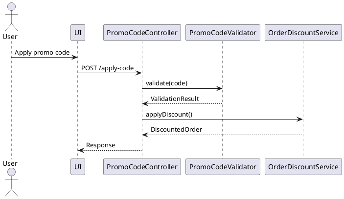

# System Design Document (SDD)
**Project:** [Project Name]  
**Version:** 1.0  
**Date:** [Date]  
**Authors:** the-architect, the-developer, the-devops-engineer

## System Overview
### Purpose
[Brief description of what the system does and why]

### Scope
[What's included and explicitly excluded]

### Architecture Philosophy
[Key principles: microservices vs monolith, event-driven, etc.]

## Context Assembly Guide

### Critical Context (Must Read First)
```yaml
- file: @src/components/critical/file.ts
  relevance: CRITICAL
  sections: [lines 50-100, function processOrder]
  why: "Core business logic that must be preserved"

- doc: @docs/patterns/auth-flow.md
  relevance: MEDIUM
  why: "Follow this authentication pattern"
  
- url: https://docs.library.com/api
  relevance: LOW
  why: "Reference if using advanced features"
```

### Supporting Context (Read as Needed)
```yaml
- file: [additional files]
  relevance: [level]
  why: [reason]
```

### Context Boundaries
- **In Scope**: [What this feature will change]
- **Out of Scope**: [What this feature will NOT touch]
- **Do Not Modify**: [Critical files/systems to avoid]

## Solution Approach

### Constraints
- **Technical:** [Language/framework requirements, performance targets]
- **Organizational:** [Coding standards, deployment restrictions]
- **Security/Compliance:** [Auth requirements, data protection needs]

### Solution Strategy
- **Architecture Pattern:** [Describe the approach (e.g., layered, modular, microservice)]
- **Integration Approach:** [Describe how this feature integrates with the current system architecture]
- **Justification:** [Brief rationale for why this approach fits given the constraints and scope]

## Architecture Design
### High-Level Architecture
```
[ASCII diagram or mermaid diagram]
┌─────────────┐     ┌─────────────┐
│   Frontend  │────▶│   Backend   │
└─────────────┘     └─────────────┘
                           │
                    ┌──────▼──────┐
                    │   Database  │
                    └─────────────┘
```

### Component Architecture
| Component | Purpose | Technology | Interfaces |
|-----------|---------|------------|------------|
| [Name] | [What it does] | [Stack] | [APIs/Events] |

### Data Flow
1. **User Action:** [Description]
2. **Processing:** [Steps]
3. **Storage:** [Where/How]
4. **Response:** [Format]

## Building Block View

### Directory Map
```
.
├── src/
│   ├── feature_area/
│   │   ├── main_component          # NEW: Primary feature logic
│   │   ├── data_models            # MODIFY: Extend existing models
│   │   ├── business_logic         # NEW: Core processing logic
│   │   └── integration_layer      # NEW: External service connections
│   └── shared/
│       ├── utilities              # MODIFY: Add shared functions
│       └── types                  # NEW: Shared type definitions
```

## Detailed Component Design
### Component: [Component Name]
**Responsibility:** [Single responsibility]

**Structure:**
```
component/
├── models/      # Data models
├── services/    # Business logic
├── controllers/ # Request handling
└── utils/       # Helpers
```

**Key Classes/Modules:**
- `[ClassName]`: [Purpose]
- `[ModuleName]`: [Purpose]

**Dependencies:**
- Internal: [Components]
- External: [Libraries/Services]

## Data Design
### Data Models
```typescript
// Example entity
interface User {
  id: string;
  email: string;
  profile: UserProfile;
  createdAt: Date;
}
```

### Database Schema
| Table | Columns | Indexes | Relationships |
|-------|---------|---------|---------------|
| users | id, email, created_at | email (unique) | 1:n posts |

### Data Storage Strategy
- **Primary Storage:** [Database type and why]
- **Caching:** [Strategy and TTL]
- **File Storage:** [Approach for media]

## API Design
### REST Endpoints
| Method | Endpoint | Purpose | Request | Response |
|--------|----------|---------|---------|----------|
| GET | /api/v1/users | List users | Query params | User[] |
| POST | /api/v1/users | Create user | User object | User |

### API Contracts
```yaml
# OpenAPI/Swagger example
/api/v1/users:
  post:
    requestBody:
      required: true
      content:
        application/json:
          schema:
            $ref: '#/components/schemas/User'
```

### Error Handling
| Error Code | Meaning | Response |
|------------|---------|----------|
| 400 | Bad Request | `{error: "Validation failed", details: [...]}` |
| 401 | Unauthorized | `{error: "Authentication required"}` |

## Runtime View

### Primary Flow: [Main User Action]
1. User triggers [action]
2. System validates [what]
3. Process executes [how]
4. Result displays [where]



### Error Handling
- Invalid input: [specific error message]
- Network failure: [retry strategy]
- Business rule violation: [user feedback]

### Complex Logic (if applicable)
```
ALGORITHM: Process Feature Request
INPUT: user_request, current_state
OUTPUT: processed_result

1. VALIDATE: input_parameters, user_permissions, system_state
2. TRANSFORM: raw_input -> structured_data
3. APPLY_BUSINESS_RULES: 
   - Check constraints and limits
   - Calculate derived values
   - Apply conditional logic
4. INTEGRATE: update_external_systems, notify_stakeholders
5. PERSIST: save_changes, log_activities
6. RESPOND: return_result, update_user_interface
```

## Security Design
### Authentication & Authorization
- **Method:** [JWT/OAuth/Sessions]
- **Flow:** [Description]
- **Permissions Model:** [RBAC/ACL]

### Security Measures
| Threat | Mitigation |
|--------|------------|
| SQL Injection | Parameterized queries |
| XSS | Input sanitization, CSP |
| CSRF | CSRF tokens |

### Data Protection
- **Encryption at Rest:** [Method]
- **Encryption in Transit:** [TLS version]
- **PII Handling:** [Approach]

## Infrastructure Design
### Deployment Architecture
```
Production Environment:
- Load Balancer (ALB)
- App Servers (ECS/K8s)
- Database (RDS)
- Cache (Redis)
- CDN (CloudFront)
```

### Scaling Strategy
- **Horizontal Scaling:** [Auto-scaling rules]
- **Vertical Scaling:** [Limits and triggers]
- **Database Scaling:** [Read replicas, sharding]

### Monitoring & Observability
| Aspect | Tool | Metrics |
|--------|------|---------|
| APM | [Tool] | Response time, error rate |
| Logs | [Tool] | Centralized logging |
| Metrics | [Tool] | Custom business metrics |

## Integration Design
### External Services
| Service | Purpose | Integration Method | Fallback |
|---------|---------|-------------------|----------|
| [Service] | [Why] | [REST/GraphQL/gRPC] | [Strategy] |

### Event Architecture
```
Event: UserCreated
Producer: UserService
Consumers: EmailService, AnalyticsService
Format: JSON
Schema: {...}
```

## Cross-Cutting Concepts

### Core Concepts
- **Security:** Authentication, authorization, encryption
- **Error Handling:** Global vs local strategies
- **Performance Optimization:** Caching, batching, async patterns
- **i18n/L10n:** Support for multi-language or regional content
- **Logging/Auditing:** System observability practices

### Implementation Patterns

#### Component Structure Pattern
```pseudocode
# Follow existing component organization in codebase
COMPONENT: FeatureComponent(properties)
  INITIALIZE: local_state, external_data_hooks
  
  HANDLE: loading_states, error_states, success_states
  
  RENDER: 
    IF loading: loading_indicator
    IF error: error_display(error_info)
    IF success: main_content(data, actions)
```

#### Data Processing Pattern
```pseudocode
# Business logic flow
FUNCTION: process_feature_operation(input, context)
  VALIDATE: input_format, permissions, preconditions
  AUTHORIZE: user_access, operation_permissions
  TRANSFORM: input_data -> business_objects
  EXECUTE: core_business_logic
  PERSIST: save_results, update_related_data
  RESPOND: success_result OR error_information
```

#### Error Handling Pattern
```pseudocode
# Error management approach
FUNCTION: handle_operation_errors(operation_result)
  CLASSIFY: error_type (validation, business_rule, system)
  LOG: error_details, context_information
  RECOVER: attempt_recovery_if_applicable
  RESPOND: 
    user_facing_message(safe_error_info)
    system_recovery_action(if_needed)
```

#### Test Pattern
```pseudocode
# Testing approach for behavior verification
TEST_SCENARIO: "Feature operates correctly under normal conditions"
  SETUP: valid_input_data, required_system_state
  EXECUTE: feature_operation_with_input
  VERIFY: 
    expected_output_produced
    system_state_updated_correctly
    side_effects_occurred_as_expected
    error_conditions_handled_properly
```

### Integration Points
- [Where this connects to existing system]
- [Data flow in/out]
- [Events triggered/consumed]

## Performance Considerations
### Performance Targets
- **API Response Time:** <200ms p95
- **Page Load Time:** <3s
- **Concurrent Users:** 10,000

### Optimization Strategies
- **Caching:** [Multi-level caching approach]
- **Database:** [Query optimization, indexes]
- **Assets:** [CDN, compression]

## Testing Strategy
### Test Levels
| Level | Coverage Target | Tools |
|-------|----------------|-------|
| Unit | 80% | Jest |
| Integration | Key flows | Supertest |
| E2E | Critical paths | Cypress |

### Test Data Strategy
- **Approach:** [Fixtures/Factories/Snapshots]
- **Test Environments:** [How they mirror production]

## Deployment Design
### CI/CD Pipeline
```
1. Code Push → 2. Build → 3. Test → 4. Deploy Staging → 5. Deploy Prod
```

### Deployment Strategy
- **Method:** [Blue-Green/Canary/Rolling]
- **Rollback:** [Automatic triggers and process]

### Environment Configuration
| Environment | Purpose | Configuration |
|-------------|---------|---------------|
| Development | Local dev | `.env.development` |
| Staging | Pre-prod testing | `.env.staging` |
| Production | Live system | `.env.production` |

## Disaster Recovery
### Backup Strategy
- **Frequency:** [Schedule]
- **Retention:** [Policy]
- **Testing:** [Recovery drills]

### RTO/RPO Targets
- **RTO:** [Recovery Time Objective]
- **RPO:** [Recovery Point Objective]

## Anti-Patterns to Avoid

### Architecture Anti-Patterns
- ❌ Creating new architectural patterns when established ones exist
- ❌ Modifying unrelated systems "while you're there"
- ❌ Adding external dependencies without checking internal capabilities
- ❌ Changing core conventions without explicit approval
- ❌ Implementing business logic in presentation layer
- ❌ Tight coupling between independent components

### Integration Anti-Patterns
- ❌ Hardcoding external service URLs or credentials
- ❌ Ignoring rate limits and retry mechanisms for external services
- ❌ Exposing internal data structures to external systems
- ❌ Synchronous calls to external services in critical paths
- ❌ Assuming external services are always available

### Data Anti-Patterns
- ❌ Direct database access from presentation layer
- ❌ Storing business logic in database triggers or procedures
- ❌ Missing data validation at application boundaries
- ❌ Inconsistent data state across related entities
- ❌ Exposing database structure through API responses

### Testing Anti-Patterns
- ❌ Testing implementation details instead of behavior
- ❌ Skipping tests for "simple" functions
- ❌ Not testing error conditions and edge cases
- ❌ Over-mocking dependencies in integration tests
- ❌ Writing tests that depend on specific execution order
- ❌ Ignoring test failures or marking them as "flaky"

### Process Anti-Patterns
- ❌ Skipping validation steps to move faster
- ❌ Implementing without understanding existing patterns
- ❌ Making assumptions about user requirements
- ❌ Continuing implementation when blocked on critical decisions
- ❌ Deploying changes without proper testing
- ❌ Ignoring performance implications until production

## Appendices
### Technology Stack Justification
[Why each technology was chosen]

### Alternative Approaches Considered
[What was evaluated and rejected]

### References
[Design patterns, architectural decisions records]