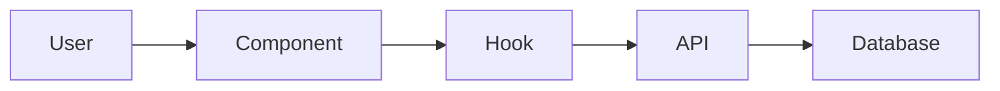
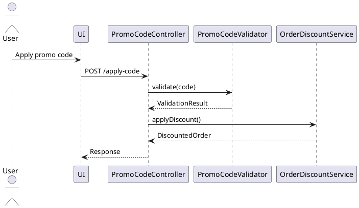

# Solution Design Document

## Constraints

- [Technical, e.g. Language/framework requirements, performance targets]
- [Organizational, e.g. Coding standards, deployment restrictions]
- [Security/Compliance, e.g. Auth requirements, data protection needs]

## Implementation Context

*[INSTRUCTION: List source code files and external documentation needed to understand the existing implementation. This provides the bridge between constraints and solution strategy. Pattern and interface documentation belong in Cross-Cutting Concepts section. The document flows from problem → constraints → existing implementation → solution.]*

### Source Code to Analyze
```yaml
# Core implementation files that must be understood
- file: @src/components/critical/file.ts
  relevance: CRITICAL
  sections: [lines 50-100, function processOrder]
  why: "Core business logic that must be preserved"
  
# Alternative: relative path format
- file: @src/components/critical/file.ts
  relevance: CRITICAL
  sections: [lines 50-100, function processOrder]
  why: "Core business logic that must be preserved"

# Configuration and setup files
- file: @package.json
  relevance: MEDIUM
  why: "Dependencies and scripts that constrain solution"
```

### External Documentation
```yaml
# Third-party library docs and architectural context
- url: https://docs.library.com/api
  relevance: MEDIUM
  why: "API constraints we must work within"

- doc: @docs/architecture/decisions/adr-001.md
  relevance: HIGH
  why: "Previous decisions that constrain approach"
```

### Implementation Boundaries
- **Must Preserve**: [Critical behavior/interfaces to maintain]
- **Can Modify**: [Areas open for refactoring]
- **Must Not Touch**: [Files/systems that are off-limits]

### Project Commands

*[INSTRUCTION: These commands will be discovered during codebase analysis and populated by the create command. This note should not appear in the final PRD.]*

```bash
# Environment Setup
Install Dependencies: [project-specific install command]
Environment Setup: [additional setup steps if needed]
Start Development: [development server command]

# Validation (run after each phase)
Code Quality: [linting/formatting command] 
Type Safety: [type checking command, if applicable]
Run Tests: [test execution command]
Build Project: [build/compile command]

# Database (if applicable)
Database Migration: [migration command]
Database Seed: [test data setup command]

# Additional Project-Specific Commands
[Any other relevant commands discovered in the codebase]
```

*[INSTRUCTION: The execute command should run these validation commands after each implementation phase to ensure code quality and catch issues early. This note should not appear in the final PRD.]*

## Solution Strategy

- [Architecture Pattern, e.g. Describe the approach (e.g., layered, modular, microservice)]
- [Integration Approach, e.g. Describe how this feature integrates with the current system architecture]
- [Justification, e.g. Brief rationale for why this approach fits given the constraints and scope]
- ...

## Building Block View

### Components



### Directory Map

```
.
├── src/
│   ├── feature_area/
│   │   ├── main_component          # NEW: Primary feature logic
│   │   ├── data_models            # MODIFY: Extend existing models
│   │   ├── business_logic         # NEW: Core processing logic
│   │   └── integration_layer      # NEW: External service connections
│   └── shared/
│       ├── utilities              # MODIFY: Add shared functions
│       └── types                  # NEW: Shared type definitions
```

*[INSTRUCTION: Actual paths and file names will be determined based on project conventions discovered during implementation. This note should not appear in the final PRD.]*

### Interface Specifications (Internal Changes Only)

*[INSTRUCTION: Include this section only when the feature involves changes to data structures, internal APIs, or core application interfaces. This note should not appear in the final PRD.]*

#### Data Storage Changes
```yaml
# Database/storage schema modifications
Table: primary_entity_table
  ADD COLUMN: new_field (data_type, constraints)
  MODIFY COLUMN: existing_field (new_constraints) 
  ADD INDEX: performance_index (fields)

Table: supporting_entity_table (NEW)
  id: primary_key
  related_id: foreign_key
  business_field: data_type, constraints
```

#### Internal API Changes
```yaml
# Application endpoints being added/modified
Endpoint: Feature Operation
  Method: HTTP_METHOD
  Path: /api/version/resource/operation
  Request:
    required_field: data_type, validation_rules
    optional_field: data_type, default_value
  Response:
    success:
      result_field: data_type
      metadata: object_structure
    error:
      error_code: string
      message: string
      details: object (optional)
```

#### Application Data Models
```pseudocode
# Core business objects being modified/created
ENTITY: PrimaryEntity (MODIFIED/NEW)
  FIELDS: 
    existing_field: data_type
    + new_field: data_type (NEW)
    ~ modified_field: updated_type (CHANGED)
  
  BEHAVIORS:
    existing_method(): return_type
    + new_method(parameters): return_type (NEW)
    ~ modified_method(): updated_return_type (CHANGED)

ENTITY: SupportingEntity (NEW)
  FIELDS: [field_definitions]
  BEHAVIORS: [method_definitions]
```

#### Integration Points
```yaml
# Where this feature connects to external systems
# (Full specifications in docs/interfaces/)

External_Service_Name:
  - doc: @docs/interfaces/service-name.md
  - sections: [relevant_endpoints, data_formats]
  - integration: "Brief description of how systems connect"
  - critical_data: [data_elements_exchanged]
```

## Runtime View

#### Primary Flow: [Main User Action]
1. User triggers [action]
2. System validates [what]
3. Process executes [how]
4. Result displays [where]



### Error Handling
- Invalid input: [specific error message]
- Network failure: [retry strategy]
- Business rule violation: [user feedback]

### Complex Logic (if applicable)
```
ALGORITHM: Process Feature Request
INPUT: user_request, current_state
OUTPUT: processed_result

1. VALIDATE: input_parameters, user_permissions, system_state
2. TRANSFORM: raw_input -> structured_data
3. APPLY_BUSINESS_RULES: 
   - Check constraints and limits
   - Calculate derived values
   - Apply conditional logic
4. INTEGRATE: update_external_systems, notify_stakeholders
5. PERSIST: save_changes, log_activities
6. RESPOND: return_result, update_user_interface
```

## Deployment View

- **Environment**: [Where this runs - client/server/edge]
- **Configuration**: [Required env vars or settings]
- **Dependencies**: [External services or APIs needed]
- **Performance**: [Expected load, caching strategy]

## Cross-Cutting Concepts

*[INSTRUCTION: Document concepts, patterns, and implementation approaches that span multiple components. This section ensures consistency and conceptual integrity across the system. Focus on "how things work" rather than "what exists" or "what's wrong".]*

### Pattern Documentation
```yaml
# Existing patterns used in this feature
- pattern: @docs/patterns/[pattern-name].md
  relevance: [CRITICAL|HIGH|MEDIUM|LOW]
  why: "[Brief explanation of why this pattern is needed]"

# New patterns created for this feature  
- pattern: @docs/patterns/[new-pattern-name].md (NEW)
  relevance: [CRITICAL|HIGH|MEDIUM|LOW]
  why: "[Brief explanation of why this pattern was created]"
```

### Interface Specifications
```yaml
# External interfaces this feature integrates with
- interface: @docs/interfaces/[interface-name].md
  relevance: [CRITICAL|HIGH|MEDIUM|LOW]
  why: "[Brief explanation of why this interface is relevant]"

# New interfaces created
- interface: @docs/interfaces/[new-interface-name].md (NEW)
  relevance: [CRITICAL|HIGH|MEDIUM|LOW]
  why: "[Brief explanation of why this interface is being created]"
```

### System-Wide Patterns
- [Security: Authentication, authorization, encryption patterns used throughout]
- [Error Handling: Global vs local strategies, error propagation patterns]
- [Performance: Caching strategies, batching approaches, async patterns]
- [i18n/L10n: Multi-language support patterns, localization approaches]
- [Logging/Auditing: Observability patterns, audit trail implementation]

### Implementation Patterns

*[INSTRUCTION: Include code patterns, conventions, and technical approaches that affect multiple parts of the system. This is where recurring implementation details belong when they represent patterns rather than problems.]*

#### Code Patterns and Conventions
[Document recurring code structures, naming conventions, and implementation approaches that ensure consistency]

#### State Management Patterns
[How state, refs, side effects, and data flow are managed across the application]

#### Performance Characteristics
[System-wide performance strategies, optimization patterns, resource management approaches]

#### Integration Patterns
[Common approaches for external service integration, API communication patterns, event handling]

*[INSTRUCTION: For each pattern, provide concrete examples from the codebase. Implementation specifics should follow established patterns in the codebase. The execute command will discover and apply appropriate patterns dynamically. This note should not appear in the final PRD.]*

#### Component Structure Pattern
```pseudocode
# Follow existing component organization in codebase
COMPONENT: FeatureComponent(properties)
  INITIALIZE: local_state, external_data_hooks
  
  HANDLE: loading_states, error_states, success_states
  
  RENDER: 
    IF loading: loading_indicator
    IF error: error_display(error_info)
    IF success: main_content(data, actions)
```

#### Data Processing Pattern
```pseudocode
# Business logic flow
FUNCTION: process_feature_operation(input, context)
  VALIDATE: input_format, permissions, preconditions
  AUTHORIZE: user_access, operation_permissions
  TRANSFORM: input_data -> business_objects
  EXECUTE: core_business_logic
  PERSIST: save_results, update_related_data
  RESPOND: success_result OR error_information
```

#### Error Handling Pattern
```pseudocode
# Error management approach
FUNCTION: handle_operation_errors(operation_result)
  CLASSIFY: error_type (validation, business_rule, system)
  LOG: error_details, context_information
  RECOVER: attempt_recovery_if_applicable
  RESPOND: 
    user_facing_message(safe_error_info)
    system_recovery_action(if_needed)
```

#### Test Pattern
```pseudocode
# Testing approach for behavior verification
TEST_SCENARIO: "Feature operates correctly under normal conditions"
  SETUP: valid_input_data, required_system_state
  EXECUTE: feature_operation_with_input
  VERIFY: 
    expected_output_produced
    system_state_updated_correctly
    side_effects_occurred_as_expected
    error_conditions_handled_properly
```

### Integration Points

- [Where this connects to existing system]
- [Data flow in/out]
- [Events triggered/consumed]

## Architecture Decisions

1. **[Decision Name]**: [Choice made]
   - Rationale: [Why this over alternatives]
   - Trade-offs: [What we accept]

2. **[Decision Name]**: [Choice made]
   - Rationale: [Why this over alternatives]
   - Trade-offs: [What we accept]

## Quality Requirements

- [Performance: Specific, measurable targets that can be validated]
- [Usability: User experience requirements]
- [Security: Access control and data protection needs]
- [Reliability: Error handling and recovery requirements]

## Risks and Technical Debt

*[INSTRUCTION: Document known issues, workarounds, technical compromises, and implementation challenges. This section makes problems visible to all stakeholders. Focus on current, concrete issues rather than theoretical risks.]*

### Known Technical Issues
- [Current bugs or limitations that affect the system]
- [Performance bottlenecks and their specific locations (with line numbers if applicable)]
- [Memory leaks or resource management problems]
- [Integration issues with external systems]

### Technical Debt
- [Code duplication that needs refactoring (specify locations)]
- [Temporary workarounds that need proper solutions]
- [Anti-patterns that exist but shouldn't be replicated]
- [Architectural violations or deviations from established patterns]

### Implementation Gotchas
- [Non-obvious dependencies or side effects]
- [Timing issues, race conditions, or synchronization problems]
- [Configuration quirks or environment-specific issues]
- [Known issues with third-party dependencies]

*[INSTRUCTION: For each item, include: Description, Impact (what problems it causes), Location (file/line numbers if applicable), and Potential Solution if known. Prioritize by severity and impact on development/operations.]*

## Test Specifications

### Critical Test Scenarios

**Scenario 1: Primary Happy Path**
```gherkin
Given: [System in valid initial state]
And: [Required preconditions met]
When: [User performs main action]
Then: [Expected outcome occurs]
And: [System state updated correctly]
And: [Appropriate feedback provided]
```

**Scenario 2: Validation Error Handling**
```gherkin
Given: [System ready for input]
When: [User provides invalid input]
Then: [Specific error message displayed]
And: [System state remains unchanged]
And: [User can recover/retry]
```

**Scenario 3: System Error Recovery**
```gherkin
Given: [Normal operation in progress]
When: [System error occurs during processing]
Then: [Error handled gracefully]
And: [User notified appropriately]
And: [System maintains data integrity]
```

**Scenario 4: Edge Case Handling**
```gherkin
Given: [Boundary condition scenario]
When: [Edge case operation attempted]
Then: [System handles edge case correctly]
And: [No unexpected behavior occurs]
```

### Test Coverage Requirements
- **Business Logic**: All decision paths, calculation formulas, validation rules
- **User Interface**: All interaction flows, error states, loading states, accessibility  
- **Integration Points**: External service calls, data persistence, event handling
- **Edge Cases**: Boundary values, empty states, concurrent operations, system limits
- **Performance**: Response times under expected load, resource usage
- **Security**: Input validation, authorization checks, data protection
