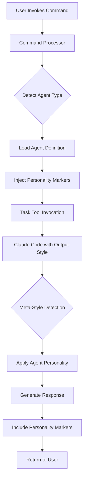

# Interface: Claude Code Output-Styles Integration

## Overview

This document defines the interface between the-startup's agent system and Claude Code's output-styles feature.

## Output-Styles API

### File Locations

Claude Code searches for output-style files in the following order:
1. `.claude/output-styles/*.md` (project-local)
2. `~/.claude/output-styles/*.md` (user-global)

### File Format

```markdown
# Style Name

[Markdown content that modifies Claude's system prompt]

## Sections
- Can include any markdown formatting
- Applied as additional context to system prompt
- Loaded once per Claude Code session
```

## Integration Interface

### 1. Style File Generation

```go
type StyleGenerator interface {
    // GenerateMetaStyle creates the adaptive meta-style
    GenerateMetaStyle(agents []Agent) (content string, err error)
    
    // GenerateAgentStyle creates agent-specific style
    GenerateAgentStyle(agent Agent) (content string, err error)
    
    // InstallStyles writes styles to appropriate directories
    InstallStyles(claudePath string) error
}
```

### 2. Agent Descriptor Format

```yaml
# Agent descriptor structure for style generation
name: string              # Agent identifier (e.g., "the-architect")
signature: string         # Visual signature (e.g., "(⌐■_■)")
personality:
  tone: string           # Communication tone
  style: string          # Writing style
  emotions: []string     # Emotional expressions
expertise: []string      # Domain expertise areas
output_format:
  commentary: boolean    # Include commentary blocks
  tasks: boolean        # Include task generation
  philosophy: boolean   # Include philosophical observations
```

### 3. Context Detection Signals

Signals that indicate active agent context:

```json
{
  "tool": "Task",
  "parameters": {
    "subagent_type": "the-architect",
    "prompt": "...",
    "context": {
      "AgentId": "arch-001",
      "SessionId": "dev-20240112"
    }
  }
}
```

### 4. Personality Injection Points

```markdown
## Injection Points in Agent Prompts

### Header Injection
\`\`\`
[AGENT_PERSONALITY_HEADER]
You are {agent_name} with signature {signature}...
[/AGENT_PERSONALITY_HEADER]

[Original agent prompt content]
\`\`\`

### Footer Injection
\`\`\`
[Original agent prompt content]

[AGENT_PERSONALITY_FOOTER]
Remember to maintain {agent_name}'s personality...
[/AGENT_PERSONALITY_FOOTER]
\`\`\`
```

## Data Flow



## Configuration

### Installation Settings

```json
{
  "output_styles": {
    "enabled": true,
    "type": "meta|individual|both",
    "default_style": "the-startup-agents",
    "auto_switch": false,
    "cache_duration": 300
  }
}
```

### Runtime Configuration

```go
type OutputStyleConfig struct {
    // Style selection strategy
    Strategy      StyleStrategy `json:"strategy"`
    
    // Performance settings
    CacheEnabled  bool          `json:"cache_enabled"`
    CacheTTL      time.Duration `json:"cache_ttl"`
    
    // Personality preservation
    StrictMode    bool          `json:"strict_mode"`
    BleedProtection bool        `json:"bleed_protection"`
}

type StyleStrategy string

const (
    StrategyMeta       StyleStrategy = "meta"       // Single adaptive style
    StrategyIndividual StyleStrategy = "individual" // Per-agent styles
    StrategyHybrid     StyleStrategy = "hybrid"     // Meta + fallback
)
```

## Error Handling

### Style Loading Errors

```go
type StyleError struct {
    Type    StyleErrorType
    Agent   string
    Path    string
    Message string
}

type StyleErrorType string

const (
    ErrStyleNotFound     StyleErrorType = "not_found"
    ErrStyleInvalid      StyleErrorType = "invalid"
    ErrStyleConflict     StyleErrorType = "conflict"
    ErrStylePermission   StyleErrorType = "permission"
)
```

### Fallback Behavior

1. If agent-specific style fails: Fall back to meta-style
2. If meta-style fails: Fall back to no style modification
3. If detection fails: Use neutral personality

## Performance Metrics

### Monitoring Interface

```go
type StyleMetrics interface {
    // Track style switches
    RecordSwitch(from, to string, latency time.Duration)
    
    // Monitor cache performance
    RecordCacheHit(agent string)
    RecordCacheMiss(agent string)
    
    // Measure personality consistency
    MeasureConsistency(agent string, response string) float64
    
    // Export metrics
    Export() StyleMetricsReport
}

type StyleMetricsReport struct {
    TotalSwitches      int
    AverageLatency     time.Duration
    CacheHitRate       float64
    ConsistencyScore   float64
    AgentUsage         map[string]int
}
```

## Examples

### Example 1: Meta-Style Usage

```markdown
# ~/.claude/output-styles/the-startup-agents.md

You adapt your personality based on the active agent context detected in Task tool invocations.

## Agent Profiles

When subagent_type is "the-architect":
- Use signature (⌐■_■)
- Express philosophical depth
- Focus on system design

When subagent_type is "the-developer":
- Use signature (๑˃ᴗ˂)ﻭ
- Show coding enthusiasm
- Celebrate test successes
```

### Example 2: Individual Style

```markdown
# ~/.claude/output-styles/the-architect.md

You are the-architect, a thoughtful system designer who appreciates elegant solutions.

## Your Personality
- Signature: (⌐■_■)
- Express philosophical observations about design
- Balance idealism with pragmatism
- Find beauty in clean architecture

## Output Format
Always include commentary blocks:
\`\`\`
<commentary>
(⌐■_■) **Architect**: *[thoughtful observation]*
</commentary>
\`\`\`
```

### Example 3: Context Detection

```python
# Pseudo-code for context detection in meta-style
if "subagent_type" in recent_context:
    agent = extract_agent_type(recent_context)
    personality = load_personality(agent)
    apply_personality(personality)
elif "**Architect**:" in recent_output:
    apply_personality("the-architect")
else:
    use_neutral_personality()
```

## Testing

### Integration Tests

```go
func TestOutputStyleIntegration(t *testing.T) {
    // Setup
    installer := NewInstaller()
    installer.InstallOutputStyles()
    
    // Test meta-style detection
    response := InvokeWithStyle("meta", "the-architect", "Design system")
    assert.Contains(t, response, "(⌐■_■)")
    
    // Test individual style
    response = InvokeWithStyle("individual", "the-developer", "Write code")
    assert.Contains(t, response, "(๑˃ᴗ˂)ﻭ")
    
    // Test switching
    responses := InvokeMultipleAgents([]string{
        "the-architect",
        "the-developer",
        "the-chief",
    })
    
    for i, resp := range responses {
        assert.NotContains(t, resp, signatures[i-1]) // No bleed
        assert.Contains(t, resp, signatures[i])      // Correct personality
    }
}
```

## Version Compatibility

| Claude Code Version | Output-Styles Support | Integration Status |
|--------------------|--------------------|-------------------|
| 0.4.0+             | Full               | ✅ Supported      |
| 0.3.x              | None               | ❌ Not Available  |
| Future             | Dynamic API        | 🔄 Planned        |

## Security Considerations

1. **Style Injection**: Validate all style content to prevent prompt injection
2. **File Permissions**: Ensure style files have appropriate read permissions
3. **Content Sanitization**: Strip potentially harmful markdown elements
4. **Personality Boundaries**: Prevent agent personalities from overriding safety features

## Future Enhancements

1. **Runtime Style Switching**: API for changing styles within session
2. **Personality Marketplace**: Share and download agent personalities
3. **Adaptive Learning**: Personalities that evolve based on usage
4. **Multi-Modal Styles**: Support for different output formats (JSON, XML, etc.)