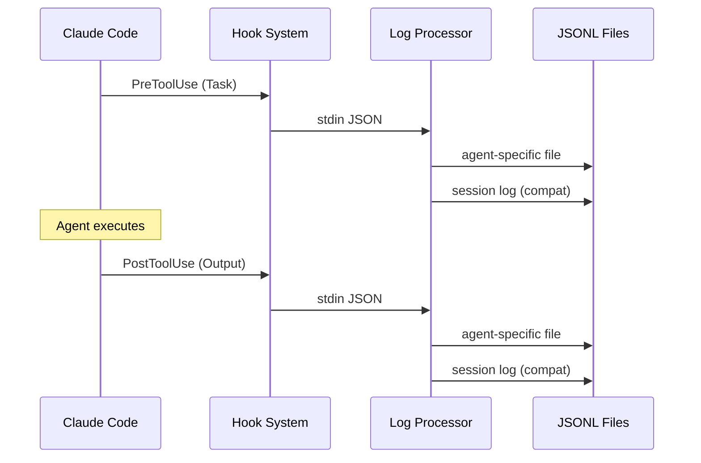

# Pattern: Orchestration MCP System Integration

## Context

The `the-startup` system currently provides agent coordination through the Task tool and hook-based logging. A new orchestration MCP system needs to integrate with existing Claude Code workflows, extending the current logging infrastructure while maintaining backward compatibility and enabling advanced agent coordination patterns.

## Problem

- Need advanced orchestration capabilities beyond simple Task delegation
- Session resumption and long-running agent coordination required
- Enhanced state management for complex multi-agent workflows
- Integration with existing hook processing and JSONL logging
- Maintaining compatibility with current agent system and commands

## Current Architecture Analysis

### Existing Hook Processing Flow



**Current Data Flow:**
1. **Input**: JSON via stdin containing `tool_name="Task"` and `tool_input.subagent_type="the-*"`
2. **Processing**: Agent ID extraction (regex or generation), session ID resolution
3. **Output**: JSONL entries in `.the-startup/session-id/agent-id.jsonl`

**Current File Structure:**
```
.the-startup/
├── dev-20250823-143022/           # Session directories
│   ├── arch-001.jsonl             # Agent-specific contexts
│   ├── dev-001.jsonl
│   └── dev-20250823-143022.jsonl  # Session log (backward compat)
├── dev-20250823-150315/
│   └── ...
└── all-agent-instructions.jsonl   # Global log (backward compat)
```

**Current Hook Data Schema:**
```go
type HookData struct {
    Role      string `json:"role"`      // "user" | "assistant"
    Content   string `json:"content"`   // prompt or response
    Timestamp string `json:"timestamp"` // UTC ISO format
    
    // Internal routing fields (not serialized)
    SessionID string `json:"-"`
    AgentID   string `json:"-"`
}
```

### Existing Agent System

**25+ Specialized Agents:**
- Architecture: `the-software-architect`, `the-lead-engineer`
- Domain Experts: `the-backend-engineer`, `the-frontend-engineer`, `the-ml-engineer`
- Quality: `the-qa-engineer`, `the-security-engineer`
- Management: `the-product-manager`, `the-project-manager`

**Invocation Pattern:**
```
Task(subagent_type="the-architect", prompt="Design authentication system")
```

**Current Commands:**
- `/s:specify`: Requirements gathering with orchestrated agents
- `/s:implement`: Phase-by-phase implementation execution
- `/s:refactor`: Code refactoring with validation

## Orchestration MCP Integration Solution

### Enhanced JSONL Schema

Extend current `HookData` to support orchestration state:

```go
type OrchestrationHookData struct {
    // Existing fields
    Role      string `json:"role"`
    Content   string `json:"content"`
    Timestamp string `json:"timestamp"`
    
    // Orchestration extensions
    OrchestrationID   string                 `json:"orchestration_id,omitempty"`
    CoordinationState string                 `json:"coordination_state,omitempty"`
    AgentRelationship map[string]interface{} `json:"agent_relationship,omitempty"`
    WorkflowPhase     string                 `json:"workflow_phase,omitempty"`
    Dependencies      []string               `json:"dependencies,omitempty"`
    
    // Internal routing (not serialized)
    SessionID string `json:"-"`
    AgentID   string `json:"-"`
}
```

**Coordination States:**
- `initiated`: Orchestration started
- `coordinating`: Multi-agent coordination active
- `waiting_dependency`: Blocked on other agents
- `review_pending`: Awaiting validation
- `completed`: Orchestration finished
- `suspended`: Paused for resumption

### New MCP Tools Integration

**Orchestration MCP Tools:** (hypothetical - would be provided by MCP system)
```bash
# Coordination tools
mcp__orchestration__coordinate_agents
mcp__orchestration__resume_session  
mcp__orchestration__manage_state
mcp__orchestration__sync_agents

# State management tools
mcp__orchestration__save_checkpoint
mcp__orchestration__load_checkpoint
mcp__orchestration__query_state
```

**Hook Processing Enhancement:**
```go
func ProcessOrchestrationToolCall(input io.Reader, isPostHook bool) (*OrchestrationHookData, error) {
    // Parse existing hook input
    hookData, err := ProcessToolCall(input, isPostHook)
    if err != nil {
        return nil, err
    }
    
    // Detect orchestration tools
    var orchestrationData *OrchestrationHookData
    if isOrchestrationTool(hookInput.ToolName) {
        orchestrationData = enhanceWithOrchestrationData(hookData, hookInput)
        
        // Write to orchestration-specific files
        WriteOrchestrationContext(orchestrationData)
    }
    
    // Maintain existing behavior
    return orchestrationData, nil
}

func isOrchestrationTool(toolName string) bool {
    orchestrationTools := []string{
        "mcp__orchestration__coordinate_agents",
        "mcp__orchestration__resume_session",
        "mcp__orchestration__manage_state",
        // ... other orchestration tools
    }
    
    for _, tool := range orchestrationTools {
        if toolName == tool {
            return true
        }
    }
    return false
}
```

### Enhanced File Structure

```
.the-startup/
├── dev-20250823-143022/
│   ├── agents/
│   │   ├── arch-001.jsonl          # Individual agent contexts
│   │   ├── dev-001.jsonl
│   │   └── pm-001.jsonl
│   ├── orchestration/
│   │   ├── main.jsonl              # Orchestration events
│   │   ├── coordination.jsonl      # Agent coordination logs
│   │   └── checkpoints/            # State snapshots
│   │       ├── phase-1.json
│   │       └── phase-2.json
│   └── dev-20250823-143022.jsonl   # Session log (backward compat)
├── orchestration-templates/
│   ├── workflows/
│   │   ├── feature-implementation.json
│   │   └── system-design.json
│   └── coordination-patterns/
│       ├── parallel-execution.json
│       └── review-cycles.json
└── all-agent-instructions.jsonl    # Global log (backward compat)
```

## Integration Patterns

### Pattern 1: Task Coordination Enhancement

**Current Task Coordination:**
```
User → Claude → Task(subagent_type="the-architect") → Agent Response
```

**Enhanced Orchestration:**
```
User → Claude → mcp__orchestration__coordinate_agents → 
    Multiple Task() calls → Agent Responses → 
    mcp__orchestration__sync_agents → Coordinated Result
```

**Implementation:**
```go
func handleOrchestrationCoordination(agents []string, sharedContext string) error {
    orchestrationID := generateOrchestrationID()
    
    // Create checkpoint
    checkpoint := &OrchestrationCheckpoint{
        ID:        orchestrationID,
        Agents:    agents,
        Context:   sharedContext,
        Phase:     "coordination_started",
        Timestamp: time.Now(),
    }
    
    if err := saveCheckpoint(checkpoint); err != nil {
        return err
    }
    
    // Log orchestration start
    orchestrationData := &OrchestrationHookData{
        Role:              "system",
        Content:           fmt.Sprintf("Orchestration %s started with %d agents", orchestrationID, len(agents)),
        Timestamp:         time.Now().UTC().Format(time.RFC3339),
        OrchestrationID:   orchestrationID,
        CoordinationState: "initiated",
        Dependencies:      agents,
    }
    
    return WriteOrchestrationContext(orchestrationData)
}
```

### Pattern 2: Session Resumption

**New User Workflow:**
```bash
# Start orchestrated task
/s:implement S001-user-auth

# Session interrupted, resume later
mcp__orchestration__resume_session --session-id dev-20250823-143022
```

**Implementation:**
```go
func ResumeOrchestrationSession(sessionID string) (*OrchestrationState, error) {
    // Find latest checkpoint
    checkpointPath := filepath.Join(GetStartupDir(), sessionID, "orchestration", "checkpoints")
    latestCheckpoint, err := findLatestCheckpoint(checkpointPath)
    if err != nil {
        return nil, err
    }
    
    // Load orchestration state
    state, err := loadOrchestrationState(latestCheckpoint)
    if err != nil {
        return nil, err
    }
    
    // Rebuild agent contexts
    for _, agentID := range state.ActiveAgents {
        agentContext, err := ReadAgentContextRaw(sessionID, agentID, 50)
        if err != nil {
            continue
        }
        state.AgentContexts[agentID] = agentContext
    }
    
    return state, nil
}
```

### Pattern 3: Enhanced Command Integration

**Current Command Execution:**
```markdown
# /s:specify workflow
Step 1: Initialize → Step 2: Requirements → Step 3: Review → ...
Each step uses Task() for agent delegation
```

**Enhanced Orchestration Integration:**
```markdown
# /s:specify with orchestration
Step 1: Initialize → mcp__orchestration__save_checkpoint
Step 2: Requirements → mcp__orchestration__coordinate_agents (parallel requirement gathering)
Step 3: Review → mcp__orchestration__sync_agents → mcp__orchestration__save_checkpoint
```

**Command Enhancement:**
```go
// In specify command implementation
func executeRequirementsGathering(ctx *SpecificationContext) error {
    // Identify parallel opportunities
    requirementAreas := analyzeRequirementAreas(ctx.Description)
    
    if len(requirementAreas) > 1 {
        // Use orchestration for parallel execution
        orchestrationData := &CoordinationRequest{
            SessionID:     ctx.SessionID,
            Agents:       mapAreasToAgents(requirementAreas),
            SharedContext: ctx.Description,
            CoordinationType: "parallel_requirements",
        }
        
        return executeOrchestredRequirements(orchestrationData)
    }
    
    // Fall back to sequential Task() calls
    return executeSequentialRequirements(ctx)
}
```

## User Interaction Patterns

### Current vs Orchestrated Workflows

| Scenario | Current Pattern | Orchestrated Pattern |
|----------|----------------|---------------------|
| **Simple Task** | `Task(subagent_type="the-developer")` | Same (no change) |
| **Multi-step Feature** | `/s:specify` → `/s:implement` (sequential) | `/s:specify` with orchestration (parallel where possible) |
| **Long-running Work** | Manual session management | `mcp__orchestration__resume_session` |
| **Complex Coordination** | Manual Task coordination | `mcp__orchestration__coordinate_agents` |
| **State Recovery** | Re-read context manually | `mcp__orchestration__load_checkpoint` |

### New Session Management Commands

```bash
# List active orchestrations
the-startup log --list-orchestrations

# Resume specific orchestration  
the-startup log --resume-orchestration orch-001

# Query orchestration state
the-startup log --orchestration-state orch-001 --format json

# Clean up completed orchestrations
the-startup log --cleanup-orchestrations --older-than 7d
```

## Technical Integration Details

### Hook System Integration

**Enhanced Hook Configuration:**
```json
{
  "preToolUseHook": "the-startup log --assistant --enable-orchestration",
  "postToolUseHook": "the-startup log --user --enable-orchestration"
}
```

**Processing Logic:**
```go
func handleWriteMode(cmd *cobra.Command, flags LogFlags) error {
    isPostHook := flags.User
    
    // Process with orchestration support
    if flags.EnableOrchestration {
        orchestrationData, err := ProcessOrchestrationToolCall(cmd.InOrStdin(), isPostHook)
        if err != nil {
            return handleError(err)
        }
        
        if orchestrationData != nil {
            // Write to orchestration context
            if err := WriteOrchestrationContext(orchestrationData); err != nil {
                DebugError(err)
            }
        }
    }
    
    // Maintain existing behavior
    hookData, err := ProcessToolCall(cmd.InOrStdin(), isPostHook)
    if err != nil {
        return handleError(err)
    }
    
    // Existing agent context writing
    return WriteAgentContext(hookData.SessionID, hookData.AgentID, hookData)
}
```

### Memory System Coordination

**Integration with TodoWrite:**
```go
func syncOrchestrationWithTodos(orchestrationID string) error {
    // Get current orchestration state
    state, err := getOrchestrationState(orchestrationID)
    if err != nil {
        return err
    }
    
    // Update TodoWrite tasks based on agent progress
    for agentID, agentState := range state.AgentStates {
        task := &TodoTask{
            Content:    fmt.Sprintf("Agent %s: %s", agentID, agentState.CurrentTask),
            Status:     mapAgentStateToTodoStatus(agentState.Status),
            ActiveForm: fmt.Sprintf("Agent %s working on %s", agentID, agentState.CurrentTask),
        }
        
        if err := updateTodoTask(orchestrationID, task); err != nil {
            return err
        }
    }
    
    return nil
}
```

### Error Handling and Recovery

**Orchestration Error Patterns:**
```go
func handleOrchestrationError(orchestrationID string, err error) error {
    // Log error to orchestration context
    errorData := &OrchestrationHookData{
        Role:              "system",
        Content:           fmt.Sprintf("Orchestration error: %v", err),
        Timestamp:         time.Now().UTC().Format(time.RFC3339),
        OrchestrationID:   orchestrationID,
        CoordinationState: "error",
    }
    
    if writeErr := WriteOrchestrationContext(errorData); writeErr != nil {
        DebugError(writeErr)
    }
    
    // Attempt recovery
    if isRecoverableError(err) {
        return attemptOrchestrationRecovery(orchestrationID)
    }
    
    // Graceful degradation to existing Task coordination
    return degradeToTaskCoordination(orchestrationID)
}
```

## Migration and Adoption Strategy

### Phase 1: Foundation (Backward Compatible)

1. **Enhanced Hook Processing**: Add orchestration detection without breaking existing flows
2. **Extended JSONL Schema**: Add optional orchestration fields
3. **New File Structure**: Create orchestration directories alongside existing structure
4. **Command Flags**: Add `--enable-orchestration` flags to existing commands

**Migration Steps:**
```bash
# Update hook configuration
# FROM: "preToolUseHook": "the-startup log --assistant"
# TO:   "preToolUseHook": "the-startup log --assistant --enable-orchestration"

# Existing workflows continue working unchanged
/s:specify "Add user authentication"  # Works as before

# New orchestration features available
/s:specify "Add user authentication" --enable-orchestration  # Enhanced coordination
```

### Phase 2: Enhanced Workflows

1. **Command Enhancement**: Update `/s:specify` and `/s:implement` to use orchestration
2. **Session Management**: Add resume and recovery capabilities
3. **State Checkpointing**: Implement checkpoint/restore functionality

### Phase 3: Advanced Orchestration

1. **Workflow Templates**: Pre-configured orchestration patterns
2. **Agent Relationship Management**: Complex dependency handling
3. **Performance Optimization**: Efficient coordination algorithms

### Adoption Indicators

**Users Ready for Orchestration:**
- Currently using `/s:specify` and `/s:implement` commands
- Working on multi-agent features regularly
- Experiencing session interruptions
- Need parallel agent coordination

**Migration Success Metrics:**
- All existing workflows continue functioning
- New orchestration features adopted by power users
- Session resumption success rate > 95%
- Performance improvement in multi-agent scenarios

## Benefits

**For Users:**
- **Session Continuity**: Resume interrupted orchestrations
- **Parallel Efficiency**: Faster multi-agent coordination
- **Better Tracking**: Enhanced visibility into agent coordination
- **Graceful Recovery**: Automatic error handling and recovery

**For System:**
- **Backward Compatibility**: Existing workflows unaffected
- **Scalable Architecture**: Support for complex orchestrations
- **Enhanced State Management**: Better context and coordination tracking
- **Extensible Design**: Easy addition of new orchestration patterns

## Trade-offs

**Complexity:**
- More sophisticated file structure
- Additional coordination logic
- Enhanced error handling requirements

**Resource Usage:**
- Additional file I/O for orchestration data
- Memory overhead for state management
- Increased processing for coordination logic

**Migration Risk:**
- Potential compatibility issues during transition
- Learning curve for advanced orchestration features
- Need for comprehensive testing of hybrid workflows

## Implementation Timeline

**Immediate (Week 1-2):**
- Enhanced hook processing with orchestration detection
- Extended JSONL schema implementation
- Basic checkpoint/restore functionality

**Short-term (Week 3-4):**
- Command integration with orchestration flags
- Session resumption capabilities
- Enhanced error handling

**Medium-term (Month 2):**
- Full workflow template system
- Advanced agent coordination patterns
- Performance optimizations

**Long-term (Month 3+):**
- Machine learning-enhanced coordination
- Advanced workflow analytics
- Integration with external orchestration systems

## Validation Strategy

**Unit Tests:**
- Hook processing with orchestration data
- JSONL schema backward compatibility
- Session resumption logic
- Error handling and recovery

**Integration Tests:**
- End-to-end orchestration workflows
- Command integration scenarios
- Multi-session coordination
- Performance benchmarks

**User Acceptance Tests:**
- Existing workflow compatibility
- New orchestration feature adoption
- Session interruption/resumption scenarios
- Complex multi-agent coordination tasks

This integration pattern ensures that the orchestration MCP system enhances existing `the-startup` workflows while maintaining full backward compatibility and providing clear migration paths for users ready to adopt advanced coordination capabilities.