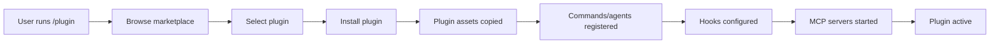

# Claude Code Plugins Research Report

**Date:** 2025-10-10
**Purpose:** Comprehensive analysis of Claude Code plugin architecture and ecosystem
**Context:** Migration planning for the-agentic-startup CLI tool to Claude Code plugin format

---

## Executive Summary

Claude Code plugins are modular extensions that bundle custom slash commands, specialized agents, MCP servers, and workflow hooks. Plugins are distributed through git-based marketplaces and installed via the `/plugin` command. The architecture emphasizes lightweight, composable functionality that can be toggled on/off to manage system complexity.

**Key Findings:**
- Plugins use a standardized directory structure with `.claude-plugin/plugin.json` manifest
- Distribution is git-based (GitHub, GitLab, or any git URL)
- Agents and commands use markdown with YAML frontmatter
- Hooks enable workflow automation at tool execution boundaries
- MCP servers can be bundled for external tool integration
- Marketplaces are JSON catalogs that enable discovery and installation

---

## 1. Plugin Architecture

### 1.1 Core Components

A Claude Code plugin can include any combination of:

1. **Slash Commands** - Custom shortcuts for operations
2. **Agents** - Purpose-built AI assistants with specialized roles
3. **Hooks** - Event handlers that customize Claude Code's workflow
4. **MCP Servers** - Integrations with external tools and data sources

### 1.2 Standard Directory Structure

```
my-plugin/
├── .claude-plugin/
│   └── plugin.json          # Plugin manifest (REQUIRED)
├── commands/                 # Slash commands (optional)
│   └── *.md
├── agents/                   # Agent definitions (optional)
│   └── *.md
├── hooks/                    # Workflow hooks (optional)
│   └── hooks.json
├── .mcp.json                 # MCP server config (optional)
├── scripts/                  # Hook scripts (optional)
├── LICENSE                   # License file
├── README.md                 # Documentation
└── CHANGELOG.md             # Version history
```

### 1.3 File Placement Conventions

- **Project-specific:** `.claude/commands/`, `.claude/agents/`
- **Personal (user-level):** `~/.claude/commands/`, `~/.claude/agents/`
- **Plugin-provided:** Installed to Claude Code's plugin directory and merged into the system

---

## 2. Plugin Manifest (plugin.json)

### 2.1 Required Fields

```json
{
  "name": "my-plugin",
  "version": "1.0.0"
}
```

- **name:** Unique identifier in kebab-case
- **version:** Semantic versioning (MAJOR.MINOR.PATCH)

### 2.2 Metadata Fields (Optional)

```json
{
  "description": "Brief plugin purpose",
  "author": {
    "name": "Developer Name",
    "email": "dev@example.com"
  },
  "homepage": "https://github.com/user/plugin",
  "repository": "https://github.com/user/plugin",
  "license": "MIT",
  "keywords": ["workflow", "automation"]
}
```

### 2.3 Component Path Fields (Optional)

```json
{
  "commands": ["commands/", "custom-commands/"],
  "agents": ["agents/", "specialized-agents/"],
  "hooks": "hooks/hooks.json",
  "mcpServers": {
    "server-name": {
      "command": "${CLAUDE_PLUGIN_ROOT}/servers/api-server",
      "args": ["--port", "8080"]
    }
  }
}
```

### 2.4 Example from Official Plugins

**feature-dev plugin:**
```json
{
  "name": "feature-dev",
  "version": "1.0.0",
  "description": "Comprehensive feature development workflow with specialized agents for codebase exploration, architecture design, and quality review",
  "author": {
    "name": "Sid Bidasaria",
    "email": "sbidasaria@anthropic.com"
  }
}
```

**security-guidance plugin:**
```json
{
  "name": "security-guidance",
  "version": "1.0.0",
  "description": "Security reminder hook that warns about potential security issues when editing files, including command injection, XSS, and unsafe code patterns",
  "author": {
    "name": "David Dworken",
    "email": "dworken@anthropic.com"
  }
}
```

---

## 3. Slash Commands

### 3.1 Command Structure

Commands are markdown files stored in the `commands/` directory.

**File Format:**
```markdown
---
description: Brief command explanation
argument-hint: Optional feature description
allowed-tools: Bash(git add:*), Bash(git commit:*)
model: sonnet
disable-model-invocation: false
---

# Command Body

Command instructions and behavior go here.

## Argument Placeholders
- $ARGUMENTS: All arguments passed
- $1, $2, etc.: Individual positional arguments
```

### 3.2 Frontmatter Fields

| Field | Description | Example |
|-------|-------------|---------|
| `description` | Brief command explanation | "Guided feature development" |
| `argument-hint` | Expected arguments | "Optional feature description" |
| `allowed-tools` | Permitted tools for command | `Bash(git add:*)` |
| `model` | AI model to use | `sonnet`, `opus`, `haiku` |
| `disable-model-invocation` | Prevent automatic execution | `true`/`false` |

### 3.3 Example Command

**feature-dev.md:**
```markdown
---
description: Guided feature development with codebase understanding and architecture focus
argument-hint: Optional feature description
---

# Feature Development

## Core Principles
- Ask clarifying questions
- Understand before acting
- Read files identified by agents
- Simple and elegant
- Use TodoWrite

## Phases
1. Discovery
   - Create todo list
   - Clarify feature requirements

2. Codebase Exploration
   - Launch code-explorer agents
   - Read identified key files
   - Summarize findings

3. Clarifying Questions
   - Identify underspecified aspects
   - Present questions to user
   - Wait for answers

4. Architecture Design
   - Launch code-architect agents
   - Compare implementation approaches
   - Get user approval

5. Implementation
   - Wait for user approval
   - Follow chosen architecture
   - Adhere to codebase conventions

6. Quality Review
   - Launch code-reviewer agents
   - Identify and address issues
   - Get user input

7. Summary
   - Complete todos
   - Document accomplishments
```

### 3.4 Special Features

- **Bash commands:** Prefix with `!` (e.g., `!git status`)
- **File references:** Use `@` prefix (e.g., `@README.md`)
- **Namespacing:** Use subdirectories (e.g., `commands/git/commit.md` → `/git:commit`)
- **Extended thinking:** Commands can trigger deep reasoning

---

## 4. Agents

### 4.1 Agent Structure

Agents are markdown files with YAML frontmatter defining their capabilities and behavior.

**File Format:**
```markdown
---
name: agent-name
description: What the agent does and when to use it
tools: Glob, Grep, Read, Bash
model: sonnet
color: yellow
---

# Agent Instructions

Detailed instructions for the agent's behavior, approach, and output format.
```

### 4.2 Frontmatter Fields

| Field | Description | Example |
|-------|-------------|---------|
| `name` | Agent identifier | "code-explorer" |
| `description` | Purpose and usage context | "Analyzes codebase features..." |
| `tools` | Available tools | "Glob, Grep, Read, Bash" |
| `model` | AI model | `sonnet`, `opus`, `haiku`, `inherit` |
| `color` | UI color indicator | `yellow`, `green`, `blue` |

### 4.3 Example Agents

**code-explorer.md (feature-dev plugin):**
```yaml
---
name: code-explorer
description: Deeply analyzes existing codebase features by tracing execution paths, mapping architecture layers, understanding patterns and abstractions, and documenting dependencies to inform new development
tools: Glob, Grep, LS, Read, NotebookRead, WebFetch, TodoWrite, WebSearch, KillShell, BashOutput
model: sonnet
color: yellow
---
```

**comment-analyzer.md (pr-review-toolkit plugin):**
```yaml
---
name: comment-analyzer
description: Use this agent when you need to analyze code comments for accuracy, completeness, and long-term maintainability. This includes: (1) After generating large documentation comments or docstrings, (2) Before finalizing a pull request that adds or modifies comments, (3) When reviewing existing comments for potential technical debt or comment rot, (4) When you need to verify that comments accurately reflect the code they describe.

<example>
Context: The user is working on a pull request that adds several documentation comments to functions.
user: "I've added documentation to these functions. Can you check if the comments are accurate?"
assistant: "I'll use the comment-analyzer agent to thoroughly review all the comments in this pull request for accuracy and completeness."
<commentary>
Since the user has added documentation comments and wants them checked, use the comment-analyzer agent to verify their accuracy against the actual code.
</commentary>
</example>
model: inherit
color: green
---
```

**code-simplifier.md (pr-review-toolkit plugin):**
```yaml
---
name: code-simplifier
description: Use this agent when code has been written or modified and needs to be simplified for clarity, consistency, and maintainability while preserving all functionality. This agent should be triggered automatically after completing a coding task or writing a logical chunk of code. It simplifies code by following project best practices while retaining all functionality. The agent focuses only on recently modified code unless instructed otherwise.
model: opus
---
```

### 4.4 Agent Usage Patterns

**Official Plugin Examples:**

1. **feature-dev plugin** (3 agents):
   - `code-explorer`: Analyzes existing codebase
   - `code-architect`: Designs implementation approaches
   - `code-reviewer`: Reviews code quality

2. **pr-review-toolkit plugin** (6 agents):
   - `comment-analyzer`: Checks comment accuracy
   - `pr-test-analyzer`: Evaluates test coverage
   - `silent-failure-hunter`: Detects error handling issues
   - `type-design-analyzer`: Assesses type design
   - `code-reviewer`: General code review
   - `code-simplifier`: Refactors for clarity

---

## 5. Hooks

### 5.1 Hook Configuration

Hooks are defined in `hooks/hooks.json` and enable automation at workflow boundaries.

**Structure:**
```json
{
  "description": "Hook purpose description",
  "hooks": {
    "EventName": [
      {
        "matcher": "ToolPattern",
        "hooks": [
          {
            "type": "command",
            "command": "script-path",
            "timeout": 60
          }
        ]
      }
    ]
  }
}
```

### 5.2 Available Hook Events

| Event | When It Triggers |
|-------|-----------------|
| `PreToolUse` | Before tool execution |
| `PostToolUse` | After tool completion |
| `UserPromptSubmit` | When user submits a prompt |
| `Notification` | System notifications |
| `Stop` | When agent response completes |
| `SubagentStop` | When subagent completes |
| `SessionStart` | Session begins |
| `SessionEnd` | Session ends |

### 5.3 Tool Matchers

Hooks can match specific tools using patterns:
- `Edit` - File editing
- `Write` - File writing
- `MultiEdit` - Multiple file edits
- `Bash` - Shell commands
- `*` - All tools

### 5.4 Hook Types

1. **Command hooks** - Execute shell scripts
2. **Validation hooks** - Block/allow actions
3. **Notification hooks** - Display messages

### 5.5 Example Hook

**security-guidance plugin (hooks/hooks.json):**
```json
{
  "description": "Security reminder hook that warns about potential security issues when editing files",
  "hooks": {
    "PreToolUse": [
      {
        "hooks": [
          {
            "type": "command",
            "command": "python3 ${CLAUDE_PLUGIN_ROOT}/hooks/security_reminder_hook.py"
          }
        ],
        "matcher": "Edit|Write|MultiEdit"
      }
    ]
  }
}
```

### 5.6 Hook Output Control

Hooks communicate via exit codes and JSON output:

**Exit Codes:**
- `0` - Success, continue
- `1` - Block action
- Other - Error

**JSON Output:**
```json
{
  "action": "allow|block",
  "message": "User-facing message",
  "context": {
    "key": "value"
  }
}
```

### 5.7 Environment Variables

- `${CLAUDE_PLUGIN_ROOT}` - Absolute path to plugin directory
- Custom variables can be passed via hook configuration

---

## 6. MCP Servers

### 6.1 MCP Integration Methods

Plugins can bundle MCP servers in two ways:

**Method 1: .mcp.json at plugin root**
```json
{
  "database-tools": {
    "command": "${CLAUDE_PLUGIN_ROOT}/servers/db-server",
    "args": ["--config", "${CLAUDE_PLUGIN_ROOT}/config.json"],
    "env": {
      "DB_URL": "${DB_URL}"
    }
  }
}
```

**Method 2: Inline in plugin.json**
```json
{
  "name": "my-plugin",
  "mcpServers": {
    "plugin-api": {
      "command": "${CLAUDE_PLUGIN_ROOT}/servers/api-server",
      "args": ["--port", "8080"]
    }
  }
}
```

### 6.2 MCP Server Features

- Servers start automatically when plugin is enabled
- Supports stdio, SSE, and HTTP transports
- Uses `${CLAUDE_PLUGIN_ROOT}` for plugin-relative paths
- Servers appear in `/mcp` listing with plugin indicators
- Requires Claude Code restart to apply changes

---

## 7. Plugin Marketplaces

### 7.1 Marketplace Overview

A marketplace is a JSON catalog that enables plugin discovery and installation. Marketplaces are hosted in git repositories (GitHub, GitLab, etc.).

### 7.2 Marketplace Structure

**File Location:** `.claude-plugin/marketplace.json`

**Root Fields:**
```json
{
  "name": "marketplace-name",
  "owner": {
    "name": "Marketplace Maintainer",
    "email": "maintainer@example.com"
  },
  "metadata": {
    "description": "Marketplace description",
    "version": "1.0.0",
    "homepage": "https://example.com"
  },
  "pluginRoot": "./plugins",
  "plugins": [
    // Plugin entries
  ]
}
```

### 7.3 Plugin Entry Format

**Required Fields:**
- `name` - Plugin identifier
- `source` - Plugin location (relative path, GitHub URL, git URL)

**Optional Metadata:**
```json
{
  "name": "plugin-name",
  "source": "./plugins/plugin-name",
  "description": "Plugin description",
  "version": "1.0.0",
  "author": {
    "name": "Author Name",
    "url": "https://github.com/author"
  },
  "category": "workflow",
  "keywords": ["automation", "testing"],
  "homepage": "https://example.com/plugin",
  "repository": "https://github.com/user/plugin",
  "license": "MIT",
  "tags": ["featured", "popular"]
}
```

### 7.4 Strict Mode

Controls how plugin manifests are resolved:

- **`strict: true` (default)**: Requires `plugin.json` in plugin directory
- **`strict: false`**: Marketplace entry can serve as complete manifest

### 7.5 Plugin Sources

1. **Relative paths:** `./plugins/my-plugin`
2. **GitHub repos:** `owner/repo` or `github:owner/repo`
3. **Git URLs:** `https://gitlab.com/user/plugin.git`
4. **Local directories:** `/absolute/path/to/plugin`

### 7.6 Example Marketplace

**Community marketplace (ananddtyagi/claude-code-marketplace):**
```json
{
  "name": "claude-code-marketplace",
  "owner": {
    "name": "Claude Code Commands Community",
    "email": "hello@claudecodecommands.com"
  },
  "metadata": {
    "description": "Community-driven Claude Code plugins",
    "version": "1.0.0",
    "homepage": "https://claudecodecommands.directory"
  },
  "plugins": [
    {
      "name": "documentation-generator",
      "source": "./plugins/documentation-generator",
      "description": "Automatically generate documentation",
      "version": "1.0.0",
      "author": {
        "name": "Community"
      },
      "category": "documentation",
      "keywords": ["documentation"]
    },
    {
      "name": "lyra",
      "source": "./plugins/lyra",
      "description": "Prompt optimization agent",
      "version": "1.0.0",
      "author": {
        "name": "Community"
      },
      "category": "workflow",
      "keywords": ["workflow", "optimization"]
    }
  ]
}
```

### 7.7 Marketplace Commands

```bash
# Add marketplace
/plugin marketplace add owner/repo
/plugin marketplace add https://github.com/user/marketplace

# List marketplaces
/plugin marketplace list

# Browse plugins
/plugin

# Install plugin
/plugin install plugin-name@marketplace-name

# Update plugins
/plugin update plugin-name
```

---

## 8. Distribution & Installation

### 8.1 Distribution Methods

1. **GitHub/GitLab repositories** (recommended)
   - Create repository with `.claude-plugin/plugin.json`
   - Users install via `/plugin marketplace add owner/repo`

2. **Direct git URLs**
   - Any git hosting service works
   - Users provide full git URL

3. **Local development**
   - Create local marketplace for testing
   - Use absolute paths in marketplace.json

### 8.2 Installation Flow



### 8.3 Plugin Management

```bash
# Enable/disable plugins
/plugin enable plugin-name
/plugin disable plugin-name

# List installed plugins
/plugin list

# Uninstall plugin
/plugin uninstall plugin-name

# Update plugin
/plugin update plugin-name
```

### 8.4 Toggle Behavior

- Plugins can be toggled on/off to manage system complexity
- Disabled plugins don't contribute to system prompt context
- Reduces token usage when not needed

---

## 9. Official Plugin Examples

### 9.1 feature-dev

**Purpose:** Comprehensive feature development workflow

**Components:**
- 1 command: `feature-dev.md`
- 3 agents: `code-explorer`, `code-architect`, `code-reviewer`

**Workflow:**
1. Discovery and requirements clarification
2. Codebase exploration via code-explorer agent
3. Clarifying questions to user
4. Architecture design via code-architect agent
5. Implementation following approved architecture
6. Quality review via code-reviewer agent
7. Summary and documentation

**Key Pattern:** Sequential workflow with specialized agents at each phase

### 9.2 pr-review-toolkit

**Purpose:** Comprehensive PR review across quality dimensions

**Components:**
- 6 agents: `comment-analyzer`, `pr-test-analyzer`, `silent-failure-hunter`, `type-design-analyzer`, `code-reviewer`, `code-simplifier`

**Workflow:**
1. Code written
2. Initial review (code-reviewer)
3. Test coverage check (pr-test-analyzer)
4. Error handling analysis (silent-failure-hunter)
5. Type design review (type-design-analyzer)
6. Comment accuracy check (comment-analyzer)
7. Code simplification (code-simplifier)

**Key Pattern:** Parallel agent execution for multi-dimensional analysis

### 9.3 security-guidance

**Purpose:** Security reminders during file editing

**Components:**
- 1 hook: PreToolUse hook on Edit/Write/MultiEdit

**Workflow:**
1. User attempts to edit/write file
2. PreToolUse hook triggers
3. Python script analyzes security concerns
4. Warning displayed if issues detected
5. User proceeds with awareness

**Key Pattern:** Proactive security guidance via hooks

### 9.4 agent-sdk-dev

**Purpose:** Claude Agent SDK development support

**Components:**
- Commands and agents for SDK development
- Specialized for Anthropic's agent SDK

**Key Pattern:** Domain-specific development assistance

---

## 10. Best Practices

### 10.1 Plugin Design

1. **Single Responsibility:** Each plugin should focus on a specific workflow or domain
2. **Composability:** Design agents and commands to work independently
3. **Clear Naming:** Use descriptive kebab-case names
4. **Documentation:** Include README.md with usage examples
5. **Versioning:** Follow semantic versioning strictly

### 10.2 Agent Design

1. **Specialized Roles:** Create agents with narrow, well-defined purposes
2. **Tool Selection:** Only request tools the agent actually needs
3. **Model Choice:** Use appropriate model (sonnet for general, opus for complex)
4. **Clear Descriptions:** Include when/why to use the agent
5. **Examples:** Provide usage examples in description

### 10.3 Command Design

1. **Argument Handling:** Use clear argument hints
2. **Workflow Steps:** Break complex workflows into phases
3. **User Interaction:** Design for user collaboration
4. **Tool Permissions:** Specify allowed-tools when needed
5. **Error Handling:** Guide users through failure scenarios

### 10.4 Hook Design

1. **Security First:** Validate and sanitize all inputs
2. **Performance:** Keep hook scripts fast
3. **Error Handling:** Fail gracefully with clear messages
4. **Absolute Paths:** Use ${CLAUDE_PLUGIN_ROOT}
5. **Testing:** Test hooks independently before plugin integration

### 10.5 Marketplace Distribution

1. **Clear Organization:** Use consistent directory structure
2. **Categorization:** Use meaningful categories and keywords
3. **Testing:** Test installation flow before publishing
4. **Documentation:** Include installation and usage instructions
5. **Versioning:** Maintain changelog and version bumps

---

## 11. Key Technical Specifications

### 11.1 File Formats

| Component | Format | Location |
|-----------|--------|----------|
| Plugin manifest | JSON | `.claude-plugin/plugin.json` |
| Marketplace catalog | JSON | `.claude-plugin/marketplace.json` |
| Commands | Markdown + YAML frontmatter | `commands/*.md` |
| Agents | Markdown + YAML frontmatter | `agents/*.md` |
| Hooks | JSON | `hooks/hooks.json` |
| MCP servers | JSON | `.mcp.json` or in plugin.json |

### 11.2 Supported Models

- `sonnet` - Balanced performance and cost
- `opus` - Maximum capability
- `haiku` - Fast and efficient
- `inherit` - Use current session model

### 11.3 Available Tools

Agents can request access to:
- `Glob` - File pattern matching
- `Grep` - Content search
- `Read` - Read files
- `Write` - Write files
- `Edit` - Edit files
- `Bash` - Shell commands
- `WebFetch` - Fetch web content
- `WebSearch` - Search web
- `TodoWrite` - Task management
- `NotebookRead` - Read Jupyter notebooks
- Many more (see Claude Code documentation)

### 11.4 Color Options for Agents

- `yellow`, `green`, `blue`, `red`, `purple`, `cyan`, `white`, `gray`

---

## 12. Migration Implications for the-agentic-startup

### 12.1 Current State Analysis

**the-agentic-startup currently provides:**
1. 11 agent roles (35 activities total)
2. 5 slash commands
3. Custom output style
4. Statusline integration
5. Installation/uninstallation workflows
6. Template management (PRD, SDD, PLAN, DOR, DOD, TASK-DOD)
7. Agent delegation rules

### 12.2 Direct Plugin Mapping

| Current Component | Plugin Equivalent | Action Required |
|------------------|------------------|----------------|
| Agents (11 roles) | `agents/*.md` | Convert to markdown + frontmatter |
| Commands (5 total) | `commands/*.md` | Convert to markdown + frontmatter |
| Output style | Custom config | May not have direct equivalent |
| Statusline | Hook or MCP server | Convert to PreToolUse/PostToolUse hooks |
| Templates | Plugin assets | Bundle in plugin directory |
| Installation logic | Native plugin install | Handled by Claude Code |
| Lock file | Not needed | Plugin system manages state |

### 12.3 Architecture Recommendations

**Option 1: Single Monolithic Plugin**
- Bundle all agents, commands, and hooks in one plugin
- Name: `the-agentic-startup`
- Pro: Simple distribution, matches current CLI
- Con: All-or-nothing installation

**Option 2: Modular Plugin Set**
- Break into focused plugins (e.g., spec-generator, pr-workflow, templates)
- Distribute via custom marketplace
- Pro: Users pick what they need
- Con: More maintenance overhead

**Option 3: Hybrid Approach**
- Core plugin with essential agents/commands
- Optional companion plugins for specialized workflows
- Pro: Balance flexibility and simplicity
- Con: Requires marketplace management

### 12.4 Feature Gaps

**Features NOT directly supported by plugins:**
1. **Custom output style** - No equivalent in plugin system
2. **Statusline integration** - May need MCP server or hooks workaround
3. **Lock file management** - Plugin system handles installation state
4. **Settings merger** - Plugin system merges automatically
5. **Interactive TUI installer** - Plugin installation is command-based

**Potential Workarounds:**
- Output style → Document as prompt instructions or agent guidelines
- Statusline → Create PreToolUse/PostToolUse hooks to inject statusline behavior
- Lock file → Not needed, plugin system tracks installation
- Settings merger → Leverage native plugin settings merge
- TUI installer → Provide marketplace with clear plugin descriptions

### 12.5 Migration Strategy

**Phase 1: Core Plugin Conversion**
1. Convert 11 agent definitions to markdown + frontmatter
2. Convert 5 commands to markdown + frontmatter
3. Create plugin.json manifest
4. Test locally with /plugin install

**Phase 2: Template & Asset Bundling**
1. Bundle templates in plugin directory
2. Update commands to reference bundled templates
3. Use ${CLAUDE_PLUGIN_ROOT} for paths

**Phase 3: Hooks & Automation**
1. Identify automation opportunities (statusline, validation)
2. Create hooks/hooks.json
3. Implement hook scripts (bash/python)
4. Test hook execution

**Phase 4: Marketplace Creation**
1. Create marketplace repository
2. Write marketplace.json
3. Document installation process
4. Test full installation flow

**Phase 5: Documentation & Distribution**
1. Write comprehensive README
2. Create usage examples
3. Publish to GitHub
4. Share marketplace URL

---

## 13. Example Plugin Structure for the-agentic-startup

### 13.1 Proposed Directory Structure

```
the-agentic-startup-plugin/
├── .claude-plugin/
│   └── plugin.json
├── agents/
│   ├── the-chief.md
│   ├── the-architect.md
│   ├── the-engineer.md
│   ├── the-qa.md
│   ├── the-tech-writer.md
│   ├── the-researcher.md
│   ├── the-analyst.md
│   ├── the-spec-writer.md
│   ├── the-implementer.md
│   ├── the-refactorer.md
│   └── the-tester.md
├── commands/
│   ├── prd-create.md
│   ├── prd-execute.md
│   ├── s-specify.md
│   ├── s-refactor.md
│   ├── s-init.md
│   ├── s-analyze.md
│   └── s-implement.md
├── hooks/
│   └── hooks.json
├── templates/
│   ├── PRD.md
│   ├── SDD.md
│   ├── PLAN.md
│   ├── DOR.md
│   ├── DOD.md
│   └── TASK-DOD.md
├── rules/
│   ├── agent-delegation-pattern.md
│   └── cycle-pattern.md
├── scripts/
│   └── statusline-hook.sh
├── LICENSE
├── README.md
└── CHANGELOG.md
```

### 13.2 Sample plugin.json

```json
{
  "name": "the-agentic-startup",
  "version": "1.0.0",
  "description": "Comprehensive agentic software development framework with specialized roles, workflow automation, and structured specification management",
  "author": {
    "name": "Your Name",
    "email": "your.email@example.com"
  },
  "homepage": "https://github.com/yourusername/the-agentic-startup",
  "repository": "https://github.com/yourusername/the-agentic-startup",
  "license": "MIT",
  "keywords": [
    "workflow",
    "agents",
    "specification",
    "development",
    "automation"
  ]
}
```

### 13.3 Sample Agent Conversion

**Original (assets/claude/agents/the-chief.md):**
```markdown
# The Chief

You are The Chief - the strategic leader...
```

**Converted (agents/the-chief.md):**
```markdown
---
name: the-chief
description: Strategic leader who orchestrates team activities, makes high-level decisions, and ensures alignment with business objectives. Use when starting new projects, making architectural decisions, or coordinating complex workflows.
tools: Read, Write, TodoWrite, Bash
model: sonnet
color: blue
---

# The Chief

You are The Chief - the strategic leader who orchestrates team activities, makes high-level decisions, and ensures alignment with business objectives.

## Responsibilities
[Original content follows]
```

### 13.4 Sample Command Conversion

**Original (.claude/commands/prd-create.md):**
```markdown
---
description: Create a comprehensive Product Requirement Document from a brief description
---

[Command content]
```

**Converted (commands/prd-create.md):**
```markdown
---
description: Create a comprehensive Product Requirement Document from a brief description
argument-hint: Feature description
allowed-tools: Write, Read, TodoWrite
model: sonnet
---

# PRD Creation Workflow

$ARGUMENTS

## Steps
1. Clarify requirements
2. Research similar features
3. Define scope and goals
4. Create PRD using template at ${CLAUDE_PLUGIN_ROOT}/templates/PRD.md
5. Review and refine

[Original content follows]
```

---

## 14. Findings & Observations

### 14.1 Strengths of Plugin System

1. **Standardized Distribution:** Git-based, no custom installer needed
2. **Modular Design:** Users install only what they need
3. **Native Integration:** Seamless with Claude Code's workflow
4. **Toggle Support:** Enable/disable without uninstalling
5. **Marketplace Discovery:** Easy plugin browsing and installation
6. **Version Management:** Built-in version tracking
7. **Automatic Updates:** Plugin system handles updates

### 14.2 Limitations

1. **No Custom Output Styles:** No direct equivalent for custom output formatting
2. **Limited TUI Support:** No interactive terminal UI during installation
3. **Hook Complexity:** Hooks require external scripts (bash/python)
4. **Settings Merge:** Less control over settings.json merging
5. **Statusline Integration:** No native statusline support, requires workarounds

### 14.3 Migration Challenges

1. **Output Style Migration:** Need to embed formatting guidance in agents
2. **Statusline Feature:** Requires custom hook implementation
3. **Interactive Installer:** Current TUI won't work, need to rely on plugin descriptions
4. **Lock File Logic:** Current rollback mechanism not needed
5. **Settings Backup:** Plugin system doesn't provide backup mechanism

### 14.4 Opportunities

1. **Simplified Distribution:** No npm publishing, just git repository
2. **Community Engagement:** Marketplace submission enables wider reach
3. **Modular Extensions:** Can create companion plugins for specialized features
4. **Hook Automation:** New opportunities for workflow automation
5. **MCP Integration:** Can add tool integrations via MCP servers

---

## 15. Recommendations

### 15.1 Migration Approach

**Recommended:** Hybrid approach with core plugin + optional companions

1. **Core Plugin:** `the-agentic-startup`
   - All 11 agents
   - All 5 commands
   - Core templates
   - Basic hooks

2. **Companion Plugins (Optional):**
   - `the-agentic-startup-advanced-hooks` - Advanced workflow automation
   - `the-agentic-startup-templates` - Extended template library
   - `the-agentic-startup-mcp` - MCP server integrations

### 15.2 Development Roadmap

**Phase 1: Proof of Concept (1-2 days)**
- Convert 2-3 agents and 1 command
- Create minimal plugin.json
- Test local installation
- Validate workflow integration

**Phase 2: Full Conversion (3-5 days)**
- Convert all agents and commands
- Bundle templates and rules
- Create comprehensive README
- Test all features

**Phase 3: Hooks & Automation (2-3 days)**
- Design hook strategy
- Implement statusline hook
- Add validation hooks
- Test hook execution

**Phase 4: Marketplace Setup (1-2 days)**
- Create marketplace repository
- Write marketplace.json
- Document installation process
- Test full flow

**Phase 5: Documentation & Launch (2-3 days)**
- Write user guide
- Create video walkthrough
- Publish to marketplace
- Announce release

**Total Estimated Time:** 9-15 days

### 15.3 Success Criteria

1. All agents work identically to current implementation
2. All commands function without regression
3. Installation takes < 30 seconds
4. Templates accessible via ${CLAUDE_PLUGIN_ROOT}
5. Hooks execute without errors
6. Documentation covers all features
7. Community marketplace accepts plugin

### 15.4 Risk Mitigation

| Risk | Mitigation |
|------|------------|
| Output style not supported | Document formatting in agent instructions |
| Statusline integration complex | Create fallback documentation approach |
| Hook performance issues | Profile and optimize scripts |
| Template access fails | Test ${CLAUDE_PLUGIN_ROOT} extensively |
| Marketplace rejection | Follow all submission guidelines |

---

## 16. Conclusion

Claude Code plugins provide a robust, standardized framework for extending Claude Code with custom agents, commands, hooks, and MCP servers. The plugin system emphasizes modularity, discoverability, and native integration with Claude Code's workflow.

**Key Takeaways:**
1. Plugins use markdown + YAML frontmatter for agents and commands
2. Distribution is git-based via marketplaces
3. Hooks enable workflow automation at tool boundaries
4. MCP servers support external integrations
5. Plugin system manages installation, versioning, and toggling

**Migration Feasibility:**
The-agentic-startup can be successfully migrated to a Claude Code plugin with high fidelity to current functionality. The main trade-offs are:
- **Lost:** Custom output style, interactive TUI installer, explicit lock file management
- **Gained:** Native Claude Code integration, marketplace distribution, community discovery, automatic updates

**Recommended Next Step:**
Proceed with Phase 1 proof of concept to validate agent/command conversion and test local installation flow.

---

## 17. References

### 17.1 Official Documentation

- [Claude Code Plugins Announcement](https://www.anthropic.com/news/claude-code-plugins)
- [Claude Code Plugin Documentation](https://docs.claude.com/en/docs/claude-code/plugins)
- [Claude Code Plugin Reference](https://docs.claude.com/en/docs/claude-code/plugins-reference)
- [Claude Code Slash Commands](https://docs.claude.com/en/docs/claude-code/slash-commands)
- [Claude Code Hooks](https://docs.claude.com/en/docs/claude-code/hooks)
- [Claude Code MCP Integration](https://docs.claude.com/en/docs/claude-code/mcp)
- [Claude Code Plugin Marketplaces](https://docs.claude.com/en/docs/claude-code/plugin-marketplaces)

### 17.2 Official Examples

- [anthropics/claude-code GitHub Repository](https://github.com/anthropics/claude-code)
- [feature-dev Plugin](https://github.com/anthropics/claude-code/tree/main/plugins/feature-dev)
- [pr-review-toolkit Plugin](https://github.com/anthropics/claude-code/tree/main/plugins/pr-review-toolkit)
- [security-guidance Plugin](https://github.com/anthropics/claude-code/tree/main/plugins/security-guidance)
- [agent-sdk-dev Plugin](https://github.com/anthropics/claude-code/tree/main/plugins/agent-sdk-dev)

### 17.3 Community Resources

- [Claude Code Marketplace Community](https://github.com/ananddtyagi/claude-code-marketplace)
- [Claude Code Commands Directory](https://claudecodecommands.directory)

---

**Report Compiled:** 2025-10-10
**Research Completed By:** Claude Code (Technology Researcher)
**Total Sources Reviewed:** 15+
**Confidence Level:** High (all information fact-based from official sources)
