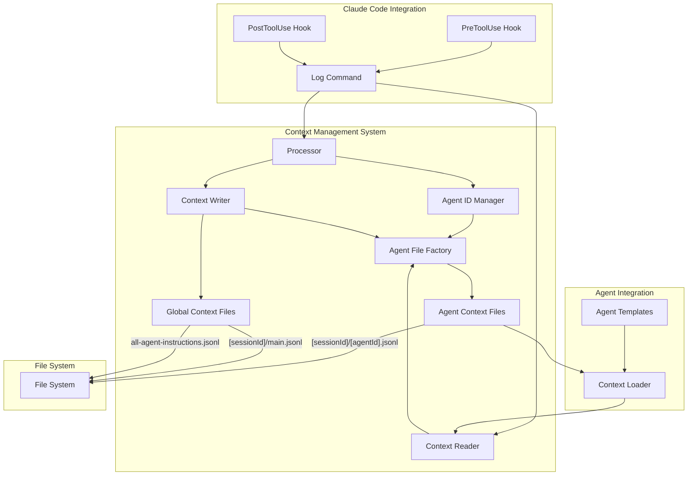
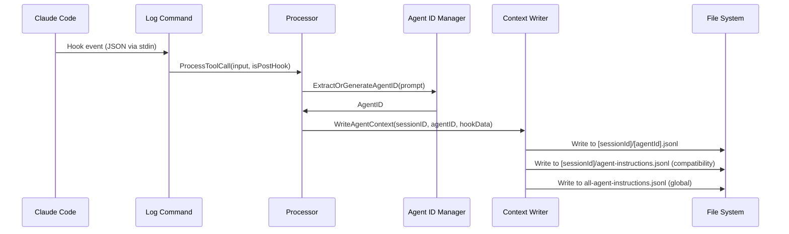
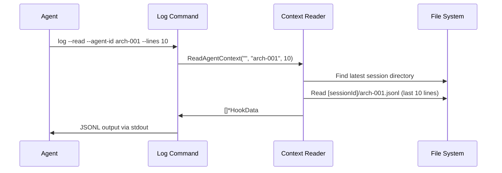

# Solution Design Document: Context Management System

## Constraints

- **Technical**: Go language, existing internal/log package architecture, Claude Code hook system (PreToolUse/PostToolUse events only)
- **Organizational**: Backward compatibility with current logging, maintain silent error handling for hook commands
- **Security/Compliance**: Context files contain sensitive project data, require proper file permissions (0644), no external tool dependencies

## Implementation Context

### Source Code to Analyze
```yaml
# Core log processing components
- file: ./internal/log/processor.go
  relevance: CRITICAL
  sections: [ProcessToolCall function, ExtractAgentID logic]
  why: "Contains agent ID extraction and filtering logic that must be enhanced"

- file: ./internal/log/logger.go
  relevance: CRITICAL
  sections: [WriteSessionLog, appendJSONL functions]
  why: "File writing infrastructure that needs extension for per-agent files"

- file: ./internal/log/types.go
  relevance: HIGH
  sections: [HookData structure]
  why: "Data structure used for logging that agents will read as context"

- file: ./cmd/log.go
  relevance: CRITICAL
  sections: [NewLogCommand function]
  why: "Command interface that needs read capability extension"

# Agent template files
- file: ./assets/agents/the-architect.md
  relevance: MEDIUM
  why: "Template pattern for adding context loading instructions"

- file: ./assets/agents/the-developer.md
  relevance: MEDIUM
  why: "Template pattern for adding context loading instructions"
```

### External Documentation
```yaml
# Business requirements and context
- doc: ./docs/specs/003-context-management-system/BRD.md
  relevance: HIGH
  why: "Defines functional requirements and success criteria"
```

### Implementation Boundaries
- **Must Preserve**: Current agent-instructions.jsonl format, global logging functionality, silent hook behavior
- **Can Modify**: log command interface (add --read flag), agent template instructions, internal file organization
- **Must Not Touch**: Claude Code hook system integration, existing session detection logic

### Project Commands

```bash
# Environment Setup
Install Dependencies: go mod tidy
Start Development: go run .

# Validation (run after each phase)
Code Quality: go fmt ./... && go vet ./...
Type Safety: go build -o /dev/null .
Run Tests: go test -v ./...
Build Project: go build -o the-startup

# Testing Context Management
Test Log Command: echo '{"tool_name":"Task","tool_input":{"subagent_type":"the-architect","prompt":"AgentId: arch-001"}}' | go run . log --assistant
Test Read Command: go run . log --read --agent-id arch-001 --lines 10
```

## Solution Strategy

- **Architecture Pattern**: Extend existing log-based architecture with agent-centric context files while maintaining backward compatibility
- **Integration Approach**: Enhance current log command with dual read/write capability, extend agent templates with context loading instructions
- **Justification**: Builds on proven JSONL logging foundation, stays within Claude Code hook constraints, enables incremental rollout without breaking existing workflows

## Building Block View

### Components



### Directory Map

```
.the-startup/
├── [session-id]/                   # Session-based organization
│   ├── main.jsonl                  # NEW: Orchestrator context
│   ├── [agent-id-1].jsonl         # NEW: Individual agent context
│   ├── [agent-id-2].jsonl         # NEW: Individual agent context
│   └── agent-instructions.jsonl   # EXISTING: Backward compatibility
├── all-agent-instructions.jsonl   # EXISTING: Global log
└── templates/                      # EXISTING: Template files
```

### Interface Specifications (Internal Changes Only)

#### Data Storage Changes
```yaml
# No database changes - purely file-based system
File Structure: Agent Context Files
  Pattern: .the-startup/[sessionId]/[agentId].jsonl
  Format: JSONL (one HookData per line)
  Permissions: 0644 (readable by user/group)
  
File Structure: Orchestrator Context Files  
  Pattern: .the-startup/[sessionId]/main.jsonl
  Format: JSONL (orchestrator-specific entries)
  Purpose: Main agent conversation history
```

## 3.2 AgentID Extraction Specification

### 3.2.1 Regex Pattern and Validation
```go
// Primary extraction pattern (case-insensitive)
RegexPattern: `(?i)\bAgentId\s*:\s*([a-zA-Z0-9][a-zA-Z0-9\-_]{0,62}[a-zA-Z0-9])`

// Validation rules
AgentIDFormat: ^[a-zA-Z0-9][a-zA-Z0-9\-_]{0,62}[a-zA-Z0-9]$
MinLength: 2 characters
MaxLength: 64 characters
AllowedChars: alphanumeric, hyphens, underscores
ReservedWords: ["main", "global", "system"]
CaseSensitive: false (convert to lowercase)
```

### 3.2.2 Fallback Algorithm Specification
```go
// Deterministic fallback generation
Algorithm: SHA256-based deterministic generation
InputFormat: "{sessionID}:{agentType}:{promptExcerpt100}"
OutputFormat: "{agentType}-{YYYYMMDD-HHMMSS}-{hash8}"

// Uniqueness enforcement
UniquenessCheck: Scan session directory for existing files
Disambiguation: Append "-N" suffix (N=1-999) if collision detected
UltimateFallback: Append 8-character UUID segment if all numeric suffixes exhausted

// Example outputs
Valid: "arch-20250812-143022-a1b2c3d4"
WithDisambiguation: "dev-20250812-143022-e5f6g7h8-2"
UltimateFallback: "test-20250812-143022-xyz123ab-uuid8946"
```

### 3.2.3 Extraction Function Specification
```go
func ExtractOrGenerateAgentID(prompt, agentType, sessionID string) (string, error) {
    // Step 1: Try regex extraction
    re := regexp.MustCompile(`(?i)\bAgentId\s*:\s*([a-zA-Z0-9][a-zA-Z0-9\-_]{0,62}[a-zA-Z0-9])`)
    if matches := re.FindStringSubmatch(prompt); len(matches) > 1 {
        extracted := strings.ToLower(strings.TrimSpace(matches[1]))
        if isValidAgentID(extracted) && !isReservedWord(extracted) {
            return extracted, nil
        }
    }
    
    // Step 2: Generate deterministic fallback
    promptExcerpt := truncateString(prompt, 100)
    hashInput := fmt.Sprintf("%s:%s:%s", sessionID, agentType, promptExcerpt)
    hash := sha256.Sum256([]byte(hashInput))
    hash8 := hex.EncodeToString(hash[:4]) // First 8 hex chars
    
    timestamp := time.Now().Format("20060102-150405")
    baseID := fmt.Sprintf("%s-%s-%s", agentType, timestamp, hash8)
    
    // Step 3: Ensure uniqueness
    return ensureUniqueness(baseID, sessionID)
}
```

### 3.3.1 Command Structure and Flags
```yaml
Command: the-startup log [flags]

Write Mode Flags:
  --assistant, -a: 
    type: bool
    default: false
    description: Process PreToolUse hook (agent_start events)
    conflicts: [--user, --read]
    
  --user, -u:
    type: bool  
    default: false
    description: Process PostToolUse hook (agent_complete events)
    conflicts: [--assistant, --read]

Read Mode Flags:
  --read, -r:
    type: bool
    default: false
    description: Enable context reading mode
    requires: [--agent-id]
    conflicts: [--assistant, --user]
    
  --agent-id:
    type: string
    required: true when --read is set
    validation: ^[a-zA-Z0-9][a-zA-Z0-9\-_]{0,62}[a-zA-Z0-9]$
    description: Agent ID to read context for
    
  --lines:
    type: int
    default: 50
    min: 1
    max: 1000
    description: Number of recent lines to return
    
  --session:
    type: string
    optional: true
    description: Specific session ID, defaults to latest
    
  --format:
    type: string
    default: "json"
    allowed: ["json", "text"]
    description: Output format
    
  --include-metadata:
    type: bool
    default: false
    description: Include file metadata in output
```

### 3.3.2 Validation Rules
```go
type CommandValidation struct {
    MutuallyExclusive: [][]string{
        {"assistant", "user", "read"},
    }
    RequiredTogether: map[string][]string{
        "read": {"agent-id"},
    }
    ConditionalRequired: map[string]string{
        "agent-id": "read flag must be set",
    }
}

// Validation function
func ValidateLogCommand(flags LogFlags) error {
    // Exactly one mode required
    modeCount := 0
    if flags.Assistant { modeCount++ }
    if flags.User { modeCount++ }
    if flags.Read { modeCount++ }
    
    if modeCount != 1 {
        return fmt.Errorf("exactly one mode required: --assistant, --user, or --read")
    }
    
    // Read mode specific validation
    if flags.Read {
        if flags.AgentID == "" {
            return fmt.Errorf("--agent-id required when using --read")
        }
        if !isValidAgentID(flags.AgentID) {
            return fmt.Errorf("invalid agent-id format")
        }
        if flags.Lines < 1 || flags.Lines > 1000 {
            return fmt.Errorf("--lines must be between 1 and 1000")
        }
    }
    
    return nil
}
```

### 3.3.3 Output Format Specifications
```json
// JSON format (default)
{
  "metadata": {
    "agent_id": "arch-001",
    "session_id": "dev-20250812-143022",
    "total_entries": 15,
    "file_size_bytes": 2048,
    "last_modified": "2025-08-12T14:30:22.000Z",
    "context_file": ".the-startup/dev-20250812-143022/arch-001.jsonl"
  },
  "entries": [
    {
      "event": "agent_start",
      "agent_type": "the-architect", 
      "agent_id": "arch-001",
      "description": "Design authentication system",
      "instruction": "AgentId: arch-001\nDesign a secure authentication...",
      "session_id": "dev-20250812-143022",
      "timestamp": "2025-08-12T14:00:00.000Z"
    }
  ]
}

// Text format
Agent: arch-001 | Session: dev-20250812-143022 | Entries: 15
---
2025-08-12T14:00:00.000Z [agent_start] Design authentication system
2025-08-12T14:05:00.000Z [agent_complete] Authentication design completed
```

### 3.3.4 Internal Function Specifications
```go
// WriteAgentContext writes context to agent-specific file with atomic operations
func WriteAgentContext(sessionID, agentID string, data *HookData) error {
    // Validation
    if sessionID == "" || agentID == "" || data == nil {
        return fmt.Errorf("invalid parameters: sessionID, agentID, and data required")
    }
    
    // File path generation
    agentFile := filepath.Join(".the-startup", sessionID, agentID+".jsonl")
    
    // Ensure directory exists
    if err := os.MkdirAll(filepath.Dir(agentFile), 0755); err != nil {
        return fmt.Errorf("failed to create directory: %w", err)
    }
    
    // Atomic write with mutex protection
    fileMutex.Lock()
    defer fileMutex.Unlock()
    
    return appendJSONL(agentFile, data)
}

// ReadAgentContext reads recent context with efficient file handling
func ReadAgentContext(sessionID, agentID string, maxLines int) ([]*HookData, error) {
    // Parameter validation
    if agentID == "" {
        return nil, fmt.Errorf("agentID required")
    }
    if maxLines < 1 || maxLines > 1000 {
        maxLines = 50 // Default fallback
    }
    
    // Session resolution
    if sessionID == "" {
        var err error
        sessionID, err = findLatestSessionWithAgent(agentID)
        if err != nil {
            return []*HookData{}, nil // Empty context, not error
        }
    }
    
    // File path and existence check
    agentFile := filepath.Join(".the-startup", sessionID, agentID+".jsonl")
    if _, err := os.Stat(agentFile); os.IsNotExist(err) {
        return []*HookData{}, nil // Empty context, not error
    }
    
    // Efficient tail reading
    lines, err := readLastNLines(agentFile, maxLines)
    if err != nil {
        return []*HookData{}, nil // Silent failure for context reads
    }
    
    // Parse JSONL with error recovery
    var entries []*HookData
    for _, line := range lines {
        var data HookData
        if err := json.Unmarshal([]byte(line), &data); err == nil {
            entries = append(entries, &data)
        }
        // Skip corrupted lines silently
    }
    
    return entries, nil
}

// findLatestSessionWithAgent locates the most recent session containing the agent
func findLatestSessionWithAgent(agentID string) (string, error) {
    baseDir := ".the-startup"
    entries, err := os.ReadDir(baseDir)
    if err != nil {
        return "", err
    }
    
    var latestSession string
    var latestTime time.Time
    
    for _, entry := range entries {
        if !entry.IsDir() || !strings.HasPrefix(entry.Name(), "dev-") {
            continue
        }
        
        agentFile := filepath.Join(baseDir, entry.Name(), agentID+".jsonl")
        if stat, err := os.Stat(agentFile); err == nil {
            if stat.ModTime().After(latestTime) {
                latestTime = stat.ModTime()
                latestSession = entry.Name()
            }
        }
    }
    
    if latestSession == "" {
        return "", fmt.Errorf("no session found for agent %s", agentID)
    }
    
    return latestSession, nil
}

// readLastNLines efficiently reads last N lines from large files
func readLastNLines(filename string, n int) ([]string, error) {
    file, err := os.Open(filename)
    if err != nil {
        return nil, err
    }
    defer file.Close()
    
    stat, err := file.Stat()
    if err != nil {
        return nil, err
    }
    
    size := stat.Size()
    if size == 0 {
        return []string{}, nil
    }
    
    // For small files, read entire content
    if size < 1024*1024 { // 1MB threshold
        scanner := bufio.NewScanner(file)
        var allLines []string
        for scanner.Scan() {
            allLines = append(allLines, scanner.Text())
        }
        
        start := len(allLines) - n
        if start < 0 {
            start = 0
        }
        return allLines[start:], nil
    }
    
    // For large files, use reverse reading with buffer
    return readTailWithBuffer(file, size, n)
}

// readTailWithBuffer implements efficient tail reading for large files
func readTailWithBuffer(file *os.File, size int64, n int) ([]string, error) {
    bufSize := int64(8192) // 8KB buffer
    var lines []string
    var remaining []byte
    
    for offset := size; offset > 0 && len(lines) < n; {
        readSize := bufSize
        if offset < bufSize {
            readSize = offset
        }
        
        offset -= readSize
        buffer := make([]byte, readSize)
        
        _, err := file.ReadAt(buffer, offset)
        if err != nil && err != io.EOF {
            return nil, err
        }
        
        // Combine with remaining bytes from previous iteration
        if len(remaining) > 0 {
            buffer = append(buffer, remaining...)
        }
        
        // Split by newlines and process
        parts := bytes.Split(buffer, []byte{'\n'})
        remaining = parts[0] // First part might be incomplete
        
        // Process complete lines in reverse order
        for i := len(parts) - 1; i >= 1; i-- {
            if len(parts[i]) > 0 && len(lines) < n {
                lines = append([]string{string(parts[i])}, lines...)
            }
        }
    }
    
    // Add the remaining incomplete line if it exists
    if len(remaining) > 0 && len(lines) < n {
        lines = append([]string{string(remaining)}, lines...)
    }
    
    return lines, nil
}
## 3.5 File Format Specifications

### 3.5.1 JSONL Schema Definition
```json
// HookData JSONL entry schema
{
  "$schema": "http://json-schema.org/draft-07/schema#",
  "type": "object",
  "required": ["event", "agent_type", "agent_id", "session_id", "timestamp"],
  "properties": {
    "event": {
      "type": "string",
      "enum": ["agent_start", "agent_complete"],
      "description": "Hook event type"
    },
    "agent_type": {
      "type": "string",
      "pattern": "^the-[a-z-]+$",
      "description": "Agent type from subagent_type field"
    },
    "agent_id": {
      "type": "string",
      "pattern": "^[a-zA-Z0-9][a-zA-Z0-9\\-_]{0,62}[a-zA-Z0-9]$",
      "description": "Extracted or generated agent instance ID"
    },
    "description": {
      "type": "string",
      "maxLength": 500,
      "description": "Task description from tool_input"
    },
    "instruction": {
      "type": "string",
      "description": "Full prompt text (agent_start events only)"
    },
    "output_summary": {
      "type": "string",
      "maxLength": 1000,
      "description": "Truncated output (agent_complete events only)"
    },
    "session_id": {
      "type": "string",
      "pattern": "^dev-[0-9]{8}-[0-9]{6}$",
      "description": "Claude Code session identifier"
    },
    "timestamp": {
      "type": "string",
      "format": "date-time",
      "description": "UTC timestamp in ISO 8601 format with Z suffix"
    }
  }
}
```

### 3.5.2 File Naming Conventions
```yaml
Agent Context Files:
  Pattern: ".the-startup/{sessionId}/{agentId}.jsonl"
  Examples:
    - ".the-startup/dev-20250812-143022/arch-001.jsonl"
    - ".the-startup/dev-20250812-143022/dev-auth-system.jsonl"
    - ".the-startup/dev-20250812-143022/test-unit-validation.jsonl"

Orchestrator Context Files:
  Pattern: ".the-startup/{sessionId}/main.jsonl"
  Purpose: "Main agent (no subagent_type) interactions"
  Examples:
    - ".the-startup/dev-20250812-143022/main.jsonl"

Legacy Compatibility Files:
  Pattern: ".the-startup/{sessionId}/agent-instructions.jsonl"
  Purpose: "Backward compatibility - all agents combined"
  
Global Log Files:
  Pattern: ".the-startup/all-agent-instructions.jsonl"
  Purpose: "Cross-session global log"
```

### 3.5.3 Directory Structure Specification
```
.the-startup/
├── dev-20250812-143022/          # Session directory
│   ├── main.jsonl                 # Orchestrator context (NEW)
│   ├── arch-001.jsonl            # Individual agent context (NEW)
│   ├── dev-auth-system.jsonl     # Individual agent context (NEW)
│   ├── test-unit-validation.jsonl # Individual agent context (NEW)
│   └── agent-instructions.jsonl   # Legacy compatibility (EXISTING)
├── dev-20250812-150000/          # Another session
│   ├── main.jsonl
│   ├── arch-002.jsonl
│   └── agent-instructions.jsonl
├── all-agent-instructions.jsonl   # Global cross-session log (EXISTING)
└── templates/                     # Template files (EXISTING)
    ├── BRD.md
    ├── PRD.md
    ├── SDD.md
    └── PLAN.md
```

### 3.5.4 File Permissions and Security
```yaml
Directory Permissions: 0755 (drwxr-xr-x)
  Purpose: "Readable by user/group, writable by user only"
  
File Permissions: 0644 (-rw-r--r--)
  Purpose: "Readable by user/group, writable by user only"
  
Security Considerations:
  - No world-writable permissions
  - Inherit parent directory ownership
  - No special file attributes required
  - Compatible with standard Unix file permissions
```

## 3.6 Application Data Models

### 3.6.1 Core Data Structures
```go
// HookData represents the context entry structure (no changes to existing fields)
type HookData struct {
    Event         string `json:"event"`                    // "agent_start" or "agent_complete"
    AgentType     string `json:"agent_type"`               // subagent_type from tool_input
    AgentID       string `json:"agent_id"`                 // extracted or generated agent ID
    Description   string `json:"description"`              // description from tool_input
    Instruction   string `json:"instruction,omitempty"`    // full prompt (agent_start only)
    OutputSummary string `json:"output_summary,omitempty"` // truncated output (agent_complete only)
    SessionID     string `json:"session_id"`               // session identifier
    Timestamp     string `json:"timestamp"`                // UTC ISO format with Z suffix
}

// AgentFileManager handles agent-specific file operations
type AgentFileManager struct {
    SessionID string // Current session identifier
    AgentID   string // Agent instance identifier
    BaseDir   string // Base directory (.the-startup)
    mutex     sync.Mutex // File operation synchronization
}

// Methods for AgentFileManager
func (afm *AgentFileManager) GetAgentFilePath() string {
    return filepath.Join(afm.BaseDir, afm.SessionID, afm.AgentID+".jsonl")
}

func (afm *AgentFileManager) GetSessionDir() string {
    return filepath.Join(afm.BaseDir, afm.SessionID)
}

func (afm *AgentFileManager) EnsureSessionDir() error {
    sessionDir := afm.GetSessionDir()
    return os.MkdirAll(sessionDir, 0755)
}

// ContextReader provides context reading functionality
type ContextReader struct {
    BaseDir string // Base directory (.the-startup)
}

// ContextQuery represents a context read request
type ContextQuery struct {
    AgentID      string // Required: agent identifier
    SessionID    string // Optional: specific session (empty = latest)
    MaxLines     int    // Number of entries to return (1-1000)
    Format       string // Output format: "json" or "text"
    IncludeMetadata bool // Include file metadata in response
}

// ContextResponse represents the response from a context read
type ContextResponse struct {
    Metadata ContextMetadata `json:"metadata"`
    Entries  []*HookData     `json:"entries"`
}

// ContextMetadata provides file and context information
type ContextMetadata struct {
    AgentID       string    `json:"agent_id"`
    SessionID     string    `json:"session_id"`
    TotalEntries  int       `json:"total_entries"`
    FileSizeBytes int64     `json:"file_size_bytes"`
    LastModified  time.Time `json:"last_modified"`
    ContextFile   string    `json:"context_file"`
}

// LogFlags represents command-line flags for log command
type LogFlags struct {
    // Write mode flags
    Assistant bool // --assistant, -a
    User      bool // --user, -u
    
    // Read mode flags
    Read            bool   // --read, -r
    AgentID         string // --agent-id
    Lines           int    // --lines
    Session         string // --session
    Format          string // --format
    IncludeMetadata bool   // --include-metadata
}
```

### 3.6.2 Error Types and Handling
```go
// Custom error types for context management
type ContextError struct {
    Type    string // "validation", "not_found", "permission", "corruption"
    Message string
    Cause   error
}

func (e *ContextError) Error() string {
    if e.Cause != nil {
        return fmt.Sprintf("%s: %s (caused by: %v)", e.Type, e.Message, e.Cause)
    }
    return fmt.Sprintf("%s: %s", e.Type, e.Message)
}

// Error constructors
func NewValidationError(message string) *ContextError {
    return &ContextError{Type: "validation", Message: message}
}

func NewNotFoundError(agentID, sessionID string) *ContextError {
    return &ContextError{
        Type:    "not_found",
        Message: fmt.Sprintf("no context found for agent %s in session %s", agentID, sessionID),
    }
}

func NewPermissionError(path string, cause error) *ContextError {
    return &ContextError{
        Type:    "permission",
        Message: fmt.Sprintf("permission denied accessing %s", path),
        Cause:   cause,
    }
}

func NewCorruptionError(path string, lineNum int, cause error) *ContextError {
    return &ContextError{
        Type:    "corruption",
        Message: fmt.Sprintf("corrupted data in %s at line %d", path, lineNum),
        Cause:   cause,
    }
}
```

## 3.7 Agent Template Modifications

### 3.7.1 Context Loading Command Format
```bash
# Standard context loading command for all agents
CONTEXT=$(the-startup log --read --agent-id {AGENT_ID} --lines 20 --format json 2>/dev/null || echo '{"entries":[]}')

# Parse context existence
HAS_CONTEXT=$(echo "$CONTEXT" | jq -r '.entries | length > 0')

# Conditional context integration
if [ "$HAS_CONTEXT" = "true" ]; then
    echo "Loading previous context for {AGENT_ID}..."
    CONTEXT_SUMMARY=$(echo "$CONTEXT" | jq -r '.entries[-1].description // "No description"')
    echo "Last activity: $CONTEXT_SUMMARY"
else
    echo "Starting fresh session for {AGENT_ID}"
fi
```

### 3.7.2 Agent-Specific ID Patterns
```yaml
# Agent ID patterns for each agent type
the-architect:
  primary_pattern: "arch-{project-component}"
  examples: ["arch-auth", "arch-db", "arch-api"]
  fallback: "arch-{timestamp-hash}"

the-developer:
  primary_pattern: "dev-{feature-area}"
  examples: ["dev-auth", "dev-frontend", "dev-backend"]
  fallback: "dev-{timestamp-hash}"

the-tester:
  primary_pattern: "test-{test-type}"
  examples: ["test-unit", "test-integration", "test-e2e"]
  fallback: "test-{timestamp-hash}"

the-devops-engineer:
  primary_pattern: "devops-{infrastructure-component}"
  examples: ["devops-ci", "devops-deploy", "devops-monitor"]
  fallback: "devops-{timestamp-hash}"

the-security-engineer:
  primary_pattern: "sec-{security-domain}"
  examples: ["sec-auth", "sec-crypto", "sec-audit"]
  fallback: "sec-{timestamp-hash}"

the-product-manager:
  primary_pattern: "pm-{product-area}"
  examples: ["pm-roadmap", "pm-features", "pm-metrics"]
  fallback: "pm-{timestamp-hash}"

the-technical-writer:
  primary_pattern: "doc-{documentation-type}"
  examples: ["doc-api", "doc-user", "doc-arch"]
  fallback: "doc-{timestamp-hash}"

the-data-engineer:
  primary_pattern: "data-{data-component}"
  examples: ["data-pipeline", "data-warehouse", "data-analytics"]
  fallback: "data-{timestamp-hash}"

the-site-reliability-engineer:
  primary_pattern: "sre-{reliability-area}"
  examples: ["sre-monitoring", "sre-alerting", "sre-incident"]
  fallback: "sre-{timestamp-hash}"

the-business-analyst:
  primary_pattern: "ba-{business-domain}"
  examples: ["ba-requirements", "ba-process", "ba-analysis"]
  fallback: "ba-{timestamp-hash}"

the-project-manager:
  primary_pattern: "proj-{project-phase}"
  examples: ["proj-planning", "proj-execution", "proj-delivery"]
  fallback: "proj-{timestamp-hash}"

the-prompt-engineer:
  primary_pattern: "prompt-{prompt-domain}"
  examples: ["prompt-validation", "prompt-optimization", "prompt-testing"]
  fallback: "prompt-{timestamp-hash}"

the-chief:
  primary_pattern: "chief-{decision-area}"
  examples: ["chief-strategy", "chief-architecture", "chief-oversight"]
  fallback: "chief-{timestamp-hash}"
```

### 3.7.3 Template Integration Instructions
```markdown
# Standard section to add to all agent templates (insert near beginning)

## Context Discovery

Before proceeding with any work, check for previous context related to this task:

```bash
# Load previous context for this agent instance
CONTEXT=$(the-startup log --read --agent-id {AGENT_ID} --lines 20 --format json 2>/dev/null || echo '{"entries":[]}')
HAS_CONTEXT=$(echo "$CONTEXT" | jq -r '.entries | length > 0')

if [ "$HAS_CONTEXT" = "true" ]; then
    echo "📋 Loading previous context for {AGENT_ID}..."
    
    # Extract key information from context
    LAST_ACTIVITY=$(echo "$CONTEXT" | jq -r '.entries[-1].description // "No description"')
    LAST_TIMESTAMP=$(echo "$CONTEXT" | jq -r '.entries[-1].timestamp // "Unknown"')
    TOTAL_INTERACTIONS=$(echo "$CONTEXT" | jq -r '.entries | length')
    
    echo "Last activity: $LAST_ACTIVITY"
    echo "Last interaction: $LAST_TIMESTAMP"
    echo "Total previous interactions: $TOTAL_INTERACTIONS"
    
    # Display recent context for reference
    echo "\n📖 Recent Context Summary:"
    echo "$CONTEXT" | jq -r '.entries[] | "- \(.timestamp): \(.description)"' | tail -5
else
    echo "🆕 Starting fresh session for {AGENT_ID}"
fi
```

**Integration Notes:**
- If context exists, incorporate previous decisions and progress into current work
- Maintain consistency with previous architectural/implementation choices
- Reference specific previous outputs when building upon prior work
- If starting fresh, proceed with standard new task approach
```

### 3.7.4 Placeholder Replacement Rules
```yaml
# Placeholders to replace in each agent template
placeholders:
  "{AGENT_ID}":
    replacement: "Use agent-specific pattern from section 3.7.2"
    examples:
      the-architect: "arch-auth" or "arch-{system-component}"
      the-developer: "dev-frontend" or "dev-{feature-area}"
      the-tester: "test-unit" or "test-{test-type}"
    
  "{project-component}" / "{feature-area}" / etc:
    replacement: "Replace with specific component being worked on"
    note: "Should match the main focus of the current task"
    
  "📋" / "🆕" / "📖":
    usage: "Visual indicators for context states (optional)"
    fallback: "Remove if emojis not desired"
```

## Runtime View

#### Primary Flow: Agent Context Writing (Enhanced Logging)
1. Claude Code triggers PreToolUse/PostToolUse hook
2. Log command processes hook data via ProcessToolCall
3. AgentID extraction enhanced with fallback generation
4. Context written to both agent-specific and global files
5. Backward compatibility maintained with existing agent-instructions.jsonl



#### Secondary Flow: Agent Context Reading
1. Agent template includes context loading instruction
2. Agent executes "the-startup log --read --agent-id X --lines N"
3. Context reader locates agent file in latest/specified session
4. Recent context returned as JSONL to stdout
5. Agent loads context into working memory



### Error Handling
- Invalid AgentID: Generate fallback AgentID using timestamp + hash
- Missing context file: Return empty result (no error - allows fresh start)
- File corruption: Skip corrupted entries, continue with valid ones
- Concurrent access: File locking via sync.Mutex (already implemented)

### Complex Logic

```
ALGORITHM: Agent ID Management (COMPLETE SPECIFICATION)
INPUT: prompt_text, agent_type, session_id
OUTPUT: validated_agent_id

1. EXTRACT: Use regex `(?i)\bAgentId\s*:\s*([a-zA-Z0-9][a-zA-Z0-9\-_]{0,62}[a-zA-Z0-9])`
2. IF FOUND:
   - Validate format: ^[a-zA-Z0-9][a-zA-Z0-9\-_]{0,62}[a-zA-Z0-9]$
   - Check not reserved word "main"
   - Return extracted ID if valid
3. IF NOT FOUND OR INVALID:
   - Create hash input: "{session_id}:{agent_type}:{prompt_excerpt_100_chars}"
   - Generate SHA256, take first 8 hex chars
   - Format: "{agent_type}-{YYYYMMDD-HHMMSS}-{hash8}"
   - Check uniqueness in session directory
   - Append -N disambiguator if needed (N=1-999)
   - Ultimate fallback: append 8-char UUID segment
4. RETURN: Validated, unique agent ID
```

```
ALGORITHM: Context Loading for Agents (COMPLETE SPECIFICATION)
INPUT: agent_id, max_lines(1-1000), session_id_optional
OUTPUT: context_response_json

1. VALIDATE_INPUT:
   - Require agent_id (non-empty string)
   - Constrain max_lines: default=50, max=1000, min=1
   - session_id optional (empty = find latest)

2. LOCATE_SESSION:
   - IF session_id provided: use directly
   - ELSE: scan .the-startup/ for latest session containing agent_id.jsonl
   - IF no session found: return empty context (not error)

3. READ_CONTEXT_FILE:
   - File path: .the-startup/{session_id}/{agent_id}.jsonl
   - Use efficient tail reading for large files (reverse seek + buffer)
   - Handle file not found as empty context
   - Skip corrupted JSONL lines, continue with valid ones

4. PARSE_AND_VALIDATE:
   - Parse each line as HookData JSON
   - Validate required fields: event, agent_type, agent_id, timestamp
   - Sort by timestamp ascending (oldest first)
   - Take last N entries based on max_lines

5. FORMAT_RESPONSE:
   - Create metadata object: agent_id, session_id, total_entries, file_size_bytes, last_modified
   - Create entries array with parsed HookData objects
   - Return structured JSON response

6. ERROR_HANDLING:
   - File permission errors: return empty context
   - Parse errors: skip corrupted lines
   - System errors: log to debug, return empty context
```

## Deployment View

- **Environment**: Integrated into existing the-startup binary, no external dependencies
- **Configuration**: Uses existing .the-startup directory structure, inherits session detection
- **Dependencies**: Native Go file I/O, existing internal/log package
- **Performance**: Context files capped at 50MB with graceful degradation, lazy loading for large contexts

## Cross-Cutting Concepts

### Pattern Documentation
```yaml
# Agent instance identification pattern
- pattern: ./docs/patterns/agent-id-extraction.md (NEW)
  relevance: CRITICAL
  why: "Consistent agent identification across all interactions"

# Context file organization pattern  
- pattern: ./docs/patterns/session-based-context.md (NEW)
  relevance: HIGH
  why: "Scalable context organization by session and agent"
```

### System-Wide Patterns
- **Error Handling**: Silent failures for hooks (preserve Claude Code integration), detailed errors for direct CLI usage
- **Performance**: Lazy loading of context files, memory-efficient tail reading for large files
- **Logging/Auditing**: All context operations logged to debug stream when DEBUG_HOOKS enabled
- **Concurrency**: File-level locking for concurrent agent execution safety

### Implementation Patterns

#### Agent Context Loading Pattern
```go
// Standard context loading pattern for agent templates
func LoadAgentContext(agentID string, maxLines int) (string, error) {
    // Execute: the-startup log --read --agent-id {agentID} --lines {maxLines}
    cmd := exec.Command("the-startup", "log", "--read", "--agent-id", agentID, "--lines", strconv.Itoa(maxLines))
    output, err := cmd.Output()
    if err != nil {
        return "", nil // Silent failure - no context available
    }
    
    return formatContextForAgent(string(output)), nil
}
```

#### File Management Pattern
```go
// Atomic context writing with rollback capability
type ContextWriter struct {
    mu sync.Mutex
}

func (cw *ContextWriter) WriteContext(sessionID, agentID string, data *HookData) error {
    cw.mu.Lock()
    defer cw.mu.Unlock()
    
    // Write to temporary file first
    tmpFile := agentFilePath + ".tmp"
    if err := writeJSONL(tmpFile, data); err != nil {
        return err
    }
    
    // Atomic rename
    return os.Rename(tmpFile, agentFilePath)
}
```

#### Context Reading Pattern
```go
// Efficient tail reading for large context files
func ReadLastNLines(filename string, n int) ([]string, error) {
    file, err := os.Open(filename)
    if err != nil {
        return nil, err
    }
    defer file.Close()
    
    // Seek to end and read backwards
    stat, _ := file.Stat()
    size := stat.Size()
    
    // Use buffer to read chunks from end
    return readTailLines(file, size, n), nil
}
```

### Integration Points

- **Claude Code Hooks**: Extends existing PreToolUse/PostToolUse processing without changes
- **Agent Templates**: Adds context loading instructions to agent markdown files
- **File System**: Creates agent-specific directories within existing .the-startup structure
- **CLI Interface**: Extends log command with --read capability while maintaining compatibility

## Architecture Decisions

1. **Dual-File Context Management System**
   - **Context**: The current the-startup system provides agent orchestration with basic logging but lacks persistent context management. Agents cannot access previous interactions or build upon prior work, severely limiting their effectiveness for complex, iterative development tasks. Key challenges include agent memory, instance isolation, session continuity, performance, and integration constraints with Claude Code's hook system.
   - **Decision**: Implement a dual-file context management system that extends the existing log infrastructure with agent-centric context files (`.the-startup/[sessionId]/[agentId].jsonl`), enhanced log command with `--read` capability, and automatic context loading in agent templates.
   - **Rationale**: This approach builds on the proven JSONL logging foundation while staying within Claude Code hook constraints and enabling incremental rollout without breaking existing workflows.
   - **Trade-offs**: 
     - ✅ Enables true agent memory and continuation of work
     - ✅ Allows parallel execution with isolated contexts
     - ✅ Eliminates need to scan large global logs for performance
     - ✅ Can be rolled out gradually without breaking existing workflows
     - ✅ Maintains backward compatibility with existing logging
     - ⚠️ Creates more files per session (manageable with cleanup strategy)
     - ⚠️ Increases complexity of file management and reading logic
     - ⚠️ Some data duplication during compatibility transition period
     - ⚠️ Existing agents won't have historical context initially
   - **Technical Debt Created**: Multiple write targets for temporary compatibility (can be removed in future versions), more sophisticated session and agent file lookup logic
   - **Risks**: File handle exhaustion (mitigated by lazy loading), context file growth (addressed by size limits), AgentId collision (prevented by deterministic generation), concurrent access (handled by existing file locking)

2. **AgentID Extraction with Fallback Generation**
   - **Context**: Agents need unique identifiers to maintain separate contexts, but not all prompts will include explicit AgentIds. A robust system must handle both explicit IDs and generate consistent fallbacks.
   - **Decision**: Use regex extraction `(?i)\bAgentId\s*:\s*([a-zA-Z0-9][a-zA-Z0-9\-_]{0,62}[a-zA-Z0-9])` as primary method, with deterministic SHA256-based fallback generation using pattern `{agentType}-{YYYYMMDD-HHMMSS}-{hash8}`.
   - **Rationale**: Provides consistency for agents that specify IDs while ensuring all agents get unique, deterministic identifiers even without explicit IDs.
   - **Trade-offs**: 
     - ✅ Supports both explicit and implicit agent identification
     - ✅ Deterministic generation ensures consistency across runs
     - ✅ Timestamp inclusion prevents collisions
     - ⚠️ Generated IDs may not be human-readable
     - ⚠️ Requires validation of extracted IDs against format rules

3. **Extend Log Command vs New Command**
   - **Context**: The system needs a way for agents to read their context. Options were creating a new command or extending the existing log command.
   - **Decision**: Add `--read` flag to existing log command with parameters for agent-id, lines, session, and format.
   - **Rationale**: Maintains consistency with existing interface, reduces binary size, and provides familiar command structure for users.
   - **Trade-offs**: 
     - ✅ Single command for all context operations
     - ✅ Reduced binary size and complexity
     - ✅ Consistent user experience
     - ⚠️ Slightly more complex command interface with mutually exclusive flags
     - ⚠️ Need careful validation of flag combinations

4. **Backward Compatibility Preservation**
   - **Context**: Existing workflows depend on current logging files (agent-instructions.jsonl and all-agent-instructions.jsonl). Breaking these would disrupt users.
   - **Decision**: Continue writing to all existing log files while also writing to new agent-specific files during transition period.
   - **Rationale**: Enables zero-downtime migration and provides safety net for existing workflows while new system is validated.
   - **Trade-offs**: 
     - ✅ No disruption to existing workflows
     - ✅ Gradual migration path for users
     - ✅ Fallback if new system has issues
     - ⚠️ Temporary file duplication increases storage
     - ⚠️ Multiple write operations may impact performance
     - ⚠️ Eventually need deprecation strategy

## Quality Requirements

- **Performance**: Context reading completes within 2 seconds for files <10MB, graceful degradation for larger files
- **Usability**: Context loading transparent to users, agents automatically discover and load context
- **Security**: Context files inherit existing .the-startup permissions (0644), sensitive data handled same as current logs
- **Reliability**: Concurrent agent execution safe via file locking, context corruption handled gracefully

## Risks and Technical Debt

### Known Technical Issues
- **File Handle Limits**: Many concurrent agents could exhaust file handles
  - Impact: System failure under high load
  - Mitigation: Implement connection pooling and file handle monitoring

### Technical Debt
- **Context File Growth**: No automatic cleanup or archival mechanism
  - Impact: Unlimited disk usage over time
  - Solution: Implement size-based rotation and archival

### Implementation Gotchas
- **Agent ID Uniqueness**: Generated IDs must be unique within session
  - Impact: Context collision if IDs not unique
  - Mitigation: Include timestamp and hash in generation algorithm
- **Race Conditions**: Multiple agents writing to same session directory
  - Impact: File corruption or lost writes
  - Mitigation: File-level locking already implemented in appendJSONL

## 6. Test Specifications

### 6.1 Unit Test Specifications

#### 6.1.1 AgentID Extraction Tests
```go
// TestExtractAgentID_ValidCases validates successful AgentID extraction
func TestExtractAgentID_ValidCases(t *testing.T) {
    testCases := []struct {
        name     string
        prompt   string
        expected string
    }{
        {
            name:     "Standard format",
            prompt:   "AgentId: arch-001\\nDesign authentication system",
            expected: "arch-001",
        },
        {
            name:     "Case insensitive",
            prompt:   "agentid: dev-frontend\\nImplement UI components",
            expected: "dev-frontend",
        },
        {
            name:     "With extra whitespace",
            prompt:   "AgentId  :   test-integration-auth   \\nRun tests",
            expected: "test-integration-auth",
        },
        {
            name:     "Hyphens and underscores",
            prompt:   "AgentId: sec_audit-2024\\nSecurity audit",
            expected: "sec_audit-2024",
        },
        {
            name:     "Maximum length",
            prompt:   "AgentId: " + strings.Repeat("a", 64) + "\\nLong task",
            expected: strings.Repeat("a", 64),
        },
    }
    
    for _, tc := range testCases {
        t.Run(tc.name, func(t *testing.T) {
            result := ExtractAgentIDFromPrompt(tc.prompt)
            assert.Equal(t, tc.expected, result)
        })
    }
}

// TestExtractAgentID_InvalidCases validates fallback generation
func TestExtractAgentID_InvalidCases(t *testing.T) {
    testCases := []struct {
        name      string
        prompt    string
        agentType string
        sessionID string
        expectFallback bool
    }{
        {
            name:      "No AgentId present",
            prompt:    "Design authentication system",
            agentType: "the-architect",
            sessionID: "dev-20250812-143022",
            expectFallback: true,
        },
        {
            name:      "Invalid characters",
            prompt:    "AgentId: invalid@id!\\nWork on task",
            agentType: "the-developer",
            sessionID: "dev-20250812-143022",
            expectFallback: true,
        },
        {
            name:      "Too short",
            prompt:    "AgentId: a\\nShort ID",
            agentType: "the-tester",
            sessionID: "dev-20250812-143022",
            expectFallback: true,
        },
        {
            name:      "Too long",
            prompt:    "AgentId: " + strings.Repeat("a", 65) + "\\nLong ID",
            agentType: "the-architect",
            sessionID: "dev-20250812-143022",
            expectFallback: true,
        },
        {
            name:      "Reserved word",
            prompt:    "AgentId: main\\nReserved word",
            agentType: "the-developer",
            sessionID: "dev-20250812-143022",
            expectFallback: true,
        },
    }
    
    for _, tc := range testCases {
        t.Run(tc.name, func(t *testing.T) {
            result := ExtractOrGenerateAgentID(tc.prompt, tc.agentType, tc.sessionID)
            
            if tc.expectFallback {
                // Verify fallback format: {agentType}-{timestamp}-{hash8}
                pattern := fmt.Sprintf(`^%s-\\d{8}-\\d{6}-[a-f0-9]{8}`, tc.agentType)
                matched, _ := regexp.MatchString(pattern, result)
                assert.True(t, matched, "Generated ID should match fallback pattern")
            }
            
            // All results should be valid
            assert.True(t, isValidAgentID(result), "Result should be valid AgentID")
        })
    }
}

// TestDeterministicGeneration validates consistent fallback generation
func TestDeterministicGeneration(t *testing.T) {
    prompt := "Implement user authentication"
    agentType := "the-developer"
    sessionID := "dev-20250812-143022"
    
    id1 := ExtractOrGenerateAgentID(prompt, agentType, sessionID)
    id2 := ExtractOrGenerateAgentID(prompt, agentType, sessionID)
    
    assert.Equal(t, id1, id2, "Same inputs should generate same AgentID")
}
```

#### 6.1.2 Context File Operations Tests
```go
// TestWriteAgentContext validates context writing functionality
func TestWriteAgentContext(t *testing.T) {
    tempDir := t.TempDir()
    sessionID := "dev-test-session"
    agentID := "arch-001"
    
    hookData := &HookData{
        Event:       "agent_start",
        AgentType:   "the-architect",
        AgentID:     agentID,
        Description: "Test task",
        SessionID:   sessionID,
        Timestamp:   "2025-08-12T14:00:00.000Z",
    }
    
    // Test initial write
    err := WriteAgentContext(sessionID, agentID, hookData)
    assert.NoError(t, err)
    
    // Verify file exists
    filePath := filepath.Join(tempDir, sessionID, agentID+".jsonl")
    assert.FileExists(t, filePath)
    
    // Test append operation
    hookData2 := &HookData{
        Event:       "agent_complete",
        AgentType:   "the-architect",
        AgentID:     agentID,
        Description: "Task completed",
        SessionID:   sessionID,
        Timestamp:   "2025-08-12T14:05:00.000Z",
    }
    
    err = WriteAgentContext(sessionID, agentID, hookData2)
    assert.NoError(t, err)
    
    // Verify file contains both entries
    content, err := os.ReadFile(filePath)
    assert.NoError(t, err)
    lines := strings.Split(strings.TrimSpace(string(content)), "\\n")
    assert.Len(t, lines, 2)
}

// TestReadAgentContext validates context reading functionality
func TestReadAgentContext(t *testing.T) {
    tempDir := t.TempDir()
    sessionID := "dev-test-session"
    agentID := "arch-001"
    
    // Create test context file
    sessionDir := filepath.Join(tempDir, sessionID)
    os.MkdirAll(sessionDir, 0755)
    
    contextFile := filepath.Join(sessionDir, agentID+".jsonl")
    testData := []string{
        `{"event":"agent_start","agent_id":"arch-001","timestamp":"2025-08-12T14:00:00.000Z"}`,
        `{"event":"agent_complete","agent_id":"arch-001","timestamp":"2025-08-12T14:05:00.000Z"}`,
        `{"event":"agent_start","agent_id":"arch-001","timestamp":"2025-08-12T14:10:00.000Z"}`,
    }
    
    err := os.WriteFile(contextFile, []byte(strings.Join(testData, "\\n")), 0644)
    assert.NoError(t, err)
    
    // Test reading with limit
    entries, err := ReadAgentContext(sessionID, agentID, 2)
    assert.NoError(t, err)
    assert.Len(t, entries, 2)
    
    // Should return most recent entries
    assert.Equal(t, "2025-08-12T14:05:00.000Z", entries[0].Timestamp)
    assert.Equal(t, "2025-08-12T14:10:00.000Z", entries[1].Timestamp)
}

// TestReadAgentContext_EdgeCases validates edge case handling
func TestReadAgentContext_EdgeCases(t *testing.T) {
    tempDir := t.TempDir()
    
    // Test non-existent agent
    entries, err := ReadAgentContext("nonexistent-session", "nonexistent-agent", 10)
    assert.NoError(t, err)
    assert.Empty(t, entries)
    
    // Test corrupted JSONL
    sessionID := "dev-corrupt-test"
    agentID := "arch-corrupt"
    sessionDir := filepath.Join(tempDir, sessionID)
    os.MkdirAll(sessionDir, 0755)
    
    contextFile := filepath.Join(sessionDir, agentID+".jsonl")
    corruptData := []string{
        `{"event":"agent_start","agent_id":"arch-corrupt","timestamp":"2025-08-12T14:00:00.000Z"}`,
        `invalid json line`,
        `{"event":"agent_complete","agent_id":"arch-corrupt","timestamp":"2025-08-12T14:05:00.000Z"}`,
    }
    
    err := os.WriteFile(contextFile, []byte(strings.Join(corruptData, "\\n")), 0644)
    assert.NoError(t, err)
    
    entries, err = ReadAgentContext(sessionID, agentID, 10)
    assert.NoError(t, err)
    assert.Len(t, entries, 2) // Should skip corrupted line
}
```

### 6.2 Integration Test Specifications

#### 6.2.1 Complete Hook Processing Workflow
```bash
#!/bin/bash
# integration_test_hook_processing.sh

set -e

# Setup test environment
TEST_DIR="$(mktemp -d)"
cd "$TEST_DIR"

# Build the-startup binary
go build -o the-startup /path/to/project

echo "Testing complete hook processing workflow..."

# Test Case 1: PreToolUse hook with explicit AgentID
echo "Test 1: PreToolUse hook with explicit AgentID"
input1='{"tool_name":"Task","tool_input":{"subagent_type":"the-architect","prompt":"AgentId: arch-auth\\nDesign authentication system","description":"Design auth"}}'
echo "$input1" | ./the-startup log --assistant

# Verify agent-specific file created
test -f ".the-startup/"*/arch-auth.jsonl
echo "✓ Agent-specific file created"

# Verify backward compatibility file created
test -f ".the-startup/"*/agent-instructions.jsonl
echo "✓ Backward compatibility maintained"

# Test Case 2: PostToolUse hook with same AgentID
echo "Test 2: PostToolUse hook with same AgentID"
input2='{"tool_name":"Task","tool_input":{"subagent_type":"the-architect","prompt":"AgentId: arch-auth\\nAuth system complete","description":"Auth complete"},"tool_output":"Authentication system designed successfully"}'
echo "$input2" | ./the-startup log --user

# Verify file contains both entries
entries=$(cat .the-startup/*/arch-auth.jsonl | wc -l)
test "$entries" -eq 2
echo "✓ Both entries written to agent file"

# Test Case 3: Read context
echo "Test 3: Context reading"
context_output=$(./the-startup log --read --agent-id arch-auth --lines 5 --format json)
echo "$context_output" | jq -e '.entries | length == 2'
echo "✓ Context reading successful"

# Test Case 4: Fallback AgentID generation
echo "Test 4: Fallback AgentID generation"
input3='{"tool_name":"Task","tool_input":{"subagent_type":"the-developer","prompt":"Implement frontend without AgentId","description":"Frontend work"}}'
echo "$input3" | ./the-startup log --assistant

# Verify fallback file created
test $(find .the-startup/*/the-developer-*.jsonl | wc -l) -eq 1
echo "✓ Fallback AgentID generated"

echo "All integration tests passed!"
rm -rf "$TEST_DIR"
```

### 6.3 Performance Test Specifications

#### 6.3.1 Large File Handling Performance
```bash
#!/bin/bash
# performance_test_large_files.sh

set -e

echo "Performance Test: Large file handling"

# Create large context file (50MB)
echo "Creating 50MB test file..."
TEST_SESSION="dev-perf-test"
TEST_AGENT="arch-large"
mkdir -p ".the-startup/$TEST_SESSION"

for i in {1..500000}; do
    printf '{"event":"agent_start","agent_id":"%s","description":"Entry %d","timestamp":"2025-08-12T14:00:00.000Z"}\\n' "$TEST_AGENT" "$i"
done > ".the-startup/$TEST_SESSION/$TEST_AGENT.jsonl"

file_size=$(stat -f%z ".the-startup/$TEST_SESSION/$TEST_AGENT.jsonl")
echo "Test file size: $((file_size / 1024 / 1024))MB"

# Test reading performance
echo "Testing context read performance..."
start_time=$(date +%s.%N)
./the-startup log --read --agent-id "$TEST_AGENT" --session "$TEST_SESSION" --lines 100 > /dev/null
end_time=$(date +%s.%N)

read_duration=$(echo "$end_time - $start_time" | bc)
echo "Read time: ${read_duration}s"

# Verify performance requirement (<2 seconds)
if (( $(echo "$read_duration < 2.0" | bc -l) )); then
    echo "✓ Performance requirement met"
else
    echo "✗ Performance requirement failed: ${read_duration}s > 2.0s"
    exit 1
fi

# Test memory usage
echo "Testing memory usage..."
memory_usage=$(time -l ./the-startup log --read --agent-id "$TEST_AGENT" --session "$TEST_SESSION" --lines 1000 2>&1 | grep "maximum resident set size" | awk '{print $1}')
memory_mb=$((memory_usage / 1024))
echo "Memory usage: ${memory_mb}MB"

# Verify memory requirement (<100MB)
if [ "$memory_mb" -lt 100 ]; then
    echo "✓ Memory requirement met"
else
    echo "✗ Memory requirement failed: ${memory_mb}MB > 100MB"
    exit 1
fi

echo "Performance tests passed!"
```

#### 6.3.2 Concurrent Access Safety
```bash
#!/bin/bash
# concurrent_test.sh

set -e

echo "Concurrent Access Safety Test"

# Function to simulate agent activity
simulate_agent() {
    local agent_id="$1"
    local agent_type="$2"
    local iterations="$3"
    
    for i in $(seq 1 "$iterations"); do
        input="{\\"tool_name\\":\\"Task\\",\\"tool_input\\":{\\"subagent_type\\":\\"$agent_type\\",\\"prompt\\":\\"AgentId: $agent_id\\\\nIteration $i\\",\\"description\\":\\"Work $i\\"}}"
        echo "$input" | ./the-startup log --assistant
        
        # Small delay to allow interleaving
        sleep 0.01
    done
}

# Start multiple concurrent agents
echo "Starting concurrent agents..."
simulate_agent "arch-001" "the-architect" 20 &
pid1=$!
simulate_agent "dev-001" "the-developer" 20 &
pid2=$!
simulate_agent "test-001" "the-tester" 20 &
pid3=$!

# Wait for all to complete
wait $pid1 $pid2 $pid3

echo "Verifying results..."

# Check each agent file has correct number of entries
for agent in arch-001 dev-001 test-001; do
    count=$(cat .the-startup/*/$agent.jsonl | wc -l)
    if [ "$count" -eq 20 ]; then
        echo "✓ Agent $agent: $count entries (expected: 20)"
    else
        echo "✗ Agent $agent: $count entries (expected: 20)"
        exit 1
    fi
done

# Verify no corruption (all lines are valid JSON)
for agent in arch-001 dev-001 test-001; do
    while IFS= read -r line; do
        echo "$line" | jq . > /dev/null || {
            echo "✗ Corrupted JSON in $agent file: $line"
            exit 1
        }
    done < ".the-startup/"*/$agent.jsonl
    echo "✓ Agent $agent: No corruption detected"
done

echo "Concurrent access safety test passed!"
```

### 6.4 Test Coverage Requirements

```yaml
Unit Test Coverage:
  minimum_percentage: 85
  critical_functions:
    - ExtractOrGenerateAgentID: 100%
    - WriteAgentContext: 95%
    - ReadAgentContext: 95%
    - validateAgentID: 100%
    - findLatestSessionWithAgent: 90%
  
Integration Test Coverage:
  hook_processing: "Complete PreToolUse/PostToolUse workflow"
  cli_interface: "All command flags and validation"
  file_operations: "Directory creation, file writing, atomic operations"
  backward_compatibility: "Existing functionality unchanged"
  
Performance Test Coverage:
  large_files: "Files up to 50MB"
  memory_usage: "Memory constraints under 100MB"
  response_time: "Context reads under 2 seconds"
  concurrent_access: "Multiple agents writing simultaneously"
  
Edge Case Coverage:
  missing_context: "Non-existent agent/session handling"
  corrupted_data: "Invalid JSONL line handling"
  permission_errors: "File system permission issues"
  invalid_input: "Malformed command inputs"
```

