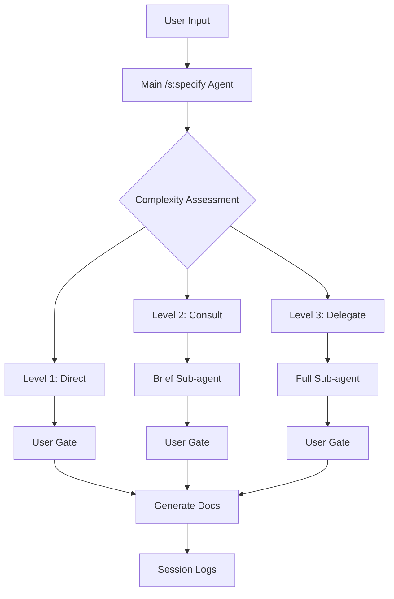

# Solution Design Document

## Constraints

- **Technical**: Slash commands in Claude Code are defined via markdown files with YAML frontmatter. No code changes possible - only prompt engineering within `/assets/commands/s/specify.md`
- **Performance**: Sub-agents "start off with a clean slate" and "add latency as they gather context" (Anthropic docs). Must minimize this latency through bounded context
- **Organizational**: Must maintain compatibility with existing Task tool interface and sub-agent ecosystem
- **Security/Compliance**: No access to user data outside current session. Context must be appropriately bounded

## Implementation Context

### Source Code to Analyze
```yaml
# Core slash command file to modify
- file: @assets/commands/s/specify.md
  relevance: CRITICAL
  sections: [entire file]
  why: "Contains current 'delegate everything' logic that needs replacement"

# Hook system for state management
- file: @internal/log/processor.go
  relevance: HIGH
  sections: [SessionId tracking, AgentId tracking]
  why: "Existing infrastructure for state persistence per PRD research"

# Example sub-agents to understand interface
- file: @assets/agents/the-business-analyst.md
  relevance: MEDIUM
  sections: [YAML frontmatter]
  why: "Understand how sub-agents receive prompts"
```

### External Documentation
```yaml
# All research sources from PRD
- url: https://docs.anthropic.com/en/docs/claude-code/sub-agents
  relevance: CRITICAL
  why: "Clean slate constraint and latency issues"

- url: https://learn.microsoft.com/en-us/azure/architecture/ai-ml/guide/ai-agent-design-patterns
  relevance: CRITICAL
  why: "Handoff pattern - core design approach"

- url: https://www.microsoft.com/en-us/research/project/autogen/
  relevance: HIGH
  why: "Asynchronous patterns for user gates"

- url: https://python.langchain.com/docs/tutorials/agents/
  relevance: HIGH
  why: "Stateful orchestration in main agent"

- url: https://arxiv.org/abs/2504.21030
  relevance: HIGH
  why: "Disconnected models problem - bounded context solution"
```

### Implementation Boundaries
- **Must Preserve**: Task tool interface (`Task` with `subagent_type` parameter)
- **Can Modify**: Entire content of `/assets/commands/s/specify.md`
- **Must Not Touch**: Sub-agent files, Task tool code, Claude Code core
- **Unknown**: Exact complexity thresholds (must be tuned through usage)

### Project Commands

```bash
# No build/compile needed - this is prompt engineering
# Testing approach:
Test Command: /s:specify "test requirement"
Verify Complexity Assessment: Check if Level 1/2/3 classification appears
Verify User Gate: Confirm prompt stops for user input
Verify Context: Review bounded context sent to sub-agents
Check Logs: .the-startup/<session-id>/agent-instructions.jsonl
```

## Solution Strategy

- **Architecture Pattern**: Microsoft's handoff orchestration - main agent assesses complexity and decides routing
- **State Management**: LangChain pattern - orchestrator maintains full state, sub-agents get bounded context
- **User Interaction**: AutoGen asynchronous patterns - explicit confirmation gates, no auto-progression
- **Context Sharing**: Academic standardized format to address "disconnected models problem"
- **Anti-Drift**: IBM efficiency principles - explicit EXCLUDE sections, measurable success criteria
- **Justification**: Research-backed approach using proven patterns, implementable through prompt engineering alone

## Building Block View

### Components



### Directory Map

```
assets/
├── commands/
│   └── s/
│       └── specify.md          # MODIFY: Complete rewrite
└── agents/                     # NO CHANGES
    └── *.md

.the-startup/
└── <session-id>/               # READ: For resume capability
    └── agent-instructions.jsonl
```

### Interface Specifications (Internal Changes Only)

#### Prompt Structure Changes

```yaml
# Remove this section from specify.md:
"You MUST delegate EVERYTHING to specialist sub-agents"

# Add these new sections:
Section 1: Complexity Assessment Protocol
Section 2: User Confirmation Gates  
Section 3: Bounded Context Format
Section 4: Clarification-First Protocol
Section 5: Anti-Drift Enforcement
Section 6: Session State Management
```

## Runtime View

#### Primary Flow: Intelligent Specification

```
1. User: /s:specify "requirement"
2. Main Agent: Assess which documents needed
3. Main Agent: Present classification to user
4. User: Confirm or override routing
5. Main Agent: Execute chosen workflow
   - L1 Direct: Create PLAN directly (optional specialist consultation)
   - L2 Design: Gather parallel input → Create SDD/PRD → Create PLAN
   - L3 Discovery: Business analysis → Parallel research → Create all docs
6. Main Agent: Present completed documents
7. User: Review and approve
8. Main Agent: Report completion

Note: Main agent maintains full context and creates all documents
Sub-agents provide research, insights, and specialized knowledge only
```

### Error Handling
- **Ambiguous Input**: STOP, ask clarifying questions, WAIT for answers
- **Classification Uncertainty**: Default to higher level, explain to user
- **Sub-agent Drift**: EXCLUDE section triggered alert, request user guidance
- **Parallel Agent Conflicts**: Present all responses, highlight differences, recommend path
- **Session Continuity**: Maintain same SessionID across entire Claude Code instance

### Complex Logic (Actual Prompt Implementation)

```markdown
## Session Initialization

At command start:
1. Generate SessionID: specify-{YYYYMMDD-HHMMSS}
2. Create .the-startup/{SessionID}/state.md
3. Initialize agent registry for tracking invoked agents
4. Use same SessionID for entire Claude Code instance
5. Reuse AgentIDs when returning to same agent/context

Note: Resume capability deferred to future enhancement

## Complexity Assessment Protocol

When user provides requirement, assess which documents are needed:

**Level 1 - Direct Planning**
- Clear, specific technical requirements
- Solution approach is obvious
- Standard patterns apply
- Example: "Add pagination to user list"
DOCUMENTS: PLAN.md only
ACTION: Main agent creates PLAN directly (may consult specialists for details)

**Level 2 - Design Required**
- Technical solution needs architecture
- OR product features need definition
- Multiple components involved
- Example: "Add caching layer" or "Add user authentication"
DOCUMENTS: 
  - Technical: SDD → PLAN
  - Product: PRD → SDD → PLAN
ACTION: 
  1. Parallel research: Invoke multiple specialists for input
  2. Main agent synthesizes and creates documents

**Level 3 - Discovery Required**
- Requirements are vague or ambitious
- Business objectives need clarification
- Multiple stakeholders/perspectives needed
- Example: "Improve user engagement" or "Make it faster"
DOCUMENTS: BRD → PRD → SDD → PLAN
ACTION: 
  1. the-business-analyst for requirements discovery
  2. Parallel specialists for different aspects
  3. Main agent creates all documents using gathered insights

Display assessment as:
🔍 Specification Assessment
├─ Clarity: [clear/needs-design/needs-discovery]
├─ Scope: [single-component/multi-component/system-wide]
├─ Documents needed: [list]
└─ Classification: Level [1/2/3] - [Direct/Design/Discovery]

Options:
a) Proceed with [recommended workflow]
b) Override to [alternative level]
c) Get more details

Your choice: _
```

## Deployment View

- **Environment**: Claude Code runtime - no deployment, just file modification
- **Configuration**: None required
- **Dependencies**: Existing sub-agents must be present in `/assets/agents/`
- **Performance**: Level 1 tasks faster (no delegation latency), Level 3 unchanged

## Cross-Cutting Concepts

### TodoWrite Usage (MANDATORY)

```markdown
## Todo Management for All Complexity Levels

CRITICAL: Always use TodoWrite to maintain focus and track progress

**Level 1 (Direct Planning)**:
- Create todo: "Create PLAN.md for [requirement]"
- Optional: "Consult [specialist] for [specific detail]"
- Main agent writes PLAN.md
- Mark completed when done

**Level 2 (Design Required)**:
- Create todos: "Gather parallel research", "Create SDD", "Create PLAN"
- Track parallel specialist consultations
- Main agent creates each document
- Update status as documents complete

**Level 3 (Discovery Required)**:
- Stage 1: "Business requirements discovery"
- Stage 2: "Parallel research gathering"
- Stage 3: "Create BRD", "Create PRD", "Create SDD", "Create PLAN"
- Main agent synthesizes and writes all documents

Without TodoWrite, Claude Code loses track of workflow state.
```

### User Confirmation Gates (CRITICAL)

```markdown
## User Confirmation Protocol

MANDATORY STOPS - Never auto-progress:

1. After Complexity Assessment:
🛑 Routing Decision
Recommendation: [Level N - reasoning]
Proceed? [Y/n/override]: _

2. Before Sub-agent Invocation:
🛑 Delegation Confirmation
Sending to: [agent name]
Context preview: [first line of bounded context]
Continue? [Y/n/modify]: _

3. After Sub-agent Response:
🛑 Response Review
[Display full response]

Accept this response? 
a) Yes, continue
b) Revise approach
c) Retry with clarification
d) Cancel

Your choice: _

4. Before Document Transition:
🛑 Document Approval
[Document] complete. 
Next: [next document]
Proceed? [Y/n]: _
```

### Bounded Context Protocol (From PRD Research)

```markdown
## Sub-Agent Context Format

When invoking ANY sub-agent, use EXACTLY this format:

## Session Identity
SessionId: {session-id}
AgentId: {agent-id}

## Context Retrieval
To load your previous work (if any), run:
the-startup log --read --agent-id {agent-id} --session {session-id} --lines 50

## Your Research Task
OBJECTIVE: [Specific research question or analysis needed]
CONTEXT: [Essential background only - 3 sentences max]
FOCUS AREAS: 
- [Specific aspect 1]
- [Specific aspect 2]
DELIVERABLE: [Type of insights/recommendations needed]
EXCLUDE: [What to explicitly NOT research or create]
NOTE: Provide insights and recommendations only - do not create documents

Example (Parallel Research):
## Session Identity
SessionId: specify-20250816-142530
AgentId: arch-auth-001

## Context Retrieval
To load your previous work (if any), run:
the-startup log --read --agent-id arch-auth-001 --session specify-20250816-142530 --lines 50

## Your Research Task
OBJECTIVE: Research authentication patterns and security best practices
CONTEXT: E-commerce platform needs secure login. Using NextJS and PostgreSQL. Must support email and social logins.
FOCUS AREAS:
- Authentication architecture patterns (JWT, sessions, OAuth)
- Security considerations and vulnerabilities
- Performance and scalability factors
DELIVERABLE: Technical recommendations and trade-offs analysis
EXCLUDE: Implementation code, UI design, payment systems
NOTE: Provide insights and recommendations only - do not create documents
```

### Anti-Drift Enforcement

```markdown
## Drift Prevention Rules

1. EVERY sub-agent invocation MUST have EXCLUDE section
2. If sub-agent mentions excluded items, IMMEDIATELY:
   - Stop processing
   - Alert user: "⚠️ Agent drifting into [excluded area]"
   - Ask: "How should we proceed?"

3. Success criteria must be MEASURABLE
   - Bad: "Design good authentication"
   - Good: "Provide auth flow with 3 security measures documented"

4. If response doesn't meet criteria:
   - Don't accept it
   - Show gap to user
   - Offer retry with clarification
```

### Parallel Research Gathering

```markdown
## Parallel Agent Research Strategy

Main agent orchestrates parallel research for efficiency:

1. **Level 2 Design - Parallel Research**:
   Example: "Add user authentication"
   ```
   Parallel invocations:
   - the-architect: "Research authentication patterns and security considerations"
   - the-developer: "Identify implementation complexity and dependencies"
   - the-security-engineer: "Assess security requirements and compliance needs"
   
   Main agent then creates PRD/SDD using all inputs
   ```

2. **Level 3 Discovery - Staged Parallel Research**:
   Stage 1: Business Analysis
   - the-business-analyst: Requirements discovery (solo)
   
   Stage 2: Parallel Deep Dive (based on discovered requirements)
   - the-architect: Technical feasibility
   - the-product-manager: User journey mapping
   - the-developer: Implementation estimates
   - the-data-engineer: Data model requirements
   
   Main agent synthesizes all inputs into BRD→PRD→SDD→PLAN

3. **Research Coordination**:
   - All agents get bounded context with specific research questions
   - Responses are insights/recommendations, not documents
   - Main agent maintains narrative coherence
   - Conflicting recommendations presented to user for decision

4. **Efficiency Benefits**:
   - Parallel research reduces latency
   - Main agent has full context for document creation
   - Specialists focus on their expertise area
   - No context loss between documents
```

### Clarification-First Protocol

```markdown
## Ambiguity Detection

Before ANY processing, check for:
- Vague terms ("good", "modern", "fast")
- Missing technical constraints
- Unstated assumptions
- Multiple interpretations possible

If detected:
1. STOP - Do not guess
2. IDENTIFY - List what's unclear
3. ASK - Number specific questions:
   1) What technology stack?
   2) What are performance requirements?
   3) Who are the end users?
4. WAIT - No progress until answered
5. CONFIRM - Echo understanding back
```

### State Management via Hooks

```markdown
## Session Persistence Architecture

### SessionID Generation
At command initialization:
```
SessionID = "{command}-{YYYYMMDD-HHMMSS}"
Example: "specify-20250816-142530"
```

### AgentID Management
For each sub-agent invocation:
```
AgentID Format: "{type}-{context}-{sequence}"
Examples:
- "ba-auth-001" (first business analyst for auth)
- "dev-api-002" (second developer for API)

Registry maintained in-memory during session:
- Main agent tracks as simple key-value pairs
- Key: "{type}-{context}" 
- Value: Full AgentID with sequence
- Enables reuse when returning to same agent/context
- Also written to state file for audit trail
```

### State File Structure
Location: `.the-startup/{session-id}/state.md`
```markdown
# Session State: {session-id}

## Current Status
- Command: /s:specify
- Phase: {current-phase}
- Started: {ISO-timestamp}
- Last Update: {ISO-timestamp}

## Agent Registry
- {agent-id}: {agent-type} ({purpose})

## Decision History
1. {timestamp}: {decision}

## Checkpoints
- {name}: {state-data}
```

### Hook Integration
Existing hooks automatically capture:

1. Pre-delegation (PreToolUse):
   - SessionID included in prompt
   - AgentID assigned and included
   - Bounded context logged
   - Stored in `.the-startup/{session-id}/agent-instructions.jsonl`

2. Post-response (PostToolUse):
   - Full response captured
   - Correlation via SessionID/AgentID
   - User decisions logged

### Context Retrieval Protocol
Sub-agents receive instructions (not data):
```markdown
## Your Identity
SessionId: {session-id}
AgentId: {agent-id}

## Loading Previous Context
To see your earlier work, run:
\`\`\`bash
the-startup log --read --agent-id {agent-id} --session {session-id} --lines 50
\`\`\`
```

### Session Continuity (Simplified)
Within same Claude Code instance:

1. Maintain single SessionID throughout workflow
2. Track all invoked agents in registry
3. When re-invoking same agent type for same context:
   - Reuse existing AgentID from registry
   - Agent can retrieve previous context via:
     `the-startup log --read --agent-id {id} --session {session-id}`
4. State file serves as audit trail, not resume mechanism

Note: Full resume capability (--resume flag) deferred to future enhancement
```

### What We Don't Know (Must Measure)

```markdown
## Unknown Metrics - Require Measurement

1. Complexity Thresholds
   - Current levels are HEURISTIC
   - No research validates 1/2/3 domain boundaries
   - MEASURE: Track success rates per level

2. Performance Impact
   - No data on actual latency reduction
   - MEASURE: Time Level 1 vs Level 3 tasks

3. User Preferences  
   - Unknown: Optimal gate frequency
   - MEASURE: Track override patterns

4. Context Size Impact
   - Unknown: Optimal context length
   - MEASURE: Success vs context size

Display to user when relevant:
"Note: Complexity thresholds are being refined. Your usage helps improve accuracy."
```

## Architecture Decisions

1. **Prompt-Only Implementation**: No code access, only `/assets/commands/s/specify.md` modification
   - Rationale: Claude Code constraint
   - Trade-offs: Cannot modify Task tool behavior

2. **Three-Level Classification**: Simple/Moderate/Complex
   - Rationale: Balance granularity with usability  
   - Trade-offs: Some tasks won't fit cleanly (must measure and adjust)

3. **Mandatory User Gates**: Every transition requires confirmation
   - Rationale: User control per research, prevent black-box frustration
   - Trade-offs: More interactions but prevents assumption errors

4. **Standardized Bounded Context**: Fixed format for all sub-agents
   - Rationale: Addresses "disconnected models problem" from research
   - Trade-offs: May occasionally need more context

5. **Hook-Based Persistence**: Use existing logging for state
   - Rationale: Infrastructure already exists per PRD
   - Trade-offs: Depends on hook system reliability

## Quality Requirements

- **Performance**: Level 1 must complete without delegation latency
- **Usability**: All routing decisions must show clear reasoning
- **Reliability**: Graceful handling when classification uncertain
- **Transparency**: User can always see why decisions made
- **Measurability**: Track all unknowns for improvement

## Risks and Technical Debt

### Known Technical Issues
- Sub-agents start with "clean slate" (Anthropic) - addressed via bounded context but latency remains
- No validated complexity thresholds - using heuristics that need tuning
- Hook system dependency - if hooks fail, lose resume capability

### Implementation Gotchas
- Prompt changes affect ALL users immediately - no gradual rollout
- Cannot A/B test different approaches within Claude Code
- Must preserve exact Task tool calling format
- Context may be visible in logs - no sensitive data

### Research Gaps (From PRD)
- No quantified performance metrics exist
- User interaction patterns unknown
- Optimal context size undocumented
- Must collect data post-implementation

## Test Specifications

### Critical Test Scenarios

**Scenario 1: Level 1 Direct Execution**
```gherkin
Given: User inputs "Add a logout button"
When: Complexity assessment runs
Then: System shows "Level 1 - Single domain"
And: User confirms direct execution
And: System generates without sub-agents
And: No delegation latency occurs
```

**Scenario 2: Ambiguity Detection**
```gherkin
Given: User inputs "Make it better"
When: System detects vague requirement
Then: System STOPs processing
And: Asks specific clarifying questions
And: WAITs for user response
And: Only proceeds after clarification
```

**Scenario 3: Anti-Drift Enforcement**
```gherkin
Given: Sub-agent invoked with EXCLUDE section
When: Sub-agent mentions excluded topic
Then: System detects drift
And: Alerts user immediately
And: Requests guidance
And: Doesn't accept drifted response
```

**Scenario 4: Session Resume**
```gherkin
Given: User interrupts workflow
When: User returns with session ID
Then: System reads session logs
And: Reconstructs current state
And: Shows where left off
And: Continues from checkpoint
```

### Test Coverage Requirements
- **Complexity Assessment**: Test all three levels with real examples
- **User Gates**: Verify STOP at each required point
- **Bounded Context**: Confirm format matches specification
- **Clarification**: Test with vague inputs
- **Anti-Drift**: Test with EXCLUDE violations
- **Resume**: Test interruption and continuation