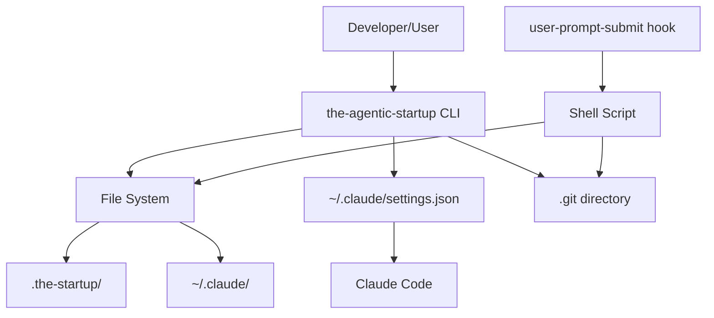
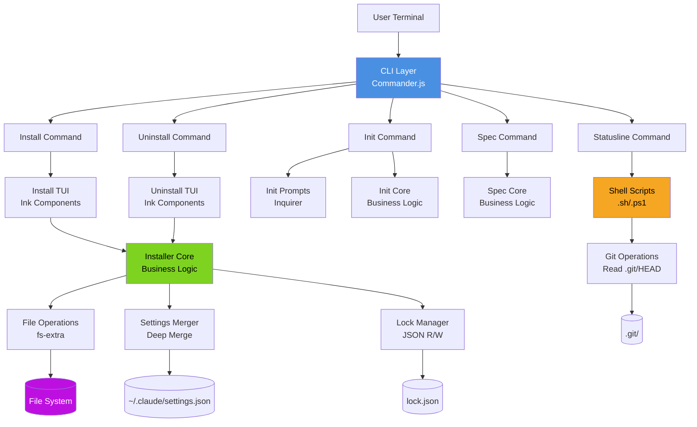
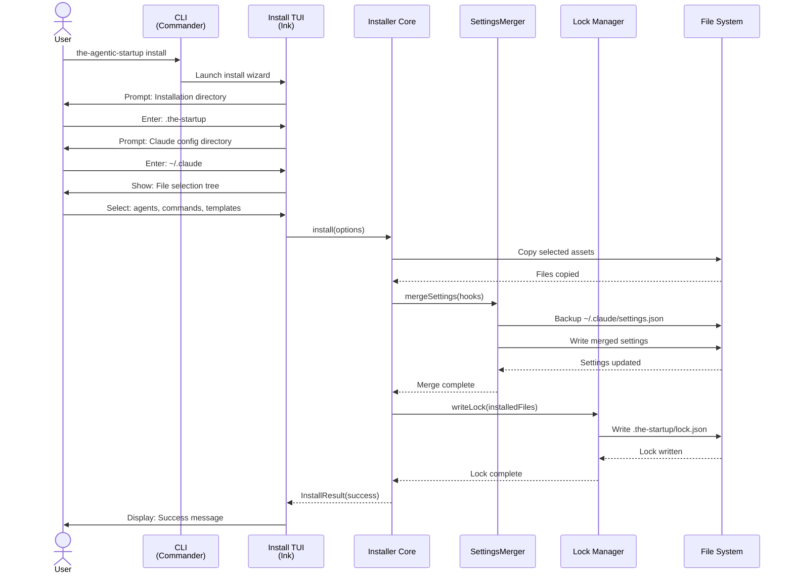
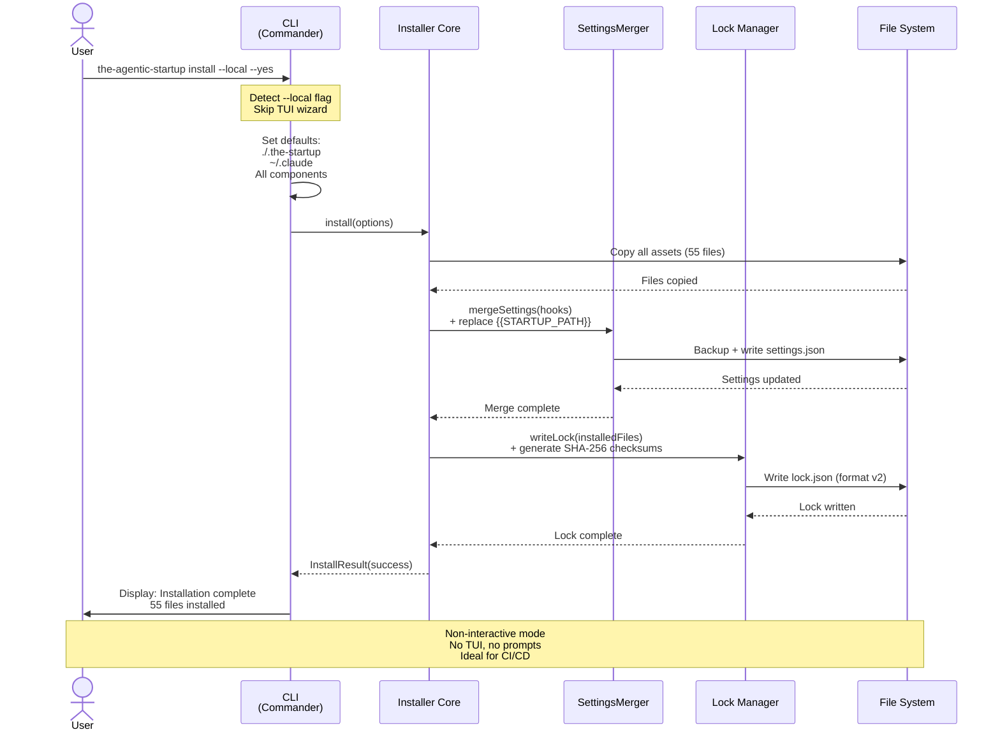
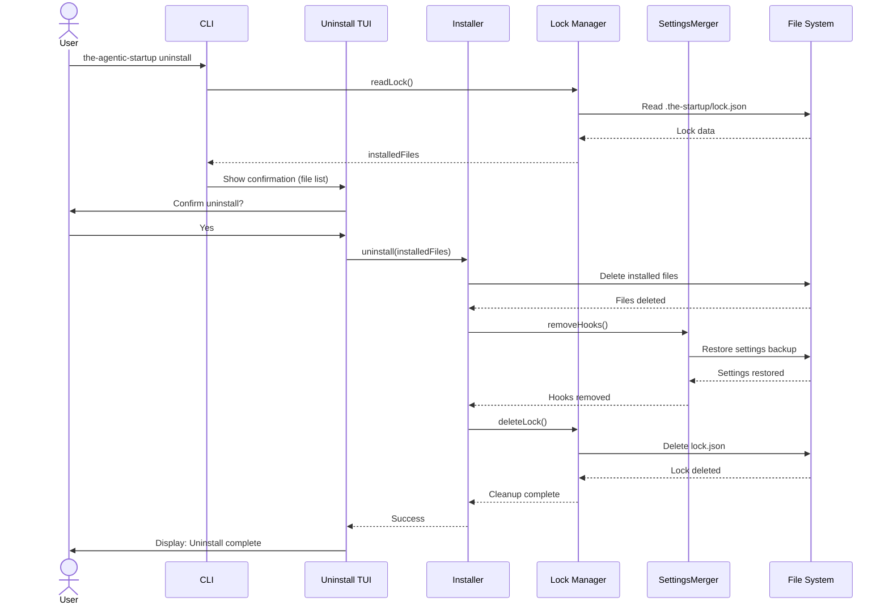
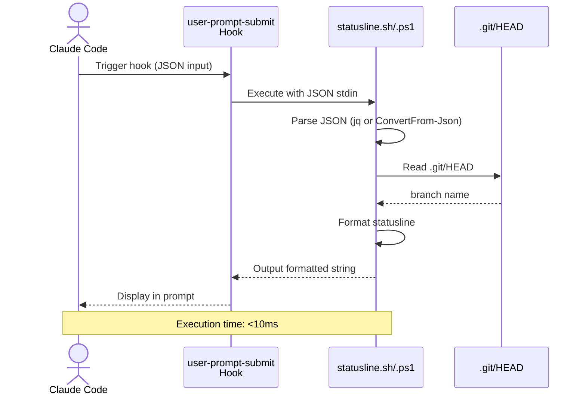
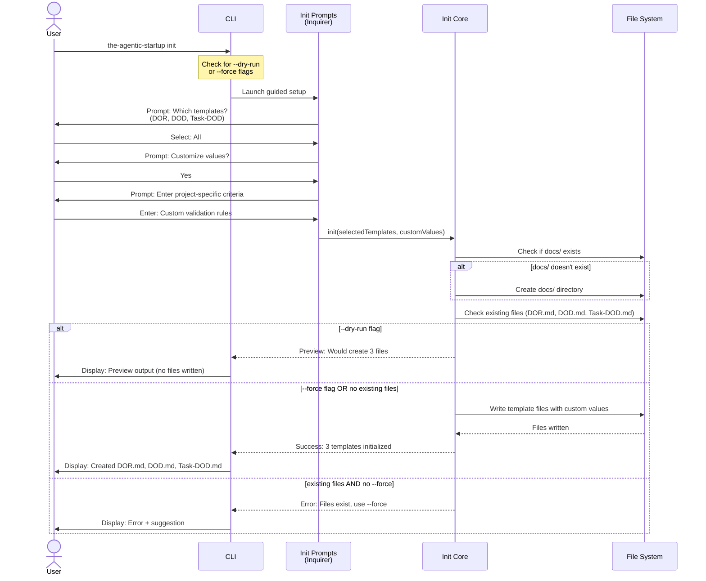
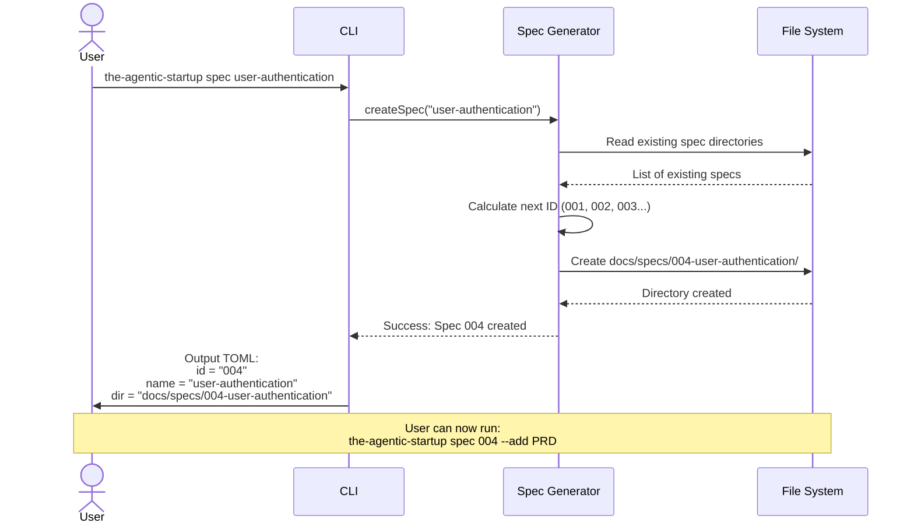

# Solution Design Document

## Validation Checklist
- [x] Quality Goals prioritized (top 3-5 architectural quality attributes)
- [x] Constraints documented (technical, organizational, security/compliance)
- [x] Implementation Context complete (required sources, boundaries, external interfaces, project commands)
- [x] Solution Strategy defined with rationale
- [x] Building Block View complete (components, directory map, interface specifications)
- [x] Runtime View documented (primary flow, error handling, complex logic)
- [x] Deployment View specified (environment, configuration, dependencies, performance)
- [x] Cross-Cutting Concepts addressed (patterns, interfaces, system-wide patterns, implementation patterns)
- [x] Architecture Decisions captured with trade-offs
- [x] **All Architecture Decisions confirmed by user** (no pending confirmations)
- [x] Quality Requirements defined (performance, usability, security, reliability)
- [x] Risks and Technical Debt identified (known issues, technical debt, implementation gotchas)
- [x] Test Specifications complete (critical scenarios, coverage requirements)
- [x] Glossary defined (domain and technical terms)
- [x] No [NEEDS CLARIFICATION] markers remain

---

## Constraints

### Technical Constraints
- **Runtime:** Node.js v18+ (LTS versions only)
- **TUI Framework:** Ink v4.x (production-ready, 1.48M downloads/week)
- **CLI Framework:** Commander.js v12.x
- **Prompt Framework:** Inquirer v10.x
- **Shell Scripts:** bash 3.2+ (macOS default), zsh, PowerShell 5.1+
- **Package Size:** Target < 5MB (npm best practice)
- **Dependencies:** No native modules (pure JavaScript/TypeScript)
- **Statusline Performance:** < 10ms execution time (critical requirement)

### Platform Constraints
- **Operating Systems:** macOS (darwin), Linux, Windows (win32)
- **Terminal Support:** iTerm2, Terminal.app, Windows Terminal, GNOME Terminal, Konsole
- **File System:** Handle case-sensitive (Linux) and case-insensitive (macOS/Windows) paths
- **Path Handling:** Cross-platform path separators, home directory expansion (~)

### Build Constraints
- **Module Format:** Dual ESM/CJS build required
- **TypeScript:** Strict mode enabled, no implicit any
- **Bundler:** tsup (TypeScript-first, esbuild-powered)
- **Asset Strategy:** File copying (not bundling) to preserve structure

### Integration Constraints
- **Claude Code Compatibility:** Must not break existing Claude workflows
- **Settings.json:** Preserve all user customizations during merge
- **Lock File:** SHA-256 checksums with backward compatibility (auto-migrate legacy format)
- **Existing Go Version:** Commands must match exactly (except stats removed)

## Implementation Context

**IMPORTANT**: You MUST read and analyze ALL listed context sources to understand constraints, patterns, and existing architecture.

### Required Context Sources

#### General Context

```yaml
# Product Requirements
- doc: docs/specs/004-typescript-npm-package-migration/PRD.md
  relevance: CRITICAL
  why: "Defines all features, user personas, success metrics for migration"

# Existing Go Implementation
- file: main.go
  relevance: HIGH
  why: "Current entry point, shows command structure and asset embedding"

- file: go.mod
  relevance: MEDIUM
  why: "Current dependencies (BubbleTea, Cobra, etc.) to map to TypeScript equivalents"

# External Framework Documentation
- url: https://github.com/vadimdemedes/ink
  relevance: HIGH
  sections: [API Reference, Components, Hooks]
  why: "TUI framework for React-based terminal interfaces"

- url: https://github.com/tj/commander.js
  relevance: HIGH
  sections: [Commands, Options, Arguments]
  why: "CLI framework replacing Cobra"

- url: https://github.com/SBoudrias/Inquirer.js
  relevance: MEDIUM
  sections: [Prompts, Validation]
  why: "CLI prompts for init command"
```

#### Component: CLI Commands

```yaml
Location: cmd/

# Source code files that must be understood
- file: cmd/install.go
  relevance: HIGH
  why: "Install command logic - maps to TypeScript install command with Ink TUI"

- file: cmd/uninstall.go
  relevance: HIGH
  why: "Uninstall command logic - file removal and settings restoration"

- file: cmd/init.go
  relevance: HIGH
  why: "Init command logic - template initialization with prompts"

- file: cmd/spec.go
  relevance: HIGH
  why: "Spec command logic - directory creation, TOML output format"

- file: cmd/statusline.go
  relevance: MEDIUM
  why: "Statusline command logic - shows how Go delegates to shell (pattern to preserve)"
```

#### Component: TUI Implementation

```yaml
Location: internal/ui/

# Source code files that must be understood
- file: internal/ui/model_install.go
  relevance: HIGH
  why: "BubbleTea install wizard - state machine pattern to migrate to Ink"

- file: internal/ui/model_uninstall.go
  relevance: HIGH
  why: "BubbleTea uninstall confirmation - migrate to Ink"

- file: internal/ui/theme.go
  relevance: MEDIUM
  why: "Color scheme and styling - map to Ink's Box component styles"
```

#### Component: Core Business Logic

```yaml
Location: internal/installer/, internal/config/

# Source code files that must be understood
- file: internal/installer/installer.go
  relevance: HIGH
  why: "File copying logic, path resolution, settings.json merge - core to preserve"

- file: internal/config/lock.go
  relevance: HIGH
  why: "Lock file structure and management - simple version for TypeScript"
```

### Implementation Boundaries

- **Must Preserve:**
  - Command names and flag names (install, uninstall, init, spec, statusline)
  - CLI output formats (TOML for spec --read, structured for other commands)
  - File installation locations (`.the-startup/`, `~/.claude/`)
  - Lock file purpose (track installed files for uninstall)
  - Settings.json hook configuration structure
  - Asset directory structure (agents/, commands/s/, templates/, rules/)
  - All 55 asset files (39 agents, 5 commands, 6 templates, 3 rules, 1 output style)

- **Can Modify:**
  - Internal code structure and architecture
  - TUI framework (BubbleTea → Ink)
  - CLI framework (Cobra → Commander.js)
  - Build system (Go → TypeScript/tsup)
  - Error messages and user feedback (improve UX)
  - Logging and debugging utilities

- **Must Not Touch:**
  - Existing Go binary (will be deprecated separately)
  - Claude Code itself (external system)
  - User's existing `.the-startup/` installations (must upgrade smoothly)
  - User's `~/.claude/settings.json` (preserve all customizations)

### External Interfaces

#### System Context Diagram



#### Interface Specifications

```yaml
# Inbound Interfaces (what calls this system)
inbound:
  - name: "User Terminal/Shell"
    type: CLI
    format: Command arguments and flags
    authentication: File system permissions
    data_flow: "User executes commands via terminal"

  - name: "npx Execution"
    type: npm package manager
    format: npx command
    authentication: None (public package)
    data_flow: "Temporary package execution without global install"

  - name: "Claude Code Hook System"
    type: Process spawn
    format: JSON via stdin
    authentication: File system permissions
    doc: "Claude Code passes hook data to statusline script"
    data_flow: "Hook data (model, directory, output style) → statusline → formatted output"

# Outbound Interfaces (what this system calls)
outbound:
  - name: "File System Operations"
    type: Node.js fs module
    format: Async file operations
    doc: "fs-extra for enhanced file operations"
    data_flow: "Read/write assets, lock file, settings.json"
    criticality: HIGH

  - name: "Git Repository"
    type: Shell command / file read
    format: Command line or direct file access
    doc: "Git branch detection for statusline"
    data_flow: "Read .git/HEAD or execute git symbolic-ref"
    criticality: LOW

  - name: "Claude Code Configuration"
    type: File system
    format: JSON (settings.json)
    doc: "~/.claude/settings.json merge and backup"
    data_flow: "Read existing settings, merge hooks, write updated settings"
    criticality: HIGH

# Data Interfaces
data:
  - name: "Lock File"
    type: JSON file
    connection: fs-extra
    path: ".the-startup/lock.json"
    doc: "Simple structure tracking installed files"
    data_flow: "Installation tracking, uninstall file list"

  - name: "Settings.json"
    type: JSON file
    connection: fs-extra
    path: "~/.claude/settings.json"
    doc: "Claude Code configuration with hooks"
    data_flow: "Read, deep merge, write with backup"

  - name: "Asset Files"
    type: Markdown/JSON files
    connection: fs-extra
    path: "dist/assets/"
    doc: "55 embedded assets (agents, commands, templates)"
    data_flow: "Copy from package to user directories during install"
```

### Cross-Component Boundaries

- **Public API Contracts** (cannot break):
  - CLI command names and flags
  - Lock file JSON structure (read by uninstall command)
  - Settings.json hook format (read by Claude Code)
  - Statusline JSON input format (passed by Claude Code)
  - TOML output format from `spec --read`

- **Internal Boundaries** (can refactor freely):
  - TypeScript module exports between src/ subdirectories
  - TUI component composition
  - Business logic implementation details
  - Build pipeline and tooling

- **Shared Resources**:
  - `~/.claude/settings.json` (shared with Claude Code, must preserve)
  - `.the-startup/lock.json` (shared between install/uninstall commands)
  - Asset files in `dist/assets/` (read-only, shared by all commands)

- **Breaking Change Policy**:
  - CLI interface: No breaking changes allowed (100% backward compatibility)
  - Lock file: Keep simple structure, no format changes
  - Settings.json: Only additive changes (new hooks), never remove user data
  - Internal APIs: Can break freely (not exposed to users)

### Project Commands

```bash
## Environment Setup
Install Dependencies: npm install
Environment Variables: None required (CLI tool, no env vars)
Start Development: npm run dev (tsup watch mode)

# Testing Commands
Unit Tests: npm test (vitest run)
Watch Mode: npm run test:watch (vitest watch)
Test Coverage: npm run test:coverage (vitest --coverage)
Integration Tests: npm run test:integration (test full install flow)

# Code Quality Commands
Linting: npm run lint (eslint src/)
Type Checking: npm run typecheck (tsc --noEmit)
Formatting: npm run format (prettier --write src/)

# Build & Compilation
Build Project: npm run build (tsup - outputs to dist/)
Clean Build: npm run clean && npm run build
Watch Mode: npm run dev (tsup --watch)

# Publishing Commands
Prepublish Checks: npm run prepublishOnly (build + typecheck + test)
Publish Beta: npm publish --tag beta
Publish Stable: npm publish
Version Bump: npm version patch|minor|major

# Local Testing Commands
Link Package: npm link (create global symlink)
Test Locally: the-agentic-startup <command> (after npm link)
Unlink: npm unlink -g the-agentic-startup

# Shell Script Testing
Test Unix Statusline: echo '{"model":"sonnet"}' | ./bin/statusline.sh
Test Windows Statusline: echo '{"model":"sonnet"}' | pwsh -File ./bin/statusline.ps1
Benchmark Statusline: time (echo '{}' | ./bin/statusline.sh)

# Package Validation
Check Package Size: npm pack --dry-run (preview what gets published)
Verify Files: npm pack && tar -tzf the-agentic-startup-*.tgz
Audit Dependencies: npm audit (security vulnerabilities)
```

## Solution Strategy

**Architecture Pattern:** Layered modular architecture with clear separation of concerns

**Layers:**
1. **CLI Layer** (`src/cli/`) - Commander.js commands, argument parsing, user interaction
2. **UI Layer** (`src/ui/`) - Ink TUI components for install/uninstall wizards
3. **Core Layer** (`src/core/`) - Pure business logic (installer, spec, init logic)
4. **Library Layer** (`src/lib/`) - Programmatic API for external consumption

**Integration Approach:**
- **File System Integration:** Copy assets from npm package to user directories
- **Claude Code Integration:** Merge hooks into `~/.claude/settings.json` preserving user config
- **Shell Integration:** Statusline scripts execute independently (no Node.js overhead)
- **Git Integration:** Statusline reads `.git/HEAD` or falls back to git command

**Justification:**
- **Layered architecture** enables clean separation - TUI can be replaced without touching business logic
- **Dual module system** (ESM/CJS) maximizes compatibility across Node.js versions and tooling
- **File copying** (vs bundling) keeps package size small and assets human-readable
- **Ink framework** provides production-ready TUI with rich ecosystem (vs alpha OpenTUI)
- **Shell scripts for statusline** achieve < 10ms performance requirement (Node.js can't match this)

**Key Decisions:**

1. **TUI Framework: Ink (not OpenTUI React)**
   - Rationale: Production-ready (1.48M DL/week), rich ecosystem, battle-tested
   - Trade-off: Not using user's initial preference, but OpenTUI is alpha (v0.1.25)

2. **Build Tool: tsup (not pure esbuild)**
   - Rationale: TypeScript-first, automatic .d.ts generation, zero-config dual builds
   - Trade-off: Slightly less control than pure esbuild, but better DX

3. **Lock File: SHA-256 checksums with backward compatibility**
   - Rationale: Enables idempotent reinstalls and update command while auto-migrating legacy lock files
   - Trade-off: Slightly more complex than string arrays, but enables PRD Feature 9 requirements

4. **Settings.json: Deep merge with backup**
   - Rationale: Preserve all user customizations, rollback on error
   - Trade-off: More complex merge logic, but prevents data loss

5. **Asset Strategy: File copying (not bundling)**
   - Rationale: 55 assets would bloat bundle, copying is simpler and keeps files readable
   - Trade-off: Larger node_modules (but only during dev, not in final package)

## Building Block View

### Components



### Directory Map

**TypeScript Package Structure** (NEW)
```
the-agentic-startup/
├── src/                          # NEW: TypeScript source code
│   ├── cli/                      # NEW: CLI command definitions
│   │   ├── index.ts              # NEW: Commander.js setup & command registration
│   │   ├── install.ts            # NEW: Install command (maps from cmd/install.go)
│   │   ├── uninstall.ts          # NEW: Uninstall command (maps from cmd/uninstall.go)
│   │   ├── init.ts               # NEW: Init command (maps from cmd/init.go)
│   │   ├── spec.ts               # NEW: Spec command (maps from cmd/spec.go)
│   │   └── statusline.ts         # NEW: Statusline command (maps from cmd/statusline.go)
│   │
│   ├── ui/                       # NEW: Ink TUI components
│   │   ├── install/              # NEW: Install wizard components
│   │   │   ├── InstallWizard.tsx # NEW: Main install wizard (maps from internal/ui/model_install.go)
│   │   │   ├── PathSelector.tsx  # NEW: Path selection component
│   │   │   ├── FileTree.tsx      # NEW: File tree selector
│   │   │   └── Complete.tsx      # NEW: Completion screen
│   │   ├── uninstall/            # NEW: Uninstall wizard components
│   │   │   └── UninstallWizard.tsx # NEW: Uninstall confirmation (maps from internal/ui/model_uninstall.go)
│   │   ├── shared/               # NEW: Shared UI components
│   │   │   ├── Spinner.tsx       # NEW: Loading spinner
│   │   │   ├── ErrorDisplay.tsx  # NEW: Error display
│   │   │   └── theme.ts          # NEW: Color scheme (maps from internal/ui/theme.go)
│   │
│   ├── core/                     # NEW: Core business logic (framework-agnostic)
│   │   ├── installer/            # NEW: Installation logic
│   │   │   ├── Installer.ts      # NEW: File copying, path resolution (maps from internal/installer/installer.go)
│   │   │   ├── SettingsMerger.ts # NEW: Deep merge settings.json with backup
│   │   │   └── LockManager.ts    # NEW: Lock file management (maps from internal/config/lock.go)
│   │   ├── init/                 # NEW: Init command logic
│   │   │   └── Initializer.ts    # NEW: Template initialization
│   │   ├── spec/                 # NEW: Spec command logic
│   │   │   └── SpecGenerator.ts  # NEW: Spec directory creation, TOML output
│   │   └── types/                # NEW: Shared TypeScript types
│   │       ├── lock.ts           # NEW: Lock file structure
│   │       ├── settings.ts       # NEW: Settings.json structure
│   │       └── config.ts         # NEW: Configuration types
│   │
│   ├── lib/                      # NEW: Programmatic API (for external consumption)
│   │   └── index.ts              # NEW: Public API exports
│   │
│   └── index.ts                  # NEW: Main entry point
│
├── bin/                          # NEW: Executable scripts
│   ├── statusline.sh             # NEW: Unix statusline (bash/zsh compatible)
│   └── statusline.ps1            # NEW: Windows statusline (PowerShell)
│
├── assets/                       # EXISTING: Copy from Go version
│   ├── agents/                   # EXISTING: 39 agent definitions (.md files)
│   ├── commands/                 # EXISTING: 5 slash commands (nested structure)
│   ├── templates/                # EXISTING: 6 template files
│   ├── rules/                    # EXISTING: 3 rule files
│   └── output-styles/            # EXISTING: 1 output style file
│
├── dist/                         # NEW: Build output (tsup generates)
│   ├── index.js                  # NEW: ESM bundle
│   ├── index.cjs                 # NEW: CJS bundle
│   ├── index.d.ts                # NEW: TypeScript declarations
│   └── assets/                   # NEW: Copied assets
│
├── tests/                        # NEW: Test files
│   ├── cli/                      # NEW: CLI command tests
│   ├── core/                     # NEW: Core logic tests
│   └── integration/              # NEW: Integration tests (full install flow)
│
├── tsconfig.json                 # NEW: TypeScript configuration
├── tsup.config.ts                # NEW: Build configuration
├── package.json                  # NEW: npm package manifest
├── vitest.config.ts              # NEW: Test configuration
└── README.md                     # NEW: Updated for TypeScript package
```

### Interface Specifications

**Reference**: See **External Interfaces** section above for complete interface specifications, including:
- Inbound interfaces (User Terminal, npx, Claude Code Hook System)
- Outbound interfaces (File System, Git, Claude Config)
- Data interfaces (Lock File, Settings.json, Asset Files)

**Key Internal Interfaces**:

```typescript
// src/core/types/lock.ts - Lock file structure with checksums

// File entry with optional checksum for backward compatibility
interface FileEntry {
  path: string;              // File path
  checksum?: string;         // SHA-256 hash (optional for backward compatibility)
}

// Lock file structure supporting both old (string[]) and new (FileEntry[]) formats
interface LockFile {
  version: string;              // Package version that installed these files
  installedAt: string;          // ISO timestamp
  lockFileVersion?: number;     // Lock file format version (1 = old string format, 2 = with checksums)
  files: {
    agents: FileEntry[];        // Installed agent files with checksums
    commands: FileEntry[];      // Installed command files with checksums
    templates: FileEntry[];     // Installed template files with checksums
    rules: FileEntry[];         // Installed rule files with checksums
    outputStyles: FileEntry[];  // Installed output style files with checksums
    binary: FileEntry;          // Binary file with checksum
  };
}

// Legacy lock file format (backward compatibility)
interface LegacyLockFile {
  version: string;
  installedAt: string;
  files: {
    agents: string[];
    commands: string[];
    templates: string[];
    rules: string[];
    outputStyles: string[];
    binary: string;
  };
}

// src/core/types/settings.ts - Settings.json hook structure
interface ClaudeSettings {
  hooks?: {
    [hookName: string]: {
      command: string;              // May contain placeholders: {{STARTUP_PATH}}, {{CLAUDE_PATH}}
      description?: string;
      continueOnError?: boolean;
    };
  };
  // ... other Claude settings preserved
}

// Placeholder replacement mapping
interface PlaceholderMap {
  STARTUP_PATH: string;  // Actual installation directory path (e.g., /Users/name/.the-startup)
  CLAUDE_PATH: string;   // Claude config directory path (e.g., /Users/name/.claude)
}

// src/core/installer/Installer.ts - Core installer API
interface InstallerOptions {
  startupPath: string;          // Installation directory (e.g., .the-startup)
  claudePath: string;           // Claude config directory (e.g., ~/.claude)
  selectedFiles: {
    agents: boolean;
    commands: boolean;
    templates: boolean;
    rules: boolean;
    outputStyles: boolean;
  };
}

interface InstallResult {
  success: boolean;
  installedFiles: string[];
  errors?: string[];
}

// CLI Command Options (Commander.js flag definitions)

// Install command flags
interface InstallCommandOptions {
  local?: boolean;      // --local: Skip prompts, use local paths (./.the-startup, ~/.claude)
  yes?: boolean;        // --yes: Auto-confirm all prompts with recommended paths
}

// Uninstall command flags
interface UninstallCommandOptions {
  keepLogs?: boolean;      // --keep-logs: Preserve .the-startup/logs directory
  keepSettings?: boolean;  // --keep-settings: Don't modify ~/.claude/settings.json
}

// Init command flags
interface InitCommandOptions {
  dryRun?: boolean;  // --dry-run: Preview changes without writing files
  force?: boolean;   // --force: Overwrite existing files without prompting
}

// Spec command (no flags in PRD, included for completeness)
interface SpecCommandOptions {
  add?: 'PRD' | 'SDD' | 'PLAN' | 'BRD';  // --add: Generate template file in spec directory
  read?: boolean;                         // --read: Output spec state in TOML format
}

// Init Core Interfaces
interface InitOptions {
  templates: ('DOR' | 'DOD' | 'TASK-DOD')[];  // Templates to initialize
  customValues?: Record<string, string>;       // User-provided custom values
  targetDirectory?: string;                     // Default: docs/
  dryRun?: boolean;                            // Preview mode (from --dry-run flag)
  force?: boolean;                             // Overwrite mode (from --force flag)
}

interface InitResult {
  success: boolean;
  filesCreated?: string[];     // Paths of created files (empty if dry-run)
  filesPreview?: string[];     // Paths that would be created (dry-run only)
  skipped?: string[];          // Files skipped due to existing (no --force)
  error?: string;              // Error message if failed
}

// Spec Core Interfaces
interface SpecOptions {
  name: string;                // Feature name (e.g., "user-authentication")
  template?: 'PRD' | 'SDD' | 'PLAN' | 'BRD';  // Template to generate (from --add flag)
  specId?: string;             // Existing spec ID (e.g., "004")
}

interface SpecResult {
  success: boolean;
  specId: string;              // Generated or provided ID (e.g., "004")
  directory: string;           // Spec directory path
  toml?: string;               // TOML output (for --read flag)
  templateGenerated?: string;  // Template file path (for --add flag)
  error?: string;              // Error message if failed
}

// Spec Numbering Algorithm
interface SpecNumbering {
  // Calculate next spec ID by reading existing directories
  getNextSpecId(): string;     // Returns "001", "002", etc.
  parseSpecId(dirname: string): number | null;  // Extract number from "004-feature-name"
}
```

**CLI Flag Behavior:**

**Install Flags:**
- `--local`: Bypasses TUI wizard, uses `./.the-startup` and `~/.claude` defaults, auto-selects all components
- `--yes`: Bypasses confirmation prompts, uses recommended paths, equivalent to pressing Enter on all prompts
- Flags can be combined: `install --local --yes` for fully non-interactive installation

**Uninstall Flags:**
- `--keep-logs`: Removes all installed files EXCEPT `.the-startup/logs/` directory (useful for debugging)
- `--keep-settings`: Removes files but leaves `~/.claude/settings.json` untouched (preserves hooks)
- Flags can be combined: `uninstall --keep-logs --keep-settings` for minimal cleanup

**Init Flags:**
- `--dry-run`: Shows what files would be created without actually writing them (preview mode)
- `--force`: Overwrites existing DOR/DOD/Task-DOD files without confirmation prompt
- Flags are mutually exclusive: cannot use `--dry-run --force` together

**No database changes** - This is a CLI tool with file-based storage only.

## Runtime View

### Primary Flow: Install Command



### Non-Interactive Install Flow (install --local --yes)



### Primary Flow: Uninstall Command



### Primary Flow: Statusline Hook



### Init Command Flow



### Spec Command Flow



### Error Handling

**Installation Errors:**
- **Invalid path**: Display error message, prompt to re-enter valid path
- **Permission denied**: Show error with suggestion to check directory permissions
- **Settings.json merge conflict**: Rollback to backup, show user the conflict details
- **Asset copy failure**: Clean up partial installation, restore original state
- **Placeholder replacement failure**: Show error with invalid placeholder name, list valid placeholders ({{STARTUP_PATH}}, {{CLAUDE_PATH}})

**Uninstall Errors:**
- **Lock file missing**: Ask user to confirm manual uninstall or exit
- **File deletion failure**: List files that couldn't be deleted, provide manual cleanup instructions
- **Settings restore failure**: Keep current settings, log error, warn user

**Statusline Errors:**
- **Git not found**: Fall back to "no git" indicator
- **Invalid JSON input**: Output empty statusline (graceful degradation)
- **Permission error**: Output minimal statusline without git info

**General Error Strategy:**
- User-facing errors: Clear message + suggested action
- System errors: Log full details, show safe summary to user
- File operations: Always backup before modify, rollback on failure
- All errors return exit code 1 for shell scripting compatibility

### Complex Logic: Settings.json Deep Merge

```typescript
ALGORITHM: Deep Merge Settings with User Preservation
INPUT: existingSettings (user's ~/.claude/settings.json), newHooks (hooks to add)
OUTPUT: mergedSettings

1. BACKUP: Create settings.json.backup with timestamp
2. PARSE: existingSettings -> userSettings object
3. INITIALIZE: If userSettings.hooks doesn't exist, create empty object
4. MERGE_HOOKS:
   FOR EACH hook in newHooks:
     IF userSettings.hooks[hook.name] exists:
       SKIP (preserve user's custom hook configuration)
     ELSE:
       userSettings.hooks[hook.name] = hook.config
4.5. REPLACE_PLACEHOLDERS:
   FOR EACH hook in userSettings.hooks:
     IF hook.command contains "{{STARTUP_PATH}}":
       REPLACE "{{STARTUP_PATH}}" with actualInstallationPath (absolute path)
     IF hook.command contains "{{CLAUDE_PATH}}":
       REPLACE "{{CLAUDE_PATH}}" with claudeConfigPath (absolute path)
5. PRESERVE: Keep ALL other user settings unchanged
6. VALIDATE: Ensure JSON structure is valid
7. WRITE: mergedSettings to ~/.claude/settings.json
8. ON_ERROR: Restore from backup, throw error with details

Key Principles:
- Never overwrite user's existing hooks
- Preserve all non-hook settings
- Always backup before modification
- Atomic operation (all or nothing)
```

### Complex Logic: Lock File Backward Compatibility with Checksums

```typescript
ALGORITHM: Lock File Read with Backward Compatibility
INPUT: lockFilePath (path to lock.json)
OUTPUT: normalized LockFile object with FileEntry[] format

1. READ: Read lock.json from disk
2. PARSE: Parse JSON to object
3. DETECT_FORMAT:
   IF lock.lockFileVersion === 2 OR lock.files.agents[0] is object with 'path' field:
     // New format with checksums
     RETURN lock as LockFile
   ELSE IF lock.files.agents[0] is string:
     // Legacy format without checksums
     MIGRATE: Convert to new format
4. MIGRATE_LEGACY:
   FOR EACH category in ['agents', 'commands', 'templates', 'rules', 'outputStyles']:
     newFiles[category] = lock.files[category].map(path => ({ path, checksum: undefined }))
   newFiles.binary = { path: lock.files.binary, checksum: undefined }
   RETURN { ...lock, lockFileVersion: 1, files: newFiles }
5. ON_ERROR: If migration fails, log warning and attempt file-by-file fallback

ALGORITHM: Lock File Write with Checksums
INPUT: installedFiles (array of file paths), installPath (installation directory)
OUTPUT: LockFile written to disk

1. GENERATE_CHECKSUMS:
   FOR EACH filePath in installedFiles:
     fileContent = fs.readFileSync(filePath)
     checksum = crypto.createHash('sha256').update(fileContent).digest('hex')
     fileEntries.push({ path: filePath, checksum })
2. CREATE_LOCK:
   lockFile = {
     version: packageVersion,
     installedAt: new Date().toISOString(),
     lockFileVersion: 2,  // New format with checksums
     files: categorizeFileEntries(fileEntries)
   }
3. WRITE: Write lockFile to .the-startup/lock.json
4. ON_ERROR: Rollback installation, delete partial lock file

ALGORITHM: Idempotent Reinstall with Checksum Comparison
INPUT: targetFiles (files to install), existingLockFile
OUTPUT: List of files that need reinstalling

1. READ_EXISTING: Load existing lock file (use backward compat read)
2. FOR EACH targetFile in targetFiles:
     existingEntry = findInLock(targetFile.path)
     IF existingEntry AND existingEntry.checksum:
       currentChecksum = calculateChecksum(targetFile.path)
       IF currentChecksum === existingEntry.checksum:
         SKIP (file unchanged)
       ELSE:
         MARK_FOR_REINSTALL (file modified by user)
     ELSE IF existingEntry AND NOT existingEntry.checksum:
       MARK_FOR_REINSTALL (legacy entry, no checksum to compare)
     ELSE:
       MARK_FOR_INSTALL (new file not in lock)
3. RETURN: List of files to install/reinstall

Key Principles:
- Checksums are SHA-256 for security and uniqueness
- Legacy lock files (without checksums) are auto-migrated on read
- Checksum comparison enables idempotent reinstalls
- Modified files detected via checksum mismatch
- Backward compatibility: old lock files work seamlessly
```

## Deployment View

**Environment**: User's local machine (macOS, Linux, Windows)

**Installation Methods**:
1. Global install: `npm install -g the-agentic-startup`
2. npx execution: `npx the-agentic-startup <command>`

**Configuration**: None required (CLI tool determines paths at runtime)

**Dependencies**:
- Node.js v18+ (LTS)
- npm or yarn package manager
- Git (optional, for statusline branch detection)

**Performance Targets**:
- Install command: Complete in <30 seconds for all 55 assets
- Uninstall command: Complete in <10 seconds
- Statusline: Execute in <10ms (critical requirement)
- Package size: <5MB compressed

**No multi-component coordination** - Single npm package deployment

## Cross-Cutting Concepts

**Security:**
- No authentication required (local CLI tool)
- File system permissions enforce access control
- No sensitive data storage (all configs are user-readable)
- Settings.json backup before modification

**Error Handling:**
- User-facing: Clear messages with suggested actions
- System errors: Log details, show safe summary
- File operations: Always backup, rollback on failure
- Exit codes: 0 for success, 1 for errors

**Performance:**
- Statusline: Shell scripts achieve <10ms (no Node.js overhead)
- Install: Async file operations with progress indicators
- No runtime caching needed (one-time operations)

**Code Patterns:**
- TypeScript strict mode, no implicit any
- Layered architecture (CLI → UI → Core → Lib)
- Pure business logic in Core (framework-agnostic)
- TDD with Vitest (Red-Green-Refactor)

**Component Structure (Ink):**
```typescript
// Ink component pattern
const ComponentName: FC<Props> = ({ data }) => {
  const [state, setState] = useState(initialState);

  // Handle loading/error/success states
  if (loading) return <Spinner />;
  if (error) return <ErrorDisplay error={error} />;

  // Main render
  return <Box>{/* component UI */}</Box>;
};
```

**Error Classification:**
- Validation errors: Show message, allow retry
- Permission errors: Suggest chmod/chown commands
- System errors: Log full details, graceful degradation
- Network errors: N/A (no network operations)

**Integration Points:**
- File System: All data persistence via fs-extra
- Claude Code: Hook system integration via settings.json
- Git: Optional integration via .git/HEAD read or git command

## Architecture Decisions

- [x] **TUI Framework: Ink instead of OpenTUI React**
  - Rationale: Ink is production-ready (1.48M downloads/week), battle-tested with rich ecosystem
  - Trade-offs: Not using user's initial preference, but OpenTUI React is alpha (v0.1.25, experimental)
  - Alternative rejected: OpenTUI React (too early, not production-ready)
  - User confirmed: ✅ _"OK, use Ink as TUI for now"_

- [x] **Build Tool: tsup instead of pure esbuild**
  - Rationale: TypeScript-first, automatic .d.ts generation, zero-config dual ESM/CJS builds
  - Trade-offs: Slightly less control than pure esbuild, but significantly better DX
  - Alternative rejected: Pure esbuild (requires more config, manual .d.ts generation)
  - User confirmed: ✅ _Approved as part of package architecture_

- [x] **Lock File: Checksums with backward compatibility (no complex migration system)**
  - Rationale: Add SHA-256 checksums for new installs (enables idempotent reinstalls and update command) while auto-migrating legacy lock files on read
  - Trade-offs: Slightly more complex than pure string arrays, but enables PRD Feature 9 requirements without breaking existing installations
  - Alternative rejected: No checksums (breaks PRD requirements) OR force migration (breaks user installations)
  - User confirmed: ✅ _"For new installs, you can use checksum, but ensure backwards compatibility with old file"_
  - Implementation: FileEntry[] with optional checksum field, auto-detection and migration of legacy string[] format

- [x] **Statusline: Shell scripts (.sh for Unix, .ps1 for Windows)**
  - Rationale: Achieves <10ms performance requirement (Node.js startup is 50-200ms)
  - Trade-offs: Two implementations to maintain, but performance is critical
  - Alternative rejected: Node.js statusline (too slow, would cause lag on every Claude interaction)
  - User confirmed: ✅ _"shell scripts are fine"_

- [x] **Asset Strategy: File copying (not bundling)**
  - Rationale: 55 assets would bloat bundle, copying keeps package small and files readable
  - Trade-offs: Slightly larger node_modules during dev, but smaller published package
  - Alternative rejected: String embedding in bundle (bloats bundle, assets not human-readable)
  - User confirmed: ✅ _Approved as part of package architecture_

- [x] **Settings.json: Deep merge with backup and rollback**
  - Rationale: Preserve all user customizations, never lose data, atomic operation
  - Trade-offs: More complex merge logic, but prevents data loss
  - Alternative rejected: Full replacement (would destroy user settings)
  - User confirmed: ✅ _Implied approval through lock file simplification discussion_

- [x] **Package Architecture: Layered (CLI → UI → Core → Lib)**
  - Rationale: Clean separation of concerns, TUI replaceable without touching business logic
  - Trade-offs: More directories, but better maintainability and testability
  - Alternative rejected: Flat structure (harder to test, tight coupling)
  - User confirmed: ✅ _"package architecture is fine"_

- [x] **Stats Command: Removed from migration scope**
  - Rationale: User explicitly requested removal to reduce scope
  - Trade-offs: Not 100% feature parity, but acceptable per user
  - Alternative rejected: Implement stats in TypeScript (user chose to remove it entirely)
  - User confirmed: ✅ _"remove the stats entirely from the migration"_

## Quality Requirements

**Performance:**
- Statusline execution: <10ms (critical, enforced by shell scripts)
- Install command: <30 seconds for all 55 assets
- Uninstall command: <10 seconds
- Package size: <5MB compressed

**Usability:**
- TUI wizard guides users through installation
- Clear error messages with suggested actions
- Progress indicators for long operations
- Cross-platform compatibility (macOS, Linux, Windows)

**Reliability:**
- Settings.json backup before modification
- Atomic operations (all-or-nothing install/uninstall)
- Graceful error handling with rollback
- Lock file prevents partial installations

**Functional Correctness:**
- 100% feature parity with Go version (except stats command)
- All 55 assets installed correctly
- CLI flags match exactly (no breaking changes)
- Settings.json merge preserves user data

## Risks and Technical Debt

**Known Risks:**
- **Ink learning curve**: Team unfamiliar with Ink framework (Mitigation: Examples in research docs)
- **Shell script maintenance**: Two implementations (.sh/.ps1) (Mitigation: Comprehensive tests)
- **npm package ecosystem changes**: Dependency updates may break builds (Mitigation: Lock dependencies)

**Technical Constraints:**
- No stats command (accepted trade-off per user request)
- Shell scripts required for statusline performance (can't use Node.js)
- Settings.json merge complexity (necessary to preserve user data)

**Implementation Gotchas:**
- Home directory expansion (~) - must handle cross-platform
- Case-sensitive vs case-insensitive file systems (macOS vs Linux)
- PowerShell JSON parsing - use ConvertFrom-Json, not regex
- Ink rendering quirks - must test all TUI states

## Test Specifications

### Critical Test Scenarios

**Scenario 1: Install Happy Path**
```gherkin
Given: User has Node.js v18+ installed
And: No previous installation exists
When: User runs `the-agentic-startup install`
And: Selects .the-startup directory
And: Selects ~/.claude directory
And: Selects all asset categories
Then: All 55 assets are copied correctly
And: settings.json is updated with hooks
And: lock.json is created
And: Success message is displayed
```

**Scenario 2: Uninstall with Lock File**
```gherkin
Given: Package is installed with valid lock.json
When: User runs `the-agentic-startup uninstall`
And: Confirms uninstall
Then: All files from lock.json are deleted
And: settings.json is restored to backup
And: lock.json is deleted
And: Success message is displayed
```

**Scenario 3: Settings.json Merge Conflict**
```gherkin
Given: User has existing hooks in settings.json
When: Installation tries to add new hooks
Then: Existing hooks are preserved (not overwritten)
And: New hooks are added
And: Backup is created before merge
```

**Scenario 4: Statusline Performance**
```gherkin
Given: Statusline hook is configured
When: User submits prompt to Claude
Then: Statusline executes in <10ms
And: Git branch is displayed (if git repo)
And: Model name is displayed
```

### Test Coverage Requirements

- **Core Business Logic**: 90% coverage (Installer, SettingsMerger, LockManager)
- **CLI Commands**: All commands tested (install, uninstall, init, spec, statusline)
- **TUI Components**: All user flows tested (path selection, file tree, completion)
- **Error Scenarios**: All error paths tested (invalid paths, permissions, conflicts)
- **Cross-platform**: Shell scripts tested on macOS, Linux, Windows
- **Integration**: Full install/uninstall cycle tested end-to-end

## Glossary

### Domain Terms

| Term | Definition | Context |
|------|------------|---------|
| **Agent** | Specialized AI persona that performs specific tasks | 39 agent files (.md) in assets/agents/ |
| **Slash Command** | Custom CLI command that expands to a full prompt | 5 commands in assets/commands/s/ |
| **Output Style** | Predefined AI response format and personality | 1 style file in assets/output-styles/ |
| **Hook** | Claude Code callback that executes on events | Configured in ~/.claude/settings.json |
| **Lock File** | JSON tracking installed files for uninstall | .the-startup/lock.json |

### Technical Terms

| Term | Definition | Context |
|------|------------|---------|
| **TUI** | Text User Interface - terminal-based UI | Ink framework for install wizard |
| **npx** | npm package runner that executes packages without installing | `npx the-agentic-startup <command>` |
| **Deep Merge** | Recursive object merging preserving nested properties | settings.json merge algorithm |
| **Dual Build** | ESM + CJS output from single source | tsup generates both formats |
| **Statusline** | Dynamic prompt prefix showing context | Shell scripts (.sh/.ps1) for <10ms perf |

### CLI Terms

| Term | Definition | Context |
|------|------------|---------|
| **Install** | Copy assets and configure Claude hooks | `the-agentic-startup install` |
| **Uninstall** | Remove files and restore settings | `the-agentic-startup uninstall` |
| **Init** | Initialize validation templates (DOR, DOD, TASK-DOD) | `the-agentic-startup init` |
| **Spec** | Create/read specification directories | `the-agentic-startup spec` |
| **Statusline** | Generate dynamic prompt prefix | Called by Claude Code hook |
