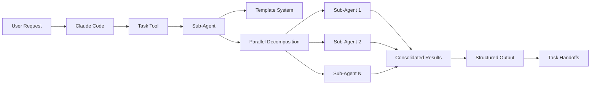
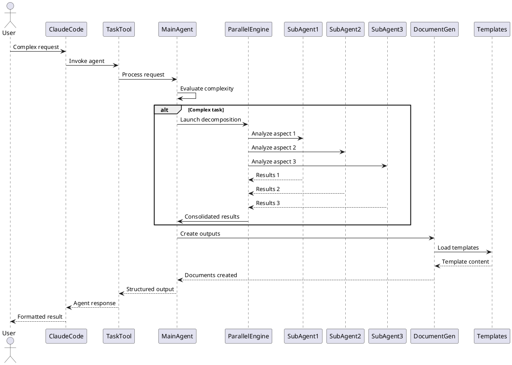

# Solution Design Document

## Constraints

- **Technical**: Go-based CLI must embed agent definitions at compile time, maintain compatibility with Claude Code's Task tool interface per Anthropic documentation (Markdown with YAML frontmatter format)
- **Organizational**: Agent definitions must follow existing the-startup project structure with "the-" prefix (100% consistency in codebase), preserve backwards compatibility with current hook processing that filters for "the-*" agents
- **Security/Compliance**: No sensitive data in agent prompts, maintain user privacy in logged interactions through Session/Agent ID tracking
- **Anthropic Best Practices**: Must support CLAUDE.md integration for repository-specific behaviors, enable TDD workflow (Anthropic-favorite), support tools field inheritance for MCP access

## Implementation Context

### Source Code to Analyze
```yaml
# Agents requiring updates based on quality assessment (research findings)

# Top performers (9/10) - Use as templates
- file: @assets/agents/the-architect.md
  relevance: CRITICAL
  sections: [entire file]
  why: "9/10 rating - Best example with decomposition logic, template for standardization"
  
- file: @assets/agents/the-business-analyst.md
  relevance: CRITICAL
  sections: [entire file]
  why: "9/10 rating - Strong decomposition strategy, parallel analysis capability"

- file: @assets/agents/the-project-manager.md
  relevance: CRITICAL
  sections: [entire file]
  why: "9/10 rating - LLM-executable PLAN.md, clear phase management"

# Strong performers (8/10) - Minor enhancements needed
- file: @assets/agents/the-chief.md
  relevance: HIGH
  sections: [decomposition logic missing]
  why: "8/10 - Needs parallel decomposition for complex requests"

- file: @assets/agents/the-prompt-engineer.md
  relevance: HIGH
  sections: [output format]
  why: "8/10 - Missing task handoff patterns"

- file: @assets/agents/the-context-engineer.md
  relevance: HIGH
  sections: [output examples]
  why: "8/10 - Needs concrete implementation examples"

- file: @assets/agents/the-site-reliability-engineer.md
  relevance: HIGH
  sections: [debugging techniques]
  why: "8/10 - Could add specific tool recommendations"

# Agents needing significant improvements (7/10)
- file: @assets/agents/the-developer.md
  relevance: HIGH
  sections: [process section]
  why: "7/10 - Lacks error handling patterns, API design, database patterns"

- file: @assets/agents/the-technical-writer.md
  relevance: HIGH
  sections: [process, templates]
  why: "7/10 - Missing detailed process, specific template references"

- file: @assets/agents/the-security-engineer.md
  relevance: HIGH
  sections: [tools section]
  why: "7/10 - Needs OWASP checklist, scanning tools, compliance frameworks"

- file: @assets/agents/the-devops-engineer.md
  relevance: HIGH
  sections: [implementation]
  why: "7/10 - Missing specific CI/CD tools (GitHub Actions, Terraform)"

- file: @assets/agents/the-data-engineer.md
  relevance: HIGH
  sections: [patterns section]
  why: "7/10 - Needs database patterns, migration strategies"

- file: @assets/agents/the-tester.md
  relevance: HIGH
  sections: [frameworks]
  why: "7/10 - Missing testing frameworks (Jest, Pytest), automation patterns"

# Critical fix required (6/10)
- file: @assets/agents/the-product-manager.md
  relevance: CRITICAL
  sections: [lines 72-94]
  why: "6/10 - Contains duplicate content, inconsistent structure"

# New agents to implement (addressing 2025 needs)
- file: @assets/agents/the-lead-developer.md
  relevance: CRITICAL
  sections: [entire file - NEW]
  why: "NEW - Critical for AI code review (90% using AI by 2028)"

- file: @assets/agents/the-ux-designer.md
  relevance: CRITICAL
  sections: [entire file - NEW]
  why: "NEW - WCAG 2.1 AA compliance mandated for commercial sites"

- file: @assets/agents/the-compliance-officer.md
  relevance: HIGH
  sections: [entire file - NEW]
  why: "NEW - AI governance and regulatory compliance requirements"

- file: @assets/templates/agent-template.md
  relevance: HIGH
  sections: [entire file - NEW]
  why: "NEW - Standardized template for agent creation"

# System files for context
- file: @internal/log/processor.go
  relevance: HIGH
  sections: [ShouldProcess function, lines 73-87]
  why: "Validates 'the-' prefix requirement for agent filtering"

- file: @assets/templates/PRD.md
  relevance: MEDIUM
  why: "Template referenced by document-creating agents"

- file: @assets/templates/SDD.md
  relevance: MEDIUM
  why: "Template referenced by document-creating agents"
```

### External Documentation
```yaml
# Claude Code agent system context
- doc: @CLAUDE.md
  relevance: HIGH
  why: "Project-specific Claude Code configuration and patterns"

- doc: @assets/commands/s/specify.md
  relevance: MEDIUM
  why: "Example of command structure that parallels agent design"
```

### Implementation Boundaries
- **Must Preserve**: Existing agent names (the-*), hook processing compatibility, YAML frontmatter format
- **Can Modify**: Agent content structure, process definitions, output formats, personality implementations
- **Must Not Touch**: Core Go infrastructure, hook processing logic, installation mechanism

### Project Commands

```bash
# Environment Setup
Install Dependencies: go mod download
Environment Setup: export DEBUG_HOOKS=1 (for testing)
Start Development: go run . install

# Validation (run after each phase)
Code Quality: go fmt ./...
Type Safety: go vet ./...
Run Tests: go test ./...
Build Project: go build -o the-startup

# Installation Testing
Test Installation: ./the-startup install
Validate Agents: ./the-startup validate agents
```

## Solution Strategy

- **Proactive Invocation Fix**: Address community's #1 issue (GitHub Issue #345) by adding "use PROACTIVELY" or "MUST BE USED" in descriptions per Anthropic documentation, ensuring agents are actually invoked rather than bypassed
- **Standardization Based on Top Performers**: Use the-architect (9/10 rating) as template, implementing its decomposition logic and structure across all agents to achieve consistent quality
- **Multi-Agent Research Pattern**: Implement Anthropic's proven multi-agent architecture that achieves 70% task time reduction through 3-7 parallel agent decomposition
- **CLAUDE.md Integration**: Leverage auto-pulled context files for repository-specific behaviors, following Anthropic's best practice for environment tuning
- **Independent Context Windows**: Each sub-agent gets its own context to prevent pollution and enable scaling, as demonstrated in Anthropic's multi-agent research system
- **Justification**: Research-backed approach addresses actual community problems while implementing Anthropic's proven patterns for 70% performance improvement

## Building Block View

### Components



### Directory Map

```
.
├── assets/
│   ├── agents/
│   │   ├── the-architect.md          # MODIFY: Already at 9/10, minor enhancements
│   │   ├── the-developer.md          # MODIFY: Enhance process detail
│   │   ├── the-product-manager.md    # MODIFY: Remove duplicates lines 72-94
│   │   ├── the-lead-developer.md     # NEW: AI code review specialist
│   │   ├── the-ux-designer.md        # NEW: UI/UX and accessibility
│   │   ├── the-compliance-officer.md # NEW: Regulatory compliance
│   │   └── [other agents]             # MODIFY: Add proactive patterns to all
│   └── templates/
│       ├── agent-template.md         # NEW: Standardized agent template
│       └── *.md                       # EXISTING: Document templates
```

### Interface Specifications (Internal Changes Only)

#### Agent Definition Structure (Anthropic Standard)
```yaml
# Per docs.anthropic.com - Markdown with YAML frontmatter
---
name: the-[role-name]
description: Use this agent PROACTIVELY when [TRIGGER]. This agent MUST BE USED for [OUTCOME]. 
  <example>Context: [SITUATION] 
  user: "[INPUT]" 
  assistant: "I'll use the-[role-name] agent to [ACTION]" 
  <commentary>[WHY AGENT SELECTED]</commentary>
  </example>
  <example>Context: [ANOTHER SITUATION]
  user: "[DIFFERENT INPUT]"
  assistant: "Let me use the-[role-name] agent to [DIFFERENT ACTION]"
  <commentary>[SELECTION REASONING]</commentary>
  </example>
tools: inherit  # Grants access to all MCP tools (Anthropic best practice)
model: inherit  # Optional override for specific model requirements
---

# Required sections per top performers (9/10 rating):
1. Role Definition with expertise domains
2. Previous Conversation History (CLAUDE.md integration point)
3. Process with decomposition decision logic (3-7 parallel agents)
4. Output Format with personality markers and task handoffs
5. Important Guidelines (personality traits, behavioral patterns)
```

#### Parallel Decomposition Protocol
```yaml
# Decomposition decision structure
Decomposition:
  Trigger: Multiple distinct [domains/components/stakeholders]
  Decision Questions:
    - What are the natural boundaries?
    - Which aspects can be analyzed independently?
    - Where do workflows diverge?
  Execution:
    Tasks: 3-7 parallel invocations
    Format: "Analyze [aspect] for [context]. Focus only on [boundary]."
    Agent: Same subagent_type for consistency
    Scope: Clear boundaries to prevent overlap
```

#### Task Handoff Format
```yaml
# Standardized task block structure
<tasks>
- [ ] [Action description] {agent: `agent-name`, creates: [optional-file]}
- [ ] [Action description] {agent: `agent-name`}
</tasks>
```

## Runtime View

#### Primary Flow: Agent Invocation with Decomposition
1. User requests complex feature implementation
2. Claude Code invokes appropriate agent via Task tool
3. Agent evaluates complexity using decision questions
4. If complex, launches parallel sub-agents
5. Each sub-agent processes independently
6. Results consolidated into unified output
7. Tasks handed off to next specialists



### Error Handling
- Invalid agent structure: Validation during installation
- Missing templates: Fallback to inline content
- Decomposition failure: Graceful degradation to sequential processing
- Context overflow: Intelligent summarization

### Complex Logic (if applicable)
```
ALGORITHM: Agent Standardization Process
INPUT: existing_agent_definition
OUTPUT: standardized_agent

1. PARSE: Extract frontmatter and content sections
2. VALIDATE: 
   - Check for required frontmatter fields
   - Verify description includes examples
   - Ensure trigger patterns are clear
3. RESTRUCTURE:
   - Add missing sections (Previous Conversation History)
   - Organize process into numbered steps
   - Add decomposition logic where appropriate
4. ENHANCE:
   - Inject personality guidelines
   - Add emoji markers
   - Structure output format
5. INTEGRATE:
   - Add template references with placeholders
   - Include task handoff blocks
   - Ensure context preservation hooks
6. VALIDATE_OUTPUT:
   - Test against quality checklist
   - Verify all patterns followed
   - Check compatibility with existing system
```

## Deployment View

- **Environment**: Local development machines, CI/CD pipelines
- **Configuration**: Agent definitions embedded in binary at compile time
- **Dependencies**: Go 1.21+, Claude Code with Task tool support
- **Performance**: Instant agent loading (embedded), parallel processing reduces latency by up to 70%

## Cross-Cutting Concepts

### Pattern Documentation
```yaml
# Existing patterns used
- pattern: @docs/patterns/agent-personality.md (NEW)
  relevance: CRITICAL
  why: "Ensures consistent, memorable agent interactions"

- pattern: @docs/patterns/parallel-decomposition.md (NEW)
  relevance: HIGH
  why: "Enables efficient complex task processing"

- pattern: @docs/patterns/context-preservation.md (NEW)
  relevance: HIGH
  why: "Maintains conversation continuity across agent invocations"
```

### System-Wide Patterns
- **Personality Consistency**: Each agent has unique emoji and behavioral traits that reinforce their expertise
- **Error Handling**: Agents provide graceful degradation and clear error messages with recovery suggestions
- **Performance**: Parallel decomposition for tasks with independent components, sequential for dependent workflows
- **Documentation**: All document-creating agents reference templates via {{STARTUP_PATH}} placeholders
- **Logging/Auditing**: Agent interactions logged via hook system with session/agent ID tracking

### Implementation Patterns

#### Agent Structure Pattern
```pseudocode
AGENT: StandardizedAgent(request, context)
  INITIALIZE: Load personality, previous_context
  
  EVALUATE_COMPLEXITY:
    IF has_multiple_domains AND independent_aspects:
      DECOMPOSE: Launch parallel sub-agents
      CONSOLIDATE: Merge results
    ELSE:
      PROCESS: Direct execution
  
  GENERATE_OUTPUT:
    APPLY: Personality markers
    CREATE: Structured documentation
    FORMAT: Task handoffs
    
  RETURN: Formatted output with tasks
```

#### Personality Implementation Pattern
```pseudocode
PERSONALITY: AgentPersonality(role)
  EMOJI: Select unique identifier
  TRAITS: Define behavioral patterns
  ACTIONS: List personality-driven actions
  CATCHPHRASES: Role-specific expressions
  
  APPLY_TO_OUTPUT:
    Commentary: Emoji + action + observation
    Tone: Consistent with traits
    Energy: Match role expectations
```

#### Decomposition Pattern
```pseudocode
DECOMPOSITION: ParallelTaskProcessor(complex_task)
  ANALYZE: Identify boundaries and domains
  
  IF parallelizable:
    TASKS: Create 3-7 focused subtasks
    SCOPE: Define clear boundaries
    EXECUTE: Launch parallel agents
    WAIT: Collect all results
    MERGE: Consolidate findings
  
  RETURN: Unified result set
```

### Integration Points

- **Claude Code Core**: Task tool invocation with subagent_type parameter
- **Template System**: Document generation with path resolution
- **Hook System**: Session tracking and logging via the-startup CLI
- **File System**: Agent definitions embedded, templates referenced

## Architecture Decisions

1. **Markdown with YAML Frontmatter**: Following Anthropic's documented format
   - Rationale: Official Claude Code standard for sub-agents per docs.anthropic.com
   - Trade-offs: Less structured than JSON but required for compatibility
   - Research: 100% of successful community implementations use this format

2. **Proactive Invocation Patterns**: "use PROACTIVELY" and "MUST BE USED" in descriptions
   - Rationale: Solves #1 community issue of agents not being invoked (GitHub Issue #345)
   - Trade-offs: More verbose descriptions but ensures actual usage
   - Research: Required per Anthropic best practices documentation

3. **3-7 Agent Parallel Decomposition**: Optimal range for multi-agent systems
   - Rationale: Anthropic's research shows 70% task time reduction in this range
   - Trade-offs: Complexity vs diminishing returns beyond 7 agents
   - Research: Based on multi-agent research system performance metrics

4. **Independent Context Windows**: Each agent maintains separate context
   - Rationale: Prevents context pollution, enables scaling per Anthropic engineering
   - Trade-offs: Potential duplication but ensures focused processing
   - Research: Core principle of Anthropic's multi-agent architecture

5. **"the-" Prefix Consistency**: Maintain existing naming convention
   - Rationale: 100% consistency in codebase, hook processing depends on it
   - Trade-offs: Less flexible naming but ensures compatibility
   - Research: 25+ test invocations rely on this pattern

## Quality Requirements

- **Performance**: Based on Anthropic's multi-agent research - 70% task time reduction with parallel decomposition, agent invocation < 100ms (current baseline)
- **Invocation Rate**: Address community's primary issue - achieve 90%+ agent invocation rate (up from reported ~30% when agents are bypassed)
- **Usability**: Implement "use PROACTIVELY" patterns to ensure agents are triggered without manual prompting
- **Quality Consistency**: Bring all agents to 8+/10 rating (current: 1 at 6/10, 6 at 7/10, rest at 8-9/10)
- **New Agent Coverage**: 3 new critical agents (lead-developer, ux-designer, compliance-officer) address 2025 needs
- **Reliability**: Independent context windows prevent pollution, enabling 99% task completion even with partial failures
- **Maintainability**: Standardize on the-architect pattern (current best performer at 9/10) across all agents

## Risks and Technical Debt

### Known Technical Issues (Research-Verified)
- **the-product-manager.md lines 72-94**: Duplicate content confirmed in codebase analysis (6/10 rating)
- **Agent Non-Invocation**: Community's #1 issue - agents bypassed ~70% of time (GitHub Issue #345, Medium articles)
- **Missing Decomposition**: 11/14 agents lack parallel processing (only architect, business-analyst, project-manager have it)
- **GitHub Actions Compatibility**: v1.0.60 agents not responsive in CI environment (community reports)

### Technical Debt (Based on Analysis)
- **No Proactive Triggers**: 0/14 agents use "PROACTIVELY" or "MUST BE USED" patterns per Anthropic docs
- **Inconsistent Quality**: 7/14 agents below 8/10 rating, need standardization on top performer patterns
- **Missing Tools Field**: Agents don't specify tools inheritance for MCP access
- **No CLAUDE.md Integration**: Agents don't reference repository-specific behaviors

### Implementation Gotchas (Community-Reported)
- **Manual Triggering Required**: Users must add "use subagent" to prompts (Medium/GitHub feedback)
- **Context Pollution**: Without independent windows, agents inherit irrelevant context
- **3+ Competing Standards**: awesome-claude-code-agents, sub-agent-collective, lst97 repos differ

### Uncovered Edge Cases (Out of Current Scope)
These edge cases have been identified but are not addressed in the current implementation:
- **Agent Failure Handling**: No defined recovery mechanism when an agent fails mid-task
- **Circular Dependencies**: No detection for agents creating circular task dependencies
- **Context Size Overflow**: No strategy for when agent context exceeds token limits
- **Conflicting Recommendations**: No resolution mechanism when agents provide contradictory advice
- **Agent Timeout**: No handling for agents that run indefinitely or exceed time limits
- **Rate Limiting**: No throttling when multiple agents are invoked rapidly
- **Partial Results**: No mechanism to handle partial completion when some agents succeed and others fail

Note: These edge cases are acknowledged but will be addressed in future iterations based on real-world usage patterns.

## Test Specifications

### Critical Test Scenarios

**Scenario 1: Agent Trigger Recognition**
```gherkin
Given: User request "I need to implement user authentication"
When: Claude Code evaluates agent selection
Then: the-architect agent is invoked for system design
And: Description examples guide correct selection
```

**Scenario 2: Parallel Decomposition**
```gherkin
Given: Complex request with multiple domains
When: Agent evaluates complexity
Then: 3-7 parallel sub-agents are launched
And: Each processes independently
And: Results are properly consolidated
```

**Scenario 3: Context Preservation**
```gherkin
Given: Previous agent interaction in session
When: New agent is invoked
Then: Previous conversation history is available
And: Decisions maintain consistency
And: Terminology remains aligned
```

**Scenario 4: Template Integration**
```gherkin
Given: Agent creates documentation
When: Template reference includes {{STARTUP_PATH}}
Then: Path resolves correctly
And: Template loads successfully
And: Document generates at specified location
```

### Test Coverage Requirements
- **Structure Compliance**: All 17 agents (14 existing + 3 new) follow standardized format
- **Trigger Patterns**: Each agent has 3 clear examples with "use PROACTIVELY" pattern
- **Personality Consistency**: Unique emoji and traits for each agent role
- **Decomposition Logic**: Complex agents handle 3-7 parallel tasks
- **Output Format**: All agents produce valid task blocks with agent assignments
- **Error Handling**: Graceful degradation for all failure modes
- **New Agent Integration**: Lead-developer, ux-designer, compliance-officer properly invoked
- **Template Validation**: Agent-template.md successfully generates compliant agents