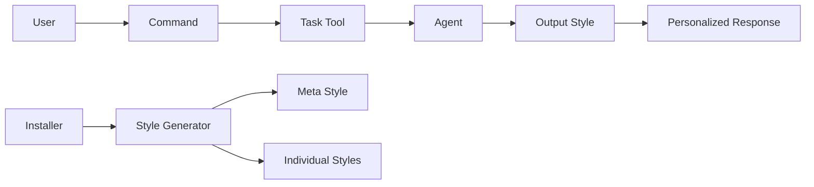
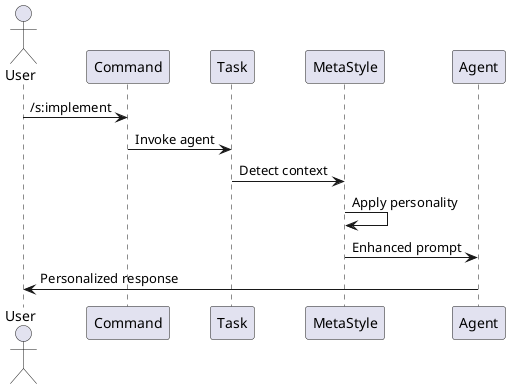

# Solution Design Document

## Constraints

- **Technical**: Claude Code output-styles are static per session and modify the entire system prompt
- **Organizational**: Must maintain compatibility with existing 17-agent system in assets/agents/
- **Performance**: Style switching should have minimal overhead (<100ms perceived latency)
- **User Experience**: Agent personalities must remain consistent and distinguishable

## Implementation Context

### Source Code to Analyze
```yaml
# Agent definitions that define personalities
- file: @assets/agents/the-chief.md
  relevance: CRITICAL
  why: "Core agent personality definitions to enhance"

- file: @assets/agents/the-developer.md
  relevance: CRITICAL  
  why: "Example of technical agent personality"

- file: @assets/agents/the-ux-designer.md
  relevance: HIGH
  why: "Example of creative agent personality"

# Installation and configuration
- file: @cmd/install.go
  relevance: HIGH
  sections: [installation flow]
  why: "Where output-styles will be generated and installed"

- file: @assets/settings.json
  relevance: MEDIUM
  why: "Template for Claude Code settings configuration"

# Hook processing for context detection
- file: @cmd/log.go
  relevance: MEDIUM
  sections: [hook data processing]
  why: "Context detection for active agents"
```

### External Documentation
```yaml
- url: https://docs.anthropic.com/en/docs/claude-code/output-styles
  relevance: CRITICAL
  why: "Claude Code output-styles feature documentation"

- doc: @docs/patterns/agent-personality-prompt-engineering.md
  relevance: HIGH
  why: "Established patterns for agent personalities"
```

### Implementation Boundaries
- **Must Preserve**: Existing agent functionality and Task tool interface
- **Can Modify**: Agent markdown files to enhance personalities, installer to generate styles
- **Must Not Touch**: Core Claude Code system behavior

### Project Commands

```bash
# Environment Setup
Install Dependencies: go mod tidy
Start Development: go run . install

# Validation (run after each phase)
Code Quality: go fmt ./...
Type Safety: go vet ./...
Run Tests: go test ./...
Build Project: go build -o the-startup

# Testing Installation
Test Install: ./the-startup install
Verify Styles: ls ~/.claude/output-styles/
Check Settings: cat ~/.claude/settings.local.json
```

## Solution Strategy

- **Hybrid Meta-Style Architecture**: Single adaptive output-style that detects and applies agent personalities dynamically
- **Context-Aware Detection**: Parse conversation context for agent indicators (subagent_type, signatures)
- **Personality Injection**: Enhanced prompts in Task tool invocations with strong personality markers
- **Graceful Degradation**: Falls back to base personalities if detection fails

## Building Block View

### Components



### Directory Map

```
.
├── internal/
│   ├── styles/                    # NEW: Output style generation
│   │   ├── generator.go           # NEW: Style generation logic
│   │   ├── meta.go                # NEW: Meta-style creator
│   │   └── templates.go           # NEW: Style templates
│   └── installer/
│       └── installer.go           # MODIFY: Add style generation
├── assets/
│   ├── agents/                    # MODIFY: Enhance personalities
│   └── templates/
│       └── meta-style.md          # NEW: Meta-style template
└── docs/
    └── output-styles/              # NEW: Generated styles directory
```

### Interface Specifications (Internal Changes Only)

#### Style Generator Interface
```yaml
Interface: StyleGenerator
  Methods:
    GenerateMetaStyle(agents []Agent) -> string
    GenerateIndividualStyle(agent Agent) -> string
    InstallStyles(targetDir string) -> error
    
  Data Structures:
    Agent:
      name: string
      personality: PersonalityProfile
      signatures: []string
      
    PersonalityProfile:
      archetype: enum[Technical, Business, Creative, Process]
      voice: VoiceCharacteristics
      behaviors: []string
```

#### Context Detection Logic
```yaml
Detection: AgentContextDetector
  Inputs:
    conversation_history: string
    current_message: string
  
  Outputs:
    detected_agent: string
    confidence: float
    personality_markers: []string
  
  Rules:
    - Check for explicit subagent_type mentions
    - Look for agent signatures (emoticons)
    - Analyze vocabulary patterns
    - Cache detection for 5 minutes
```

## Runtime View

#### Primary Flow: Agent Personality Application
1. User invokes command with agent delegation
2. System detects target agent from context
3. Meta-style applies personality overlay
4. Agent responds with consistent personality
5. Personality markers reinforce identity



### Error Handling
- Detection failure: Use neutral professional tone
- Style not found: Fall back to default Claude Code
- Conflicting signals: Prioritize most recent agent

### Complex Logic

```
ALGORITHM: Personality Detection and Application
INPUT: conversation_context, current_task
OUTPUT: personalized_response

1. DETECT_AGENT:
   - Parse for subagent_type parameter
   - Search for signature patterns
   - Analyze vocabulary markers
   
2. LOAD_PERSONALITY:
   - Retrieve agent profile
   - Select voice characteristics
   - Load behavioral directives
   
3. APPLY_OVERLAY:
   - Inject personality markers
   - Adjust language patterns
   - Add signature elements
   
4. MAINTAIN_CONSISTENCY:
   - Cache active personality
   - Track context switches
   - Preserve personality across turns
```

## Deployment View

- **Environment**: Local file system (~/.claude/output-styles/)
- **Configuration**: settings.local.json with output_style preference
- **Dependencies**: Claude Code 0.8.0+
- **Performance**: <100ms style application, 5-minute context cache

## Cross-Cutting Concepts

### Pattern Documentation
```yaml
- pattern: @docs/patterns/agent-personality-prompt-engineering.md
  relevance: CRITICAL
  why: "Core patterns for creating effective agent personalities"
```

### System-Wide Patterns
- **Personality Consistency**: Visual signatures and voice patterns maintained across interactions
- **Context Switching**: Clean transitions between different agent personalities
- **Graceful Degradation**: Professional fallback when personality detection fails
- **Performance Optimization**: Caching and lazy loading for minimal overhead

### Implementation Patterns

#### Meta-Style Structure Pattern
```pseudocode
META_STYLE: Adaptive Agent Personality System
  DETECT: Current agent context
  LOAD: Agent-specific personality
  APPLY: Voice, behavior, and signature overlays
  MAINTAIN: Consistency through context caching
```

#### Personality Injection Pattern
```pseudocode
FUNCTION: inject_personality(base_prompt, agent_profile)
  ADD: Identity foundation layer
  ADD: Behavioral directives
  ADD: Voice modulation rules
  ADD: Output formatting with signatures
  RETURN: Enhanced prompt with personality
```

#### Agent Archetype Pattern
```pseudocode
ARCHETYPE: Define personality category
  Technical: Precise, solution-focused, celebrates elegance
  Business: Strategic, impact-driven, cross-functional
  Creative: Empathetic, sensory language, craft-focused
  Process: Risk-aware, validation-minded, reliability-focused
```

### Integration Points

- Hooks system for context detection
- Task tool for personality injection
- Settings.json for style configuration
- File system for style storage

## Architecture Decisions

1. **Meta-Style over Individual Styles**: Single adaptive style
   - Rationale: Avoids manual switching, provides seamless experience
   - Trade-offs: More complex detection logic, potential misdetection

2. **Context Caching Strategy**: 5-minute cache windows
   - Rationale: Balance between consistency and responsiveness
   - Trade-offs: Memory usage vs context switch performance

3. **Personality Injection in Prompts**: Enhanced Task tool prompts
   - Rationale: Works within Claude Code constraints
   - Trade-offs: Requires careful prompt engineering

## Quality Requirements

- **Differentiation**: Each agent personality distinctly recognizable
- **Consistency**: Personality maintained across conversation turns
- **Performance**: <100ms perceived latency for personality application
- **Compatibility**: No disruption to existing Claude Code features

## Risks and Technical Debt

### Known Technical Issues
- Output-styles are session-static, preventing dynamic switching
- No native API for programmatic style changes
- Context detection may have false positives

### Technical Debt
- Manual style file generation during installation
- No automated personality consistency testing
- Hardcoded personality profiles in templates

### Implementation Gotchas
- Style files must be valid markdown
- Settings.json modification requires careful JSON handling
- Race conditions possible in concurrent agent invocations

## Test Specifications

### Critical Test Scenarios

**Scenario 1: Successful Personality Application**
```gherkin
Given: Meta-style is active
And: User invokes the-developer agent
When: Agent responds to task
Then: Response includes developer personality markers
And: Signature (๑˃ᴗ˂)ﻭ appears in commentary
And: Technical enthusiasm is expressed
```

**Scenario 2: Context Switch Between Agents**
```gherkin
Given: the-architect was previously active
When: User switches to the-ux-designer
Then: Personality cleanly transitions
And: No architect signatures remain
And: Designer vocabulary emerges
```

**Scenario 3: Fallback on Detection Failure**
```gherkin
Given: Meta-style cannot detect agent
When: Task is executed
Then: Professional tone is maintained
And: No incorrect personality is applied
And: Core functionality preserved
```

**Scenario 4: Installation and Setup**
```gherkin
Given: User runs the-startup install
When: Installation completes
Then: Output-styles directory exists
And: Meta-style.md is generated
And: Settings.json references style
```

### Test Coverage Requirements
- **Personality Detection**: All 17 agents correctly identified
- **Voice Consistency**: Personality maintained across 10+ turns
- **Performance**: Style application under 100ms
- **Compatibility**: All Claude Code features remain functional
- **Installation**: Styles generated and configured correctly
- **Edge Cases**: Unknown agents, corrupted context, style conflicts