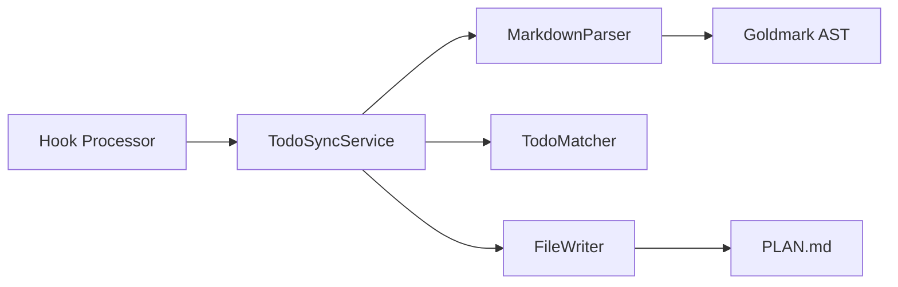
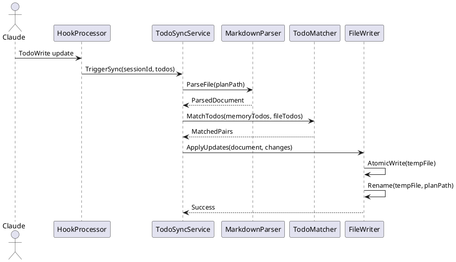

# Solution Design Document

## Constraints

- **Technical**: Go language, Cobra command framework, preserve exact markdown formatting, <100ms write operations
- **Organizational**: Follow existing CLI patterns, maintain backward compatibility with existing PLAN.md files
- **Security/Compliance**: No sensitive data in timestamps, atomic operations to prevent corruption

## Implementation Context

### Source Code to Analyze
```yaml
# Core implementation files that must be understood
- file: @cmd/log.go
  relevance: CRITICAL
  sections: [PreToolUse/PostToolUse handling]
  why: "Hook processor that will trigger sync operations"
  
- file: @internal/log/processor.go
  relevance: CRITICAL
  sections: [ProcessHookData function]
  why: "Main processing logic where sync will integrate"

- file: @main.go
  relevance: MEDIUM
  sections: [embed directives, asset handling]
  why: "Understand embedded file system patterns"

# Configuration and setup files
- file: @go.mod
  relevance: MEDIUM
  why: "Dependencies available for markdown parsing"
```

### External Documentation
```yaml
# Third-party library docs
- url: https://github.com/yuin/goldmark
  relevance: HIGH
  why: "Markdown AST parser that preserves formatting"

- doc: @docs/specs/*/PLAN.md
  relevance: HIGH
  why: "Understand existing PLAN.md format conventions"
```

### Implementation Boundaries
- **Must Preserve**: Exact markdown formatting, whitespace, indentation
- **Can Modify**: Only checkbox states and add HTML comments
- **Must Not Touch**: Other markdown content, file encoding

### Project Commands

```bash
# Environment Setup
Install Dependencies: go mod tidy
Environment Setup: N/A
Start Development: go run . 

# Validation (run after each phase)
Code Quality: go fmt ./...
Type Safety: go vet ./...
Run Tests: go test ./...
Build Project: go build -o the-startup

# Additional Project-Specific Commands
Run Hook Processor: go run . log --assistant < hook-data.json
```

## Solution Strategy

- **Architecture Pattern**: Hexagonal architecture with clean separation between todo sync domain logic and file I/O adapters
- **Integration Approach**: Post-hook trigger from existing log processor, non-blocking sync operations
- **Justification**: Maintains existing command flow while adding sync as a side effect, ensuring zero disruption to current functionality

## Building Block View

### Components



### Directory Map

```
.
├── internal/
│   ├── sync/                      # NEW: Todo synchronization package
│   │   ├── service.go            # NEW: Main sync orchestration
│   │   ├── parser.go             # NEW: Markdown parsing with goldmark
│   │   ├── matcher.go            # NEW: Todo matching algorithm
│   │   └── writer.go             # NEW: Atomic file operations
│   ├── log/
│   │   └── processor.go          # MODIFY: Add sync trigger
│   └── models/
│       └── todo.go                # NEW: Todo state structures
```

### Interface Specifications (Internal Changes Only)

#### Application Data Models
```pseudocode
ENTITY: TodoItem (NEW)
  FIELDS: 
    ID: string
    Content: string
    State: enum (pending, in_progress, completed)
    Line: int
    Indent: int
    Timestamp: time.Time (optional)
  
  BEHAVIORS:
    ToMarkdown(): string
    UpdateState(newState): void
    AddTimestamp(): void

ENTITY: PlanDocument (NEW)
  FIELDS:
    Path: string
    Todos: []TodoItem
    RawLines: []string
  
  BEHAVIORS:
    ParseFromFile(path): PlanDocument
    SyncTodos(updates): void
    WriteToFile(): error
```

## Runtime View

#### Primary Flow: Todo State Synchronization
1. Hook processor receives TodoWrite update
2. System identifies associated PLAN.md file
3. Parser reads and preserves file structure
4. Matcher correlates memory todos with file todos
5. Writer applies atomic updates



### Error Handling
- File not found: Log warning, skip sync
- Parse error: Log error with line number, abort sync
- Write permission denied: Log warning, continue command
- Concurrent modification: Retry with exponential backoff

### Complex Logic
```
ALGORITHM: Match Todos Between Memory and File
INPUT: memory_todos, file_todos
OUTPUT: matched_pairs

1. BUILD_INDEX: Create content hash map for file_todos
2. FOR each memory_todo:
   a. Try exact content match
   b. If no match, try fuzzy match (>80% similarity)
   c. If no match, try position-based match
   d. If no match, mark as new
3. DETECT_CHANGES: Compare states between matched pairs
4. GENERATE_UPDATES: Create line-level change set
5. VALIDATE: Ensure changes don't corrupt structure
6. RETURN: matched_pairs with update operations
```

## Deployment View

- **Environment**: Runs within CLI process on developer machines
- **Configuration**: No additional config required, uses existing paths
- **Dependencies**: Goldmark markdown parser (vendored)
- **Performance**: Target <100ms for 100-todo files, debounced for rapid changes

## Cross-Cutting Concepts

### Pattern Documentation
```yaml
# New patterns created for this feature  
- pattern: @docs/patterns/atomic-file-write.md (NEW)
  relevance: CRITICAL
  why: "Ensures file integrity during updates"

- pattern: @docs/patterns/ast-format-preservation.md (NEW)
  relevance: HIGH
  why: "Maintains exact markdown formatting"
```

### System-Wide Patterns
- **Error Handling**: Non-blocking failures, graceful degradation
- **Performance**: Debounced updates, incremental parsing for large files
- **Logging/Auditing**: Debug-level sync operations, no user-visible output

### Implementation Patterns

#### Atomic File Write Pattern
```pseudocode
FUNCTION: AtomicWriteFile(path, content)
  tempPath = path + ".tmp." + random_suffix
  WRITE: content to tempPath
  FSYNC: ensure tempPath written to disk
  RENAME: tempPath to path (atomic on POSIX)
  IF error:
    DELETE: tempPath if exists
    RETURN: error
  RETURN: success
```

#### Markdown AST Preservation Pattern
```pseudocode
FUNCTION: PreserveFormattingAST(node, originalSource)
  STORE: node.Position.Start, node.Position.End
  EXTRACT: exact_text = originalSource[start:end]
  MODIFY: only checkbox character if needed
  PRESERVE: all whitespace, indentation, markers
  RETURN: modified_text with same byte positions
```

#### Content-Based Matching Pattern
```pseudocode
FUNCTION: MatchByContent(memoryTodo, fileTodos)
  contentHash = hash(normalize(memoryTodo.content))
  candidates = fileTodos.withHash(contentHash)
  IF len(candidates) == 1:
    RETURN: exact_match
  IF len(candidates) > 1:
    RETURN: closest_by_position
  FALLBACK: fuzzy_match(>80% similarity)
```

## Architecture Decisions

1. **Goldmark over Regex**: AST parsing preserves structure perfectly
   - Rationale: Regex would break on edge cases
   - Trade-offs: Slightly more complex but guaranteed correctness

2. **Content Matching over IDs**: No ID pollution in markdown
   - Rationale: Keeps PLAN.md human-readable
   - Trade-offs: Fuzzy matching needed for edited todos

3. **Atomic Writes over In-Place**: Prevent corruption
   - Rationale: System crashes shouldn't corrupt files
   - Trade-offs: Temp files briefly use extra disk space

4. **Debounced Sync**: Batch rapid changes
   - Rationale: Avoid excessive I/O during fast updates
   - Trade-offs: 500ms delay before persistence

## Quality Requirements

- **Performance**: <100ms for typical files, <500ms for 500+ todos
- **Reliability**: Zero data loss on crashes, atomic operations only
- **Usability**: Completely transparent to users, no manual intervention
- **Maintainability**: Clean interfaces, comprehensive test coverage

## Risks and Technical Debt

### Known Technical Issues
- Large files (>1000 todos) may exceed 100ms target
- Windows file locking more restrictive than POSIX

### Implementation Gotchas
- Goldmark requires careful position tracking for preservation
- Line endings (CRLF vs LF) must be detected and preserved
- Concurrent git operations may conflict with file writes

## Test Specifications

### Critical Test Scenarios

**Scenario 1: Normal Todo Completion**
```gherkin
Given: PLAN.md with unchecked todo "- [ ] Implement feature"
When: TodoWrite marks todo as completed
Then: File contains "- [x] Implement feature"
And: Timestamp comment added after checkbox
And: All other content unchanged
```

**Scenario 2: Concurrent Modification**
```gherkin
Given: PLAN.md being edited in external editor
When: Sync attempts to write
Then: Retry with backoff
And: Eventually succeed or log warning
And: No corruption occurs
```

**Scenario 3: Malformed Markdown**
```gherkin
Given: PLAN.md with invalid checkbox syntax
When: Sync processes file
Then: Skip malformed todos
And: Update valid todos only
And: Log parsing warnings
```

**Scenario 4: Large File Performance**
```gherkin
Given: PLAN.md with 1000+ todos
When: Single todo state changes
Then: Update completes in <500ms
And: Only changed lines modified
And: Memory usage remains bounded
```

### Test Coverage Requirements
- **Parser**: All markdown checkbox variations, nested lists, special characters
- **Matcher**: Exact, fuzzy, position-based matching scenarios
- **Writer**: Atomic operations, error recovery, concurrent access
- **Integration**: End-to-end sync with real files
- **Performance**: Benchmark with various file sizes
- **Edge Cases**: Empty files, no todos, corrupted files