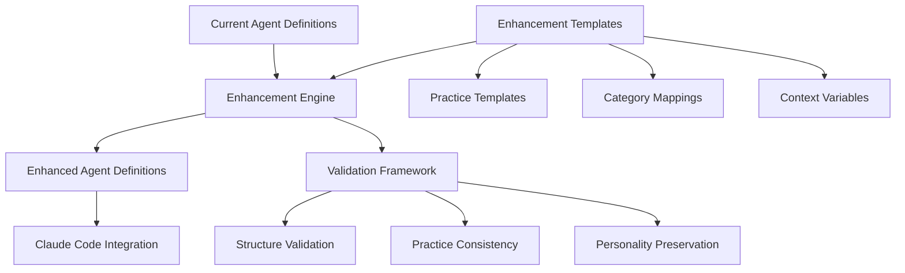
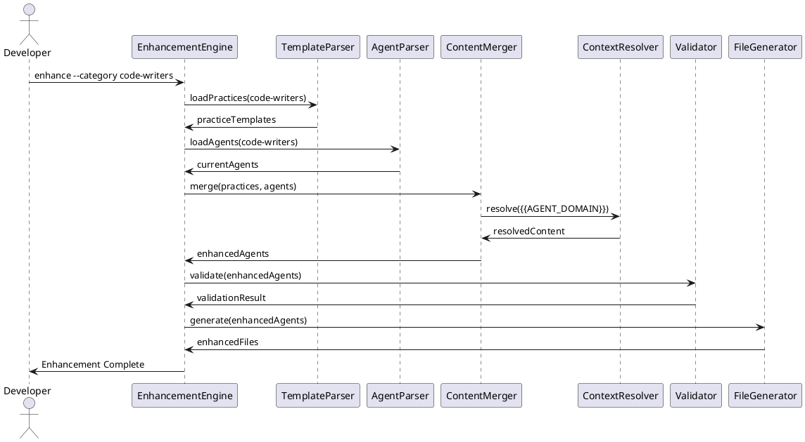

# Solution Design Document

## Constraints

**Technical Constraints:**
- Must preserve existing YAML frontmatter structure in agent definitions
- Agent files maintain existing 4-section format (Focus Areas, Approach, Anti-Patterns, Expected Output)  
- Must preserve agent personalities and domain expertise focus
- Template-driven enhancement system required for systematic consistency
- Tool-agnostic language throughout (no specific framework/tool references)

**Organizational Constraints:**
- Enhancement templates must follow existing `assets/the-startup/rules/` pattern
- No changes to Claude Code sub-agent loading mechanism
- Must maintain existing `Task(subagent_type="name")` invocation pattern
- Agent length constraints require user validation (not pre-determined)

**Security/Compliance Constraints:**
- Security practices must be domain-specific, not generic
- Input validation practices required for user-facing agents
- Secrets management patterns required for infrastructure agents
- Context drift prevention required for validation/review agents

## Implementation Context

### Source Code to Analyze
```yaml
# Current agent definitions (all 25 agents)
- file: @assets/claude/agents/the-backend-engineer.md
  relevance: CRITICAL
  sections: [entire file structure]
  why: "Representative code-writing agent structure and personality"

- file: @assets/claude/agents/the-business-analyst.md
  relevance: CRITICAL  
  sections: [entire file structure]
  why: "Representative requirements agent needing validation patterns"

- file: @assets/claude/agents/the-security-engineer.md
  relevance: HIGH
  sections: [security focus and approach]
  why: "Security practice patterns to distribute across other agents"

- file: @assets/claude/agents/the-qa-engineer.md
  relevance: HIGH
  sections: [testing approach and validation patterns]
  why: "Testing strategy patterns for code-writing agents"

# Template system reference
- file: @assets/the-startup/rules/agent-delegation.md
  relevance: HIGH  
  sections: [entire file]
  why: "Existing rule pattern that template system must follow"

# Enhancement target structure
- file: @~/.claude/CLAUDE.md
  relevance: CRITICAL
  sections: [TDD workflows, SOLID principles, security practices]
  why: "Industry best practices that must be integrated into agents"
```

### External Documentation
```yaml
# Claude Code sub-agent system documentation
- url: https://docs.anthropic.com/en/docs/claude-code/sub-agents
  relevance: CRITICAL
  why: "Sub-agent loading and invocation patterns that must be preserved"

- url: https://docs.anthropic.com/en/docs/claude-code/slash-commands
  relevance: MEDIUM
  why: "Command system context for agent enhancement"

# Industry best practices references  
- doc: @~/.claude/CLAUDE.md
  relevance: CRITICAL
  why: "Source of best practices to integrate: TDD, SOLID, security, testing"
```

### Implementation Boundaries
- **Must Preserve**: Agent personalities, existing 4-section structure, YAML frontmatter, Claude Code integration
- **Can Modify**: Section content within agents, addition of best practice guidance, enhancement of existing approaches
- **Must Not Touch**: Claude Code loading mechanism, agent invocation patterns, core agent personality statements

### Project Commands

```bash
# Environment Setup  
Install Dependencies: N/A (file-based enhancement system)
Environment Setup: N/A
Start Development: N/A

# Validation (run after each enhancement phase)
Code Quality: N/A (markdown files)
Type Safety: N/A  
Run Tests: Validation of enhanced agent responses
Build Project: N/A (embedded assets compiled with Go binary)

# Enhancement System Commands (to be implemented)
Template Validation: ./enhancement-engine validate --templates
Agent Enhancement: ./enhancement-engine enhance --category code-writers
Consistency Check: ./enhancement-engine validate --agents --consistency
Preview Changes: ./enhancement-engine diff --agent the-backend-engineer

# Integration Testing
Agent Response Testing: Test enhanced agents with Claude Code Task tool
Template Application Testing: Verify templates apply correctly across agent categories
```

## Solution Strategy

**"@" Directive Integration Architecture**: Use condensed rule files stored in `assets/the-startup/rules/` that agents include via "@" directive (`@{{STARTUP_PATH}}/rules/abc.md`), with Claude Code interpreting the rule content as inline agent markdown.

**Category-Based Practice Distribution**: Group agents by expertise area (Code Writers, Architects, Requirements/Validation, etc.) and apply relevant practice sets to each category, ensuring domain-specific integration rather than generic application.

**Embedded Integration Approach**: Enhance existing agent sections rather than adding new sections, preserving familiar structure while systematically integrating practices into Focus Areas, Approach, Anti-Patterns, and Expected Output sections.

**Validation-First Design**: Build validation checkpoints into enhancement process to ensure agent personality preservation, practice consistency, and systematic coverage across all relevant agents.

## Building Block View

### Components



### Directory Map

```
assets/
├── claude/agents/                      # MODIFY: Enhance existing agents
│   ├── the-backend-engineer.md        # Enhanced with software development practices
│   ├── the-frontend-engineer.md       # Enhanced with software development practices  
│   ├── the-business-analyst.md        # Enhanced with requirements validation practices
│   ├── the-qa-engineer.md             # Enhanced with quality assurance practices
│   └── [21 more agents]               # Enhanced per category from README
└── the-startup/rules/                  # NEW: Simple enhancement rules (flat structure)
    ├── software-development-practices.md    # TDD, security, tool integration
    ├── architecture-practices.md            # SOLID principles, design patterns + asset creation
    ├── requirements-validation-practices.md # Question-driven, assumption prevention
    ├── quality-assurance-practices.md       # Testing strategies, validation
    ├── infrastructure-practices.md          # DevOps, SRE, automation
    └── design-documentation-practices.md    # UX, documentation, clarity

docs/
├── patterns/                           # EXISTING: Architectural patterns (enhanced by architecture agents)
│   ├── template-driven-agent-enhancement.md
│   ├── assumption-prevention.md
│   └── [future patterns created by architecture agents]
└── interfaces/                         # EXISTING: Service contracts (enhanced by architecture agents)  
    └── [service interfaces created by architecture agents]
```

### Interface Specifications (Internal Changes Only)

#### "@" Directive Rule Integration
```yaml
# Agent enhancement via "@" directive inclusion
Agent_Enhancement: the-software-architect
  current_structure: |
    ## Focus Areas
    - Problem Definition: What needs solving NOW vs what's nice-to-have later
    
  enhanced_structure: |
    ## Focus Areas  
    - Problem Definition: What needs solving NOW vs what's nice-to-have later
    
    @{{STARTUP_PATH}}/rules/architecture-practices.md
    
# Rule file structure (architecture-practices.md) - condensed, no excessive headlines
architecture_practices_content: |
  - **SOLID Principles**: Apply single responsibility, dependency inversion
  - **Design Patterns**: Document reusable solutions at docs/patterns/
  - **Architectural Assets**: Create interfaces at docs/interfaces/ when defining contracts
  
  ## Approach Integration
  - Apply hexagonal architecture for domain separation
  - All tests working means 100% - do not stop in middle of testing  
  - Search existing patterns/interfaces before creating new ones
  
  ## Anti-Patterns
  - Over-engineering for hypothetical future requirements  
  - Creating new patterns when existing ones work
```

#### Agent Category Enhancement Mapping
**Implementation Guide**: See @docs/patterns/agent-category-enhancement-mapping.md for complete mapping of README agent categories to appropriate rule file inclusions, organized by user-validated implementation phases.

#### Agent Enhancement Integration Points
```yaml
# How practices integrate into existing agent structure
Integration_Pattern: agent_section_enhancement
  focus_areas:
    merge_strategy: "Add practice-specific bullets to existing domain bullets"
    preserve: "Domain expertise remains primary focus"
    
  approach:
    merge_strategy: "Insert practice steps into existing numbered sequence"
    preserve: "Pragmatic, actionable methodology tone"
    
  anti_patterns:
    merge_strategy: "Add practice-specific anti-patterns to existing list"
    preserve: "Concrete, experience-based warnings"
    
  expected_output:
    merge_strategy: "Enhance output specs with practice requirements"
    preserve: "Clear, measurable deliverable definitions"
```

#### Architectural Asset Management (Architecture Agents Only)
```yaml
# Additional capabilities for architecture-type agents
Architectural_Asset_Creation:
  patterns:
    location: "docs/patterns/[descriptive-name].md"
    create_when: "Solution will be reused across multiple features"
    deduplication: "Search existing patterns first, enhance rather than duplicate"
    required_sections: [context, problem, solution, implementation_example]
    
  interfaces:
    location: "docs/interfaces/[service-name].md" 
    create_when: "Defining contracts between services or systems"
    deduplication: "Search existing interfaces first, update rather than duplicate"
    required_sections: [authentication, rate_limits, data_formats, examples]
    
  enhancement_approach:
    search_first: "Always check docs/patterns/ and docs/interfaces/ before creating"
    prefer_update: "Enhance existing documentation over creating new files"
    naming_convention: "Use descriptive, searchable names (kebab-case)"
    cross_reference: "Link between related patterns and interfaces"
```

## Runtime View

### Primary Flow: Agent Enhancement Process

1. **Template Parsing**: Enhancement engine reads practice templates and category mappings
2. **Agent Analysis**: Current agent structure parsed, personality markers identified  
3. **Practice Selection**: Relevant practices selected based on agent category mapping
4. **Content Merging**: Practice content merged into existing agent sections with context resolution
5. **Validation**: Enhanced agent validated for structure, consistency, personality preservation
6. **Output Generation**: Enhanced agent file generated with integrated best practices



### Error Handling
- **Invalid template format**: Specific error message with template location and format issue
- **Agent structure violation**: Validation failure with preserved original agent file
- **Practice conflict detection**: Warning with conflict details and resolution suggestions  
- **Personality preservation failure**: Enhancement rejection with personality drift analysis

### Complex Logic: Content Merging Algorithm

```
ALGORITHM: Merge Practice into Agent Section
INPUT: practice_content, agent_section, agent_domain, context_variables
OUTPUT: enhanced_section

1. VALIDATE: practice_content format, agent_section structure
2. RESOLVE_CONTEXT: 
   - Replace {{AGENT_DOMAIN}} with domain-specific examples
   - Replace {{TOOL_CONTEXT}} with relevant Claude Code tools
   - Replace {{VALIDATION_CONTEXT}} with domain validation needs
3. MERGE_STRATEGY:
   - Focus Areas: Append practice bullets to existing domain bullets
   - Approach: Insert practice steps maintaining numerical sequence
   - Anti-Patterns: Add practice warnings to existing list
   - Expected Output: Enhance existing specs with practice requirements
4. PERSONALITY_PRESERVATION:
   - Maintain agent voice and tone
   - Keep domain expertise as primary focus
   - Adapt practice language to match agent personality
5. CONFLICT_DETECTION:
   - Check for contradictory guidance within enhanced section
   - Validate practice integration doesn't dilute domain focus
6. RETURN: enhanced_section with integrated practices
```

## Deployment View

- **Environment**: File-based enhancement of embedded assets, compiled into Go binary via `embed.FS`
- **Configuration**: Enhancement templates stored in `assets/the-startup/rules/enhancements/`
- **Dependencies**: Go build system for asset embedding, template parsing and validation tools
- **Performance**: File-based enhancement process, minimal runtime impact (templates applied at build time)

## Cross-Cutting Concepts

### Pattern Documentation
```yaml  
# Enhancement system patterns
- file: @docs/patterns/template-driven-agent-enhancement.md (NEW)
  relevance: CRITICAL
  why: "Systematic approach for enhancing multiple agents consistently"

- file: @docs/patterns/agent-category-enhancement-mapping.md (NEW)
  relevance: CRITICAL
  why: "Implementation mapping of README agent categories to rule file inclusions"

- file: @docs/patterns/assumption-prevention.md (NEW)  
  relevance: HIGH
  why: "Question-driven validation patterns for requirements-gathering agents"

- file: @docs/patterns/domain-specific-security-integration.md (NEW)
  relevance: HIGH
  why: "Security practice distribution strategy across relevant agent domains"

- file: @docs/patterns/architectural-asset-management.md (NEW)
  relevance: MEDIUM
  why: "Architecture agents create/enhance patterns and interfaces systematically"
```

### Implementation References
```yaml
# Implementation guidance documented in patterns
- file: @docs/patterns/agent-category-enhancement-mapping.md
  why: "Implementation mapping of README agent categories to rule file inclusions"

- reference: "Existing rule files in assets/the-startup/rules/ for structure patterns"
  why: "Follow established condensed rule file format without excessive nested structure"
```

### System-Wide Patterns
- **Security**: Domain-specific security practices distributed across relevant agents, tool-agnostic implementation guidance
- **Validation**: Question-driven clarification patterns, assumption prevention protocols, stakeholder confirmation requirements
- **Quality**: TDD workflows embedded in development agents, testing strategies for QA agents, code quality tool integration
- **Architecture**: SOLID principles integrated into architecture agents, design pattern guidance, dependency management practices

### Implementation Patterns

#### Template Integration Pattern
```pseudocode
FUNCTION: integrate_practice_template(agent, practice_template, context)
  PARSE: agent_structure, practice_content, context_variables
  RESOLVE: template_variables using agent_domain_context
  MERGE: practice_content into agent_sections preserving_personality
  VALIDATE: structure_consistency, practice_alignment, personality_preservation
  RETURN: enhanced_agent_definition
```

#### Category-Based Enhancement Pattern  
```pseudocode
FUNCTION: enhance_agent_category(category_name, practice_list)
  LOAD: agents_in_category, relevant_practice_templates
  FOR_EACH: agent in category
    SELECT: applicable_practices based_on_domain_relevance
    APPLY: practice_templates to agent_definition
    VALIDATE: enhanced_agent maintains_domain_focus
  RETURN: enhanced_category_agents
```

#### Validation Framework Pattern
```pseudocode
FUNCTION: validate_enhanced_agent(original_agent, enhanced_agent)
  CHECK_STRUCTURE: yaml_frontmatter, section_format, required_sections
  CHECK_PERSONALITY: personality_markers_preserved, voice_consistency
  CHECK_PRACTICES: practice_integration_complete, no_conflicting_guidance
  CHECK_CONSISTENCY: cross_agent_practice_alignment
  RETURN: validation_result with_issues_and_recommendations
```

#### Context Resolution Pattern
```pseudocode
FUNCTION: resolve_template_context(template_content, agent_context)
  IDENTIFY: context_variables in template ({{AGENT_DOMAIN}}, {{TOOL_CONTEXT}})
  RESOLVE: variables using agent_domain_expertise, available_tools
  VALIDATE: resolved_content maintains_practice_intent
  RETURN: context_resolved_template_content
```

### Integration Points

- **Claude Code System**: Enhanced agents loaded via existing `embed.FS` pattern, invoked via `Task(subagent_type="name")`
- **Template System**: Templates stored following existing `assets/the-startup/rules/` pattern for consistency
- **Build Integration**: Enhanced agents embedded at compile time, no runtime dependency changes
- **Validation Integration**: Enhanced agent responses validated against expected best practice integration

## Architecture Decisions

1. **Template-Driven Enhancement over Manual Updates**: Template system chosen for consistency and maintainability
   - Rationale: 25+ agents require systematic approach to prevent drift and enable future updates
   - Trade-offs: Initial complexity of template system vs. long-term maintainability

2. **Category-Based Practice Distribution over Universal Application**: Group agents by expertise and apply relevant practices
   - Rationale: Domain-specific practice integration more effective than generic application
   - Trade-offs: More complex mapping system vs. better practice relevance and agent effectiveness

3. **Embedded Integration over New Sections**: Enhance existing sections rather than adding new structure
   - Rationale: Preserve familiar agent structure and avoid length explosion  
   - Trade-offs: More complex merging logic vs. preserved agent usability

4. **File-Based Enhancement over Runtime Enhancement**: Apply practices at build time rather than runtime
   - Rationale: Better performance, simpler deployment, consistent agent behavior
   - Trade-offs: Less dynamic but more reliable and predictable

## Quality Requirements

- **Consistency**: 95%+ practice application consistency across agents in same category  
- **Preservation**: Agent personality and domain focus maintained in 100% of enhanced agents
- **Coverage**: Industry best practices integrated into 100% of relevant agents per category mapping
- **Integration**: Enhanced agents integrate seamlessly with existing Claude Code Task tool invocation

## Risks and Technical Debt

### Known Technical Issues
- **Agent Length Management**: No established length constraints may lead to unwieldy agents after enhancement
- **Practice Conflicts**: Potential for contradictory guidance when multiple practices apply to same agent
- **Context Variable Resolution**: Complex logic needed to adapt generic practices to specific agent domains
- **Personality Drift**: Risk of diluting agent personalities during practice integration

### Technical Debt
- **Template System Complexity**: Initial template-driven approach more complex than manual enhancement
- **Validation Framework**: Comprehensive validation requires significant upfront tooling investment  
- **Cross-Agent Consistency**: Ensuring consistent practice application across 25+ agents requires systematic tracking
- **Future Practice Evolution**: Template system must support practice updates propagated across all agents

### Implementation Gotchas
- **YAML Frontmatter Preservation**: Must maintain exact YAML structure during enhancement to preserve Claude Code integration
- **Personality Marker Identification**: Automatic detection of personality elements may miss subtle agent characteristics
- **Practice Applicability**: Some generic practices may not adapt well to specialized agent domains
- **Enhancement Validation**: Difficult to automatically validate that enhanced agents maintain effectiveness

## Test Specifications

### Critical Test Scenarios

**Scenario 1: TDD Workflow Integration (Code Writers)**
```gherkin
Given: Backend engineer agent with existing API development focus
And: TDD workflow practice template with Red-Green-Refactor methodology
When: Enhancement engine applies TDD practice to backend engineer
Then: Agent includes TDD workflow steps in approach section
And: TDD guidance integrated with existing API design approach  
And: Agent personality and domain focus preserved
And: Tool-agnostic TDD language used (testing frameworks, not specific tools)
```

**Scenario 2: Security Practice Distribution**
```gherkin
Given: Frontend engineer agent and DevOps engineer agent
And: Security validation practice template with input validation patterns
When: Enhancement engine applies security practices to both agents
Then: Frontend agent receives XSS prevention and client-side security guidance
And: DevOps agent receives secrets management and infrastructure security guidance  
And: Security practices domain-specific to each agent's expertise area
And: No generic security advice duplicated across agents
```

**Scenario 3: Requirements Validation Integration**
```gherkin
Given: Business analyst agent with existing requirements gathering approach
And: Assumption prevention practice template with question-driven patterns
When: Enhancement engine applies validation practices to business analyst
Then: Agent includes "I'm assuming X, please confirm" pattern in approach
And: Agent requires 3-5 clarifying questions before proceeding with analysis
And: Agent requests concrete examples instead of accepting abstract requirements
And: Existing business analysis expertise and personality preserved
```

**Scenario 4: Cross-Agent Practice Consistency**
```gherkin
Given: Multiple agents in code-writers category (backend, frontend, mobile)
And: TDD workflow practice template applied to entire category
When: Enhancement engine processes all code-writer agents
Then: All agents include consistent TDD workflow terminology and steps
And: TDD integration adapted to each agent's domain (APIs, UI components, mobile apps)
And: No contradictory guidance between agents regarding testing approaches
```

### Test Coverage Requirements
- **Template Integration**: All practice templates apply correctly to designated agent categories
- **Structure Preservation**: YAML frontmatter and 4-section format maintained in 100% of enhanced agents
- **Personality Preservation**: Agent voice and domain focus maintained across all enhancements
- **Practice Consistency**: Same practices described consistently across agents within categories  
- **Context Resolution**: Template variables resolve appropriately for different agent domains
- **Validation Framework**: All validation rules correctly identify structure, consistency, and quality issues
