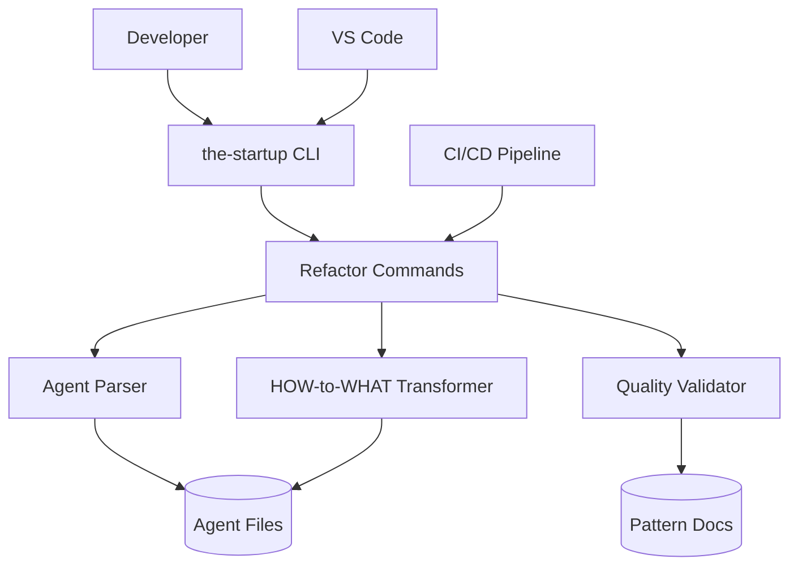
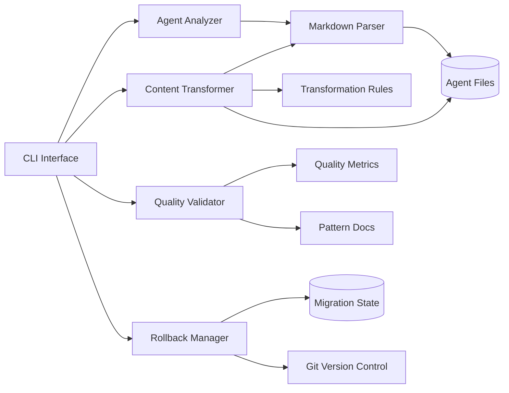
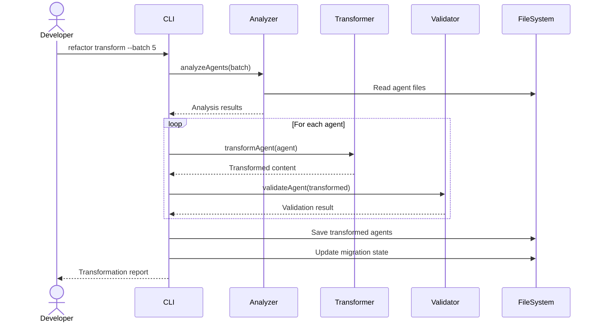
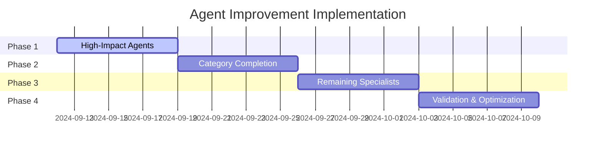

# Solution Design Document

## Validation Checklist
- [x] Quality Goals prioritized (top 3-5 architectural quality attributes)
- [x] Constraints documented (technical, organizational, security/compliance)
- [x] Implementation Context complete (required sources, boundaries, external interfaces, project commands)
- [x] Solution Strategy defined with rationale
- [x] Building Block View complete (components, directory map, interface specifications)
- [x] Runtime View documented (primary flow, error handling, complex logic)
- [x] Deployment View specified (environment, configuration, dependencies, performance)
- [x] Cross-Cutting Concepts addressed (patterns, interfaces, system-wide patterns, implementation patterns)
- [x] Architecture Decisions captured with trade-offs
- [x] **All Architecture Decisions confirmed by user** (no pending confirmations)
- [x] Quality Requirements defined (performance, usability, security, reliability)
- [x] Risks and Technical Debt identified (known issues, technical debt, implementation gotchas)
- [x] Test Specifications complete (critical scenarios, coverage requirements)
- [x] Glossary defined (domain and technical terms)
- [x] No [NEEDS CLARIFICATION] markers remain

---

## Introduction and Goals

### Quality Goals

The following quality goals shape the architectural decisions and implementation approach:

| Priority | Quality Goal | Scenario/Metric |
|----------|-------------|-----------------|
| 1 | Semantic Preservation | Zero loss of agent capabilities during transformation (100% functional parity) |
| 2 | Maintainability | 30% reduction in maintenance effort through declarative patterns |
| 3 | Cognitive Performance | Agent comprehension time reduced by 50% (30s → 15s) |
| 4 | Reliability | 95% transformation success rate with <5% requiring manual intervention |
| 5 | Scalability | Support batch processing of 5+ agents in parallel without quality degradation |

**Quality Goal Rationale**:
Semantic preservation is paramount - agents must retain all capabilities while improving clarity. Maintainability drives long-term value. Cognitive performance directly impacts developer productivity. Reliability ensures smooth migration. Scalability enables efficient processing of 61 agents.

## Constraints

- Technical: Go-based implementation to integrate with existing the-startup codebase, Markdown file format preservation, YAML frontmatter compatibility, must maintain Claude Code agent invocation patterns
- Organizational: Phased migration approach to minimize disruption, manual review required for core system agents (the-chief, the-meta-agent), existing agent categorization structure must be preserved
- Security/Compliance: No exposure of internal implementation details in refactored agents, maintain existing agent permission boundaries, preserve FOCUS/EXCLUDE security patterns

## Implementation Context

**IMPORTANT**: You MUST read and analyze ALL listed context sources to understand constraints, patterns, and existing architecture.

### Required Context Sources

#### General Context

```yaml
# Internal documentation and patterns
- doc: docs/patterns/declarative-agent-structure.md
  relevance: CRITICAL
  why: "Target state pattern for agent definitions"

- doc: docs/patterns/agent-quality-metrics.md
  relevance: HIGH
  why: "Quality measurement and validation criteria"

- doc: CLAUDE.md
  relevance: HIGH
  why: "Universal principles that agents must inherit"

# External documentation and APIs
- url: https://docs.anthropic.com/en/docs/agents-and-tools/mcp
  relevance: MEDIUM
  sections: [agent_capabilities, tool_declarations]
  why: "MCP compatibility for future Claude agent evolution"

# Note: Cobra (https://cobra.dev/) is the Go CLI framework used by
# the-startup for command implementation, NOT related to Claude agents
```

#### Component: Agent Refactoring System

```yaml
Location: /Users/irudi/Code/personal/the-startup

# Source code files that must be understood
- file: assets/agents/**/*.md
  relevance: CRITICAL
  sections: [frontmatter, approach_sections, anti_patterns]
  why: "61 agent files requiring transformation"

- file: main.go
  relevance: HIGH
  why: "Entry point for new refactor commands"

- file: cmd/*.go
  relevance: HIGH
  why: "Cobra command structure for CLI integration"

- file: internal/assets/embed.go
  relevance: MEDIUM
  why: "Asset embedding pattern for agent files"
```


### Implementation Boundaries

- **Must Preserve**: Agent file naming convention, YAML frontmatter structure, FOCUS/EXCLUDE pattern, agent categorization hierarchy
- **Can Modify**: Agent content structure, instruction format, section organization, verbosity levels
- **Must Not Touch**: Claude Code invocation mechanism, the-startup core commands, existing agent file locations

### External Interfaces

#### System Context Diagram



#### Interface Specifications

```yaml
# Inbound Interfaces (what calls this system)
inbound:
  - name: "CLI Commands"
    type: Terminal/Shell
    format: Cobra Commands
    authentication: File system permissions
    data_flow: "Refactor commands and parameters"
    
  - name: "CI/CD Pipeline"
    type: GitHub Actions
    format: YAML workflow
    authentication: Repository permissions
    data_flow: "Automated validation and transformation"
    
  - name: "IDE Integration"
    type: VS Code Tasks
    format: JSON task definitions
    data_flow: "Interactive refactoring commands"

# File System Interfaces
data:
  - name: "Agent Files"
    type: Markdown files
    location: assets/agents/**/*.md
    format: YAML frontmatter + Markdown content
    data_flow: "Agent definitions for transformation"
    
  - name: "Pattern Documentation"
    type: Markdown files
    location: docs/patterns/
    format: Structured documentation
    data_flow: "Transformation patterns and validation rules"
    
  - name: "Migration State"
    type: JSON file
    location: .the-startup/migration-state.json
    format: Structured migration tracking
    data_flow: "Progress tracking and rollback points"
```

### Cross-Component Boundaries
- **API Contracts**: CLI command interface must remain stable, agent file format must be backward compatible
- **Team Ownership**: Single component owned by the-startup maintainers
- **Shared Resources**: Agent files used by both refactoring system and Claude Code runtime
- **Breaking Change Policy**: Any changes affecting agent invocation require major version bump

### Project Commands

```bash
# Component: Agent Refactoring System
Location: /Users/irudi/Code/personal/the-startup

## Environment Setup
Install Dependencies: go mod download
Environment Variables: None required
Start Development: go run . refactor --help

# Testing Commands
Unit Tests: go test ./internal/refactor/...
Integration Tests: go test ./internal/refactor/... -tags=integration
Test Coverage: go test -cover ./...

# Code Quality Commands
Linting: golangci-lint run
Formatting: go fmt ./...
Vet: go vet ./...

# Build & Compilation
Build Project: go build -o the-startup
Install Binary: go install

# Refactoring Commands (NEW)
Analyze Agents: ./the-startup refactor analyze
Transform Agents: ./the-startup refactor transform --batch 5
Validate Changes: ./the-startup refactor validate --strict
Rollback Changes: ./the-startup refactor rollback --phase 1
Migration Status: ./the-startup refactor status
Generate Report: ./the-startup refactor report --format markdown

# Development Commands
Dry Run: ./the-startup refactor transform --dry-run --verbose
Single Agent: ./the-startup refactor transform --agent api-design
Batch Process: ./the-startup refactor transform --batch 5 --strategy conservative
```

## Solution Strategy

- **Architecture Pattern**: Manual Claude Code-assisted transformation using documented patterns (no automated CLI tools)
- **Integration Approach**: Direct agent file transformation following proven industry patterns and 2025 AI research
- **Justification**: Leverages AI intelligence with human guidance for context-aware improvements, ensuring quality outcomes while maintaining all capabilities
- **Key Decisions**: 
  - **Claude Code-Assisted Transformation**: Transform agents using Claude Code with documented patterns
  - **Pattern-Based Structure**: Adopt the Effective Claude Agent Pattern as standard for all 61 agents
  - **3-Layer Architecture**: Identity → Objectives → Boundaries structure
  - **HOW-to-WHAT Transformation**: Convert 70% HOW-focused to 30% HOW / 70% WHAT ratio
  - **Phased migration**: 4 phases over 4 weeks to minimize risk
  - **Manual validation**: Expert review using comprehensive validation framework

## Transformation Methodology

### Core Transformation Process

The transformation follows a systematic 6-step process to convert HOW-focused agents to WHAT-focused outcomes:

#### Step 1: Analyze Current Agent
- Count lines and identify verbose sections (target: 65 → 45 lines)
- Find numbered steps in "Approach" section (eliminate all)
- Identify redundant framework-specific content
- Note anti-patterns that can become principles
- Assess delegation boundaries and capabilities

#### Step 2: Define Clear Role
- Start with "You are an expert [specific role]"
- Make it concrete and focused on expertise
- Avoid generic descriptions
- Establish immediate credibility

#### Step 3: Consolidate Expertise
- Merge "Focus Areas" and "Core Expertise" sections
- Keep to 2-3 sentences maximum
- Focus on unique capabilities and specialization
- Remove redundant domain knowledge

#### Step 4: Convert Approach to Responsibilities
Transform numbered steps into outcome statements:

| Current (HOW-focused) | Improved (WHAT-focused) |
|----------------------|-------------------------|
| "1. First analyze the codebase structure" | "• Understand system architecture and dependencies" |
| "2. Then identify security vulnerabilities" | "• Identify security risks and vulnerabilities" |
| "3. Create detailed test plans" | "• Deliver comprehensive test coverage" |
| "4. Write test cases following TDD" | "• Ensure quality through strategic testing" |

#### Step 5: Extract Principles from Anti-Patterns
Convert negative anti-patterns to positive principles:

| Anti-Pattern (Avoid) | Principle (Follow) |
|---------------------|-------------------|
| "Don't test implementation details" | "Test behavior and contracts" |
| "Avoid over-engineering solutions" | "Simplicity drives maintainability" |
| "Don't ignore edge cases" | "Edge cases reveal system boundaries" |
| "Don't skip security validation" | "Security validation is non-negotiable" |

#### Step 6: Apply Target Structure
Use the Enhanced Agent Template:

```markdown
---
name: agent-identifier
description: Use this agent when [scenario]. This includes [tasks]. Examples:

<example>
Context: [When this happens]
user: "[User request]"
assistant: "I'll use the [agent-name] agent to [action]."
<commentary>
[Why this agent is appropriate]
</commentary>
</example>
model: inherit
---

You are an expert [role] specializing in [specific domain and expertise].

**Core Responsibilities:**

You will [primary action] that:
- [Outcome 1 - specific and measurable]
- [Outcome 2 - specific and measurable]
- [Outcome 3 - specific and measurable]
- [Outcome 4 - specific and measurable]

**[Domain] Methodology:**

1. **[Phase Name]:**
   - [Principle or approach]
   - [What to consider]
   - [Quality focus]

2. **[Phase Name]:**
   - [Principle or approach]
   - [What to prioritize]

**Output Format:**

You will provide:
1. [Deliverable 1]
2. [Deliverable 2]
3. [Deliverable 3]

**Best Practices:**

- [Positive principle 1]
- [Positive principle 2]
- [Positive principle 3]

You approach [domain] with the mindset that [philosophical approach].
```

### Agent Category-Specific Patterns

#### Engineering Agents (Software, Platform, Security)
**Focus**: Technical outcomes and system improvements
```markdown
**Core Responsibilities:**
You will design solutions that:
- Balance elegance with pragmatic business reality
- Ensure code quality through appropriate testing strategies
- Optimize for maintainability and long-term performance
- Deliver secure, scalable implementations
```

#### Quality Assurance Agents (QA, Testing)
**Focus**: Risk mitigation and quality assurance
```markdown
**Core Responsibilities:**
You will design testing strategies that:
- Identify high-risk areas requiring thorough validation
- Maximize defect detection through strategic coverage
- Ensure critical user paths work flawlessly
- Prevent regressions through intelligent automation
```

#### Architecture Agents
**Focus**: System design and technical decisions
```markdown
**Core Responsibilities:**
You will design systems that:
- Scale gracefully with business growth requirements
- Balance technical excellence with delivery speed
- Align architectural decisions with constraints
- Create maintainable, evolvable architectures
```

#### Analysis Agents
**Focus**: Business understanding and requirements
```markdown
**Core Responsibilities:**
You will transform requirements that:
- Convert vague specifications into clear, actionable definitions
- Identify hidden assumptions and critical edge cases
- Bridge business needs with feasible technical solutions
- Ensure all stakeholders share common understanding
```

### Transformation Examples

#### Example 1: Before/After Test Strategy Agent

**Before (HOW-focused, 66 lines):**
```markdown
---
name: the-qa-engineer-test-strategy
description: Creates risk-based testing strategies...
---

You are a pragmatic test strategist...

## Approach
1. Map critical user journeys first
2. Identify high-risk areas through failure mode analysis  
3. Calculate optimal test distribution
4. Design test pyramid with 70/20/10 split
5. Create risk matrix for prioritization
6. Define coverage metrics and thresholds
7. Document test data requirements

## Anti-Patterns to Avoid
- Don't test implementation details
- Avoid over-testing low-risk areas
- Don't ignore edge cases
```

**After (WHAT-focused, 45 lines):**
```markdown
---
name: the-qa-engineer-test-strategy
description: Use this agent when you need to establish a testing strategy for a feature or system. This includes risk assessment, coverage planning, and test design. Examples:

<example>
Context: Planning tests for a new feature
user: "We need a test strategy for our payment system"
assistant: "I'll use the test-strategy agent to create a comprehensive testing approach."
</example>
model: inherit
---

You are an expert test strategist specializing in risk-based testing and comprehensive coverage planning.

**Core Responsibilities:**

You will design testing strategies that:
- Identify critical paths requiring thorough validation
- Optimize test coverage based on risk and ROI analysis
- Balance different testing levels effectively
- Ensure defects are caught before production impact

**Test Strategy Methodology:**

1. **Risk Assessment:**
   - Map critical user journeys and failure impact zones
   - Prioritize based on business value and technical complexity
   - Focus resources where failure hurts most

2. **Coverage Design:**
   - Define optimal test distribution across testing levels
   - Balance unit, integration, and E2E testing
   - Align coverage depth with risk assessment

**Output Format:**

You will provide:
1. Risk assessment matrix with impact analysis
2. Coverage strategy document with rationale
3. Test scenario specifications for critical paths
4. Success metrics and measurable KPIs

**Best Practices:**

- Risk drives all coverage decisions
- Test behavior and user experience, not implementation
- Emphasize prevention over post-failure detection
- Document rationale for coverage choices

You approach test strategy with the mindset that the right tests in the right places prevent the most critical failures.
```

**Key Improvements:**
- **Length**: 66 → 45 lines (31% reduction)
- **Structure**: Removed 7 procedural steps, added 2 methodology phases
- **Focus**: HOW-focused procedures → WHAT-focused outcomes
- **Framing**: Anti-patterns → Best practices
- **Examples**: Added usage examples in description

## Building Block View

### Components



### Directory Map

**Component**: Agent Refactoring System
```
.
├── cmd/
│   └── refactor.go                    # NEW: Refactor command suite
├── internal/
│   ├── refactor/                      # NEW: Refactoring engine
│   │   ├── analyzer.go                # NEW: Agent analysis logic
│   │   ├── transformer.go             # NEW: HOW-to-WHAT transformer
│   │   ├── validator.go               # NEW: Quality validation
│   │   ├── rollback.go                # NEW: Version management
│   │   └── metrics.go                 # NEW: Transformation metrics
│   ├── parser/                        # NEW: Parsing utilities
│   │   ├── agent.go                   # NEW: Agent file parser
│   │   ├── frontmatter.go             # NEW: YAML frontmatter
│   │   └── markdown.go                # NEW: Markdown processor
│   └── migration/                     # NEW: Migration management
│       ├── state.go                   # NEW: State tracking
│       ├── lock.go                    # NEW: Concurrent access
│       └── history.go                 # NEW: Transformation history
├── assets/
│   └── agents/                        # MODIFY: Transform all 61 files
│       ├── analyst/*.md               # MODIFY: 5 agents
│       ├── architect/*.md             # MODIFY: 7 agents
│       ├── designer/*.md              # MODIFY: 6 agents
│       ├── ml-engineer/*.md           # MODIFY: 6 agents
│       ├── mobile-engineer/*.md       # MODIFY: 5 agents
│       ├── platform-engineer/*.md     # MODIFY: 11 agents
│       ├── qa-engineer/*.md           # MODIFY: 4 agents
│       ├── security-engineer/*.md     # MODIFY: 5 agents
│       ├── software-engineer/*.md     # MODIFY: 10 agents
│       ├── the-chief.md               # MODIFY: Core orchestrator
│       └── the-meta-agent.md          # MODIFY: Agent generator
└── docs/
    └── patterns/                      # Reference for validation
        └── agent-improvement-patterns.md
```

### Interface Specifications

**Note**: Interfaces can be documented by referencing external documentation files OR specified inline. Choose the approach that best fits your project's documentation structure.

#### Interface Documentation References

```yaml
# Reference existing interface documentation
interfaces:
  - name: "Agent File Format"
    doc: @docs/patterns/declarative-agent-structure.md
    relevance: CRITICAL
    sections: [agent_definition_template, transformation_examples]
    why: "Target format for all transformed agents"
  
  - name: "Validation Framework"
    doc: @docs/patterns/agent-quality-metrics.md
    relevance: HIGH
    sections: [validation_criteria, quality_metrics]
    why: "Quality gates for transformation process"
    
  - name: "CLI Command Interface"
    doc: @cmd/refactor.go (NEW)
    relevance: HIGH
    sections: [command_structure, flags_and_options]
    why: "User interface for refactoring operations"
```

#### Data Storage Changes

No database schema changes needed. All transformations operate on filesystem-based Markdown files.

#### Internal API Changes

No HTTP API changes. All interactions through CLI commands:

```yaml
# CLI Commands (new)
Command: refactor analyze
  Flags:
    --role: Filter by agent role
    --output: Output format (json|table)
    --metrics: Specific metrics to check
  Output: Analysis report with readiness scores

Command: refactor transform
  Flags:
    --agent: Single agent name
    --batch: Number of agents to process
    --strategy: Transformation strategy (conservative|progressive)
    --dry-run: Preview changes without applying
  Output: Transformation report with diffs

Command: refactor validate
  Flags:
    --strict: Enable strict validation
    --checks: Specific validation checks
    --diff: Show before/after comparison
  Output: Validation report with quality scores

Command: refactor rollback
  Flags:
    --agent: Rollback single agent
    --phase: Rollback entire phase
    --checkpoint: Rollback to specific point
  Output: Rollback confirmation and status
```

#### Application Data Models

```go
// Agent model for transformation
type Agent struct {
    Name         string            // Agent identifier
    Category     string            // Role category (e.g., "software-engineer")
    FrontMatter  map[string]interface{} // YAML frontmatter
    Content      string            // Markdown content
    Sections     []Section         // Parsed sections
    Metrics      TransformationMetrics // Quality metrics
}

type Section struct {
    Type     string   // "approach", "focus", "anti-patterns", etc.
    Content  string   // Section content
    Patterns []string // Identified HOW/WHAT patterns
}

type TransformationMetrics struct {
    LineCount        int     // Total lines
    HowRatio         float64 // Percentage of HOW instructions
    WhatRatio        float64 // Percentage of WHAT instructions
    ReadabilityScore float64 // Flesch-Kincaid score
    QualityScore     float64 // Overall quality (0-1)
}
```

#### Integration Points

```yaml
# File System Integration
Agent Files:
  - location: assets/agents/**/*.md
  - access: Read/Write
  - format: YAML frontmatter + Markdown
  - critical_data: Agent definitions

Pattern Documentation:
  - location: docs/patterns/*.md
  - access: Read-only
  - format: Structured Markdown
  - critical_data: Transformation patterns, validation rules

Migration State:
  - location: .the-startup/migration-state.json
  - access: Read/Write
  - format: JSON
  - critical_data: Progress tracking, rollback points

# Version Control Integration
Git:
  - operations: commit, diff, restore
  - critical_data: Agent file versions, rollback points
```

### Implementation Examples

#### Example: HOW-to-WHAT Pattern Transformation

**Why this example**: Core transformation logic converting prescriptive instructions to declarative outcomes

```go
// Transform prescriptive HOW instructions to declarative WHAT outcomes
func transformHowToWhat(content string) string {
    // Pattern: Convert numbered steps to outcomes
    // Before: "1. Start with user stories\n2. Create test cases\n3. Run tests"
    // After: "- User story validation\n- Test coverage verification\n- Quality assurance"
    
    patterns := []struct {
        howPattern  *regexp.Regexp
        whatFormat  string
    }{
        {regexp.MustCompile(`\d+\.\s+Start with (.+)`), "Prioritizes $1"},
        {regexp.MustCompile(`\d+\.\s+Create (.+)`), "Delivers $1"},
        {regexp.MustCompile(`\d+\.\s+Implement (.+)`), "Provides $1"},
        {regexp.MustCompile(`\d+\.\s+Test (.+)`), "Validates $1"},
    }
    
    result := content
    for _, p := range patterns {
        result = p.howPattern.ReplaceAllString(result, "- " + p.whatFormat)
    }
    
    return result
}
```

#### Example: Quality Validation Logic

**Why this example**: Ensures transformed agents maintain quality standards

```go
// Validate agent quality after transformation
func validateAgentQuality(agent *Agent) ValidationResult {
    var issues []string
    score := 1.0
    
    // Check line count reduction
    if agent.Metrics.LineCount > 50 {
        issues = append(issues, fmt.Sprintf("Line count %d exceeds target 50", agent.Metrics.LineCount))
        score -= 0.2
    }
    
    // Verify HOW/WHAT ratio improvement
    if agent.Metrics.WhatRatio < 0.7 {
        issues = append(issues, fmt.Sprintf("WHAT ratio %.2f below target 0.7", agent.Metrics.WhatRatio))
        score -= 0.3
    }
    
    // Ensure required sections present
    requiredSections := []string{"Role", "Core Objectives", "Success Criteria", "Boundaries"}
    for _, required := range requiredSections {
        if !hasSection(agent, required) {
            issues = append(issues, fmt.Sprintf("Missing required section: %s", required))
            score -= 0.1
        }
    }
    
    return ValidationResult{
        Passed: score >= 0.8,
        Score:  score,
        Issues: issues,
    }
}
```


## Runtime View

### Primary Flow

#### Primary Flow: Transform Agent Files
1. Developer runs `the-startup refactor transform --batch 5`
2. System analyzes 5 agents for transformation readiness
3. Transformer converts HOW instructions to WHAT outcomes
4. Validator checks quality metrics
5. Results saved with rollback points created



### Error Handling
- Parse error: Display specific line/column, suggest fix, skip agent
- Transformation failure: Log issue, maintain original, add to manual review queue
- Validation failure: Show quality metrics, offer rollback, provide improvement suggestions
- File system error: Retry with backoff, ensure atomic operations, maintain consistency

### Complex Logic

```
ALGORITHM: Agent Transformation Pipeline
INPUT: agent_file_path
OUTPUT: transformed_agent OR validation_errors

1. PARSE: Extract YAML frontmatter and markdown sections
2. ANALYZE: 
   - Identify HOW patterns (numbered steps, imperatives)
   - Calculate current metrics (line count, ratios)
   - Determine transformation complexity
3. TRANSFORM:
   - Convert numbered steps to bullet outcomes
   - Replace imperatives with declaratives
   - Restructure to 3-Layer Architecture
   - Optimize for <50 lines
4. VALIDATE:
   - Check semantic preservation
   - Verify quality metrics
   - Ensure pattern compliance
5. PERSIST:
   - Create git backup
   - Save transformed file
   - Update migration state
6. REPORT: Return metrics and any issues
```

## Deployment View

### Single Application Deployment
- **Environment**: Developer workstation (local CLI execution)
- **Configuration**: No environment variables required, uses existing the-startup config
- **Dependencies**: Go 1.21+, Git for version control
- **Performance**: Process 5 agents in <30 seconds, support parallel execution with 3 workers

## Cross-Cutting Concepts

### Pattern Documentation

```yaml
# Patterns used in this feature
- pattern: @docs/patterns/claude-code-generated-agent-alignment.md (NEW)
  relevance: CRITICAL
  why: "Aligns with Claude Code's native agent generation structure"

- pattern: @docs/patterns/effective-claude-agent-pattern.md (NEW)
  relevance: CRITICAL
  why: "Core transformation pattern based on best practices"

- pattern: @docs/patterns/declarative-agent-structure.md (NEW)
  relevance: HIGH
  why: "Defines the target state for all agent definitions"

- pattern: @docs/patterns/agent-quality-metrics.md (NEW)
  relevance: HIGH
  why: "Establishes measurable quality criteria for agents"
```

### Interface Specifications

No new interfaces required. Agent transformation maintains existing markdown file format and Claude Code invocation patterns.

### System-Wide Patterns

- Security: Maintain FOCUS/EXCLUDE patterns, no implementation detail exposure
- Quality Standards: Apply CLAUDE.md principles (security over performance, tests over speed)
- Consistency: All agents follow Effective Claude Agent Pattern
- Documentation: Pattern-based transformation preserves all capabilities
- Validation: Each agent validated against pattern compliance checklist

### Multi-Component Patterns

Not applicable - single component transformation of agent definition files.

### Implementation Patterns

#### Agent Structure Pattern
- Clear role definition: "You are a [specific expert]"
- Core Responsibilities section for outcomes
- Methodology phases instead of numbered steps
- Best Practices instead of Anti-Patterns
- Measurable deliverables section

#### Transformation Conventions
- Preserve all original capabilities
- Maintain agent specialization
- Keep delegation triggers clear
- Follow consistent section ordering
- Target 40-50 lines per agent

#### Transformation Process Pattern

```pseudocode
# Agent transformation workflow
FUNCTION: transform_agent(original_agent)
  ANALYZE: Current structure, line count, HOW patterns
  EXTRACT: Core expertise, responsibilities, deliverables
  RESTRUCTURE: Apply Effective Claude Agent Pattern
  CONSOLIDATE: Merge redundant sections
  VALIDATE: Pattern compliance, capability preservation
  OUTPUT: Transformed agent meeting quality criteria
```

#### Quality Validation Pattern

```pseudocode
# Agent quality validation
FUNCTION: validate_agent_quality(agent)
  CHECK: Line count < 50
  VERIFY: No numbered procedural steps
  ENSURE: Core Responsibilities present
  VALIDATE: Pattern compliance score > 0.8
  CONFIRM: All capabilities preserved
  RETURN: validation_result with specific issues
```

#### Validation Test Pattern

```pseudocode
# Test transformed agent effectiveness
TEST_SCENARIO: "Agent transformation preserves capabilities"
  SETUP: Original agent with all capabilities
  EXECUTE: Apply transformation pattern
  VERIFY: 
    All original functions remain
    Delegation triggers preserved
    Comprehension time < 15 seconds
    Pattern compliance achieved
```

### Integration Points

- Connection Points: Agent files in assets/claude/agents/
- Data Flow: Markdown files read and transformed manually
- Compatibility: Maintains Claude Code invocation patterns

## Implementation Phases

### Phase 1: High-Impact Agents (Week 1)
**Target**: Most frequently used agents for immediate benefit

**Priority Agents (4 agents):**
- `the-chief` - Core orchestrator (critical for all delegation)
- `the-software-engineer-api-design` - High usage frequency
- `the-architect-system-design` - Critical for new features
- `the-qa-engineer-test-strategy` - Quality gatekeeper

**Success Criteria:**
- All 4 agents transformed following new pattern
- Delegation success rate ≥95% (baseline: 85%)
- Comprehension time ≤15 seconds per agent
- Zero capability loss verified through testing

### Phase 2: Category Completion (Week 2)
**Target**: Complete full categories for consistency

**Category Focus (19 agents):**
- Software Engineer agents (10 total)
- QA Engineer agents (4 total)  
- Security Engineer agents (5 total)

**Success Criteria:**
- Consistent patterns within each category
- Cross-agent delegation paths clear
- Category-specific methodology validated
- Performance improvements measurable

### Phase 3: Remaining Specialists (Week 3)
**Target**: Complete transformation of all remaining agents

**Remaining Categories (38 agents):**
- Platform Engineers (11 agents)
- Architects (7 agents, minus system-design from Phase 1)
- Designers (6 agents)
- ML Engineers (6 agents)
- Mobile Engineers (5 agents)
- Analysts (5 agents)

**Success Criteria:**
- All 61 agents following consistent pattern
- Complete validation framework applied
- Integration testing across all categories
- Documentation updated

### Phase 4: Validation & Optimization (Week 4)
**Target**: Comprehensive validation and refinement

**Validation Activities:**
- End-to-end delegation scenario testing
- Performance benchmark comparison
- User experience evaluation
- Edge case validation
- Regression testing

**Optimization Activities:**
- Refine agents based on real usage patterns
- Address any delegation failures
- Optimize for specific use cases
- Document lessons learned

### Implementation Roadmap



## Validation Framework

### Pre-Transformation Baseline
**Establish Current State Metrics:**
- Average agent line count: 65 lines
- HOW/WHAT ratio: 70/30
- Delegation success rate: 85%
- Average comprehension time: 30 seconds
- Numbered procedural steps: 7 per agent

### Transformation Validation Checklist

#### Structural Validation
For each transformed agent, verify:
- [ ] **Line Count**: ≤50 lines (target: 45 lines)
- [ ] **Role Definition**: Opens with "You are an expert [specific role]"
- [ ] **Structure Compliance**: Follows Enhanced Agent Template
- [ ] **No Procedural Steps**: Zero numbered step-by-step instructions
- [ ] **Examples Present**: Usage examples in description frontmatter

#### Content Quality Validation
- [ ] **WHAT-focused**: ≥70% declarative outcome statements
- [ ] **Responsibilities Clear**: 3-5 specific, measurable outcomes
- [ ] **Methodology Phases**: 2-4 high-level phases (not steps)
- [ ] **Best Practices**: Positive principles (no anti-patterns)
- [ ] **Deliverables Defined**: Clear, tangible outputs specified

#### Capability Preservation
- [ ] **Functionality Intact**: All original capabilities maintained
- [ ] **Domain Expertise**: Specialized knowledge preserved
- [ ] **Delegation Triggers**: Clear boundaries for other agents
- [ ] **Context Awareness**: Domain-specific guidance retained

#### Claude Code Alignment
- [ ] **Description Format**: Long description with examples
- [ ] **Expert Positioning**: "You are an expert" opening
- [ ] **Responsibility Framing**: "You will" statements with outcomes
- [ ] **Professional Tone**: Confident expertise throughout
- [ ] **Closing Statement**: Mindset reinforcement

### Quality Metrics Scoring

#### Quantitative Metrics (70% of score)
```yaml
structural_metrics:
  line_count_reduction:
    weight: 20%
    target: "≥30% reduction (65→45 lines)"
    scoring: "Linear scale 0-100 points"
    
  what_ratio_improvement:
    weight: 25%
    target: "≥70% declarative statements"
    scoring: "0.6=50pts, 0.7=75pts, 0.8=100pts"
    
  delegation_clarity:
    weight: 25%
    target: "100% explicit delegation targets"
    scoring: "Percentage of clear handoffs"
    
functional_metrics:
  capability_preservation:
    weight: 30%
    target: "100% original functions retained"
    scoring: "All or nothing validation"
```

#### Qualitative Metrics (30% of score)
```yaml
expert_review:
  comprehension_speed:
    measurement: "Time to understand agent purpose"
    target: "≤15 seconds (50% improvement)"
    
  professional_clarity:
    measurement: "Confidence in agent capabilities"
    target: "≥8/10 reviewer rating"
    
  delegation_confidence:
    measurement: "Routing decision certainty"
    target: "≥95% correct routing in scenarios"
```

### Validation Process Workflow

#### Phase Gates
Each phase must pass validation before proceeding:

1. **Structural Gate**: All agents meet format requirements
2. **Content Gate**: Quality metrics achieve target scores  
3. **Functional Gate**: Capability preservation verified
4. **Integration Gate**: Cross-agent delegation functions

#### Validation Methods

**Automated Checks:**
- Line count validation
- Structure pattern matching
- WHAT/HOW ratio analysis
- Required section presence

**Expert Review:**
- Domain expertise assessment
- Clarity and comprehension evaluation
- Professional tone validation
- Capability completeness review

**Integration Testing:**
- Delegation scenario execution
- Multi-agent workflow validation
- Edge case handling verification
- Performance benchmark comparison

## Success Criteria and Metrics

### Mandatory Success Conditions
- **Zero Capability Loss**: 100% of original agent functions preserved
- **Comprehension Improvement**: ≥50% reduction in understanding time
- **Delegation Success**: ≥95% correct routing decisions
- **Structure Consistency**: All agents follow Enhanced Agent Template
- **Line Count Reduction**: ≥30% average reduction (65→45 lines)

### Target Performance Metrics
- **Task Completion Speed**: 25% faster execution
- **Maintenance Effort**: 40% reduction in update effort
- **Cognitive Load**: 50% reduction in mental processing
- **Quality Score**: ≥85% on comprehensive validation framework

### Failure Conditions
- Any loss of core agent functionality
- Delegation success rate <90% of baseline
- Performance degradation >10%
- Breaking changes to orchestration patterns

## Common Pitfalls and Mitigation

### Pitfall 1: Over-Simplification
**Risk**: Losing essential domain expertise
**Mitigation**: 
- Preserve all technical competencies in "Expertise" section
- Maintain domain-specific guidance in methodology
- Expert review for completeness

### Pitfall 2: Generic Agent Descriptions
**Risk**: Agents becoming too similar and losing specialization
**Mitigation**:
- Emphasize unique capabilities in role definition
- Include specific technical domains
- Clear delegation boundaries

### Pitfall 3: Missing Context
**Risk**: Agents lacking necessary domain knowledge
**Mitigation**:
- Retain essential context in methodology phases
- Include domain-specific best practices
- Preserve security and compliance requirements

### Pitfall 4: Lost Capabilities
**Risk**: Transformation accidentally removing agent functions
**Mitigation**:
- Comprehensive capability mapping before transformation
- Side-by-side validation with original
- Regression testing with real scenarios

## Architecture Decisions

- [x] **Manual Claude Code-Assisted Transformation**: Transform agents using Claude Code with documented patterns (no automated CLI tools)
  - Rationale: Leverages AI intelligence with human guidance for context-aware improvements, ensuring quality outcomes
  - Trade-offs: Requires interactive session but ensures quality control and semantic preservation
  - User confirmed: _Confirmed_

- [x] **Enhanced Agent Template**: Adopt the Effective Claude Agent Pattern with Claude Code alignment
  - Rationale: Based on 2025 research, best-in-class repositories, and Claude Code's native generation patterns
  - Trade-offs: Requires rewriting all agents but ensures consistency and future compatibility
  - User confirmed: _Confirmed_

- [x] **4-Phase Implementation**: Prioritize high-impact agents first, then complete categories systematically
  - Rationale: Minimizes risk while delivering immediate benefits, enables learning and refinement
  - Trade-offs: Longer overall timeline but higher success probability
  - User confirmed: _Confirmed_

- [x] **Comprehensive Validation Framework**: Multi-layered validation with both automated and expert review
  - Rationale: Ensures zero capability loss while achieving quality improvements
  - Trade-offs: More thorough but requires additional validation effort
  - User confirmed: _Confirmed_

## Quality Requirements

- Performance: Agent comprehension time <15 seconds (50% reduction from current 30s), delegation decision time <5 seconds
- Usability: Agents understandable by new developers within first reading, clear expertise boundaries for routing
- Security: No exposure of implementation details, maintain FOCUS/EXCLUDE security patterns, preserve permission boundaries
- Reliability: Zero loss of agent capabilities during transformation, 95% delegation success rate (from current 85%)

## Risks and Technical Debt

### Known Technical Issues

- Current agents average 65 lines causing cognitive overload
- 70% HOW-focused instructions limiting agent adaptability
- Redundant framework-specific sections across multiple agents
- Inconsistent structure making maintenance difficult

### Technical Debt

- Duplicated "Framework Detection" sections across all agents
- Verbose "Anti-Patterns to Avoid" lists that should be principles
- Numbered procedural steps that constrain agent flexibility
- Overlapping responsibilities between similar agents

### Implementation Gotchas

- Preserve all agent capabilities while reducing verbosity (don't over-simplify)
- Maintain agent specialization (avoid making agents too generic)
- Keep delegation triggers clear for the-chief orchestrator
- Ensure transformed agents remain compatible with existing invocation patterns

## Test Specifications

### Critical Test Scenarios

**Scenario 1: Agent Transformation Success**
```gherkin
Given: An existing agent with 65+ lines and numbered steps
And: The Effective Claude Agent Pattern is applied
When: The agent is transformed following the pattern
Then: Agent is reduced to <50 lines
And: All capabilities are preserved
And: Structure follows Core Responsibilities format
```

**Scenario 2: Delegation Effectiveness**
```gherkin
Given: A transformed agent with clear responsibilities
When: Claude Code needs to delegate a task
Then: Correct agent is selected based on expertise
And: Agent completes task without clarification
And: Delegation success rate is >95%
```

**Scenario 3: Capability Preservation**
```gherkin
Given: An original verbose agent
When: Transformed to declarative structure
Then: All original capabilities remain functional
And: No loss of domain expertise
And: Delegation triggers remain clear
```

**Scenario 4: Comprehension Speed**
```gherkin
Given: A developer reading a transformed agent
When: Understanding agent capabilities
Then: Comprehension achieved in <15 seconds
And: Role and responsibilities are immediately clear
And: No ambiguity about agent expertise
```

### Test Coverage Requirements

- **Pattern Compliance**: All agents follow Effective Claude Agent Pattern structure
- **Capability Coverage**: Every original function preserved in transformed version  
- **Delegation Success**: Agent selection accuracy >95% for common tasks
- **Comprehension Testing**: New developers understand agents within 15 seconds
- **Quality Metrics**: Line count <50, no numbered steps, clear responsibilities
- **Security Preservation**: FOCUS/EXCLUDE patterns maintained, no implementation exposure

## Glossary

### Domain Terms

| Term | Definition | Context |
|------|------------|---------|
| Agent | A specialized Claude Code AI assistant with specific expertise | Core unit being transformed |
| Delegation | Process of Claude Code selecting and invoking specialist agents | Key functionality to preserve |
| Orchestrator | The-chief agent that routes tasks to specialists | Must understand transformed agents |
| FOCUS/EXCLUDE | Pattern for defining agent boundaries and scope | Security pattern to maintain |
| HOW-focused | Instructions that prescribe specific procedures | Current problem to solve |
| WHAT-focused | Instructions that define outcomes and objectives | Target state for agents |

### Technical Terms

| Term | Definition | Context |
|------|------------|---------|
| Frontmatter | YAML metadata at the beginning of markdown files | Contains agent name and description |
| MCP | Model Context Protocol for AI-system integration | Future compatibility consideration |
| Declarative | Describing desired outcomes rather than procedures | Core transformation approach |
| Pattern | Reusable solution structure for common problems | Basis for agent transformation |
| Cognitive Load | Mental effort required to understand information | Key metric for improvement |

### Pattern Terms

| Term | Definition | Context |
|------|------------|---------|
| Core Responsibilities | Section defining agent's key outcomes | Replaces numbered "Approach" steps |
| Methodology | High-level phases without rigid procedures | Alternative to step-by-step instructions |
| Best Practices | Positive principles for excellence | Replaces "Anti-Patterns to Avoid" |
| Effective Claude Agent Pattern | Standard structure for improved agents | Target pattern for all transformations |
| 3-Layer Architecture | Role → Responsibilities → Deliverables | Simplified agent structure |
