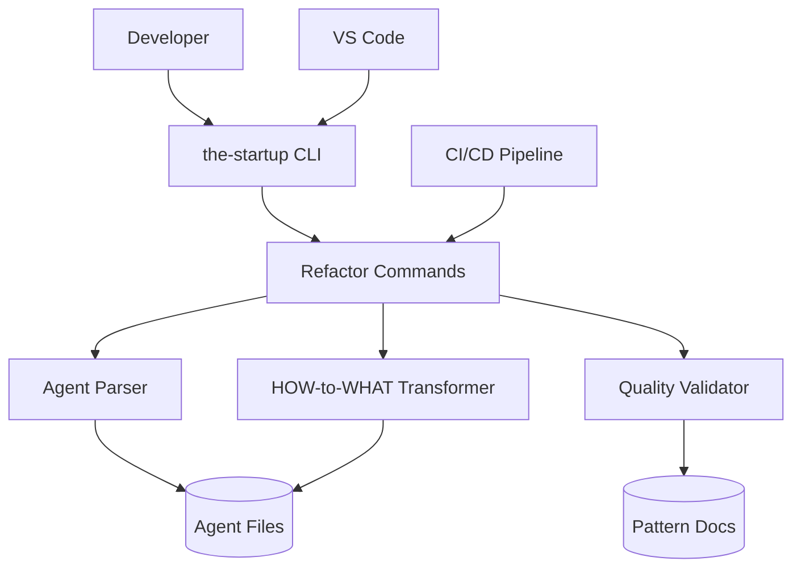
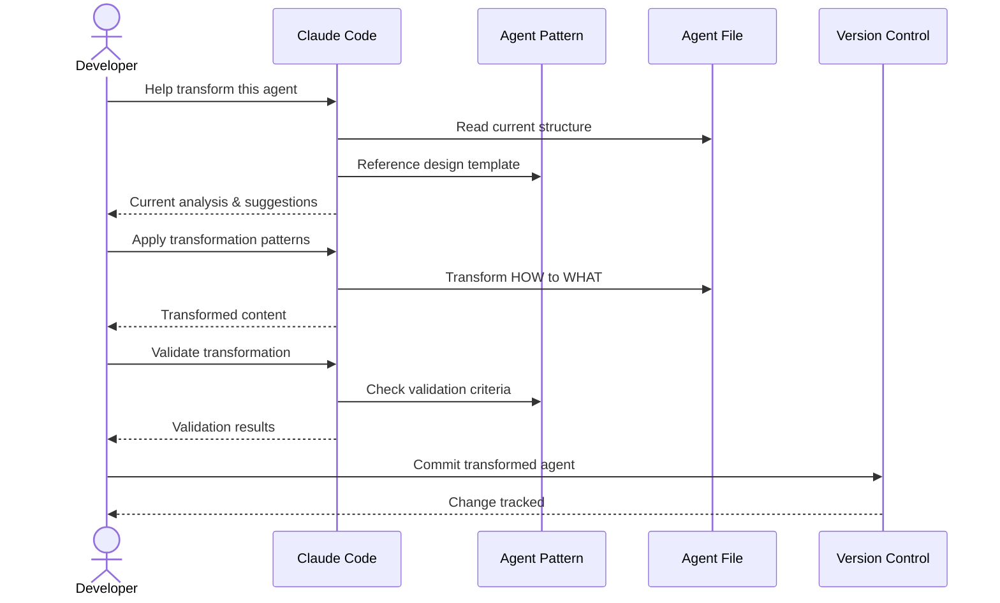

# Solution Design Document

## Validation Checklist
- [x] Quality Goals prioritized (top 3-5 architectural quality attributes)
- [x] Constraints documented (technical, organizational, security/compliance)
- [x] Implementation Context complete (required sources, boundaries, external interfaces, project commands)
- [x] Solution Strategy defined with rationale
- [x] Building Block View complete (components, directory map, interface specifications)
- [x] Runtime View documented (primary flow, error handling, complex logic)
- [x] Deployment View specified (environment, configuration, dependencies, performance)
- [x] Cross-Cutting Concepts addressed (patterns, interfaces, system-wide patterns, implementation patterns)
- [x] Architecture Decisions captured with trade-offs
- [x] **All Architecture Decisions confirmed by user** (no pending confirmations)
- [x] Quality Requirements defined (performance, usability, security, reliability)
- [x] Risks and Technical Debt identified (known issues, technical debt, implementation gotchas)
- [x] Test Specifications complete (critical scenarios, coverage requirements)
- [x] Glossary defined (domain and technical terms)
- [x] No [NEEDS CLARIFICATION] markers remain

---

## Introduction and Goals

### Quality Goals

The following quality goals shape the architectural decisions and implementation approach:

| Priority | Quality Goal | Scenario/Metric |
|----------|-------------|-----------------|
| 1 | Semantic Preservation | Zero loss of agent capabilities during transformation (100% functional parity) |
| 2 | Maintainability | Declarative patterns reduce update complexity |
| 3 | Pattern Consistency | All agents follow uniform structure for predictable behavior |
| 4 | Delegation Clarity | 95% accurate agent selection based on clearer boundaries |
| 5 | Scalability | Support batch processing of 5+ agents in parallel without quality degradation |

**Quality Goal Rationale**:
Semantic preservation is paramount - agents must retain all capabilities. Maintainability simplifies future updates. Pattern consistency enables predictable agent behavior. Delegation clarity ensures Claude Code selects the right specialist. Scalability enables efficient processing of 61 agents.

## Constraints

- Technical: Go-based implementation to integrate with existing the-startup codebase, Markdown file format preservation, YAML frontmatter compatibility, must maintain Claude Code agent invocation patterns
- Organizational: Phased migration approach to minimize disruption, manual review required for core system agents (the-chief, the-meta-agent), existing agent categorization structure must be preserved
- Security/Compliance: No exposure of internal implementation details in refactored agents, maintain existing agent permission boundaries, preserve FOCUS/EXCLUDE security patterns

## Implementation Context

**IMPORTANT**: You MUST read and analyze ALL listed context sources to understand constraints, patterns, and existing architecture.

### Required Context Sources

#### General Context

```yaml
# Existing Claude-generated agents (reference implementations)
- file: .claude/agents/test-writer.md
  relevance: CRITICAL
  why: "Claude-generated agent demonstrating target pattern - comprehensive structure with examples"
  
- file: .claude/agents/api-design-architect.md
  relevance: CRITICAL
  why: "Claude-generated agent demonstrating target pattern - detailed methodology sections"

# Internal documentation and patterns
- doc: Target pattern derived from existing Claude agents
  relevance: CRITICAL
  why: "Pattern extracted from Claude's own agent generation"

- doc: CLAUDE.md
  relevance: HIGH
  why: "Universal principles that agents must inherit"

# External documentation and APIs
- url: https://docs.anthropic.com/en/docs/agents-and-tools/mcp
  relevance: MEDIUM
  sections: [agent_capabilities, tool_declarations]
  why: "MCP compatibility for future Claude agent evolution"

# Note: Cobra (https://cobra.dev/) is the Go CLI framework used by
# the-startup for command implementation, NOT related to Claude agents
```

#### Component: Agent Refactoring System

```yaml
Location: /Users/irudi/Code/personal/the-startup

# Source code files that must be understood
- file: assets/agents/**/*.md
  relevance: CRITICAL
  sections: [frontmatter, approach_sections, anti_patterns]
  why: "61 agent files requiring transformation"

- file: main.go
  relevance: HIGH
  why: "Entry point for new refactor commands"

- file: cmd/*.go
  relevance: HIGH
  why: "Cobra command structure for CLI integration"

- file: internal/assets/embed.go
  relevance: MEDIUM
  why: "Asset embedding pattern for agent files"
```


### Implementation Boundaries

- **Must Preserve**: Agent file naming convention, YAML frontmatter structure, FOCUS/EXCLUDE pattern, agent categorization hierarchy
- **Can Modify**: Agent content structure, instruction format, section organization, verbosity levels
- **Must Not Touch**: Claude Code invocation mechanism, the-startup core commands, existing agent file locations

### External Interfaces

#### System Context Diagram



#### Interface Specifications

```yaml
# Inbound Interfaces (what calls this system)
inbound:
  - name: "CLI Commands"
    type: Terminal/Shell
    format: Cobra Commands
    authentication: File system permissions
    data_flow: "Refactor commands and parameters"
    
  - name: "CI/CD Pipeline"
    type: GitHub Actions
    format: YAML workflow
    authentication: Repository permissions
    data_flow: "Automated validation and transformation"
    
  - name: "IDE Integration"
    type: VS Code Tasks
    format: JSON task definitions
    data_flow: "Interactive refactoring commands"

# File System Interfaces
data:
  - name: "Agent Files"
    type: Markdown files
    location: assets/agents/**/*.md
    format: YAML frontmatter + Markdown content
    data_flow: "Agent definitions for transformation"
    
  - name: "Pattern Documentation"
    type: Markdown files
    location: docs/patterns/
    format: Structured documentation
    data_flow: "Transformation patterns and validation rules"
    
  - name: "Migration State"
    type: JSON file
    location: .the-startup/migration-state.json
    format: Structured migration tracking
    data_flow: "Progress tracking and rollback points"
```

### Cross-Component Boundaries
- **API Contracts**: CLI command interface must remain stable, agent file format must be backward compatible
- **Team Ownership**: Single component owned by the-startup maintainers
- **Shared Resources**: Agent files used by both refactoring system and Claude Code runtime
- **Breaking Change Policy**: Any changes affecting agent invocation require major version bump

### Project Commands

```bash
# Component: Agent Refactoring System
Location: /Users/irudi/Code/personal/the-startup

## Environment Setup
Install Dependencies: go mod download
Environment Variables: None required
Start Development: go run . refactor --help

# Testing Commands
Unit Tests: go test ./internal/refactor/...
Integration Tests: go test ./internal/refactor/... -tags=integration
Test Coverage: go test -cover ./...

# Code Quality Commands
Linting: golangci-lint run
Formatting: go fmt ./...
Vet: go vet ./...

# Build & Compilation
Build Project: go build -o the-startup
Install Binary: go install

# Refactoring Commands (NEW)
Analyze Agents: ./the-startup refactor analyze
Transform Agents: ./the-startup refactor transform --batch 5
Validate Changes: ./the-startup refactor validate --strict
Rollback Changes: ./the-startup refactor rollback --phase 1
Migration Status: ./the-startup refactor status
Generate Report: ./the-startup refactor report --format markdown

# Development Commands
Dry Run: ./the-startup refactor transform --dry-run --verbose
Single Agent: ./the-startup refactor transform --agent api-design
Batch Process: ./the-startup refactor transform --batch 5 --strategy conservative
```

## Solution Strategy

- **Architecture Pattern**: Manual Claude Code-assisted transformation using documented patterns (no automated CLI tools)
- **Integration Approach**: Direct agent file transformation following proven industry patterns and 2025 AI research
- **Justification**: Leverages AI intelligence with human guidance for context-aware improvements, ensuring quality outcomes while maintaining all capabilities
- **Key Decisions**: 
  - **Claude Code-Assisted Transformation**: Transform agents using Claude Code with documented patterns
  - **Pattern-Based Structure**: Adopt the Effective Claude Agent Pattern as standard for all 61 agents
  - **3-Layer Architecture**: Identity → Objectives → Boundaries structure
  - **HOW-to-WHAT Transformation**: Convert 70% HOW-focused to 30% HOW / 70% WHAT ratio
  - **Phased migration**: 4 phases over 4 weeks to minimize risk
  - **Manual validation**: Expert review using comprehensive validation framework

## Solution Architecture

### Target Agent Structure

**Reference Implementation**: The existing Claude-generated agents in `.claude/agents/` (test-writer.md and api-design-architect.md) already demonstrate the target pattern. All agents should follow this proven structure:

```markdown
---
name: agent-identifier
description: Use this agent when [detailed scenario description]. This includes [specific tasks]. Examples:\n\n<example>\nContext: [situation]\nuser: "[request]"\nassistant: "[response using agent]"\n<commentary>\n[explanation of why agent is appropriate]\n</commentary>\n</example>
model: inherit
---

You are an expert [role] specializing in [detailed expertise areas]. [Additional expertise context].

**Core Responsibilities:**

You will [primary action] that:
- [Specific outcome with measurable result]
- [Specific outcome with measurable result]
- [Specific outcome with measurable result]
- [Additional outcomes as needed]

**[Domain] Methodology:**

1. **[Phase Name]:**
   - [Specific principle or approach]
   - [Specific principle or approach]
   - [Additional details as needed]

2. **[Phase Name]:**
   - [Specific principle or approach]
   - [Specific principle or approach]

[Additional phases as needed, typically 3-6 total]

**Output Format:**

You will provide:
1. [Specific deliverable with details]
2. [Specific deliverable with details]
3. [Additional deliverables as needed]

**[Optional Section e.g., Error Handling, Quality Checks]:**

- [Specific handling approach]
- [Specific handling approach]

**Best Practices:**

- [Detailed positive principle]
- [Detailed positive principle]
- [Additional practices as needed]

You approach [domain] with the mindset that [detailed philosophy about quality and approach].
```

**Key Pattern Elements from Claude-Generated Agents:**
- Rich description with multiple detailed examples including commentary
- Comprehensive expertise statement with context
- Numbered methodology phases with detailed sub-points
- Clear "You will provide" output format
- Optional specialized sections (Error Handling, Quality Checks, etc.)
- Detailed best practices (not anti-patterns)
- Closing mindset statement about approach philosophy

### Agent Category Specifications

#### Engineering Agents (26 total)
- **Software Engineers (10)**: Technical implementation and code quality
- **Platform Engineers (11)**: Infrastructure and system operations  
- **Security Engineers (5)**: Security validation and compliance

#### Specialist Agents (35 total)
- **QA Engineers (4)**: Testing strategy and quality assurance
- **Architects (7)**: System design and technical decisions
- **Designers (6)**: User experience and interface design
- **ML Engineers (6)**: Machine learning and AI systems
- **Mobile Engineers (5)**: Mobile platform development
- **Analysts (5)**: Business analysis and requirements

### Transformation Target Metrics
- **Structure**: HOW-focused (70%) → WHAT-focused (70%)
- **Procedures**: 7 numbered steps → 2-4 methodology phases
- **Delegation**: Explicit handoff points for all boundaries

## Building Block View

### Components

The agent improvement system consists of manual transformation activities guided by established patterns:

**Core Components:**
- **Agent Files (61 total)**: Source markdown files requiring transformation
- **Claude Agent Pattern**: Consolidated design pattern for target structure
- **Validation Framework**: Quality assurance and capability preservation criteria
- **Version Control**: Git-based rollback and change tracking

### Directory Map

**Project Structure for Agent Transformation:**
```
docs/
├── patterns/
│   └── claude-agent-pattern.md       # REFERENCE: Master agent design pattern
└── specs/013-agent-improvements/
    ├── PRD.md                         # REFERENCE: Product requirements
    ├── SDD.md                         # REFERENCE: This solution design
    └── PLAN.md                        # REFERENCE: Implementation methodology

.claude/agents/                       # TARGET: Agent files to transform
├── analyst/*.md                      # TRANSFORM: 5 agents
├── architect/*.md                    # TRANSFORM: 7 agents  
├── designer/*.md                     # TRANSFORM: 6 agents
├── ml-engineer/*.md                  # TRANSFORM: 6 agents
├── mobile-engineer/*.md              # TRANSFORM: 5 agents
├── platform-engineer/*.md           # TRANSFORM: 11 agents
├── qa-engineer/*.md                  # TRANSFORM: 4 agents
├── security-engineer/*.md           # TRANSFORM: 5 agents
├── software-engineer/*.md           # TRANSFORM: 10 agents
├── the-chief.md                      # TRANSFORM: Core orchestrator
└── the-meta-agent.md                 # TRANSFORM: Agent generator

Total: 63 agent files (61 specialists + 2 core)
```

**Key Files:**
- **Pattern Reference**: `docs/patterns/claude-agent-pattern.md` - Master design template
- **Agent Files**: `.claude/agents/**/*.md` - Files requiring transformation
- **Validation**: Project-specific criteria embedded in this SDD

### Interface Specifications

#### Interface Documentation References

```yaml
# Reference consolidated interface documentation
interfaces:
  - name: "Agent File Format"
    doc: @docs/patterns/claude-agent-pattern.md
    relevance: CRITICAL
    sections: [standard_agent_structure, validation_criteria]
    why: "Consolidated target format for all transformed agents"
  
  - name: "Validation Framework" 
    doc: SDD Section "Agent Validation Framework (Project-Specific)"
    relevance: HIGH
    sections: [structural_validation, quality_metrics]
    why: "Project-specific quality gates and validation criteria"
    
  - name: "Manual Transformation Process"
    doc: PLAN.md (implementation methodology)
    relevance: HIGH
    sections: [transformation_workflow, validation_steps]
    why: "Step-by-step implementation process"
```

#### Data Storage Changes

No database schema changes needed. All transformations operate on filesystem-based Markdown files.

#### Internal API Changes

No HTTP API or CLI command changes. All transformations are performed manually using:
- **Claude Code** for guided transformation
- **Git** for version control and rollback
- **File system** for agent file modifications
- **Manual validation** against established criteria

#### Data Models

**Agent File Structure:**
```yaml
# Standard agent file format (target structure)
frontmatter:
  name: string              # Agent identifier
  description: string       # Usage examples and trigger scenarios  
  model: "inherit"          # Model configuration

content_structure:
  role_statement: string    # "You are an expert..."
  core_responsibilities:    # "You will [action] that:"
    - outcome_1            # Measurable result
    - outcome_2            # Measurable result
    - outcome_3            # Measurable result
  methodology:             # Domain-specific phases
    phase_1: principles    # High-level guidance
    phase_2: principles    # High-level guidance
  output_format:           # Clear deliverables
    - deliverable_1
    - deliverable_2
  best_practices:          # Positive principles
    - principle_1
    - principle_2
  closing_statement: string # Philosophy/mindset
```

**Transformation Tracking:**
```yaml
# Manual tracking structure
transformation_record:
  agent_name: string
  what_ratio: percentage
  validation_checklist:
    structural: boolean
    content_quality: boolean
    capability_preservation: boolean
    claude_alignment: boolean
  transformation_date: date
  reviewer: string
```

#### Integration Points

```yaml
# File System Integration
Agent Files:
  - location: .claude/agents/**/*.md
  - access: Manual Read/Write via Claude Code
  - format: YAML frontmatter + Markdown content
  - critical_data: Agent definitions requiring transformation

Pattern Documentation:
  - location: docs/patterns/claude-agent-pattern.md
  - access: Read-only reference
  - format: Structured Markdown
  - critical_data: Target structure and transformation guidelines

Specification Documentation:
  - location: docs/specs/013-agent-improvements/
  - access: Reference during transformation
  - format: PRD, SDD, PLAN documents
  - critical_data: Requirements, design, and implementation guidance

# Version Control Integration
Git:
  - operations: commit, diff, restore (manual)
  - critical_data: Agent file versions, transformation history
  - rollback_strategy: Git restore for individual files or entire commits
```

### Implementation Examples

#### Example: Manual Transformation Workflow

**Transformation Process:**
1. **Read** existing agent file to understand current structure
2. **Apply** claude-agent-pattern.md template structure  
3. **Transform** content following HOW-to-WHAT guidelines
4. **Validate** against project-specific criteria
5. **Commit** changes with descriptive commit message

#### Example: Pattern Application

**Before (HOW-focused):**
```markdown
## Approach
1. Start with user stories
2. Create test cases
3. Run tests
4. Validate coverage
```

**After (WHAT-focused):**
```markdown
**Core Responsibilities:**
You will ensure quality that:
- Prioritizes user story validation
- Delivers comprehensive test coverage
- Validates system reliability
- Confirms requirement fulfillment
```

**Key Transformation:**
- Numbered steps → Outcome-focused responsibilities
- Procedural language → Declarative objectives
- Process focus → Result focus


## Runtime View

### Primary Flow

#### Primary Flow: Manual Agent Transformation
1. **Developer** selects agent file for transformation
2. **Claude Code** assists with reading and understanding current structure
3. **Developer** applies claude-agent-pattern.md template
4. **Claude Code** helps transform HOW-instructions to WHAT-outcomes
5. **Developer** validates against quality criteria
6. **Git** commits changes with transformation notes



### Error Handling
- **Content Issues**: Claude Code identifies structural problems and suggests corrections
- **Transformation Challenges**: Break down complex agents into smaller, manageable transformations
- **Validation Failures**: Document specific issues and iterate on transformation approach
- **Version Control Issues**: Use Git restore for rollback, maintain clean transformation history

### Complex Logic

```
PROCESS: Manual Agent Transformation Workflow
INPUT: agent_file_selection
OUTPUT: validated_transformed_agent

1. ANALYSIS PHASE:
   - Read agent file completely
   - Identify current structure and patterns
   - Note HOW/WHAT ratio
   - Assess transformation complexity

2. PATTERN APPLICATION:
   - Reference claude-agent-pattern.md template
   - Map current sections to target structure
   - Preserve domain expertise and capabilities
   - Apply category-specific patterns

3. TRANSFORMATION:
   - Convert numbered steps to outcome statements
   - Transform procedures to responsibilities
   - Restructure using target template
   - Optimize for clarity and brevity

4. VALIDATION:
   - Check structural compliance
   - Verify capability preservation
   - Validate quality metrics
   - Confirm Claude Code alignment

5. COMMIT:
   - Git commit with transformation notes
   - Document before/after metrics
   - Record validation checklist completion
```

## Deployment View

### Manual Transformation Environment
- **Environment**: Developer workstation with Claude Code access
- **Configuration**: No additional configuration required
- **Dependencies**: Claude Code, Git, text editor, access to pattern documentation  
- **Performance**: Transform 1 agent in 10-15 minutes, validate in 5 minutes, total 63 agents over 4 weeks

## Cross-Cutting Concepts

### Pattern Documentation

```yaml
# Patterns used in this feature
- pattern: @docs/patterns/claude-agent-pattern.md
  relevance: CRITICAL
  why: "Consolidated agent design pattern based on 2025 best practices and Claude Code alignment"

- pattern: Agent Validation Framework (included below)
  relevance: HIGH
  why: "Quality measurement and validation criteria specific to this transformation"
```

### Agent Validation Framework (Project-Specific)

#### Validation Criteria for Transformed Agents

**Structural Validation Rules:**
```yaml
validation_rules:
  structure:
    - Must follow Claude-generated agent pattern from reference implementations
    - Description must include multiple <example> blocks with commentary
    - Role description should be comprehensive (1-2 sentences with expertise detail)
    - Core responsibilities section with detailed outcomes (3-7 points typical)
    - Methodology sections with numbered phases and sub-points (3-6 phases typical)
    - Output format section with clear deliverables
    - Best practices section with detailed principles
    - Closing mindset statement
    
  content_quality:
    - No procedural step-by-step instructions (but numbered methodology phases are good)
    - No tool-specific implementations (npm, git commands) unless core to role
    - Clear boundaries in description for delegation
    - Explicit "You will" statements for responsibilities
    - Rich examples showing when to use the agent
```

**Language Pattern Requirements:**
```yaml
language_patterns:
  required:
    - Outcome-focused verbs (ensure, identify, validate, optimize)
    - Measurable results (comprehensive coverage, optimal distribution)
    - Quality standards (industry standards, best practices)
    
  prohibited:
    - Procedural verbs (run, execute, follow, implement steps)
    - Tool commands (npm test, git commit, docker build)
    - Step numbers (Step 1, First do X, Then do Y)
    - Implementation details (use bcrypt, apply @Retryable)
```

#### Test Scenarios and Validation Data

**Single Agent Test Scenarios:**
```yaml
test_scenarios:
  simple_task:
    description: "Basic task within agent's core expertise"
    input: "Standard request matching agent specialization"
    expected: "Complete solution without delegation"
    validation: "Output quality and completeness"
    
  boundary_task:
    description: "Task at edge of agent's scope"
    input: "Request touching multiple domains"
    expected: "Partial solution with clear delegation"
    validation: "Correct scope identification"
    
  ambiguous_task:
    description: "Vague or incomplete requirements"
    input: "High-level request lacking details"
    expected: "Clarification or intelligent defaults"
    validation: "Appropriate handling of ambiguity"
```

**Quality Metrics Specific to Agent Transformation:**
```yaml
structural_metrics:
  pattern_compliance:
    weight: 20%
    target: "Follows Enhanced Agent Template"
    scoring: "Binary - compliant or not"
    
  what_ratio_improvement:
    weight: 25%
    target: "≥70% declarative statements"
    scoring: "0.6=50pts, 0.7=75pts, 0.8=100pts"
    
  delegation_clarity:
    weight: 25%
    target: "100% explicit delegation targets"
    scoring: "Percentage of clear handoffs"
    
functional_metrics:
  capability_preservation:
    weight: 30%
    target: "100% original functions retained"
    scoring: "All or nothing validation"
```

### Interface Specifications

No new interfaces required. Agent transformation maintains existing markdown file format and Claude Code invocation patterns.

### System-Wide Patterns

- Security: Maintain FOCUS/EXCLUDE patterns, no implementation detail exposure
- Quality Standards: Apply CLAUDE.md principles (security over performance, tests over speed)
- Consistency: All agents follow Effective Claude Agent Pattern
- Documentation: Pattern-based transformation preserves all capabilities
- Validation: Each agent validated against pattern compliance checklist

### Multi-Component Patterns

Not applicable - single component transformation of agent definition files.

### Implementation Patterns

#### Agent Structure Pattern (from Claude-generated agents)
- Rich frontmatter with detailed examples including commentary tags
- Comprehensive role definition: "You are an expert [role] specializing in [detailed areas]"
- Core Responsibilities section with "You will [action] that:" followed by specific outcomes
- Methodology with numbered phases containing detailed sub-points (not procedural steps)
- Output Format section with "You will provide:" followed by numbered deliverables
- Optional specialized sections (Error Handling, Quality Checks, etc.) as needed
- Best Practices section with detailed positive principles
- Closing mindset statement starting with "You approach [domain] with the mindset that..."

#### Transformation Conventions
- Follow Claude-generated agent examples from .claude/agents/
- Preserve all original capabilities
- Maintain agent specialization
- Keep delegation triggers clear in description with examples
- Follow section ordering from reference implementations
- Include rich examples with commentary in frontmatter
- Use detailed methodology phases (like test-writer's 6 phases)
- Add optional sections where domain-appropriate

#### Transformation Process Pattern

```pseudocode
# Agent transformation workflow
FUNCTION: transform_agent(original_agent)
  ANALYZE: Current structure, HOW patterns
  EXTRACT: Core expertise, responsibilities, deliverables
  RESTRUCTURE: Apply Effective Claude Agent Pattern
  CONSOLIDATE: Merge redundant sections
  VALIDATE: Pattern compliance, capability preservation
  OUTPUT: Transformed agent meeting quality criteria
```

#### Quality Validation Pattern

```pseudocode
# Agent quality validation
FUNCTION: validate_agent_quality(agent)
  CHECK: Line count < 50
  VERIFY: No numbered procedural steps
  ENSURE: Core Responsibilities present
  VALIDATE: Pattern compliance score > 0.8
  CONFIRM: All capabilities preserved
  RETURN: validation_result with specific issues
```

#### Validation Test Pattern

```pseudocode
# Test transformed agent effectiveness
TEST_SCENARIO: "Agent transformation preserves capabilities"
  SETUP: Original agent with all capabilities
  EXECUTE: Apply transformation pattern
  VERIFY: 
    All original functions remain
    Delegation triggers preserved
    Pattern compliance achieved
```

### Integration Points

- Connection Points: Agent files in assets/claude/agents/
- Data Flow: Markdown files read and transformed manually
- Compatibility: Maintains Claude Code invocation patterns


## Validation Framework

### Pre-Transformation Baseline
**Establish Current State Metrics:**
- HOW/WHAT ratio: 70/30
- Delegation success rate: 85%
- Numbered procedural steps: 7 per agent
- Pattern consistency: Varies by agent

### Transformation Validation Checklist

#### Structural Validation
For each transformed agent, verify:
- [ ] **Role Definition**: Opens with "You are an expert [specific role]"
- [ ] **Structure Compliance**: Follows Enhanced Agent Template
- [ ] **No Procedural Steps**: Zero numbered step-by-step instructions
- [ ] **Examples Present**: Usage examples in description frontmatter

#### Content Quality Validation
- [ ] **WHAT-focused**: ≥70% declarative outcome statements
- [ ] **Responsibilities Clear**: 3-5 specific, measurable outcomes
- [ ] **Methodology Phases**: 2-4 high-level phases (not steps)
- [ ] **Best Practices**: Positive principles (no anti-patterns)
- [ ] **Deliverables Defined**: Clear, tangible outputs specified

#### Capability Preservation
- [ ] **Functionality Intact**: All original capabilities maintained
- [ ] **Domain Expertise**: Specialized knowledge preserved
- [ ] **Delegation Triggers**: Clear boundaries for other agents
- [ ] **Context Awareness**: Domain-specific guidance retained

#### Claude Code Alignment
- [ ] **Description Format**: Long description with examples
- [ ] **Expert Positioning**: "You are an expert" opening
- [ ] **Responsibility Framing**: "You will" statements with outcomes
- [ ] **Professional Tone**: Confident expertise throughout
- [ ] **Closing Statement**: Mindset reinforcement

### Quality Metrics Scoring

#### Quantitative Metrics (70% of score)
```yaml
structural_metrics:
  pattern_compliance:
    weight: 20%
    target: "Follows Enhanced Agent Template"
    scoring: "Binary - compliant or not"
    
  what_ratio_improvement:
    weight: 25%
    target: "≥70% declarative statements"
    scoring: "0.6=50pts, 0.7=75pts, 0.8=100pts"
    
  delegation_clarity:
    weight: 25%
    target: "100% explicit delegation targets"
    scoring: "Percentage of clear handoffs"
    
functional_metrics:
  capability_preservation:
    weight: 30%
    target: "100% original functions retained"
    scoring: "All or nothing validation"
```

#### Qualitative Metrics (30% of score)
```yaml
functional_review:
  delegation_confidence:
    measurement: "Routing decision accuracy"
    target: "≥95% correct routing in scenarios"
    
  capability_completeness:
    measurement: "All original functions preserved"
    target: "100% capability retention"
```

### Validation Process Workflow

#### Phase Gates
Each phase must pass validation before proceeding:

1. **Structural Gate**: All agents meet format requirements
2. **Content Gate**: Quality metrics achieve target scores  
3. **Functional Gate**: Capability preservation verified
4. **Integration Gate**: Cross-agent delegation functions

#### Validation Methods

**Validation Checks:**
- Structure pattern matching
- WHAT/HOW ratio analysis
- Required section presence
- Capability completeness review
- Delegation boundary verification

**Integration Testing:**
- Delegation scenario execution
- Multi-agent workflow validation
- Edge case handling verification
- Performance benchmark comparison

## Success Criteria and Metrics

### Mandatory Success Conditions
- **Zero Capability Loss**: 100% of original agent functions preserved
- **Delegation Success**: ≥95% correct routing decisions
- **Structure Consistency**: All agents follow Enhanced Agent Template
- **WHAT-focused Content**: ≥70% declarative statements

### Target Performance Metrics
- **Pattern Compliance**: ≥85% adherence to template structure
- **Delegation Accuracy**: ≥95% correct agent selection
- **Capability Coverage**: 100% original functions preserved

### Failure Conditions
- Any loss of core agent functionality
- Delegation success rate <90% of baseline
- Performance degradation >10%
- Breaking changes to orchestration patterns

## Common Pitfalls and Mitigation

### Pitfall 1: Over-Simplification
**Risk**: Losing essential domain expertise
**Mitigation**: 
- Preserve all technical competencies in "Expertise" section
- Maintain domain-specific guidance in methodology
- Expert review for completeness

### Pitfall 2: Generic Agent Descriptions
**Risk**: Agents becoming too similar and losing specialization
**Mitigation**:
- Emphasize unique capabilities in role definition
- Include specific technical domains
- Clear delegation boundaries

### Pitfall 3: Missing Context
**Risk**: Agents lacking necessary domain knowledge
**Mitigation**:
- Retain essential context in methodology phases
- Include domain-specific best practices
- Preserve security and compliance requirements

### Pitfall 4: Lost Capabilities
**Risk**: Transformation accidentally removing agent functions
**Mitigation**:
- Comprehensive capability mapping before transformation
- Side-by-side validation with original
- Regression testing with real scenarios

## Architecture Decisions

- [x] **Manual Claude Code-Assisted Transformation**: Transform agents using Claude Code with documented patterns (no automated CLI tools)
  - Rationale: Leverages AI intelligence with human guidance for context-aware improvements, ensuring quality outcomes
  - Trade-offs: Requires interactive session but ensures quality control and semantic preservation
  - User confirmed: _Confirmed_

- [x] **Enhanced Agent Template**: Adopt the Effective Claude Agent Pattern with Claude Code alignment
  - Rationale: Based on 2025 research, best-in-class repositories, and Claude Code's native generation patterns
  - Trade-offs: Requires rewriting all agents but ensures consistency and future compatibility
  - User confirmed: _Confirmed_

- [x] **4-Phase Implementation**: Prioritize high-impact agents first, then complete categories systematically
  - Rationale: Minimizes risk while delivering immediate benefits, enables learning and refinement
  - Trade-offs: Longer overall timeline but higher success probability
  - User confirmed: _Confirmed_

- [x] **Comprehensive Validation Framework**: Multi-layered validation with both automated and expert review
  - Rationale: Ensures zero capability loss while achieving quality improvements
  - Trade-offs: More thorough but requires additional validation effort
  - User confirmed: _Confirmed_

## Quality Requirements

- Performance: Delegation accuracy ≥95%, consistent response patterns across agents
- Usability: Clear expertise boundaries for accurate routing decisions
- Security: No exposure of implementation details, maintain FOCUS/EXCLUDE security patterns, preserve permission boundaries
- Reliability: Zero loss of agent capabilities during transformation, 95% delegation success rate (from current 85%)

## Risks and Technical Debt

### Known Technical Issues

- Current agents use procedural HOW-focused instructions (70%)
- Verbose framework-specific sections across multiple agents
- Redundant framework-specific sections across multiple agents
- Inconsistent structure making maintenance difficult

### Technical Debt

- Duplicated "Framework Detection" sections across all agents
- Verbose "Anti-Patterns to Avoid" lists that should be principles
- Numbered procedural steps that constrain agent flexibility
- Overlapping responsibilities between similar agents

### Implementation Gotchas

- Preserve all agent capabilities while reducing verbosity (don't over-simplify)
- Maintain agent specialization (avoid making agents too generic)
- Keep delegation triggers clear for the-chief orchestrator
- Ensure transformed agents remain compatible with existing invocation patterns

## Test Specifications

### Critical Test Scenarios

**Scenario 1: Agent Transformation Success**
```gherkin
Given: An existing agent with 65+ lines and numbered steps
And: The Effective Claude Agent Pattern is applied
When: The agent is transformed following the pattern
Then: Agent follows Enhanced Agent Template
And: All capabilities are preserved
And: Structure follows Core Responsibilities format
```

**Scenario 2: Delegation Effectiveness**
```gherkin
Given: A transformed agent with clear responsibilities
When: Claude Code needs to delegate a task
Then: Correct agent is selected based on expertise
And: Agent completes task without clarification
And: Delegation success rate is >95%
```

**Scenario 3: Capability Preservation**
```gherkin
Given: An original verbose agent
When: Transformed to declarative structure
Then: All original capabilities remain functional
And: No loss of domain expertise
And: Delegation triggers remain clear
```

**Scenario 4: Pattern Consistency**
```gherkin
Given: Multiple transformed agents
When: Comparing structure and format
Then: All follow Enhanced Agent Template
And: Consistent section organization
And: Uniform delegation patterns
```

### Test Coverage Requirements

- **Pattern Compliance**: All agents follow Effective Claude Agent Pattern structure
- **Capability Coverage**: Every original function preserved in transformed version  
- **Delegation Success**: Agent selection accuracy >95% for common tasks
- **Quality Metrics**: No numbered steps, clear responsibilities, pattern compliance
- **Security Preservation**: FOCUS/EXCLUDE patterns maintained, no implementation exposure

## Glossary

### Domain Terms

| Term | Definition | Context |
|------|------------|---------|
| Agent | A specialized Claude Code AI assistant with specific expertise | Core unit being transformed |
| Delegation | Process of Claude Code selecting and invoking specialist agents | Key functionality to preserve |
| Orchestrator | The-chief agent that routes tasks to specialists | Must understand transformed agents |
| FOCUS/EXCLUDE | Pattern for defining agent boundaries and scope | Security pattern to maintain |
| HOW-focused | Instructions that prescribe specific procedures | Current problem to solve |
| WHAT-focused | Instructions that define outcomes and objectives | Target state for agents |

### Technical Terms

| Term | Definition | Context |
|------|------------|---------|
| Frontmatter | YAML metadata at the beginning of markdown files | Contains agent name and description |
| MCP | Model Context Protocol for AI-system integration | Future compatibility consideration |
| Declarative | Describing desired outcomes rather than procedures | Core transformation approach |
| Pattern | Reusable solution structure for common problems | Basis for agent transformation |
| Pattern Consistency | Uniform structure across all agents | Key metric for improvement |

### Pattern Terms

| Term | Definition | Context |
|------|------------|---------|
| Core Responsibilities | Section defining agent's key outcomes | Replaces numbered "Approach" steps |
| Methodology | High-level phases without rigid procedures | Alternative to step-by-step instructions |
| Best Practices | Positive principles for excellence | Replaces "Anti-Patterns to Avoid" |
| Effective Claude Agent Pattern | Standard structure for improved agents | Target pattern for all transformations |
| 3-Layer Architecture | Role → Responsibilities → Deliverables | Simplified agent structure |
