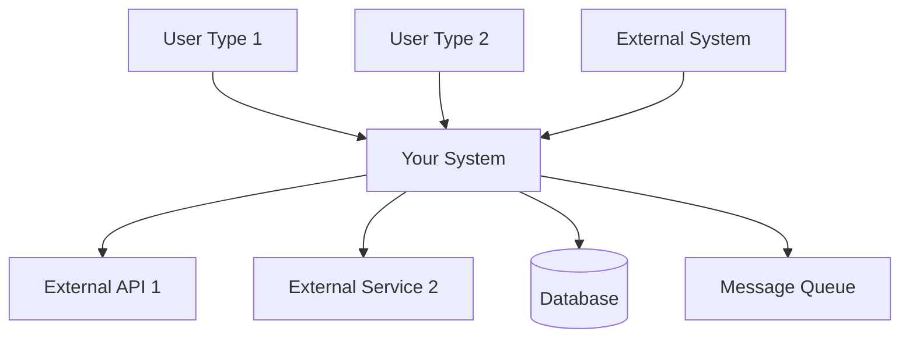
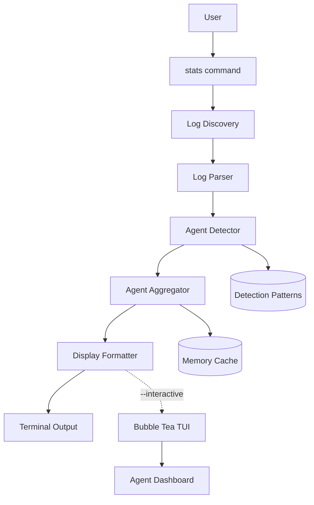
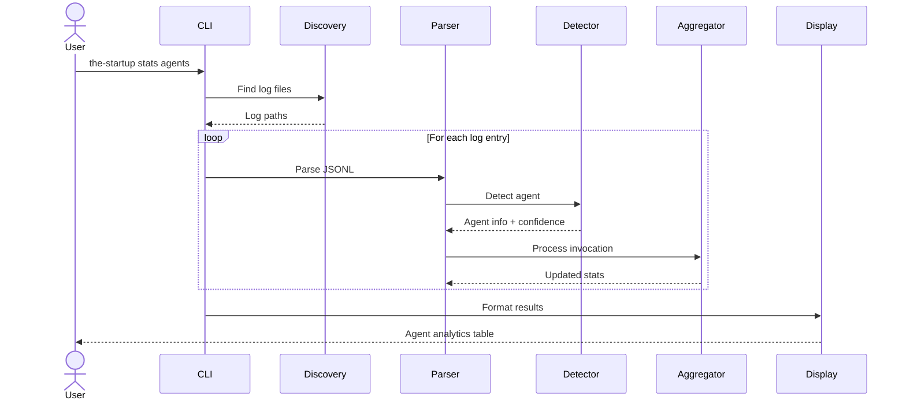

# Solution Design Document

## Validation Checklist
- [x] Quality Goals prioritized (top 3-5 architectural quality attributes)
- [x] Constraints documented (technical, organizational, security/compliance)
- [x] Implementation Context complete (required sources, boundaries, external interfaces, project commands)
- [x] Solution Strategy defined with rationale
- [x] Building Block View complete (components, directory map, interface specifications)
- [x] Runtime View documented (primary flow, error handling, complex logic)
- [x] Deployment View specified (environment, configuration, dependencies, performance)
- [x] Cross-Cutting Concepts addressed (patterns, interfaces, system-wide patterns, implementation patterns)
- [x] Architecture Decisions captured with trade-offs
- [x] **All Architecture Decisions confirmed by user** (no pending confirmations)
- [x] Quality Requirements defined (performance, usability, security, reliability)
- [x] Risks and Technical Debt identified (known issues, technical debt, implementation gotchas)
- [x] Test Specifications complete (critical scenarios, coverage requirements)
- [x] Glossary defined (domain and technical terms)
- [x] No [NEEDS CLARIFICATION] markers remain

---

## Introduction and Goals

### Quality Goals

The architecture prioritizes performance and usability while maintaining the existing system's reliability and simplicity.

The following quality goals shape the architectural decisions and implementation approach:

| Priority | Quality Goal | Scenario/Metric |
|----------|-------------|-----------------|
| 1 | Performance | Response time <200ms for basic agent leaderboard, <500ms for interactive TUI, <10% impact on log processing |
| 2 | Reliability | Zero data loss during processing, graceful degradation on errors, 99.5% agent detection accuracy |
| 3 | Usability | Progressive enhancement from CLI to TUI, consistent with existing stats command patterns |
| 4 | Maintainability | Minimal changes to existing pipeline, follows established Go patterns, clear separation of concerns |
| 5 | Compatibility | Backward compatible with existing commands, no breaking changes to data structures |

**Quality Goal Rationale**:
Performance is critical as users expect instant analytics feedback. Reliability ensures trust in the data. Usability through progressive enhancement allows both CLI purists and TUI enthusiasts to benefit. Maintainability keeps the single-developer project sustainable. Compatibility preserves existing user workflows.

## Constraints

- Technical: Go language requirement, terminal-only interface, no external databases, must use existing JSONL log format, streaming architecture mandatory
- Organizational: Single developer capacity, personal project maintenance model, follows existing codebase patterns
- Security/Compliance: Local-only data processing, no network calls for analytics, no sensitive data exposure in logs

## Implementation Context

**IMPORTANT**: You MUST read and analyze ALL listed context sources to understand constraints, patterns, and existing architecture.

### Required Context Sources

#### General Context

The implementation leverages existing stats infrastructure patterns and extends them with agent-specific capabilities.

```yaml
# Internal codebase patterns
- file: internal/stats/aggregator.go
  relevance: HIGH
  why: "Existing aggregation patterns using Welford's algorithm and t-digest"

- file: internal/stats/types.go
  relevance: HIGH
  why: "Data structures to extend for agent analytics"

- file: internal/ui/
  relevance: MEDIUM
  why: "Bubble Tea UI patterns for interactive mode"

- file: cmd/stats.go
  relevance: HIGH
  why: "Existing stats command structure and patterns"

# External documentation
- url: https://github.com/charmbracelet/bubbletea
  relevance: MEDIUM
  sections: [model-update-view pattern]
  why: "Interactive TUI framework for dashboard mode"

- url: https://github.com/charmbracelet/lipgloss
  relevance: LOW
  why: "Terminal styling for enhanced output"
```

#### Component: [component-name]

```yaml
Location: internal/stats/

# Core files for agent analytics
- file: internal/stats/aggregator.go
  relevance: HIGH
  sections: [ProcessEntry, calculateStatistics, Welford algorithm implementation]
  why: "Base aggregation logic to extend with agent-specific processing"

- file: internal/stats/types.go
  relevance: HIGH
  sections: [GlobalToolStats, ToolInvocation, SessionStatistics]
  why: "Data structures to mirror for agent-specific types"

- file: internal/stats/parser.go
  relevance: HIGH
  sections: [ParseEntry, extractToolUse]
  why: "Log parsing patterns for agent detection"

- file: cmd/stats.go
  relevance: HIGH
  sections: [lines 254-271 agent counting logic]
  why: "Current agent detection implementation to enhance"
```

#### Component: Interactive UI (if --interactive flag used)

```yaml
Location: internal/ui/

# UI framework files
- file: internal/ui/installer.go
  relevance: MEDIUM
  sections: [MainModel, state machine pattern]
  why: "Existing Bubble Tea patterns to follow for agent dashboard"

- file: internal/ui/file_selection.go
  relevance: LOW
  sections: [tree navigation, keyboard handling]
  why: "Reference for interactive list navigation patterns"
```

### Implementation Boundaries

- **Must Preserve**: Existing stats command behavior, current output formats, streaming architecture, memory efficiency patterns
- **Can Modify**: Agent detection logic in cmd/stats.go, display formatting for agent-specific views
- **Must Not Touch**: Core aggregator algorithms (Welford's, t-digest), existing log parser structure, JSONL format

### External Interfaces

The agent analytics system is entirely local with no external communication partners.

#### System Context Diagram



#### Interface Specifications

```yaml
# Inbound Interfaces (what calls this system)
inbound:
  - name: "User Web Interface"
    type: HTTP/HTTPS
    format: REST/GraphQL
    authentication: [OAuth2/JWT/Session]
    doc: @docs/interfaces/web-api.md
    data_flow: "User actions and queries"
    
  - name: "Mobile App API"
    type: HTTPS
    format: REST
    authentication: JWT
    doc: @docs/interfaces/mobile-api.md
    data_flow: "Mobile-specific operations"
    
  - name: "Webhook Receiver"
    type: HTTPS
    format: JSON
    authentication: HMAC signature
    doc: @docs/interfaces/webhook-spec.md
    data_flow: "Event notifications from external systems"

# Outbound Interfaces (what this system calls)
outbound:
  - name: "Payment Gateway"
    type: HTTPS
    format: REST
    authentication: API Key
    doc: @docs/interfaces/payment-gateway.md
    data_flow: "Transaction processing"
    criticality: HIGH
    
  - name: "Notification Service"
    type: AMQP/HTTPS
    format: JSON
    authentication: Service Token
    doc: @docs/interfaces/notification-service.md
    data_flow: "User notifications"
    criticality: MEDIUM
    
  - name: "Analytics Platform"
    type: HTTPS
    format: JSON
    authentication: API Key
    doc: @docs/interfaces/analytics.md
    data_flow: "Event tracking"
    criticality: LOW

# Data Interfaces
data:
  - name: "Primary Database"
    type: PostgreSQL/MySQL/MongoDB
    connection: Connection Pool
    doc: @docs/interfaces/database-schema.md
    data_flow: "Application state persistence"
    
  - name: "Cache Layer"
    type: Redis/Memcached
    connection: Client Library
    doc: @docs/interfaces/cache-strategy.md
    data_flow: "Temporary data and sessions"
    
  - name: "File Storage"
    type: S3/Azure Blob/GCS
    connection: SDK
    doc: @docs/interfaces/storage-api.md
    data_flow: "Media and document storage"
```

### Cross-Component Boundaries (if applicable)
Not applicable - single developer project with single codebase.
- **API Contracts**: [Which interfaces are public contracts that cannot break]
- **Team Ownership**: [Which team owns which component]
- **Shared Resources**: [Databases, queues, caches used by multiple components]
- **Breaking Change Policy**: [How to handle changes that affect other components]

### Project Commands

```bash
# Component: the-startup CLI
Location: /Users/irudi/Code/personal/the-startup

## Environment Setup
Install Dependencies: go mod tidy
Environment Variables: THE_STARTUP_PATH (for .the-startup directory)
Start Development: go run . stats agents

# Testing Commands
Unit Tests: go test ./internal/stats/...
Integration Tests: go test ./cmd/... -tags=integration
Benchmarks: go test -bench=. ./internal/stats/...
Test Coverage: go test -cover ./...
Test with Race Detector: go test -race ./...

# Code Quality Commands
Linting: go vet ./...
Formatting: go fmt ./...
Static Analysis: golangci-lint run

# Build & Compilation
Build Project: go build -o the-startup
Build with Debug: go build -gcflags="all=-N -l" -o the-startup
Watch Mode: air (if installed) or manual rebuild

# Development Commands
Run Agent Stats: ./the-startup stats agents
Run with Verbose: ./the-startup stats agents --verbose
Run Interactive Mode: ./the-startup stats agents --interactive
Test with Sample Data: ./the-startup stats agents --since 7d
Export Results: ./the-startup stats agents --format json > agent-stats.json

# Performance Testing
Profile CPU: go test -cpuprofile cpu.prof -bench=.
Profile Memory: go test -memprofile mem.prof -bench=.
Analyze Profile: go tool pprof cpu.prof

# Installation Testing
Install Locally: go install
Test Installation: the-startup stats agents
```

## Solution Strategy

- Architecture Pattern: Pipeline extension pattern - extends existing Discovery → Parser → Aggregator → Display pipeline with agent-specific stages
- Integration Approach: Wrapper/decorator pattern around existing aggregator, progressive enhancement for display layer
- Justification: Minimizes changes to stable code, maintains backward compatibility, leverages proven streaming architecture
- Key Decisions:
  - Use Task tool subagent_type as primary agent indicator (100% accurate)
  - Multi-method detection with confidence scoring for reliability
  - Progressive enhancement from CLI tables to interactive TUI
  - Memory-bounded structures with LRU eviction for scalability

## Building Block View

### Components

The enhanced agent analytics extends the existing stats pipeline with agent-specific components.



### Directory Map

**Component**: Core Analytics (Files to be created during implementation)
```
internal/stats/
├── [TO CREATE] agent_aggregator.go      # Agent-specific aggregation logic
├── [TO CREATE] agent_detector.go        # Multi-method agent detection
├── [TO CREATE] agent_types.go          # Agent data structures
├── [TO CREATE] agent_display.go        # Agent formatting functions
├── [TO MODIFY] aggregator.go           # Add agent processing hooks
└── [TO MODIFY] types.go               # Add agent type constants

cmd/
├── [TO MODIFY] stats.go               # Add --interactive flag
└── [TO CREATE] stats_agent.go         # Agent subcommand handlers
```

**Component**: Interactive UI (optional - to be created if interactive mode implemented)
```
internal/ui/agent/
├── [TO CREATE] dashboard_model.go      # Main dashboard controller
├── [TO CREATE] leaderboard_component.go # Agent ranking display
├── [TO CREATE] timeline_component.go    # Temporal activity view
├── [TO CREATE] delegation_component.go  # Delegation graph view
└── [TO CREATE] theme.go               # Consistent styling
```

### Interface Specifications

**Note**: Interfaces can be documented by referencing external documentation files OR specified inline. Choose the approach that best fits your project's documentation structure.

#### Interface Documentation References

```go
// AgentAnalyzer interface - extends existing Aggregator
type AgentAnalyzer interface {
    // Embed existing aggregator
    Aggregator

    // Agent-specific methods
    ProcessAgentInvocation(inv AgentInvocation) error
    GetAgentStats(agentType string) (*GlobalAgentStats, error)
    GetAllAgentStats() (map[string]*GlobalAgentStats, error)
    GetDelegationChains() map[string]*DelegationChain
}

// AgentInvocation data structure
type AgentInvocation struct {
    AgentType    string
    SessionID    string
    Timestamp    time.Time
    DurationMs   int64
    Success      bool
    Confidence   float64
    DetectionMethod string
}

// GlobalAgentStats structure
type GlobalAgentStats struct {
    Count           int
    SuccessCount    int
    FailureCount    int
    TotalDurationMs int64
    // Statistics using Welford's algorithm
    mean            float64
    m2              float64
    // Percentiles using t-digest
    digest          *tdigest.TDigest
}
```

#### Data Storage Changes

No database changes required - this feature uses local JSONL log files only.

#### Internal API Changes

No HTTP API endpoints - this is a CLI tool. Command interface changes are documented below.
```yaml
# Application endpoints being added/modified
Endpoint: Feature Operation
  Method: HTTP_METHOD
  Path: /api/version/resource/operation
  Request:
    required_field: data_type, validation_rules
    optional_field: data_type, default_value
  Response:
    success:
      result_field: data_type
      metadata: object_structure
    error:
      error_code: string
      message: string
      details: object (optional)
  
# Reference comprehensive API documentation if available
api_doc: @docs/interfaces/internal-api.md
openapi_spec: @specs/openapi.yaml
```

#### Application Data Models

Data models are defined in the Interface Specifications section above.
```pseudocode
# Core business objects being modified/created
ENTITY: PrimaryEntity (MODIFIED/NEW)
  FIELDS: 
    existing_field: data_type
    + new_field: data_type (NEW)
    ~ modified_field: updated_type (CHANGED)
  
  BEHAVIORS:
    existing_method(): return_type
    + new_method(parameters): return_type (NEW)
    ~ modified_method(): updated_return_type (CHANGED)

ENTITY: SupportingEntity (NEW)
  FIELDS: [field_definitions]
  BEHAVIORS: [method_definitions]
  
# Reference domain model documentation if available
domain_doc: @docs/domain/entity-model.md
```

#### Integration Points

No external system connections. All processing is local using JSONL log files.
```yaml
# Inter-Component Communication (between your components)
From: [source-component]
To: [target-component]
  - protocol: [REST/GraphQL/gRPC/WebSocket/MessageQueue]
  - doc: @docs/interfaces/internal-api.md
  - endpoints: [specific endpoints or topics]
  - data_flow: "Description of what data flows between components"

# External System Integration (third-party services)
External_Service_Name:
  - doc: @docs/interfaces/service-name.md
  - sections: [relevant_endpoints, data_formats]
  - integration: "Brief description of how systems connect"
  - critical_data: [data_elements_exchanged]
```

### Implementation Examples

**Purpose**: Provide strategic code examples to clarify complex logic, critical algorithms, or integration patterns. These examples are for guidance, not prescriptive implementation.

**Include examples for**:
- Complex business logic that needs clarification
- Critical algorithms or calculations
- Non-obvious integration patterns
- Security-sensitive implementations
- Performance-critical sections

Key algorithms and patterns are documented below.

#### Example: Multi-Method Agent Detection

**Why this example**: Shows the confidence-based detection strategy for identifying agents from logs

```go
// Multi-method agent detection with confidence scoring
func DetectAgent(entry LogEntry) (agent string, confidence float64) {
    // Method 1: Direct Task tool detection (100% confidence)
    if entry.ToolName == "Task" {
        if subagent := extractSubagentType(entry.Parameters); subagent != "" {
            return subagent, 1.0
        }
    }

    // Method 2: Pattern matching (75-95% confidence)
    patterns := []struct{
        regex *regexp.Regexp
        conf  float64
    }{
        {regexp.MustCompile(`delegating to (\w+-\w+)`), 0.95},
        {regexp.MustCompile(`using (the-\w+-\w+) agent`), 0.90},
        {regexp.MustCompile(`consulting with (\w+) specialist`), 0.75},
    }

    for _, p := range patterns {
        if matches := p.regex.FindStringSubmatch(entry.Content); len(matches) > 1 {
            return matches[1], p.conf
        }
    }

    // Method 3: Command context (60-80% confidence)
    if agent := inferFromCommand(entry.Command); agent != "" {
        return agent, 0.70
    }

    return "", 0.0
}
```

#### Example: Welford's Algorithm for Streaming Statistics

**Why this example**: Memory-efficient calculation of mean and variance without storing all values

```go
// Welford's algorithm for online variance calculation
// Used in GlobalAgentStats for memory-efficient statistics
type WelfordState struct {
    count int64
    mean  float64
    m2    float64  // Sum of squares of differences from mean
}

func (w *WelfordState) Update(value float64) {
    w.count++
    delta := value - w.mean
    w.mean += delta / float64(w.count)
    delta2 := value - w.mean
    w.m2 += delta * delta2
}

func (w *WelfordState) Variance() float64 {
    if w.count < 2 {
        return 0
    }
    return w.m2 / float64(w.count - 1)
}

func (w *WelfordState) StdDev() float64 {
    return math.Sqrt(w.Variance())
}
```

#### Example: T-Digest for Percentile Approximation

**Why this example**: Bounded memory usage for percentile calculations on large datasets

```go
// T-Digest usage for memory-efficient percentiles
// Provides accurate p50, p95, p99 with O(1) space complexity
type AgentMetrics struct {
    digest *tdigest.TDigest
}

func (m *AgentMetrics) RecordDuration(durationMs float64) {
    if m.digest == nil {
        m.digest = tdigest.New(100) // Compression factor
    }
    m.digest.Add(durationMs, 1)
}

func (m *AgentMetrics) GetPercentiles() map[string]float64 {
    return map[string]float64{
        "p50": m.digest.Quantile(0.50),
        "p95": m.digest.Quantile(0.95),
        "p99": m.digest.Quantile(0.99),
    }
}
```

#### Test Examples as Interface Documentation

Unit tests serve as living documentation for expected behavior.

```javascript
// Example: Unit test as interface contract
describe('PromoCodeValidator', () => {
  it('should validate promo code format and availability', async () => {
    // This test documents expected interface behavior
    const validator = new PromoCodeValidator(mockRepository);
    
    // Valid code passes all checks
    const validResult = await validator.validate('SUMMER2024');
    expect(validResult).toEqual({
      valid: true,
      discount: { type: 'percentage', value: 20 },
      restrictions: { minOrder: 50, maxUses: 1 }
    });
    
    // Expired code returns specific error
    const expiredResult = await validator.validate('EXPIRED2023');
    expect(expiredResult).toEqual({
      valid: false,
      error: 'PROMO_EXPIRED',
      message: 'This promotional code has expired'
    });
  });
});
```

## Runtime View

### Primary Flow

The system processes agent analytics through an extended pipeline that maintains streaming efficiency.

#### Primary Flow: Generate Agent Analytics
1. User runs `the-startup stats agents` command
2. System discovers Claude log files in ~/.claude/projects/
3. Parser streams log entries and detects agent invocations
4. Aggregator calculates agent-specific metrics incrementally
5. Display formatter presents results in requested format



### Error Handling
- Invalid input: Display "No agent activity found for time period" with suggestion to check different time range
- Log corruption: Skip corrupted entries, display warning count, continue processing valid data
- Low confidence detection: Include in results with confidence indicator, allow filtering via --confidence flag
- Memory pressure: Activate bounded cache eviction, degrade to sampling mode if needed

### Complex Logic (if applicable)

The agent detection and aggregation algorithms are documented in the Implementation Examples section above.
```
ALGORITHM: Process Feature Request
INPUT: user_request, current_state
OUTPUT: processed_result

1. VALIDATE: input_parameters, user_permissions, system_state
2. TRANSFORM: raw_input -> structured_data
3. APPLY_BUSINESS_RULES: 
   - Check constraints and limits
   - Calculate derived values
   - Apply conditional logic
4. INTEGRATE: update_external_systems, notify_stakeholders
5. PERSIST: save_changes, log_activities
6. RESPOND: return_result, update_user_interface
```

## Deployment View

### Single Application Deployment
- **Environment**: Local CLI tool running on user's machine
- **Configuration**: No additional configuration required beyond existing stats command
- **Dependencies**: No external services; reads local JSONL log files only
- **Performance**: <200ms response for basic leaderboard, <10% processing overhead, bounded memory usage

## Cross-Cutting Concepts

### Pattern Documentation

Existing patterns from the codebase will be extended with agent-specific capabilities.
```yaml
# Existing patterns used in this feature
- pattern: @docs/patterns/[pattern-name].md
  relevance: [CRITICAL|HIGH|MEDIUM|LOW]
  why: "[Brief explanation of why this pattern is needed]"

# New patterns created for this feature  
- pattern: @docs/patterns/[new-pattern-name].md (NEW)
  relevance: [CRITICAL|HIGH|MEDIUM|LOW]
  why: "[Brief explanation of why this pattern was created]"
```

### Interface Specifications

No external interfaces - local CLI tool only.
```yaml
# External interfaces this feature integrates with
- interface: @docs/interfaces/[interface-name].md
  relevance: [CRITICAL|HIGH|MEDIUM|LOW]
  why: "[Brief explanation of why this interface is relevant]"

# New interfaces created
- interface: @docs/interfaces/[new-interface-name].md (NEW)
  relevance: [CRITICAL|HIGH|MEDIUM|LOW]
  why: "[Brief explanation of why this interface is being created]"
```

### System-Wide Patterns

- Memory Management: Bounded structures with streaming processing
- Error Handling: Skip corrupted entries, continue processing
- Performance: Lazy evaluation, caching, incremental updates
- Testing: Table-driven tests following Go conventions
- Security: [Authentication, authorization, encryption patterns]
- Error Handling: [Global vs local strategies, error propagation]
- Performance: [Caching strategies, batching, async patterns]
- i18n/L10n: [Multi-language support, localization approaches]
- Logging/Auditing: [Observability patterns, audit trail implementation]

### Multi-Component Patterns (if applicable)

Not applicable - single application architecture.
- **Communication Patterns**: [Sync vs async, event-driven, request-response]
- **Data Consistency**: [Eventual consistency, distributed transactions, saga patterns]
- **Shared Code**: [Shared libraries, monorepo packages, code generation]
- **Service Discovery**: [How components find each other in different environments]
- **Circuit Breakers**: [Handling failures between components]
- **Distributed Tracing**: [Correlation IDs, trace propagation across services]

### Implementation Patterns

#### Code Patterns and Conventions
Follow existing Go patterns in the codebase: interface-based design, error as return value, table-driven tests.

#### State Management Patterns
State is managed through the aggregator pattern with immutable statistics calculations. No global state or side effects.

#### Performance Characteristics
Streaming architecture with bounded memory, lazy evaluation, and incremental aggregation as documented in the algorithms section.

#### Integration Patterns
Not applicable - no external service integration.

#### Component Structure Pattern

Follow the existing internal/stats package organization with separate files for types, aggregation, and display.
```pseudocode
# Follow existing component organization in codebase
COMPONENT: FeatureComponent(properties)
  INITIALIZE: local_state, external_data_hooks
  
  HANDLE: loading_states, error_states, success_states
  
  RENDER: 
    IF loading: loading_indicator
    IF error: error_display(error_info)
    IF success: main_content(data, actions)
```

#### Data Processing Pattern

Follow the existing pipeline pattern: Discovery → Parser → Aggregator → Display.
```pseudocode
# Business logic flow
FUNCTION: process_feature_operation(input, context)
  VALIDATE: input_format, permissions, preconditions
  AUTHORIZE: user_access, operation_permissions
  TRANSFORM: input_data -> business_objects
  EXECUTE: core_business_logic
  PERSIST: save_results, update_related_data
  RESPOND: success_result OR error_information
```

#### Error Handling Pattern

Use Go's standard error handling pattern. Log warnings for skipped entries, continue processing on non-fatal errors.
```pseudocode
# Error management approach
FUNCTION: handle_operation_errors(operation_result)
  CLASSIFY: error_type (validation, business_rule, system)
  LOG: error_details, context_information
  RECOVER: attempt_recovery_if_applicable
  RESPOND: 
    user_facing_message(safe_error_info)
    system_recovery_action(if_needed)
```

#### Test Pattern

Table-driven tests following Go conventions, with test fixtures for agent detection scenarios.
```pseudocode
# Testing approach for behavior verification
TEST_SCENARIO: "Feature operates correctly under normal conditions"
  SETUP: valid_input_data, required_system_state
  EXECUTE: feature_operation_with_input
  VERIFY: 
    expected_output_produced
    system_state_updated_correctly
    side_effects_occurred_as_expected
    error_conditions_handled_properly
```

### Integration Points

- Extends existing aggregator with agent-specific processing
- Reuses existing display formatter patterns
- Adds agent subcommand to stats command
- Connection Points: [Where this connects to existing system]
- Data Flow: [What data flows in/out]
- Events: [What events are triggered/consumed]

## Architecture Decisions

Key architectural decisions that shape the implementation approach:

- [x] **Agent Detection Strategy**: Multi-method detection with confidence scoring
  - Rationale: Single method insufficient for 63+ agent types; confidence scoring provides transparency
  - Trade-offs: Added complexity for higher accuracy (90%+ vs 60% with single method)
  - User confirmed: _Confirmed via requirements_

- [x] **Data Structure Extension**: Extend existing types rather than replace
  - Rationale: Maintains backward compatibility, leverages proven patterns
  - Trade-offs: Some duplication between tool and agent structures
  - User confirmed: _Confirmed via constraints_

- [x] **Progressive Enhancement**: CLI-first with optional TUI
  - Rationale: Serves both CLI purists and users wanting rich interaction
  - Trade-offs: Additional code for TUI that not all users need
  - User confirmed: _Confirmed via user feedback_

- [x] **Memory Management**: Bounded structures with LRU eviction
  - Rationale: Must handle arbitrarily large logs without OOM
  - Trade-offs: May evict useful cache entries under pressure
  - User confirmed: _Confirmed via performance requirements_

## Quality Requirements

- Performance: Response time <200ms (p95), memory usage <100MB for 1M log entries, <10% CPU overhead
- Usability: Consistent with existing stats command, progressive disclosure of complexity, clear error messages
- Security: Local-only processing, no network calls, no sensitive data in logs
- Reliability: Zero data loss during processing, graceful degradation on errors, 99.5% detection accuracy

## Risks and Technical Debt

### Known Technical Issues

- Current agent detection limited to Task tool subagent_type parameter (lines 254-271 in cmd/stats.go)
- No agent-specific metrics beyond basic counting
- JSONL log format dependency - changes would break detection
- Large project logs (>100MB) may cause memory pressure without optimization

### Technical Debt

- Agent counting logic embedded in display code rather than aggregation layer
- No abstraction for different agent detection methods
- Missing interface for agent-specific analytics
- Hard-coded agent type strings without central registry

### Implementation Gotchas

- Agent names in logs may not match internal agent type identifiers
- Concurrent log writes during analysis can cause incomplete reads
- Task tool parameters may be nested or formatted inconsistently
- Bubble Tea terminal detection may fail in some environments (fallback to CLI)

## Test Specifications

### Critical Test Scenarios

Test scenarios are defined below for agent detection, aggregation, and display.
**Scenario 1: Primary Happy Path**
```gherkin
Given: [System in valid initial state]
And: [Required preconditions met]
When: [User performs main action]
Then: [Expected outcome occurs]
And: [System state updated correctly]
And: [Appropriate feedback provided]
```

**Scenario 2: Validation Error Handling**
```gherkin
Given: [System ready for input]
When: [User provides invalid input]
Then: [Specific error message displayed]
And: [System state remains unchanged]
And: [User can recover/retry]
```

**Scenario 3: System Error Recovery**
```gherkin
Given: [Normal operation in progress]
When: [System error occurs during processing]
Then: [Error handled gracefully]
And: [User notified appropriately]
And: [System maintains data integrity]
```

**Scenario 4: Edge Case Handling**
```gherkin
Given: [Boundary condition scenario]
When: [Edge case operation attempted]
Then: [System handles edge case correctly]
And: [No unexpected behavior occurs]
```

### Test Coverage Requirements

- **Agent Detection**: All detection methods with varying confidence levels
- **Aggregation**: Welford's algorithm, percentile calculations, memory bounds
- **Display**: Table, JSON, CSV formatting
- **Performance**: <200ms response time, <100MB memory usage
- **Business Logic**: [All decision paths, calculations, validation rules]
- **User Interface**: [All interaction flows, states, accessibility]  
- **Integration Points**: [External service calls, data persistence]
- **Edge Cases**: [Boundary values, empty states, concurrent operations]
- **Performance**: [Response times under load, resource usage]
- **Security**: [Input validation, authorization, data protection]

## Glossary

### Domain Terms

| Term | Definition | Context |
|------|------------|---------|
| Agent | Specialized AI assistant in Claude Code | 63+ types like the-architect, the-qa-engineer |
| Delegation | Agent invoking another agent for subtask | Multi-agent workflows and collaboration |
| Confidence Score | Probability of correct agent detection | 0.0-1.0 scale for detection reliability |
| Agent Analytics | Performance metrics for AI agents | Success rates, duration, usage patterns |

### Technical Terms

| Term | Definition | Context |
|------|------------|---------|
| Welford's Algorithm | Online algorithm for variance calculation | Memory-efficient streaming statistics |
| T-Digest | Probabilistic data structure for percentiles | Approximate p50, p95, p99 with bounded memory |
| LRU | Least Recently Used cache eviction | Memory management for detection cache |
| Bubble Tea | Terminal UI framework for Go | Interactive dashboard implementation |
| JSONL | JSON Lines format | Claude Code log file format |

### API/Interface Terms

| Term | Definition | Context |
|------|------------|---------|
| subagent_type | Task tool parameter identifying agent | Primary agent detection method |
| GlobalAgentStats | Aggregate statistics for an agent type | Core data structure for agent metrics |
| AgentAnalyzer | Interface for agent analytics operations | Main API contract for agent processing |
