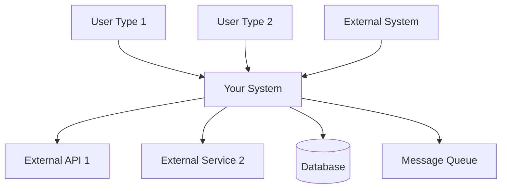
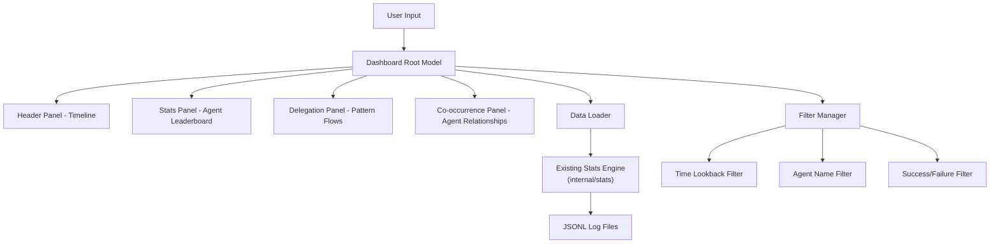
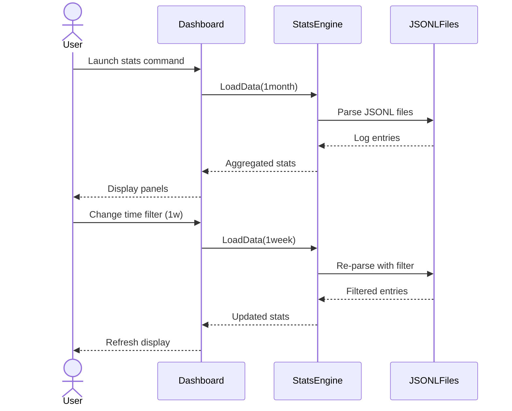

# Solution Design Document

## Validation Checklist
- [ ] Quality Goals prioritized (top 3-5 architectural quality attributes)
- [ ] Constraints documented (technical, organizational, security/compliance)
- [ ] Implementation Context complete (required sources, boundaries, external interfaces, project commands)
- [ ] Solution Strategy defined with rationale
- [ ] Building Block View complete (components, directory map, interface specifications)
- [ ] Runtime View documented (primary flow, error handling, complex logic)
- [ ] Deployment View specified (environment, configuration, dependencies, performance)
- [ ] Cross-Cutting Concepts addressed (patterns, interfaces, system-wide patterns, implementation patterns)
- [ ] Architecture Decisions captured with trade-offs
- [ ] **All Architecture Decisions confirmed by user** (no pending confirmations)
- [ ] Quality Requirements defined (performance, usability, security, reliability)
- [ ] Risks and Technical Debt identified (known issues, technical debt, implementation gotchas)
- [ ] Test Specifications complete (critical scenarios, coverage requirements)
- [ ] Glossary defined (domain and technical terms)
- [ ] No [NEEDS CLARIFICATION] markers remain

---

## Constraints

- **Technical**:
  - Must use Go and BubbleTea framework (existing codebase dependency)
  - Terminal-based interface (no web browser requirement)
  - Reuse existing stats parsing infrastructure
- **Organizational**:
  - Follow existing code patterns in internal/ui/ directory
  - Reuse existing stats infrastructure from internal/stats/
  - Maintain compatibility with current JSONL log format
  - No external dependencies beyond current go.mod
- **Security/Compliance**:
  - Read-only access to log files (no data modification)
  - Local file system access only (no network data)
  - Respect existing file permissions

## Implementation Context

**IMPORTANT**: You MUST read and analyze ALL listed context sources to understand constraints, patterns, and existing architecture.

### Required Context Sources

#### General Context

```yaml
# Internal documentation and patterns
- doc: docs/patterns/tui-dashboard-architecture.md
  relevance: HIGH
  why: "Core TUI dashboard patterns and BubbleTea best practices"

- doc: docs/interfaces/dashboard-data-api.md
  relevance: HIGH
  why: "Data layer interface specifications for dashboard"

# External documentation and APIs
- url: https://github.com/aristocratos/btop
  relevance: HIGH
  sections: [UI layout, component architecture, performance patterns]
  why: "Reference implementation for fullscreen dashboard design"

- url: https://leg100.github.io/en/posts/building-bubbletea-programs/
  relevance: HIGH
  why: "Advanced BubbleTea patterns for production applications"

- url: https://github.com/charmbracelet/bubbletea
  relevance: MEDIUM
  why: "Framework documentation and API reference"
```

#### Component: Stats Engine

Existing stats infrastructure that provides the data foundation for the dashboard.

```yaml
Location: internal/stats/

# Source code files that must be understood
- file: internal/stats/agent_detector.go
  relevance: HIGH
  why: "Agent detection logic and confidence scoring that drives dashboard metrics"

- file: internal/stats/delegation.go
  relevance: HIGH
  why: "Delegation pattern analysis that powers delegation visualization panel"

- file: cmd/stats.go
  relevance: HIGH
  why: "Current CLI interface and data loading patterns to extend"

- file: internal/ui/installer/models.go
  relevance: MEDIUM
  why: "Existing BubbleTea patterns and component composition examples"

- file: go.mod
  relevance: MEDIUM
  why: "Available dependencies and version constraints"
```

#### Component: UI Framework

Existing BubbleTea UI components and patterns used in the installer.

```yaml
Location: internal/ui/

# Source code files that must be understood
- file: internal/ui/installer/main.go
  relevance: HIGH
  why: "Main BubbleTea application structure and initialization patterns"

- file: internal/ui/installer/startup_path.go
  relevance: MEDIUM
  why: "Component composition and state management patterns"

- file: internal/ui/installer/file_selection.go
  relevance: MEDIUM
  why: "Interactive selection UI patterns for lists and trees"
```

### Implementation Boundaries

- **Must Preserve**:
  - JSONL log file format and structure
  - Current agent detection and delegation analysis logic
  - Go module dependencies and version constraints
  - All internal/stats/ package functionality
- **Can Modify**:
  - Replace cmd/stats.go completely with dashboard implementation
  - Add new UI components in internal/ui/agent/
  - Add new data structures for dashboard state
  - Remove all CLI table/JSON/CSV output formats
- **Must Not Touch**:
  - Existing installer UI components (internal/ui/installer/)
  - Log file writing logic
  - Agent detection confidence algorithms (internal/stats/)
  - External dependencies beyond current go.mod

### External Interfaces

[NEEDS CLARIFICATION: What are all the external communication partners and system boundaries?]

#### System Context Diagram



#### Interface Specifications

```yaml
# Inbound Interfaces (what calls this system)
inbound:
  - name: "User Web Interface"
    type: HTTP/HTTPS
    format: REST/GraphQL
    authentication: [OAuth2/JWT/Session]
    doc: @docs/interfaces/web-api.md
    data_flow: "User actions and queries"
    
  - name: "Mobile App API"
    type: HTTPS
    format: REST
    authentication: JWT
    doc: @docs/interfaces/mobile-api.md
    data_flow: "Mobile-specific operations"
    
  - name: "Webhook Receiver"
    type: HTTPS
    format: JSON
    authentication: HMAC signature
    doc: @docs/interfaces/webhook-spec.md
    data_flow: "Event notifications from external systems"

# Outbound Interfaces (what this system calls)
outbound:
  - name: "Payment Gateway"
    type: HTTPS
    format: REST
    authentication: API Key
    doc: @docs/interfaces/payment-gateway.md
    data_flow: "Transaction processing"
    criticality: HIGH
    
  - name: "Notification Service"
    type: AMQP/HTTPS
    format: JSON
    authentication: Service Token
    doc: @docs/interfaces/notification-service.md
    data_flow: "User notifications"
    criticality: MEDIUM
    
  - name: "Analytics Platform"
    type: HTTPS
    format: JSON
    authentication: API Key
    doc: @docs/interfaces/analytics.md
    data_flow: "Event tracking"
    criticality: LOW

# Data Interfaces
data:
  - name: "Primary Database"
    type: PostgreSQL/MySQL/MongoDB
    connection: Connection Pool
    doc: @docs/interfaces/database-schema.md
    data_flow: "Application state persistence"
    
  - name: "Cache Layer"
    type: Redis/Memcached
    connection: Client Library
    doc: @docs/interfaces/cache-strategy.md
    data_flow: "Temporary data and sessions"
    
  - name: "File Storage"
    type: S3/Azure Blob/GCS
    connection: SDK
    doc: @docs/interfaces/storage-api.md
    data_flow: "Media and document storage"
```

### Cross-Component Boundaries (if applicable)
[NEEDS CLARIFICATION: What are the boundaries between components/teams?]
- **API Contracts**: [Which interfaces are public contracts that cannot break]
- **Team Ownership**: [Which team owns which component]
- **Shared Resources**: [Databases, queues, caches used by multiple components]
- **Breaking Change Policy**: [How to handle changes that affect other components]

### Project Commands

[NEEDS CLARIFICATION: What are the project-specific commands for development, validation, and deployment? For multi-component features, organize commands by component. These commands must be discovered from package.json, Makefile, docker-compose.yml, or other build configuration files. Pay special attention to monorepo structures and database-specific testing tools.]

```bash
# Component: [component-name]
Location: [path or repository]

## Environment Setup
Install Dependencies: [discovered from package.json, requirements.txt, go.mod, etc.]
Environment Variables: [discovered from .env.example, config files]
Start Development: [discovered from package.json scripts, Makefile targets]

# Testing Commands (CRITICAL - discover ALL testing approaches)
Unit Tests: [e.g., npm test, go test, cargo test]
Integration Tests: [e.g., npm run test:integration]
Database Tests: [e.g., pgTap for PostgreSQL, database-specific test runners]
E2E Tests: [e.g., npm run test:e2e, playwright test]
Test Coverage: [e.g., npm run test:coverage]

# Code Quality Commands
Linting: [discovered from package.json, .eslintrc, etc.]
Type Checking: [discovered from tsconfig.json, mypy.ini, etc.]
Formatting: [discovered from .prettierrc, rustfmt.toml, etc.]

# Build & Compilation
Build Project: [discovered from build scripts]
Watch Mode: [discovered from development scripts]

# Database Operations (if applicable)
Database Setup: [discovered from database scripts]
Database Migration: [discovered from migration tools]
Database Tests: [discovered from database test configuration]

# Monorepo Commands (if applicable)
Workspace Commands: [discovered from workspace configuration]
Package-specific Commands: [discovered from individual package.json files]
Cross-package Commands: [commands that affect multiple packages]
Dependency Management: [how to update shared dependencies]
Local Package Linking: [how packages reference each other locally]

# Multi-Component Coordination (if applicable)
Start All: [command to start all components]
Run All Tests: [command to test across components]
Build All: [command to build all components]
Deploy All: [orchestrated deployment command]

# Additional Project-Specific Commands
[Any other relevant commands discovered in the codebase]
```

## Solution Strategy

- **Architecture Pattern**: Simple BubbleTea dashboard with static data loading and interactive filtering, following btop's multi-panel layout
- **Integration Approach**: Replace existing stats command entirely with interactive dashboard, reuse internal/stats parsing functions, add new UI layer in internal/ui/agent/
- **Justification**: Leverages existing stats engine, maintains CLI compatibility, provides familiar terminal-native experience, minimal complexity
- **Key Decisions**:
  - Replace CLI stats completely with interactive dashboard (better UX)
  - Static data loading using existing stats.ParseJSONLFiles() (simplicity)
  - Re-read files only when filters change or user refreshes (no streaming)
  - Fullscreen dashboard as the primary stats experience (no backward compatibility)
  - Time-based lookback filters (1w, 1m, 3m, 6m, 1y, all) for data scoping

## Building Block View

### Components

Simple dashboard with static data loading and panel-based navigation:



### Directory Map

**Component**: Interactive Dashboard
```
.
├── cmd/
│   └── stats.go                    # MODIFY: Replace with dashboard launcher
├── internal/
│   ├── stats/                      # EXISTING: Reuse parsing logic
│   │   ├── agent_detector.go       # EXISTING: Agent analysis
│   │   ├── delegation.go           # EXISTING: Delegation patterns
│   │   └── ...                     # EXISTING: Other stats logic
│   └── ui/
│       └── agent/                  # NEW: Dashboard UI components
│           ├── dashboard.go        # NEW: Main dashboard model
│           ├── stats_panel.go      # NEW: Agent stats panel
│           ├── timeline_panel.go   # NEW: Message timeline panel
│           ├── delegation_panel.go # NEW: Delegation patterns panel
│           ├── filters.go          # NEW: Filter management
│           └── types.go            # NEW: Dashboard data types
```

**Component**: [another-component-name] (if applicable)
```
.
├── [discovered structure]
│   └── [discovered structure]
```

### Interface Specifications

**Note**: Interfaces can be documented by referencing external documentation files OR specified inline. Choose the approach that best fits your project's documentation structure.

#### Interface Documentation References

[NEEDS CLARIFICATION: What interface documentation already exists that should be referenced?]
```yaml
# Reference existing interface documentation
interfaces:
  - name: "User Authentication API"
    doc: @docs/interfaces/auth-api.md
    relevance: CRITICAL
    sections: [authentication_flow, token_management]
    why: "Core authentication flow must be followed"
  
  - name: "Payment Processing Interface"
    doc: @docs/interfaces/payment-gateway.md
    relevance: HIGH
    sections: [transaction_processing, webhook_handling]
    why: "Integration with payment provider constraints"
    
  - name: "Event Bus Interface"
    doc: @docs/interfaces/event-bus.md (NEW)
    relevance: MEDIUM
    sections: [event_format, subscription_model]
    why: "New event-driven communication pattern"
```

#### Data Storage Changes

No database or storage changes needed. Dashboard reads existing JSONL log files using current stats infrastructure.
```yaml
# Database/storage schema modifications
Table: primary_entity_table
  ADD COLUMN: new_field (data_type, constraints)
  MODIFY COLUMN: existing_field (new_constraints) 
  ADD INDEX: performance_index (fields)

Table: supporting_entity_table (NEW)
  id: primary_key
  related_id: foreign_key
  business_field: data_type, constraints
  
# Reference detailed schema documentation if available
schema_doc: @docs/interfaces/database-schema.md
migration_scripts: @migrations/v2.1.0/
```

#### Internal API Changes

No API changes needed. Dashboard uses existing internal functions from stats package.
```yaml
# Application endpoints being added/modified
Endpoint: Feature Operation
  Method: HTTP_METHOD
  Path: /api/version/resource/operation
  Request:
    required_field: data_type, validation_rules
    optional_field: data_type, default_value
  Response:
    success:
      result_field: data_type
      metadata: object_structure
    error:
      error_code: string
      message: string
      details: object (optional)
  
# Reference comprehensive API documentation if available
api_doc: @docs/interfaces/internal-api.md
openapi_spec: @specs/openapi.yaml
```

#### Application Data Models

Reuse existing data models from stats package with simple additions:

```go
// NEW: Dashboard state management
type DashboardModel struct {
    // Panel management
    ActivePanel   PanelType
    StatsPanel    StatsPanelModel
    TimelinePanel TimelinePanelModel
    DelegationPanel DelegationPanelModel

    // Data and filters
    Data          *DashboardData
    Filters       FilterState

    // UI state
    Width, Height int
}

// NEW: Filter management
type FilterState struct {
    TimeRange     TimeRange     // 1w, 1m, 3m, 6m, 1y, all
    AgentFilter   []string      // Selected agents
    SuccessFilter *bool         // Success/failure/all
    SessionFilter []string      // Selected sessions
}

// NEW: Aggregated dashboard data
type DashboardData struct {
    AgentStats         []stats.GlobalAgentStats
    DelegationPatterns []stats.DelegationPattern
    CoOccurrences      []AgentCoOccurrence
    MessageTimeline    []MessageEvent
    Sessions          []SessionInfo
    LoadedAt          time.Time
}
```

#### Integration Points

[NEEDS CLARIFICATION: What external systems does this feature connect to? For multi-component features, also document inter-component communication.]
```yaml
# Inter-Component Communication (between your components)
From: [source-component]
To: [target-component]
  - protocol: [REST/GraphQL/gRPC/WebSocket/MessageQueue]
  - doc: @docs/interfaces/internal-api.md
  - endpoints: [specific endpoints or topics]
  - data_flow: "Description of what data flows between components"

# External System Integration (third-party services)
External_Service_Name:
  - doc: @docs/interfaces/service-name.md
  - sections: [relevant_endpoints, data_formats]
  - integration: "Brief description of how systems connect"
  - critical_data: [data_elements_exchanged]
```

### Implementation Examples

**Purpose**: Provide strategic code examples to clarify complex logic, critical algorithms, or integration patterns. These examples are for guidance, not prescriptive implementation.

**Include examples for**:
- Complex business logic that needs clarification
- Critical algorithms or calculations
- Non-obvious integration patterns
- Security-sensitive implementations
- Performance-critical sections

[NEEDS CLARIFICATION: Are there complex areas that would benefit from code examples? If not, remove this section]

#### Example: [Complex Business Logic Name]

**Why this example**: [Explain why this specific example helps clarify the implementation]

```typescript
// Example: Discount calculation with multiple rules
// This demonstrates the expected logic flow, not the exact implementation
function calculateDiscount(order: Order, user: User): Discount {
  // Business rule: VIP users get additional benefits
  const baseDiscount = order.subtotal * getBaseDiscountRate(user.tier);
  
  // Complex rule: Stacking discounts with limits
  const promotionalDiscount = Math.min(
    order.promotions.reduce((sum, promo) => sum + promo.value, 0),
    order.subtotal * MAX_PROMO_PERCENTAGE
  );
  
  // Edge case: Never exceed maximum discount
  return Math.min(
    baseDiscount + promotionalDiscount,
    order.subtotal * MAX_TOTAL_DISCOUNT
  );
}
```

#### Example: [Integration Pattern Name]

**Why this example**: [Explain why this pattern is important to document]

```python
# Example: Retry pattern for external service integration
# Shows expected error handling approach
async def call_payment_service(transaction):
    """
    Demonstrates resilient integration pattern.
    Actual implementation may use circuit breaker library.
    """
    for attempt in range(MAX_RETRIES):
        try:
            response = await payment_client.process(transaction)
            if response.requires_3ds:
                # Critical: Handle 3D Secure flow
                return await handle_3ds_flow(response)
            return response
        except TransientError as e:
            if attempt == MAX_RETRIES - 1:
                # Final attempt failed, escalate
                raise PaymentServiceUnavailable(e)
            await exponential_backoff(attempt)
        except PermanentError as e:
            # Don't retry permanent failures
            raise PaymentFailed(e)
```

#### Test Examples as Interface Documentation

[NEEDS CLARIFICATION: Can unit tests serve as interface documentation?]

```javascript
// Example: Unit test as interface contract
describe('PromoCodeValidator', () => {
  it('should validate promo code format and availability', async () => {
    // This test documents expected interface behavior
    const validator = new PromoCodeValidator(mockRepository);
    
    // Valid code passes all checks
    const validResult = await validator.validate('SUMMER2024');
    expect(validResult).toEqual({
      valid: true,
      discount: { type: 'percentage', value: 20 },
      restrictions: { minOrder: 50, maxUses: 1 }
    });
    
    // Expired code returns specific error
    const expiredResult = await validator.validate('EXPIRED2023');
    expect(expiredResult).toEqual({
      valid: false,
      error: 'PROMO_EXPIRED',
      message: 'This promotional code has expired'
    });
  });
});
```

## Runtime View

### Primary Flow

#### Primary Flow: Dashboard Launch and Interaction
1. User runs `the-startup stats` (no flags needed)
2. Dashboard launches directly with default data (last 1 month lookback)
3. Display fullscreen interactive dashboard with agent stats, timeline, and delegation panels
4. User navigates panels with Tab/Shift-Tab or changes filters
5. Dashboard re-reads files when time filter changes
6. User presses 'q' or Ctrl+C to exit



### Error Handling
- **Missing log files**: Display "No data found" message with guidance to run Claude Code first
- **Corrupted JSONL**: Show parse error count and continue with valid entries
- **Empty dataset**: Display "No data in selected time range" with suggestion to expand lookback
- **Terminal too small**: Show minimum size requirement message

### Complex Logic (if applicable)

No complex algorithmic logic - dashboard uses existing stats aggregation functions and simple filtering.

## Deployment View

No change to existing deployment. Dashboard is part of the same binary and runs locally in terminal.

### Single Application Deployment
- **Environment**: Local terminal application (same as current stats command)
- **Configuration**: No additional configuration needed
- **Dependencies**: Same as existing the-startup binary
- **Performance**: Standard terminal application, no special requirements

### Multi-Component Coordination (if applicable)

[NEEDS CLARIFICATION: How do multiple components coordinate during deployment?]
- **Deployment Order**: [Which components must deploy first?]
- **Version Dependencies**: [Minimum versions required between components]
- **Feature Flags**: [How to enable/disable features during rollout]
- **Rollback Strategy**: [How to handle partial deployment failures]
- **Data Migration Sequencing**: [Order of database changes across services]

## Cross-Cutting Concepts

### Pattern Documentation

```yaml
# Existing patterns used in this feature
- pattern: @docs/patterns/tui-dashboard-architecture.md
  relevance: MEDIUM
  why: "Basic TUI dashboard layout and component patterns"

# New patterns created for this feature
- pattern: @docs/patterns/simple-dashboard-filtering.md (NEW)
  relevance: LOW
  why: "Simple time-based filtering pattern for dashboard data"
```

### Interface Specifications

```yaml
# External interfaces this feature integrates with
- interface: internal/stats package
  relevance: HIGH
  why: "Reuses existing stats parsing and analysis functions"

# New interfaces created
- interface: @docs/interfaces/dashboard-data-api.md (NEW)
  relevance: MEDIUM
  why: "Simple data structures for dashboard state and filtering"
```

### System-Wide Patterns

- **Security**: Read-only access to log files (no data modification)
- **Error Handling**: Simple error display with graceful degradation
- **Performance**: Standard Go application patterns, no special optimization
- **i18n/L10n**: Not applicable (English-only terminal application)
- **Logging/Auditing**: Standard error logging, no audit trail needed

### Multi-Component Patterns (if applicable)

[NEEDS CLARIFICATION: What patterns apply across multiple components?]
- **Communication Patterns**: [Sync vs async, event-driven, request-response]
- **Data Consistency**: [Eventual consistency, distributed transactions, saga patterns]
- **Shared Code**: [Shared libraries, monorepo packages, code generation]
- **Service Discovery**: [How components find each other in different environments]
- **Circuit Breakers**: [Handling failures between components]
- **Distributed Tracing**: [Correlation IDs, trace propagation across services]

### Implementation Patterns

#### Code Patterns and Conventions
Follow existing Go patterns in the codebase, use BubbleTea model-update-view pattern from internal/ui/installer.

#### State Management Patterns
Simple struct-based state with basic filtering, no complex state trees or history.

#### Performance Characteristics
Standard terminal application, no special performance requirements.

#### Integration Patterns
Direct function calls to existing stats package, no external integrations.

#### Component Structure Pattern

```go
// Follow existing BubbleTea patterns from installer
type PanelModel struct {
    data    interface{}
    focused bool
    width   int
    height  int
}

func (m PanelModel) Update(msg tea.Msg) (tea.Model, tea.Cmd)
func (m PanelModel) View() string
```

#### Data Processing Pattern

[NEEDS CLARIFICATION: How should business logic flow be structured?]
```pseudocode
# Business logic flow
FUNCTION: process_feature_operation(input, context)
  VALIDATE: input_format, permissions, preconditions
  AUTHORIZE: user_access, operation_permissions
  TRANSFORM: input_data -> business_objects
  EXECUTE: core_business_logic
  PERSIST: save_results, update_related_data
  RESPOND: success_result OR error_information
```

#### Error Handling Pattern

[NEEDS CLARIFICATION: How should errors be classified, logged, and handled?]
```pseudocode
# Error management approach
FUNCTION: handle_operation_errors(operation_result)
  CLASSIFY: error_type (validation, business_rule, system)
  LOG: error_details, context_information
  RECOVER: attempt_recovery_if_applicable
  RESPOND: 
    user_facing_message(safe_error_info)
    system_recovery_action(if_needed)
```

#### Test Pattern

[NEEDS CLARIFICATION: What testing approach should be used for behavior verification?]
```pseudocode
# Testing approach for behavior verification
TEST_SCENARIO: "Feature operates correctly under normal conditions"
  SETUP: valid_input_data, required_system_state
  EXECUTE: feature_operation_with_input
  VERIFY: 
    expected_output_produced
    system_state_updated_correctly
    side_effects_occurred_as_expected
    error_conditions_handled_properly
```

### Integration Points

[NEEDS CLARIFICATION: How does this feature integrate with the existing system?]
- Connection Points: [Where this connects to existing system]
- Data Flow: [What data flows in/out]
- Events: [What events are triggered/consumed]

## Architecture Decisions

[NEEDS CLARIFICATION: What key architecture decisions need to be made? Each requires user confirmation.]

- [ ] **[Decision Name]**: [Choice made]
  - Rationale: [Why this over alternatives]
  - Trade-offs: [What we accept]
  - User confirmed: _Pending_

- [ ] **[Decision Name]**: [Choice made]
  - Rationale: [Why this over alternatives]
  - Trade-offs: [What we accept]
  - User confirmed: _Pending_

## Quality Requirements

- **Performance**: Standard terminal application responsiveness
- **Usability**: Keyboard navigation, clear visual hierarchy, help text
- **Security**: Read-only file access, no data modification
- **Reliability**: Graceful error handling, no crashes on invalid data

## Risks and Technical Debt

### Known Technical Issues

[NEEDS CLARIFICATION: What current bugs, limitations, or issues affect this feature?]
- [Current bugs or limitations that affect the system]
- [Performance bottlenecks and their specific locations]
- [Memory leaks or resource management problems]
- [Integration issues with external systems]

### Technical Debt

[NEEDS CLARIFICATION: What technical debt exists that impacts this feature?]
- [Code duplication that needs refactoring]
- [Temporary workarounds that need proper solutions]
- [Anti-patterns that shouldn't be replicated]
- [Architectural violations or deviations]

### Implementation Gotchas

[NEEDS CLARIFICATION: What non-obvious issues might trip up implementation?]
- [Non-obvious dependencies or side effects]
- [Timing issues, race conditions, or synchronization problems]
- [Configuration quirks or environment-specific issues]
- [Known issues with third-party dependencies]

## Test Specifications

### Critical Test Scenarios

**Scenario 1: Dashboard Launch**
```gherkin
Given: JSONL log files exist
When: User runs the-startup stats
Then: Interactive dashboard launches fullscreen
And: All panels are visible
And: Default time filter is applied
```

**Scenario 2: Filter Changes**
```gherkin
Given: Dashboard is running with data
When: User changes time filter to "1w"
Then: Data is re-loaded with 1 week lookback
And: All panels update with filtered data
```

**Scenario 3: Missing Data**
```gherkin
Given: No JSONL files exist
When: User launches dashboard
Then: "No data found" message is displayed
And: Dashboard doesn't crash
```

**Scenario 4: Panel Navigation**
```gherkin
Given: Dashboard is running
When: User presses Tab key
Then: Focus moves to next panel
And: Visual focus indicator updates
```

### Test Coverage Requirements

- **Data Loading**: File parsing, filter application, error handling
- **User Interface**: Panel navigation, keyboard shortcuts, layout
- **Integration Points**: Stats package function calls
- **Edge Cases**: Empty data, corrupted files, small terminals
- **Performance**: Not applicable (standard terminal app)
- **Security**: File permission handling

## Glossary

[NEEDS CLARIFICATION: Define domain-specific and technical terms used throughout this document]

### Domain Terms

| Term | Definition | Context |
|------|------------|---------|
| [Domain Term] | [Clear, concise definition] | [Where/how it's used in this feature] |
| [Business Concept] | [Explanation in plain language] | [Relevance to the implementation] |

### Technical Terms

| Term | Definition | Context |
|------|------------|---------|
| [Technical Term] | [Technical definition] | [How it applies to this solution] |
| [Acronym/Abbreviation] | [Full form and explanation] | [Usage in the architecture] |

### API/Interface Terms

| Term | Definition | Context |
|------|------------|---------|
| [API Term] | [Specific meaning in this context] | [Related endpoints or operations] |
| [Protocol/Format] | [Technical specification] | [Where used in integrations] |
