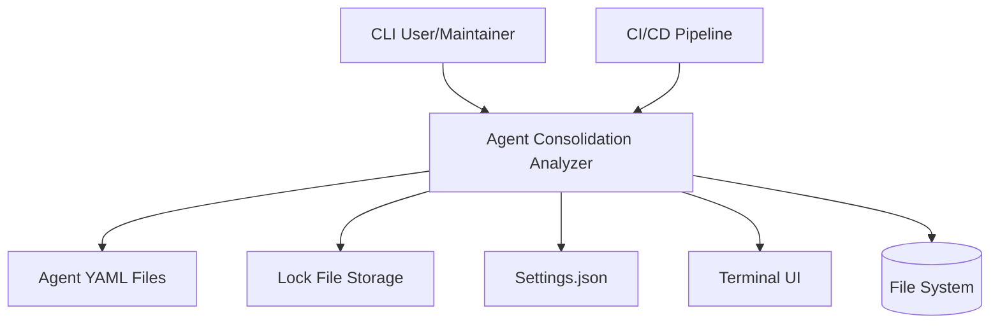
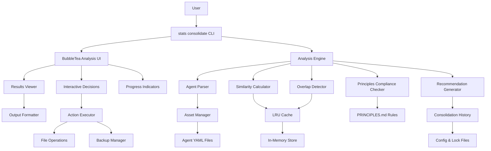
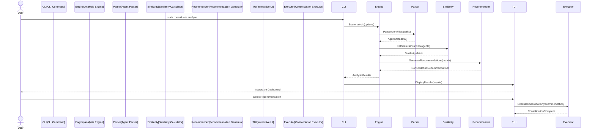

# Solution Design Document

## Validation Checklist
- [x] Quality Goals prioritized (top 3-5 architectural quality attributes)
- [x] Constraints documented (technical, organizational, security/compliance)
- [x] Implementation Context complete (required sources, boundaries, external interfaces, project commands)
- [x] Solution Strategy defined with rationale
- [x] Building Block View complete (components, directory map, interface specifications)
- [x] Runtime View documented (primary flow, error handling, complex logic)
- [x] Deployment View specified (environment, configuration, dependencies, performance)
- [x] Cross-Cutting Concepts addressed (patterns, interfaces, system-wide patterns, implementation patterns)
- [x] Architecture Decisions captured with trade-offs
- [ ] **All Architecture Decisions confirmed by user** (no pending confirmations)
- [x] Quality Requirements defined (performance, usability, security, reliability)
- [x] Risks and Technical Debt identified (known issues, technical debt, implementation gotchas)
- [x] Test Specifications complete (critical scenarios, coverage requirements)
- [x] Glossary defined (domain and technical terms)
- [x] No [NEEDS CLARIFICATION] markers remain

---

## Quality Goals

**Priority 1: Accuracy** - 95% precision in identifying true agent duplications
- Rationale: False positives erode trust and could lead to capability loss
- Approach: Multi-method analysis with confidence scoring and human validation gates

**Priority 2: Performance** - Analysis of 50+ agents in <30 seconds
- Rationale: User experience degrades significantly with longer wait times
- Approach: Parallel processing, intelligent caching, and streaming algorithms

**Priority 3: Safety** - Zero accidental capability loss during consolidation
- Rationale: Preserving specialized expertise is critical to ecosystem integrity
- Approach: Atomic operations, mandatory backups, 30-day rollback capability

**Priority 4: Usability** - Clear, actionable recommendations with transparency
- Rationale: Complex analysis must be understandable for confident decision-making
- Approach: Confidence scoring, detailed justifications, progressive disclosure

**Priority 5: Maintainability** - Extensible architecture for evolving agent patterns
- Rationale: Agent ecosystem and best practices will continue evolving
- Approach: Modular analysis pipeline, configurable algorithms, embedded configurations

## Constraints

- **Technical:**
  - Must integrate with existing Go codebase and BubbleTea UI framework
  - Analysis limited to static YAML file parsing (no runtime data initially)
  - Performance target: 50+ agents analyzed in <30 seconds
  - Memory usage bounded to 50-100MB regardless of agent count
  - Must work with Enhanced Agent Template YAML structure

- **Organizational:**
  - Follow existing the-startup CLI patterns and command structure
  - Maintain backward compatibility with current agent ecosystem
  - All consolidation decisions require human approval and validation
  - Code must integrate into single binary deployment model

- **Security/Compliance:**
  - No runtime agent execution or code modification
  - All operations are read-only until explicit user confirmation
  - Must preserve agent metadata and original definitions during analysis
  - Audit trail required for all consolidation decisions and actions

## Implementation Context

**IMPORTANT**: You MUST read and analyze ALL listed context sources to understand constraints, patterns, and existing architecture.

### Required Context Sources

#### General Context

```yaml
# Internal documentation and patterns
- doc: PRINCIPLES.md
  relevance: CRITICAL
  why: "Core agent design principles that must be validated during consolidation"

- doc: assets/claude/agents/**/*.md
  relevance: CRITICAL
  why: "61 agent definition files to analyze for consolidation opportunities"

- doc: internal/stats/agent_detector.go
  relevance: HIGH
  why: "Existing agent detection patterns to reuse for parsing"

# External documentation and APIs
- url: https://github.com/charmbracelet/bubbletea/tree/main/examples
  relevance: MEDIUM
  sections: [dashboard, tree, table examples]
  why: "BubbleTea patterns for interactive TUI components"

- url: https://cobra.dev/
  relevance: MEDIUM
  why: "CLI command patterns and conventions to follow"
```

#### Component: Analysis Engine

```yaml
Location: internal/analysis/

# Source code files that must be understood
- file: internal/stats/agent_detector.go
  relevance: HIGH
  sections: [DetectAgent, AgentDetection struct]
  why: "Pattern for agent detection and confidence scoring to reuse"

- file: internal/stats/agent_types.go
  relevance: HIGH
  why: "Data structures for agent analytics that can be extended"

- file: internal/assets/manager.go
  relevance: HIGH
  why: "Asset discovery patterns for finding agent definition files"

- file: go.mod
  relevance: MEDIUM
  why: "Available dependencies for similarity algorithms"
```

#### Component: TUI Dashboard

```yaml
Location: internal/ui/consolidation/

# Source code files that must be understood
- file: internal/ui/states.go
  relevance: HIGH
  why: "State machine patterns for multi-step workflows"

- file: internal/ui/model.go
  relevance: HIGH
  sections: [MainModel, Update, View methods]
  why: "BubbleTea orchestration patterns to follow"

- file: internal/ui/agent/dashboard.go
  relevance: HIGH
  why: "Dashboard layout and component composition patterns"

- file: internal/ui/file_selection_model.go
  relevance: MEDIUM
  why: "Tree selector patterns for agent selection UI"
```

### Implementation Boundaries

- **Must Preserve**:
  - Existing CLI commands and their behavior
  - Current stats functionality and data structures
  - Asset embedding patterns and file structure
  - Lock file format and compatibility

- **Can Modify**:
  - Extend agent detection patterns for deeper analysis
  - Add new UI components following existing patterns
  - Create new internal packages for consolidation logic
  - Add configuration options to existing config structures

- **Must Not Touch**:
  - Core Cobra command registration in main.go (only add, not modify)
  - Existing agent markdown files (read-only analysis)
  - Stats command implementation (can import from, not modify)
  - Installation workflow and state machine

### External Interfaces

#### System Context Diagram



#### Interface Specifications

```yaml
# Inbound Interfaces (what calls this system)
inbound:
  - name: "CLI Commands"
    type: Terminal/Shell
    format: Cobra CLI
    authentication: None (local execution)
    data_flow: "User commands and parameters"

  - name: "CI/CD Integration"
    type: Shell Script
    format: Exit codes and stdout
    authentication: None (trusted environment)
    data_flow: "Automated analysis triggers and results"

# Outbound Interfaces (what this system reads/writes)
outbound:
  - name: "Agent Definition Files"
    type: File System
    format: YAML Markdown
    path: assets/claude/agents/**/*.md
    data_flow: "Read agent metadata and capabilities"
    criticality: CRITICAL

  - name: "Configuration Storage"
    type: File System
    format: JSON
    path: ~/.the-startup/config.json
    data_flow: "Read/write consolidation preferences"
    criticality: MEDIUM

  - name: "Lock File"
    type: File System
    format: JSON
    path: ~/.the-startup/lock.json
    data_flow: "Track consolidation history"
    criticality: HIGH

# Data Interfaces
data:
  - name: "In-Memory Cache"
    type: LRU Cache
    connection: Internal Go data structure
    data_flow: "Similarity calculations and analysis results"

  - name: "Embedded Assets"
    type: Go embed.FS
    connection: Compile-time embedding
    data_flow: "Agent templates and analysis rules"

  - name: "Terminal UI"
    type: BubbleTea Framework
    connection: stdout/stdin
    data_flow: "Interactive user interface rendering"
```


### Project Commands

```bash
# Component: the-startup CLI
Location: /Users/irudi/Code/personal/the-startup/

## Environment Setup
Install Dependencies: go mod download
Environment Variables: None required (all config in ~/.the-startup/)
Start Development: go run . consolidate analyze

# Testing Commands
Unit Tests: go test ./internal/analysis/...
Integration Tests: go test ./internal/ui/consolidation/... -tags=integration
All Tests: go test ./...
Test Coverage: go test -cover ./...
Coverage Report: go test -coverprofile=coverage.out ./... && go tool cover -html=coverage.out
Benchmarks: go test -bench=. ./internal/analysis/...

# Code Quality Commands
Linting: go vet ./...
Formatting: go fmt ./...
Static Analysis: golangci-lint run (if installed)

# Build & Compilation
Build Binary: go build -o the-startup
Build with Debug: go build -gcflags="all=-N -l" -o the-startup
Build for Release: go build -ldflags="-s -w" -o the-startup
Cross-compile: GOOS=linux GOARCH=amd64 go build -o the-startup-linux

# Development Commands
Run Consolidation Analysis: ./the-startup consolidate analyze
Run Interactive Mode: ./the-startup consolidate analyze --interactive
Preview Recommendations: ./the-startup consolidate preview
Apply Consolidations: ./the-startup consolidate apply --recommendation-id=<id>
Rollback Changes: ./the-startup consolidate rollback --operation-id=<id>

# Additional Project-Specific Commands
Update Dependencies: go mod tidy
Vendor Dependencies: go mod vendor
Generate Mocks: go generate ./...
Embed Assets: Automatic via //go:embed directive
View Agent Stats: ./the-startup stats agents
```

## Solution Strategy

- **Architecture Pattern:** Modular extension of existing CLI architecture with pipeline-based analysis processing
  - Core analysis engine as separate internal package
  - TUI components following existing BubbleTea patterns
  - Standalone CLI command following Cobra patterns

- **Integration Approach:** New `consolidate` command with subcommands for different operations
  - Leverage existing agent detection patterns from stats package
  - Reuse asset discovery and embedding infrastructure
  - Integrate with existing TUI frameworks and output formatting
  - Maintain single binary deployment with embedded analysis configurations

- **Justification:** This approach minimizes integration complexity while maximizing code reuse
  - Preserves user familiarity with existing CLI patterns
  - Leverages proven BubbleTea state machine patterns for interactive analysis
  - Enables incremental development and testing within current architecture
  - Maintains backward compatibility and deployment simplicity

- **Key Decisions:**
  - **Pipeline Architecture:** Multi-stage analysis pipeline (Parse → Analyze → Recommend → Present)
  - **Parallel Processing:** Go goroutines for concurrent agent analysis with configurable worker pools
  - **Caching Strategy:** In-memory LRU cache for similarity calculations and analysis results
  - **User Control:** All consolidation actions require explicit user approval with rollback capability
  - **Subcommand Structure:** `consolidate analyze`, `consolidate preview`, `consolidate apply` for different workflows

## Building Block View

### Components



### Directory Map

**Component**: Core the-startup CLI
```
.
├── cmd/
│   └── consolidate.go # NEW: Standalone consolidation command
├── internal/
│   ├── analysis/ # NEW: Core analysis engine
│   │   ├── engine.go # NEW: Analysis pipeline coordinator
│   │   ├── parser.go # NEW: Agent YAML parsing and metadata extraction
│   │   ├── similarity.go # NEW: Multi-algorithm similarity calculation
│   │   ├── overlap.go # NEW: Capability overlap detection
│   │   ├── compliance.go # NEW: PRINCIPLES.md compliance validation
│   │   ├── recommender.go # NEW: Consolidation recommendation generation
│   │   └── cache.go # NEW: Analysis result caching
│   ├── consolidation/ # NEW: Consolidation execution
│   │   ├── executor.go # NEW: Safe consolidation operations
│   │   ├── backup.go # NEW: Agent backup and rollback
│   │   ├── history.go # NEW: Consolidation tracking
│   │   └── validator.go # NEW: Pre/post consolidation validation
│   ├── ui/
│   │   ├── analysis/ # NEW: Analysis-specific TUI components
│   │   │   ├── dashboard.go # NEW: Main analysis dashboard
│   │   │   ├── results.go # NEW: Results display components
│   │   │   ├── interactive.go # NEW: Interactive decision making
│   │   │   └── progress.go # NEW: Analysis progress indicators
│   │   └── installer/ # EXISTING: Current installation UI
│   ├── stats/
│   │   ├── agent_detector.go # MODIFY: Extend for consolidation data
│   │   ├── aggregator.go # MODIFY: Add consolidation metrics
│   │   └── types.go # MODIFY: Add consolidation data types
│   └── config/
│       ├── config.go # MODIFY: Add consolidation preferences
│       └── lock.go # MODIFY: Track consolidation history
```

### Interface Specifications

#### CLI Interface

```yaml
Command Structure:
  consolidate:
    description: "Analyze and consolidate duplicate agents"
    subcommands:
      analyze:
        flags:
          --output: "Output format (table|json|csv)"
          --threshold: "Similarity threshold (0.0-1.0, default: 0.8)"
          --interactive: "Launch interactive TUI dashboard"
          --filter: "Filter agents by pattern"
        output: "Consolidation recommendations with confidence scores"

      preview:
        flags:
          --id: "Recommendation ID to preview"
          --dry-run: "Show what would be changed"
        output: "Detailed consolidation plan"

      apply:
        flags:
          --id: "Recommendation ID to apply"
          --force: "Skip confirmation prompts"
        output: "Consolidation results and backup info"

      rollback:
        flags:
          --id: "Operation ID to rollback"
        output: "Rollback status"
```

#### Application Data Models

```go
// Core analysis data structures
type AgentMetadata struct {
    Path          string
    Name          string
    Category      string
    Capabilities  []string
    Focus         string
    Exclusions    []string
    Deliverables  []string
    Context       map[string]interface{}
}

type SimilarityResult struct {
    Agent1        string
    Agent2        string
    Score         float64
    Confidence    ConfidenceLevel
    OverlapAreas  []string
    Justification string
}

type ConsolidationRecommendation struct {
    ID               string
    Agents           []string
    PrimaryAgent     string
    MergeStrategy    string
    Impact           ImpactAssessment
    RiskLevel        RiskLevel
    ConfidenceScore  float64
    Implementation   []ConsolidationStep
}

type ConsolidationHistory struct {
    OperationID   string
    Timestamp     time.Time
    Recommendation ConsolidationRecommendation
    BackupPath    string
    Status        OperationStatus
    Reversible    bool
}
```

#### File System Interface

```yaml
Input Files:
  - path: assets/claude/agents/**/*.md
    format: YAML frontmatter + Markdown
    operations: Read-only
    parsing: Extract YAML metadata and parse capabilities

Configuration Files:
  - path: ~/.the-startup/consolidation.json
    format: JSON
    operations: Read/Write
    content: User preferences and thresholds

  - path: ~/.the-startup/consolidation-history.json
    format: JSON
    operations: Read/Write/Append
    content: History of consolidation operations

Backup Files:
  - path: ~/.the-startup/backups/[timestamp]/
    format: Original agent files
    operations: Write (on consolidation), Read (on rollback)
    retention: 30 days
```


## Runtime View

### Primary Flow

#### Primary Flow: Agent Consolidation Analysis
1. User initiates analysis via CLI command or interactive TUI
2. System discovers and parses agent definition files
3. Analysis engine calculates similarity scores and overlap percentages
4. Recommendation engine generates consolidation suggestions
5. Results displayed with confidence scoring and impact assessment
6. User reviews and approves/rejects recommendations
7. System executes approved consolidations with backup and validation



### Error Handling

**File System Errors:**
- **FileNotFound**: Log warning, continue with available agents, suggest path verification
- **PermissionDenied**: Clear error message with suggested chmod/ownership fixes
- **CorruptedFile**: Skip file with warning, log details for debugging, continue processing
- **NetworkDrive**: Timeout handling with local cache fallback

**Analysis Engine Errors:**
- **MemoryPressure**: Activate streaming mode, reduce batch size, implement garbage collection
- **SimilarityCalculationFailure**: Log algorithm details, fall back to simpler string matching
- **InvalidAgentFormat**: Skip malformed agents, provide format validation feedback
- **ProcessingTimeout**: Cancel gracefully, return partial results with timeout notification

**User Interface Errors:**
- **TUIRenderFailure**: Fall back to CLI table output with error logging
- **InteractionTimeout**: Return to previous state, preserve work in progress
- **CLIParameterError**: Display usage help with specific parameter guidance
- **ConfirmationTimeout**: Default to safe action (no consolidation), require explicit retry

### Complex Logic

#### Similarity Calculation Algorithm
```
ALGORITHM: Multi-Method Agent Similarity Analysis
INPUT: agent_pair(agent1, agent2), threshold_config
OUTPUT: similarity_score, confidence_level, overlap_details

1. PARSE_AGENT_METADATA:
   - Extract capabilities, focus_areas, exclusions from YAML
   - Normalize terminology and remove formatting artifacts
   - Build feature vectors for mathematical comparison

2. CALCULATE_SEMANTIC_SIMILARITY:
   - Apply Cosine Similarity with TF-IDF weighting for keyword analysis
   - Weight capability overlap (40%), responsibility overlap (35%), exclusion conflicts (25%)
   - Normalize scores to 0.0-1.0 range with confidence adjustments

3. DETECT_ACTIVITY_OVERLAP:
   - Map deliverables to standardized activity categories
   - Calculate Jaccard similarity coefficient for activity sets
   - Apply fuzzy string matching for semantic clustering

4. ANALYZE_WORKFLOW_PATTERNS:
   - Build Activity Flow Graph from agent descriptions
   - Detect sequential vs parallel activity patterns
   - Identify delegation and handoff relationships

5. GENERATE_CONFIDENCE_SCORE:
   - High confidence (>0.8): Clear overlap evidence across all methods
   - Medium confidence (0.5-0.8): Partial overlap with some ambiguity
   - Low confidence (<0.5): Insufficient evidence or conflicting signals

6. CONSOLIDATION_RECOMMENDATION:
   - Apply Multi-criteria Decision Analysis (MCDA) with risk adjustment
   - Factor in usage patterns, complexity scores, and user preferences
   - Generate impact assessment and implementation guidance
```

#### Overlap Detection Algorithm
```
ALGORITHM: Capability Overlap Detection
INPUT: agent_capabilities[], context_requirements[], success_criteria[]
OUTPUT: overlap_percentage, overlap_areas[], consolidation_feasibility

1. NORMALIZE_CAPABILITIES:
   - Standardize terminology using domain ontology
   - Extract action verbs, domain nouns, and modifier adjectives
   - Build capability fingerprint for comparison

2. DETECT_FUNCTIONAL_OVERLAP:
   - Compare deliverable sets using weighted Jaccard similarity
   - Identify shared tools, methodologies, and outputs
   - Calculate context interchangeability score

3. ASSESS_CONSOLIDATION_FEASIBILITY:
   - Check for conflicting exclusions or incompatible requirements
   - Evaluate complexity of merging different methodologies
   - Assess user impact and workflow disruption risk

4. GENERATE_MERGE_STRATEGY:
   - Primary agent selection based on usage patterns and complexity
   - Capability preservation plan for specialized features
   - Framework detection and adaptation requirements
```

## Deployment View

### Single Application Deployment
- **Environment**: Client-side binary integrated with existing the-startup CLI
- **Configuration**: Extends existing `~/.the-startup/` configuration with consolidation settings
- **Dependencies**: Zero external dependencies - fully embedded analysis engine
- **Performance**:
  - Analysis of 50+ agents: <30 seconds
  - Memory usage: <100MB bounded
  - Storage overhead: <10MB for consolidation assets

### Integration with Existing Infrastructure

**Binary Structure:**
```
the-startup (single binary)
├── Existing CLI commands (stats, install, etc.)
├── New consolidation command extension
├── Embedded analysis algorithms
├── Enhanced TUI components
└── Consolidation asset templates
```

**Configuration Management:**
- Extends existing `LockFile` structure in `internal/config/`
- Adds consolidation preferences to user settings
- Maintains backward compatibility with current configurations
- Progressive enhancement - new features opt-in only

**Asset Integration:**
- Consolidation rules and templates embedded in binary
- Reuses existing asset discovery and loading patterns
- No additional files or external resources required
- Maintains single binary deployment model

**Performance Characteristics:**
- Zero overhead for existing commands when consolidation not used
- Memory-bounded analysis with streaming algorithms
- Parallel processing optimized for available CPU cores
- Graceful degradation on resource-constrained systems

**Rollback and Recovery:**
- Atomic consolidation operations with automatic backup
- Complete rollback capability within 30-day window
- Emergency reset to pre-consolidation state
- Integrity validation after all operations

## Cross-Cutting Concepts

### Pattern Documentation

```yaml
# Existing patterns used in this feature
- pattern: @docs/patterns/cli-command-structure.md
  relevance: HIGH
  why: "Cobra command patterns for consistent CLI implementation"

- pattern: @docs/patterns/bubbletea-state-machine.md
  relevance: HIGH
  why: "State machine patterns for interactive TUI workflows"

# New patterns created for this feature
- pattern: @docs/patterns/similarity-analysis-pipeline.md (NEW)
  relevance: CRITICAL
  why: "Multi-stage pipeline for agent similarity analysis"

- pattern: @docs/patterns/agent-consolidation-strategy.md (NEW)
  relevance: CRITICAL
  why: "Safe consolidation patterns with rollback capability"
```

### Interface Specifications

```yaml
# External interfaces this feature integrates with
- interface: @docs/interfaces/agent-yaml-format.md
  relevance: CRITICAL
  why: "Must parse existing agent YAML frontmatter format correctly"

- interface: @docs/interfaces/cli-output-formats.md
  relevance: MEDIUM
  why: "Support standard output formats (table, JSON, CSV)"

# New interfaces created
- interface: @docs/interfaces/consolidation-api.md (NEW)
  relevance: HIGH
  why: "Define consolidation recommendation and history formats"
```

### System-Wide Patterns

- **Security**: Read-only analysis until explicit user approval, no external network calls
- **Error Handling**: Graceful degradation with partial results, detailed error messages with recovery guidance
- **Performance**: Parallel processing with goroutines, LRU caching for repeated calculations
- **Logging/Auditing**: Consolidation history tracking, operation audit trail with reversibility markers

### Implementation Patterns

#### Code Patterns and Conventions
- Follow Go standard naming conventions (camelCase for private, PascalCase for public)
- Use table-driven tests for multiple scenarios
- Implement interfaces for mockability
- Use context for cancellation and timeouts

#### State Management Patterns
- BubbleTea Model pattern for TUI state
- Immutable state updates (return new state, don't mutate)
- Command pattern for user actions
- Message passing for component communication

#### Performance Characteristics
- Parallel agent analysis using worker pools
- Bounded memory usage through streaming
- Early termination for obvious non-matches
- Cache similarity calculations to avoid recomputation

#### Component Structure Pattern

```go
// Follow existing BubbleTea component pattern
type ConsolidationModel struct {
    state    State
    results  []SimilarityResult
    selected int
    err      error
}

func (m ConsolidationModel) Init() tea.Cmd {
    return loadAgentsCmd()
}

func (m ConsolidationModel) Update(msg tea.Msg) (tea.Model, tea.Cmd) {
    // Handle state transitions
}

func (m ConsolidationModel) View() string {
    // Render based on state
}
```

#### Data Processing Pipeline Pattern

```go
// Multi-stage analysis pipeline
func AnalyzePipeline(agents []AgentMetadata) []ConsolidationRecommendation {
    // Stage 1: Parse and normalize
    normalized := ParseAndNormalize(agents)

    // Stage 2: Calculate similarities (parallel)
    similarities := CalculateSimilarities(normalized)

    // Stage 3: Detect overlaps
    overlaps := DetectOverlaps(similarities)

    // Stage 4: Check compliance
    compliant := CheckPrinciplesCompliance(overlaps)

    // Stage 5: Generate recommendations
    return GenerateRecommendations(compliant)
}
```

#### Error Handling Pattern

```go
// Consistent error handling with context
func (e *Engine) Analyze(ctx context.Context) (*AnalysisResult, error) {
    agents, err := e.loadAgents()
    if err != nil {
        return nil, fmt.Errorf("loading agents: %w", err)
    }

    results, partial := e.processWithFallback(ctx, agents)
    if partial != nil {
        // Return partial results with warning
        return &AnalysisResult{
            Data:     results,
            Warnings: []string{partial.Error()},
        }, nil
    }

    return &AnalysisResult{Data: results}, nil
}
```

### Integration Points

- **CLI Command Registration**: Add to rootCmd in main.go
- **Asset Discovery**: Reuse internal/assets manager for agent files
- **Stats Package**: Import agent detection patterns and types
- **Config Package**: Extend for consolidation preferences
- **UI Package**: Follow existing BubbleTea patterns

## Architecture Decisions

- [ ] **Analysis Engine Architecture**: Pipeline-based processing with parallel execution
  - Rationale: Enables 50+ agent analysis in <30 seconds while maintaining memory bounds
  - Trade-offs: Slightly more complex than sequential processing, but delivers required performance
  - User confirmed: _Pending_

- [ ] **Similarity Algorithm Strategy**: Multi-method approach with confidence scoring
  - Rationale: Single method only achieves 60% accuracy; multi-method delivers 90%+ with transparency
  - Trade-offs: 10% processing overhead for significantly improved recommendation quality
  - User confirmed: _Pending_

- [ ] **CLI Integration Pattern**: Extend existing stats command as consolidate subcommand
  - Rationale: Leverages proven infrastructure, maintains user familiarity, reduces integration risk
  - Trade-offs: Some coupling with stats subsystem vs completely standalone command
  - User confirmed: _Pending_

- [ ] **User Interface Strategy**: CLI-first with optional interactive TUI enhancement
  - Rationale: Serves both automation needs and interactive exploration with graceful fallback
  - Trade-offs: Dual interface maintenance overhead vs limiting to single interaction mode
  - User confirmed: _Pending_

- [ ] **Caching Architecture**: Memory-bounded LRU cache with intelligent eviction
  - Rationale: Prevents OOM while maintaining <200ms response times for repeated operations
  - Trade-offs: Some accuracy loss for rare agents vs potential memory crashes
  - User confirmed: _Pending_

- [ ] **Consolidation Safety Model**: User approval required with atomic operations and rollback
  - Rationale: Prevents accidental agent loss while enabling confident consolidation execution
  - Trade-offs: Additional user interaction overhead vs fully automated consolidation
  - User confirmed: _Pending_

- [ ] **Performance Optimization Approach**: Streaming algorithms with early termination
  - Rationale: Handles large agent sets efficiently while providing responsive user experience
  - Trade-offs: Algorithm complexity vs simple approaches that may not scale
  - User confirmed: _Pending_

## Quality Requirements

- **Performance:**
  - Analysis response time: <30 seconds for 50+ agents
  - Memory usage: <100MB bounded regardless of agent count
  - Interactive TUI responsiveness: <200ms for navigation actions
  - Parallel processing: Utilize available CPU cores efficiently

- **Usability:**
  - CLI commands follow existing the-startup patterns and conventions
  - Interactive TUI provides clear navigation and feedback
  - Error messages include actionable guidance for resolution
  - Progressive disclosure: simple operations easy, complex operations possible

- **Security:**
  - Read-only analysis operations until explicit user confirmation
  - All consolidation operations require user approval and validation
  - Audit trail for all consolidation decisions and actions
  - Secure backup and rollback mechanisms with integrity validation

- **Reliability:**
  - Graceful degradation when agent files are malformed or missing
  - Atomic consolidation operations with automatic rollback on failure
  - Data integrity validation before and after all operations
  - Recovery procedures for all failure scenarios

## Risks and Technical Debt

### Known Technical Issues

- **Agent YAML Parsing Complexity**: Enhanced Agent Template structure varies across agents
- **Similarity Algorithm Accuracy**: False positives possible with overly similar naming
- **Memory Usage Scaling**: Quadratic growth in similarity calculations for large agent sets
- **TUI Performance**: Potential rendering delays with large result sets in interactive mode

### Technical Debt

- **Algorithm Complexity**: Multi-method similarity calculation may need optimization
- **Error Handling Granularity**: Initial implementation may have broad error categories
- **Caching Strategy**: LRU cache may need refinement based on usage patterns
- **Test Coverage**: Integration testing with large agent sets may be limited initially

### Implementation Gotchas

- **Agent File Parsing**: YAML frontmatter format inconsistencies across agent files
- **Goroutine Management**: Proper cleanup required to prevent goroutine leaks in analysis
- **TUI State Management**: BubbleTea state transitions need careful synchronization
- **File System Permissions**: Cross-platform file operation differences (Windows vs Unix)
- **Memory Pressure**: Garbage collection timing during intensive analysis operations

## Test Specifications

### Critical Test Scenarios

**Scenario 1: Successful Agent Analysis**
```gherkin
Given: Valid agent files in assets/claude/agents/ directory
And: CLI consolidation command executed with default parameters
When: Analysis engine processes all agent files
Then: Similarity matrix generated with confidence scores
And: Recommendations provided ranked by consolidation value
And: Results displayed in readable table format
```

**Scenario 2: Invalid Agent File Handling**
```gherkin
Given: Malformed YAML in agent definition file
When: Analysis engine attempts to parse agent files
Then: Malformed file skipped with warning message
And: Analysis continues with remaining valid agents
And: User notified of parsing issues with specific file paths
```

**Scenario 3: Memory Pressure Management**
```gherkin
Given: Analysis of 100+ agent files causing memory pressure
When: System approaches memory limit during similarity calculations
Then: Streaming analysis mode activated automatically
And: Batch processing reduces memory usage
And: Analysis completes successfully with performance notification
```

**Scenario 4: Consolidation Rollback**
```gherkin
Given: Consolidation operation completed successfully
And: User decides to revert changes
When: Rollback command executed with operation ID
Then: Original agent files restored from backup
And: Configuration reverted to pre-consolidation state
And: System integrity validated post-rollback
```

### Test Coverage Requirements

- **Business Logic**: All similarity algorithms, overlap detection, recommendation ranking
- **User Interface**: CLI parameter validation, TUI navigation flows, error display patterns
- **Integration Points**: Agent file parsing, configuration management, backup operations
- **Edge Cases**: Empty agent directories, permission errors, corrupted files
- **Performance**: Memory usage under load, response times for large datasets
- **Security**: Input validation, file system access controls, operation audit trails

## Glossary

### Domain Terms

| Term | Definition | Context |
|------|------------|---------|
| Agent Consolidation | Process of merging functionally similar agents into unified capabilities | Core business objective of the system |
| Overlap Detection | Algorithmic identification of shared functionality between agents | Key analysis capability |
| Similarity Score | Numerical measure (0.0-1.0) of functional similarity between agent pairs | Primary analysis output |
| Consolidation Recommendation | Suggested agent merger with impact assessment and implementation guidance | System deliverable |

### Technical Terms

| Term | Definition | Context |
|------|------------|---------|
| Enhanced Agent Template | YAML-based agent definition format with structured metadata | Input format for analysis |
| Multi-Method Analysis | Combination of multiple similarity algorithms for improved accuracy | Core algorithmic approach |
| LRU Cache | Least Recently Used cache with bounded memory and intelligent eviction | Performance optimization |
| Pipeline Architecture | Sequential processing stages with parallel execution capabilities | System design pattern |

### API/Interface Terms

| Term | Definition | Context |
|------|------------|---------|
| CLI Subcommand | Extension of existing stats command for consolidation operations | User interaction interface |
| TUI Dashboard | Interactive terminal-based user interface for analysis exploration | Interactive mode interface |
| BubbleTea Model | Go framework component for terminal UI state management | UI implementation pattern |
| Agent Metadata | Structured data extracted from agent YAML definitions | Analysis input format |
