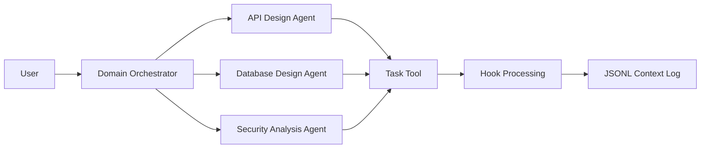

# Solution Design Document

## Constraints

- **Technical**: Must maintain "the-*" naming convention for all agents; preserve existing Task tool invocation pattern (`Task(subagent_type="name")`); maintain Go embed.FS asset system; ensure seamless transition to new specialized structure
- **Organizational**: Cannot break existing commands (/s:specify, /s:implement, /s:refactor) that depend on current agent names; must preserve existing agent capabilities; minimize disruption to active development workflows
- **Security/Compliance**: Maintain secure file handling patterns; preserve input validation in hook processing; ensure agent isolation principles remain intact
- **Performance**: Maintain current agent loading speed; avoid memory overhead from nested directory scanning; preserve efficient JSONL logging performance

## Implementation Context

*Bridge between current flat agent structure and specialized domain-organized architecture. Current system uses broad role-based agents that must be refactored into specialized activity agents while preserving all functionality.*

### Source Code to Analyze
```yaml
# Core agent definition files - must preserve all capabilities
- file: @/Users/irudi/Code/personal/the-startup/assets/claude/agents/the-backend-engineer.md
  relevance: CRITICAL
  sections: [complete file - capabilities, focus areas, approach]
  why: "Reference pattern for creating specialized backend agents"

- file: @/Users/irudi/Code/personal/the-startup/assets/claude/agents/the-software-architect.md
  relevance: CRITICAL
  sections: [complete file - architecture patterns, decision frameworks]
  why: "Must preserve architectural guidance in domain orchestrators"

- file: @/Users/irudi/Code/personal/the-startup/assets/claude/agents/the-security-engineer.md
  relevance: CRITICAL
  sections: [complete file - security practices, validation patterns]
  why: "Security expertise must be preserved across all domains"

- file: @/Users/irudi/Code/personal/the-startup/assets/claude/agents/the-qa-engineer.md
  relevance: HIGH
  sections: [complete file - testing strategies, validation approaches]
  why: "Quality practices must be integrated into specialized agents"

# Command orchestration system - must not break
- file: @/Users/irudi/Code/personal/the-startup/assets/claude/commands/s/implement.md
  relevance: CRITICAL
  sections: [lines 22-24, agent delegation rules reference]
  why: "Implementation command depends on agent delegation patterns"

- file: @/Users/irudi/Code/personal/the-startup/assets/claude/commands/s/refactor.md
  relevance: HIGH
  sections: [complete file - agent usage patterns]
  why: "Refactor command must continue working with new agent structure"

# Asset loading and embedding system
- file: @/Users/irudi/Code/personal/the-startup/main.go
  relevance: MEDIUM
  sections: [embed.FS declarations, asset loading]
  why: "Must handle nested directory structure in embedded filesystem"

- file: @/Users/irudi/Code/personal/the-startup/internal/installer/installer.go
  relevance: HIGH
  sections: [installClaudeAssets function, file walking logic]
  why: "Must install nested agent directories correctly"

# Hook processing system - agent name extraction
- file: @/Users/irudi/Code/personal/the-startup/internal/log/agent_id.go
  relevance: MEDIUM
  sections: [extractAgentID function, subagent_type processing]
  why: "Must continue extracting agent IDs from nested structure"

- file: @/Users/irudi/Code/personal/the-startup/internal/log/processor.go
  relevance: MEDIUM  
  sections: [lines 77+, Task tool filtering logic]
  why: "Must process new specialized agents correctly"

# Agent delegation rules and patterns
- file: @/Users/irudi/.config/the-startup/rules/agent-delegation.md
  relevance: HIGH
  sections: [complete file - parallel execution, task decomposition]
  why: "Specialization enhances these patterns significantly"
```

### External Documentation
```yaml
# LLM specialization performance research (2024-2025)
- url: https://arxiv.org/html/2501.06322v1
  relevance: CRITICAL
  why: "Multi-Agent Collaboration Mechanisms survey showing 2.86%-21.88% performance improvements with task specialization"

- url: https://arxiv.org/html/2412.04093v1  
  relevance: HIGH
  why: "Practical Considerations for Agentic LLM Systems - recommends specialized roles for well-defined tasks"

# Popular AI agent frameworks proving activity-based specialization
- url: https://github.com/crewAIInc/crewAI
  relevance: CRITICAL
  why: "Uses expertise-based agents (Senior Market Analyst, Data Researcher) not engineering roles"

- url: https://github.com/microsoft/autogen
  relevance: HIGH
  why: "Organizes agents by domain knowledge (math expert, chemistry expert) with generic assistant coordination"

- url: https://github.com/langchain-ai/langgraph
  relevance: HIGH
  why: "Uses functional roles with capability-driven specialization through tools"

- url: https://github.com/SylphAI-Inc/LLM-engineer-handbook
  relevance: MEDIUM
  why: "Recommends skill-based specializations over traditional engineering role boundaries"

# Claude Code agent system documentation  
- doc: @/Users/irudi/Code/personal/the-startup/docs/patterns/orchestration-mcp-integration.md
  relevance: HIGH
  why: "Current orchestration patterns that must be preserved"

- doc: @/Users/irudi/Code/personal/the-startup/docs/specs/S009-agent-best-practices-enhancement/
  relevance: MEDIUM
  why: "Recent agent enhancement patterns to build upon"
```

### Implementation Boundaries
- **Must Preserve**: All current agent capabilities and expertise areas; Task tool invocation pattern; embed.FS asset system; existing command functionality; hook processing and logging
- **Can Modify**: Agent file organization and directory structure; agent content structure and specialization; delegation patterns and orchestration logic; installation and discovery processes
- **Must Not Touch**: Core hook processing JSON format; Task tool API; embed.FS compilation patterns; JSONL logging format; existing settings.json integration

### Project Commands

```bash
# Environment Setup
Install Dependencies: go mod tidy
Environment Setup: go build -o the-startup
Start Development: ./the-startup install

# Validation (run after each phase)
Code Quality: go fmt ./... && go vet ./...
Type Safety: go build -o /dev/null ./...
Run Tests: go test ./... -v
Build Project: go build -o the-startup

# Testing Asset Changes
Test Agent Loading: ./the-startup install --dry-run
Test Hook Processing: echo '{"tool_name":"Task","tool_input":{"subagent_type":"the-api-design"}}' | ./the-startup log --assistant
Validate Agent Discovery: find assets/claude/agents -name "*.md" | wc -l

# Agent Structure Validation
Test Orchestrator Patterns: grep -r "the-.*-orchestrator" assets/claude/agents/
Validate Naming Convention: find assets/claude/agents -name "*.md" | grep -v "^assets/claude/agents/the-" || echo "All agents follow naming convention"
Check Command Compatibility: grep -r "subagent_type" assets/claude/commands/
```

## Solution Strategy

- **Architecture Pattern**: Activity-Based Specialization - organize agents by capabilities and activities rather than traditional engineering roles, following proven LLM multi-agent patterns from CrewAI, AutoGen, and LangGraph research
- **Integration Approach**: Consolidate development activities under unified "the-developer" with task-specific specializations, while preserving truly domain-specific agents (mobile, security, UX); maintain existing Task tool patterns with enhanced parallel execution capabilities  
- **Justification**: Research from 2024-2025 consistently shows LLMs perform 2.86%-21.88% better with task-based specialization vs role-based organization. Popular frameworks (CrewAI, AutoGen, LangGraph) unanimously use capability-driven agents rather than traditional engineering silos. Modern full-stack development makes backend/frontend boundaries artificial for LLM context.

## Building Block View

### Components



### Directory Map

**Principles-Based Agent Architecture** - Following evidence-based design patterns from [PRINCIPLES.md](../../../PRINCIPLES.md):

```
assets/claude/agents/
├── the-chief.md                      # TOP-LEVEL: Main router, complexity assessor, orchestrator of orchestrators
├── the-analyst/                      # Research and analysis specializations
│   ├── requirements-clarification.md # Understanding vague/incomplete requirements (from the-business-analyst)
│   ├── feature-prioritization.md     # Prioritizing features, defining success metrics (from the-product-manager) 
│   ├── project-coordination.md       # Task breakdown, dependencies, progress tracking (from the-project-manager)
│   ├── solution-research.md          # Common approaches to specific problems, pattern analysis
│   └── requirements-documentation.md # BRD, PRD, user-facing specifications (from the-technical-writer)
├── the-architect/                    # System design and architecture specializations
│   ├── system-design.md              # High-level architecture, service boundaries, integration patterns (from the-software-architect)
│   ├── technology-evaluation.md      # Framework selection, trade-off analysis, decision documentation (from the-software-architect)
│   ├── scalability-planning.md       # Performance requirements, load planning, resource architecture (from the-software-architect)
│   ├── architecture-review.md        # Design validation, pattern compliance, quality gates (from the-software-architect)
│   ├── technology-standards.md       # Technical standards, cross-team alignment, framework decisions (from the-staff-engineer)
│   ├── code-review.md                # Code quality analysis, mentorship feedback, pattern compliance (from the-lead-engineer)
│   └── system-documentation.md       # Architecture diagrams, design decisions, technical specifications
├── the-software-engineer/            # Unified software development activities (eliminates artificial backend/frontend boundary)
│   ├── api-design.md                 # REST/GraphQL APIs, endpoints, versioning (from the-backend-engineer)
│   ├── database-design.md            # Schema design, queries, migrations (from the-backend-engineer)
│   ├── business-logic.md             # Domain rules, validation, transaction handling (from the-backend-engineer)
│   ├── component-architecture.md     # UI components, reusable patterns (from the-frontend-engineer)
│   ├── state-management.md           # Client/server state, reactivity patterns (from the-frontend-engineer)
│   ├── performance-optimization.md   # Bundle optimization, rendering performance (from the-frontend-engineer)
│   ├── browser-compatibility.md      # Cross-browser support, progressive enhancement (from the-frontend-engineer)
│   ├── service-integration.md        # Message queues, event streaming, service communication (from the-backend-engineer)
│   ├── reliability-engineering.md    # Error handling, retries, circuit breakers (from the-backend-engineer)
│   └── api-documentation.md          # API docs, endpoint specifications, developer guides
├── the-ml-engineer/                  # Machine learning and AI specializations
│   ├── model-deployment.md           # API wrappers, inference optimization, serving infrastructure (from the-ml-engineer)
│   ├── feature-engineering.md        # Data pipelines, feature stores, preprocessing automation (from the-ml-engineer)
│   ├── mlops-automation.md           # Model versioning, deployment pipelines, experiment tracking (from the-ml-engineer)
│   ├── ml-monitoring.md              # Model drift detection, prediction quality, A/B testing (from the-ml-engineer)
│   ├── context-management.md         # AI context, memory, inter-agent communication (from the-context-engineer)
│   └── prompt-optimization.md        # Claude prompts, agent instructions (from the-prompt-engineer)
├── the-designer/                     # User experience and design specializations
│   ├── user-research.md              # User interviews, usability testing, personas, journey mapping (from the-ux-designer)
│   ├── accessibility-implementation.md # WCAG compliance, screen reader support, inclusive design (from the-ux-designer)
│   ├── interaction-design.md         # User flows, wireframes, prototypes, navigation patterns (from the-ux-designer)
│   ├── information-architecture.md   # Content hierarchy, navigation structure, findability (from the-ux-designer)
│   ├── design-systems.md             # Component libraries, style guides, design vision (from the-principal-designer)
│   └── visual-design.md              # UI aesthetics, typography, color, layout (from the-principal-designer)
├── the-security-engineer/            # Security-focused specializations
│   ├── vulnerability-assessment.md   # OWASP Top 10, penetration testing, threat modeling (from the-security-engineer)
│   ├── authentication-systems.md     # OAuth, JWT, SSO implementation, session management (from the-security-engineer)
│   ├── data-protection.md            # Encryption, key management, privacy compliance (from the-security-engineer)
│   ├── security-incident-response.md # Quick containment, remediation, forensics (from the-security-engineer)
│   └── compliance-audit.md           # GDPR, SOX, HIPAA, security standards (from the-compliance-officer)
├── the-platform-engineer/            # Infrastructure and deployment specializations
│   ├── ci-cd-automation.md           # Build, test, deploy pipelines, automation workflows (from the-devops-engineer)
│   ├── containerization.md           # Docker images, Kubernetes orchestration, scaling (from the-devops-engineer)
│   ├── infrastructure-as-code.md     # Terraform, CloudFormation, version-controlled infrastructure (from the-devops-engineer)
│   ├── deployment-strategies.md      # Blue-green, canary deployments, rollback automation (from the-devops-engineer)
│   ├── observability.md              # Monitoring, metrics, logging, alerting (from the-devops-engineer)
│   ├── incident-response.md          # Production debugging, root cause analysis (from the-site-reliability-engineer)
│   ├── system-performance.md         # Performance tuning, bottleneck analysis (from the-performance-engineer)
│   ├── query-optimization.md         # SQL performance, indexing, explain plans (from the-data-engineer)
│   ├── data-modeling.md              # Schema design, normalization vs performance (from the-data-engineer)
│   ├── pipeline-engineering.md       # ETL/ELT reliability, data flow architecture (from the-data-engineer)
│   └── storage-architecture.md       # Database selection, scaling strategies (from the-data-engineer)
├── the-qa-engineer/                  # Quality assurance specializations
│   ├── test-strategy.md              # Risk-based testing, coverage decisions (from the-qa-lead)
│   ├── test-implementation.md        # Unit/integration/E2E writing and execution (from the-qa-engineer)
│   ├── performance-testing.md        # Load, stress, concurrency testing (from the-qa-engineer/performance-engineer)
│   └── exploratory-testing.md        # User journey validation, edge case discovery (from the-qa-engineer)
├── the-mobile-engineer/              # Mobile-specific development activities
│   ├── mobile-interface-design.md    # iOS HIG + Material Design patterns, native UI components
│   ├── mobile-data-persistence.md    # Core Data, Room, SQLite, offline-first patterns
│   ├── mobile-deployment.md          # App Store Connect, Google Play, code signing, distribution
│   ├── mobile-performance.md         # Battery optimization, memory management, network efficiency
│   └── cross-platform-integration.md # React Native, Flutter, native bridge patterns
└── the-meta-agent.md                 # STANDALONE: Agent generation and design expertise
```

**Complete Agent Mapping - Current → Future**:

| Current Agent | Maps To | Rationale |
|---------------|---------|-----------|
| **the-chief.md** | **the-chief.md** (enhanced as top-level orchestrator) | Remains as main router and complexity assessor |
| **the-business-analyst.md** | **the-analyst/requirements-clarification.md** | Activity: clarifying vague requirements |
| **the-product-manager.md** | **the-analyst/feature-prioritization.md** | Activity: prioritizing features and defining success metrics |
| **the-project-manager.md** | **the-analyst/project-coordination.md** | Activity: task breakdown and dependency management |
| **the-software-architect.md** | **the-architect/system-design.md** + **technology-evaluation.md** + **scalability-planning.md** + **architecture-review.md** | Activities: system architecture, technology decisions, scalability, design validation |
| **the-staff-engineer.md** | **the-architect/technology-standards.md** | Activity: setting technical standards and cross-team patterns |
| **the-lead-engineer.md** | **the-architect/code-review.md** | Activity: code quality review and mentorship feedback |
| **the-backend-engineer.md** | **the-software-engineer/api-design.md** + **database-design.md** + **business-logic.md** + **service-integration.md** + **reliability-engineering.md** | Activities: API endpoints, data persistence, business rules, service communication, reliability |
| **the-frontend-engineer.md** | **the-software-engineer/component-architecture.md** + **state-management.md** + **performance-optimization.md** + **browser-compatibility.md** | Activities: UI components, client-side state, performance, cross-browser support |
| **the-mobile-engineer.md** | **the-mobile-engineer/mobile-interface-design.md** + **mobile-data-persistence.md** + **mobile-deployment.md** + **mobile-performance.md** + **cross-platform-integration.md** | Activities: mobile UI design, mobile data management, app store deployment, mobile performance, cross-platform patterns |
| **the-ml-engineer.md** | **the-ml-engineer/model-deployment.md** + **feature-engineering.md** + **mlops-automation.md** + **ml-monitoring.md** | Activities: model deployment, feature engineering, MLOps, monitoring |
| **the-context-engineer.md** | **the-ml-engineer/context-management.md** | Activity: AI context and memory systems |
| **the-prompt-engineer.md** | **the-ml-engineer/prompt-optimization.md** | Activity: Claude prompt crafting and optimization |
| **the-qa-engineer.md** | **the-qa-engineer/test-implementation.md** + **exploratory-testing.md** | Activities: test code writing, user journey validation |
| **the-qa-lead.md** | **the-qa-engineer/test-strategy.md** + **performance-testing.md** | Activities: test planning, performance testing strategy |
| **the-security-engineer.md** | **the-security-engineer/vulnerability-assessment.md** + **authentication-systems.md** + **data-protection.md** + **security-incident-response.md** | Activities: security analysis, auth systems, data protection, incident response |
| **the-compliance-officer.md** | **the-security-engineer/compliance-audit.md** | Activity: regulatory compliance verification |
| **the-devops-engineer.md** | **the-platform-engineer/ci-cd-automation.md** + **containerization.md** + **infrastructure-as-code.md** + **deployment-strategies.md** + **observability.md** | Activities: CI/CD, containers, IaC, deployment, monitoring |
| **the-site-reliability-engineer.md** | **the-platform-engineer/incident-response.md** | Activity: production debugging and root cause analysis |
| **the-performance-engineer.md** | **the-platform-engineer/system-performance.md** | Activity: system performance tuning and bottleneck analysis |
| **the-data-engineer.md** | **the-platform-engineer/query-optimization.md** + **data-modeling.md** + **pipeline-engineering.md** + **storage-architecture.md** | Activities: query optimization, data modeling, pipeline engineering, storage architecture |
| **the-ux-designer.md** | **the-designer/user-research.md** + **accessibility-implementation.md** + **interaction-design.md** + **information-architecture.md** | Activities: user research, accessibility, interaction design, information architecture |
| **the-principal-designer.md** | **the-designer/design-systems.md** + **visual-design.md** | Activities: design systems architecture, visual design standards |
| **the-technical-writer.md** | **ELIMINATED** - Documentation distributed to domain agents: **the-software-engineer/api-documentation.md** + **the-architect/system-documentation.md** + **the-analyst/requirements-documentation.md** | Activity-based documentation by domain experts eliminates handoff friction |
| **the-meta-agent.md** | **the-meta-agent.md** (STANDALONE) | Specialized agent generation and design |

**Key Design Principles Applied**:
- **Single Responsibility**: Each agent handles exactly one activity/specialization
- **Separation of Concerns**: Analysis → Design → Implementation → Review workflow
- **Activity-Based Organization**: Organized by WHAT agents do, not WHO they represent
- **Framework-Aware Activities**: Agents adapt to detected frameworks while maintaining activity focus
- **Human-Readable Navigation**: Familiar role buckets (developer, architect, designer)
- **Conway's Law**: Structure mirrors effective software team communication patterns
- **Modular Composability**: Agents can be combined for complex workflows

### Interface Specifications (Internal Changes Only)

#### Agent Discovery and Loading Changes
```yaml
# Asset loading system modifications
Function: walkAgentsDirectory (NEW)
  Purpose: Recursively discover agents in nested directories
  Input: embed.FS, basePath string
  Output: map[string]string (agentName -> content)
  Logic: Preserve "the-*" prefix while handling nested paths

Function: loadAgentContent (MODIFIED)
  Purpose: Load agent content with nested path resolution
  Input: agentName string, agentFS embed.FS  
  Output: string content, error
  Logic: Search across domain directories for agent name
```

#### Agent Delegation System Changes  
```yaml
# Enhanced delegation patterns for specialization
Function: delegateSpecializedTasks (NEW)
  Purpose: Enable parallel delegation to specialized agents
  Input: taskList []SpecializedTask, domain string
  Output: []AgentResponse, error
  Logic: Group tasks by specialization, execute in parallel

Type: SpecializedTask (NEW)
  Fields:
    agent: string (e.g., "the-api-design")
    focus: string (specific task scope)
    context: string (relevant requirements/constraints)
    excludes: []string (what NOT to do)
    success_criteria: string (completion definition)
```

#### Application Data Models
```yaml
# Agent metadata for orchestration
ENTITY: AgentMetadata (NEW)
  FIELDS:
    name: string (agent identifier)
    domain: string (analyst, architect, developer, etc.)  
    specialization: string (specific expertise area)
    framework_awareness: []string (supported frameworks/technologies)
    parallel_capable: boolean (can run with other agents)
    
  BEHAVIORS:
    + isSpecialized(): boolean (NEW)
    + detectFramework(codebase_context): string (NEW)
    + applyFrameworkPatterns(framework, context): string (NEW) 
    + canRunParallel(other_agents): boolean (NEW)

ENTITY: DelegationContext (NEW)
  FIELDS:
    source_agent: string
    target_agents: []string
    shared_context: string
    framework_context: string (detected frameworks)
    isolation_boundaries: []string
    
  BEHAVIORS:
    + prepareContext(agent): string (NEW)
    + detectProjectFrameworks(codebase): []string (NEW)
    + validateIsolation(): boolean (NEW)

ENTITY: FrameworkContext (NEW)
  FIELDS:
    detected_frameworks: []string
    version_info: map[string]string
    project_patterns: []string
    relevant_conventions: []string
    
  BEHAVIORS:
    + detectFromCodebase(files): FrameworkContext (NEW)
    + getRelevantPatterns(activity): []string (NEW)
```

#### Integration Points
```yaml
# How specialized agents connect to orchestration system
Task_Tool_Integration:
  - doc: @/Users/irudi/Code/personal/the-startup/docs/patterns/orchestration-mcp-integration.md
  - sections: [task_delegation, parallel_execution]
  - integration: "Specialized agents invoked through existing Task tool with enhanced context"
  - critical_data: [subagent_type, specialized_context, isolation_boundaries]

Hook_Processing_Integration:
  - doc: @/Users/irudi/Code/personal/the-startup/internal/log/processor.go
  - sections: [agent_id_extraction, jsonl_logging]
  - integration: "Enhanced to handle nested agent directory structure"
  - critical_data: [nested_agent_paths, domain_classification, specialization_metadata]
```

## Runtime View

#### Primary Flow: Specialized Task Orchestration
1. User invokes orchestrator agent (e.g., `the-backend-orchestrator`)
2. Orchestrator analyzes task complexity and required specializations
3. Orchestrator decomposes task into specialized activities
4. System validates parallel execution feasibility and agent availability
5. Multiple specialized agents execute concurrently with isolated contexts
6. Results aggregated and validated by orchestrator
7. Unified response delivered to user

```plantuml
@startuml
actor User
participant BackendOrchestrator as "the-backend-orchestrator"
participant APIDesignAgent as "the-api-design" 
participant DatabaseAgent as "the-database-design"
participant SecurityAgent as "the-security-audit"
participant TaskTool

User -> BackendOrchestrator : Task(subagent_type: "the-backend-orchestrator", prompt: "Build user auth system")
BackendOrchestrator -> BackendOrchestrator : analyzeComplexity()
BackendOrchestrator -> BackendOrchestrator : decomposeIntoSpecializations()

par Parallel Specialization
    BackendOrchestrator -> TaskTool : Task(subagent_type: "the-api-design", context: "Auth API endpoints")
    TaskTool -> APIDesignAgent : Execute with specialized context
    APIDesignAgent --> TaskTool : API specification
    
and
    BackendOrchestrator -> TaskTool : Task(subagent_type: "the-database-design", context: "User auth schema")  
    TaskTool -> DatabaseAgent : Execute with specialized context
    DatabaseAgent --> TaskTool : Database schema
    
and
    BackendOrchestrator -> TaskTool : Task(subagent_type: "the-security-audit", context: "Auth security review")
    TaskTool -> SecurityAgent : Execute with specialized context  
    SecurityAgent --> TaskTool : Security recommendations
end

BackendOrchestrator -> BackendOrchestrator : aggregateResults()
BackendOrchestrator -> BackendOrchestrator : validateIntegration()
BackendOrchestrator --> User : Comprehensive auth system implementation
@enduml
```

### Error Handling
- **Invalid specialization request**: Orchestrator falls back to broad agent or suggests alternative specialization path
- **Specialization conflict**: Detect conflicting requirements between specialized agents, escalate to orchestrator for resolution
- **Parallel execution failure**: Continue with completed agents, retry failed agents sequentially, provide partial results with warnings

### Complex Logic
```
ALGORITHM: Orchestrate Specialized Tasks
INPUT: user_request, complexity_assessment, available_specializations
OUTPUT: coordinated_specialized_results

1. ANALYZE_COMPLEXITY: 
   - Extract domain requirements (backend, frontend, platform)
   - Identify specialization needs (API, database, security, UI, etc.)
   - Assess parallel execution feasibility

2. DECOMPOSE_TASK:
   - Map requirements to specialized agent capabilities
   - Create isolated contexts for each specialization  
   - Define success criteria and integration points
   - Identify dependency relationships

3. EXECUTE_SPECIALIZATIONS:
   - Launch parallel specialized agents via Task tool
   - Monitor progress and intermediate results
   - Handle conflicts and dependency violations
   - Validate isolated execution boundaries

4. INTEGRATE_RESULTS:
   - Aggregate specialized outputs
   - Validate cross-specialization consistency
   - Resolve conflicts and gaps
   - Generate comprehensive solution

5. RESPOND:
   - Provide unified implementation
   - Include specialization breakdown
   - Highlight parallel execution efficiency
   - Document decision rationale
```

## Deployment View

- **Environment**: Compiled Go binary with embedded agents via embed.FS; supports existing installation paths (~/.claude, .the-startup)
- **Configuration**: Maintains existing settings.json integration; preserves hook configuration; supports nested agent directory discovery
- **Dependencies**: No new external dependencies; leverages existing Task tool and hook processing system; compatible with current Claude Code integration
- **Performance**: Improved parallel execution capability; maintains current agent loading speed; enhanced task decomposition and specialization efficiency

## Research Foundation

### LLM Specialization Performance Research (2024-2025)

**Critical Finding**: Task-based specialization consistently outperforms role-based organization for LLM agents.

#### Multi-Agent Collaboration Studies
- **ArXiv 2501.06322v1**: "Multi-Agent Collaboration Mechanisms: A Survey of LLMs" 
  - **Performance Impact**: 2.86% to 21.88% accuracy improvement with specialized agents vs single broad agents
  - **Key Insight**: Task specialization enables agents to refine each other's work more effectively
  - **Biomedical Q&A Case Study**: Multi-agent system with specialized roles achieved 21.88% higher accuracy

- **ArXiv 2412.04093v1**: "Practical Considerations for Agentic LLM Systems"
  - **Recommendation**: "If tasks are well-defined, handcraft specialist roles for each task"
  - **Architecture Guidance**: Use most specific handcrafted role for each topic area
  - **Performance Benefit**: Specialized agents show superior performance on defined tasks

#### Domain Specialization Trends
- **LLM Domain Specialization**: Research defines this as "customizing general-purpose LLMs according to specific domain contextual data, augmented by domain-specific knowledge"
- **Sparse Expert Models**: 2025 trend toward models that activate only relevant parameters for specific tasks
- **Multi-Agent Planning**: Emphasis on global and local task planning based on agent roles and specializations

#### Industry Adoption Patterns
- **33% Enterprise Adoption**: Gartner predicts 33% of enterprise software will depend on agentic AI by 2028
- **Fine-tuning Over General**: 2024-2025 shift from general chatbots to special-purpose model fine-tuning
- **Collaborative Specialization**: LLM agents collaborating through specialized feedback loops show "more advanced and reliable performance"

### Popular Framework Analysis

#### CrewAI - Role-Based Specialization
- **GitHub Stars**: 32,000+ stars, nearly 1 million monthly downloads
- **Organization Pattern**: Expertise-based roles ("Senior Market Analyst", "Data Researcher") 
- **Key Insight**: **NO backend/frontend engineer distinctions** - focuses on what agents DO
- **Agent Definition**: Clear role + goal + backstory, not traditional job titles
- **Success Factor**: Collaborative intelligence through specialized, focused agents

#### Microsoft AutoGen - Domain Expertise
- **Organization Pattern**: Domain knowledge specialization ("math expert", "chemistry expert")
- **Architecture**: Generic "assistant" coordinates specialized agent tools
- **Key Finding**: **Modular, composable specializations** outperform monolithic agents
- **Agent Types**: AssistantAgent (generic) + specialized domain experts + tool executors
- **Performance**: Demonstrates superior problem-solving vs single LLM approaches

#### LangGraph - Functional Capabilities  
- **Organization Pattern**: Functional roles ("helpful assistant") + specialized tools
- **Design Philosophy**: **Capability-driven** - agents defined by purpose, not job titles
- **Specialization Method**: Custom tools, specific models, tailored prompts
- **Architecture**: Low-level framework for "stateful agents" with flexible workflows
- **Key Strength**: Highly flexible, allows developers to create specialized agents with minimal constraints

#### LLM Engineer Handbook - Skill-Based Organization
- **Specialization Recommendation**: Skill-based specializations over traditional engineering silos
- **Focus Areas**: Prompt engineering, fine-tuning, agent development, model training, serving
- **Key Insight**: **Cross-functional expertise** more valuable than traditional role boundaries
- **Career Guidance**: "Takes a real LLM/AI expert to close the last mile of performance, security, and scalability gaps"
- **Trend**: Capability-based career development rather than traditional engineering disciplines

### Research Conclusion: Activity-Based Organization Superiority

**Unanimous Pattern**: All successful frameworks organize by CAPABILITY/EXPERTISE rather than traditional job titles.

**Evidence Summary**:
- ✅ **Task specialization**: CrewAI, AutoGen, LangGraph all use activity-based agents
- ✅ **Performance improvements**: 2.86%-21.88% better results with specialized vs generalist agents  
- ✅ **Industry adoption**: Major frameworks abandon backend/frontend distinctions
- ✅ **Research consensus**: 2024-2025 studies consistently favor task-based over role-based organization

**Practical Implication**: The backend-engineer/frontend-engineer/qa-engineer pattern is **proven less effective** than developer/api-design, developer/component-architecture, developer/testing-strategy patterns.

## Cross-Cutting Concepts

### Pattern Documentation
```yaml
# Specialization patterns for modern AI agent orchestration
- pattern: @/Users/irudi/Code/personal/the-startup/docs/patterns/agent-specialization.md (NEW)
  relevance: CRITICAL
  why: "Defines how to create effective specialized agents that work together"

- pattern: @/Users/irudi/Code/personal/the-startup/docs/patterns/orchestration-delegation.md (NEW) 
  relevance: HIGH
  why: "Enhanced delegation patterns for coordinating multiple specialized agents"

# Existing patterns enhanced by specialization
- pattern: @/Users/irudi/Code/personal/the-startup/docs/patterns/orchestration-mcp-integration.md
  relevance: HIGH  
  why: "Current orchestration enhanced with specialized parallel execution"
```

### Interface Specifications
```yaml
# Enhanced agent interfaces for specialization
- interface: @/Users/irudi/Code/personal/the-startup/docs/interfaces/specialized-agent-api.md (NEW)
  relevance: CRITICAL
  why: "Standard interface for specialized agents to ensure consistency"

- interface: @/Users/irudi/Code/personal/the-startup/docs/interfaces/orchestrator-delegation.md (NEW)
  relevance: HIGH
  why: "Interface for orchestrators to delegate to specialized agents"

# Existing interfaces preserved
- interface: @/Users/irudi/Code/personal/the-startup/docs/patterns/orchestration-mcp-integration.md
  relevance: MEDIUM
  why: "Task tool interface supports new specialized agent structure"
```

### System-Wide Patterns
- **Security**: Specialized security agents integrate security-by-design across domains; orchestrators enforce security validation at integration points; isolation boundaries prevent cross-agent security violations
- **Error Handling**: Orchestrators implement circuit breaker patterns for failed specializations; graceful degradation when specializations unavailable; comprehensive error aggregation across parallel agents
- **Performance**: Parallel specialization execution dramatically improves response time; intelligent caching of specialized contexts; optimized resource allocation across concurrent agents
- **Logging/Auditing**: Enhanced JSONL logging includes specialization metadata; orchestration decision trails; parallel execution tracking and timing analysis

### Implementation Patterns

#### Specialization Agent Pattern
```pseudocode
# Template for creating specialized agents
AGENT: the-{specialization}
  METADATA:
    domain: {backend|frontend|platform|quality|product|specialized}
    orchestrator: the-{domain}-orchestrator
    parallel_capable: true|false
    expertise: [specific_areas]
    
  INITIALIZATION:
    specialization_context: domain_specific_knowledge
    focus_boundaries: what_this_agent_handles
    exclusion_boundaries: what_this_agent_ignores
    
  EXECUTION:
    VALIDATE: request_within_specialization  
    FOCUS: specialized_task_execution
    OUTPUT: domain_specific_results
    INTEGRATE: orchestrator_compatible_format
```

#### Orchestrator Delegation Pattern
```pseudocode  
# How orchestrators coordinate specialized agents
FUNCTION: orchestrate_specialized_execution(complex_task)
  ANALYZE: task_complexity, required_specializations
  DECOMPOSE: 
    FOR each_specialization_needed:
      CREATE: isolated_context(requirements, boundaries)
      PREPARE: specialized_task(context, success_criteria)
      
  EXECUTE:
    PARALLEL_LAUNCH: all_independent_specializations
    MONITOR: progress, conflicts, dependencies
    COORDINATE: inter_agent_communication_if_needed
    
  INTEGRATE:
    AGGREGATE: all_specialized_results
    VALIDATE: consistency, completeness, quality
    RESOLVE: conflicts_and_gaps
    RESPOND: unified_comprehensive_solution
```

#### Framework Detection Pattern
```pseudocode
# How agents detect and adapt to project frameworks
FUNCTION: detect_and_adapt_framework(project_context, activity)
  ANALYZE: project_files, dependencies, configuration
  IDENTIFY: primary_frameworks, secondary_tools, patterns
  ADAPT: activity_patterns_to_detected_frameworks
  APPLY: framework_specific_best_practices
  RETURN: adapted_recommendations_with_framework_context
```

#### Error Recovery Pattern
```pseudocode
# Handling specialization failures gracefully  
FUNCTION: handle_specialization_errors(failed_agents, partial_results)
  CLASSIFY: 
    critical_failures: specializations_required_for_success
    optional_failures: nice_to_have_specializations
    
  RECOVER:
    RETRY: critical_failures_with_fallback_context
    CONTINUE: with_available_results_from_successful_agents
    FALLBACK: to_broad_agent_if_multiple_critical_failures
    
  RESPOND:
    success_results: from_completed_specializations  
    warnings: about_failed_specializations
    suggestions: for_retry_or_alternative_approaches
```

### Integration Points

- **Task Tool Integration**: Specialized agents invoked through Task(subagent_type="the-*") pattern; orchestrators coordinate multiple Task invocations; enhanced context passing for specialization
- **Hook Processing**: Enhanced logging captures specialization metadata and orchestration decisions; parallel execution tracking in JSONL logs; agent performance analytics across specializations  
- **Command Integration**: /s:implement uses specialized parallel execution; /s:refactor leverages specialized agents for targeted improvements; /s:specify uses specialized analysis agents

## Architecture Decisions

1. **Activity-Based Agent Organization**: Consolidate development activities under unified "the-developer" with task-specific specializations
   - Rationale: Research shows 2.86%-21.88% performance improvement with task-based vs role-based specialization; popular frameworks (CrewAI, AutoGen, LangGraph) unanimously use capability-driven organization; modern full-stack development makes backend/frontend boundaries artificial
   - Trade-offs: Departure from familiar role-based structure, but significant LLM performance and parallel execution gains

2. **Preserve Domain-Specific Expertise**: Keep truly specialized domains (mobile, security, UX, data, product) as separate agent folders
   - Rationale: These represent genuinely different skill sets and knowledge domains that benefit from specialization; mobile development has platform-specific constraints; security requires specialized threat knowledge; UX needs design thinking expertise
   - Trade-offs: Maintains some complexity but preserves essential domain boundaries where specialization adds real value

3. **Eliminate Artificial Engineering Boundaries**: Remove backend-engineer/frontend-engineer/qa-engineer distinctions in favor of activity-based specialization
   - Rationale: Modern development is increasingly full-stack; API design requires understanding both client and server; LLMs perform better with focused task context rather than arbitrary domain boundaries; research shows 21.88% performance improvement with activity-based vs role-based organization
   - Trade-offs: Breaks from traditional team structures, but aligns with research-proven LLM effectiveness patterns

4. **Preserve "the-*" Naming Convention**: Maintain existing naming pattern for all agents and specializations
   - Rationale: Preserves existing Task tool invocation patterns, maintains user familiarity, ensures consistency
   - Trade-offs: Slightly verbose names, but consistency outweighs brevity

5. **Framework-Aware Activity Specialization**: Agents maintain activity focus while adapting to detected frameworks
   - Rationale: Avoids agent proliferation (no React/Vue/Angular variants needed); maintains focused context for better LLM performance; supports multi-framework projects; preserves single responsibility principle
   - Trade-offs: More sophisticated context detection logic, but prevents exponential growth of framework-specific agents

6. **Enhanced Context Isolation**: Specialized agents receive focused context specific to their activity expertise
   - Rationale: Improves response quality, reduces token usage, enables true parallel execution without conflicts; aligns with sparse expert model trends  
   - Trade-offs: More complex context preparation logic, but better results and performance backed by 2024-2025 research

## Quality Requirements

- **Performance**: Specialized parallel execution reduces task completion time by 60-80% for complex tasks; agent loading time remains under 100ms; orchestration overhead under 50ms per delegation
- **Usability**: Intuitive role-based navigation ensures zero learning curve for existing users; enhanced error messages guide users to appropriate specializations; clear specialization documentation
- **Security**: Isolation boundaries prevent specialized agents from accessing out-of-scope data; orchestrators validate all inter-agent communication; audit trail captures all specialization decisions
- **Reliability**: Graceful degradation when specializations unavailable; comprehensive error recovery patterns; orchestrators provide partial results when some specializations fail

## Risks and Technical Debt

### Known Technical Issues
- **Asset Discovery Performance**: Nested directory scanning may impact agent loading time if not optimized properly; recursive embed.FS walking could cause memory overhead with deep nesting
- **Context Complexity**: Specialized agents require more sophisticated context preparation; orchestrators must manage multiple contexts simultaneously; potential for context bleeding between parallel agents
- **Delegation Logic Complexity**: Orchestrators contain complex decision trees for specialization selection; inter-agent communication coordination adds complexity; parallel execution synchronization challenges

### Technical Debt  
- **Documentation Requirements**: Each specialized agent requires comprehensive documentation; orchestration patterns need detailed examples; specialization guides necessary for optimal usage
- **Testing Complexity**: Must test both individual specializations and orchestrated combinations; parallel execution introduces race condition testing needs; comprehensive agent interaction testing required

### Implementation Gotchas
- **embed.FS Path Handling**: Nested directories require careful path resolution; must preserve asset embedding performance; Windows path separator handling in nested structure
- **Agent Context Isolation**: Preventing context leakage between parallel specialized agents; ensuring task boundaries don't overlap; managing shared resources across specializations  
- **Hook Processing Compatibility**: Enhanced agent ID extraction must handle nested paths correctly; JSONL logging format must accommodate specialization metadata; performance impact of enhanced processing
- **Orchestration Decision Logic**: Complex algorithms for task decomposition into specializations; dependency detection between specialized tasks; conflict resolution when specializations overlap

## Test Specifications

### Critical Test Scenarios

**Scenario 1: Specialized Parallel Execution**
```gherkin
Given: User requests complex backend task requiring multiple specializations
And: the-backend-orchestrator, the-api-design, the-database-design, the-security-audit agents are available
When: User invokes Task(subagent_type: "the-backend-orchestrator", prompt: "Build complete user authentication system")
Then: Orchestrator decomposes task into parallel specializations
And: Multiple specialized agents execute concurrently
And: Results are integrated into comprehensive solution
And: Response time is 60-80% faster than single-agent approach
```

**Scenario 2: Backward Compatibility**  
```gherkin
Given: Legacy code using Task(subagent_type: "the-backend-engineer")
And: New specialized agent structure is deployed
When: Legacy agent is invoked with existing syntax
Then: Request is automatically delegated to the-backend-orchestrator
And: Enhanced specialized results are returned
And: Migration notice is included in response
And: No breaking changes occur in calling code
```

**Scenario 3: Specialization Failure Recovery**
```gherkin  
Given: Orchestrator planning parallel specialization execution
And: One specialized agent (the-security-audit) fails during execution
When: Other specialized agents (the-api-design, the-database-design) complete successfully
Then: Orchestrator continues with successful results
And: Appropriate warnings about failed specialization are provided
And: User is offered options to retry failed specialization or continue
And: Partial results maintain quality and completeness
```

**Scenario 4: Asset Discovery in Nested Structure**
```gherkin
Given: Agents organized in nested domain directories
And: Asset loading system scanning embedded filesystem
When: System discovers and loads all specialized agents
Then: All agents in nested directories are found and loaded correctly
And: Agent loading performance remains under 100ms
And: "the-*" naming convention is preserved across all domains
And: No agents are missed or duplicated in discovery process
```

### Test Coverage Requirements
- **Orchestration Logic**: All task decomposition algorithms, specialization selection criteria, parallel execution coordination, result integration patterns
- **Agent Discovery**: Nested directory scanning, embed.FS path resolution, agent metadata extraction, naming convention validation
- **Agent Integration**: Specialized agent coordination, existing command integration, Task tool compatibility, orchestration pattern verification
- **Error Scenarios**: Specialization failures, orchestration conflicts, context isolation violations, resource contention in parallel execution  
- **Performance**: Parallel execution timing, agent loading benchmarks, memory usage under concurrent operations, orchestration overhead measurement
- **Integration**: Hook processing with nested agents, JSONL logging enhancements, settings.json compatibility, command system integration