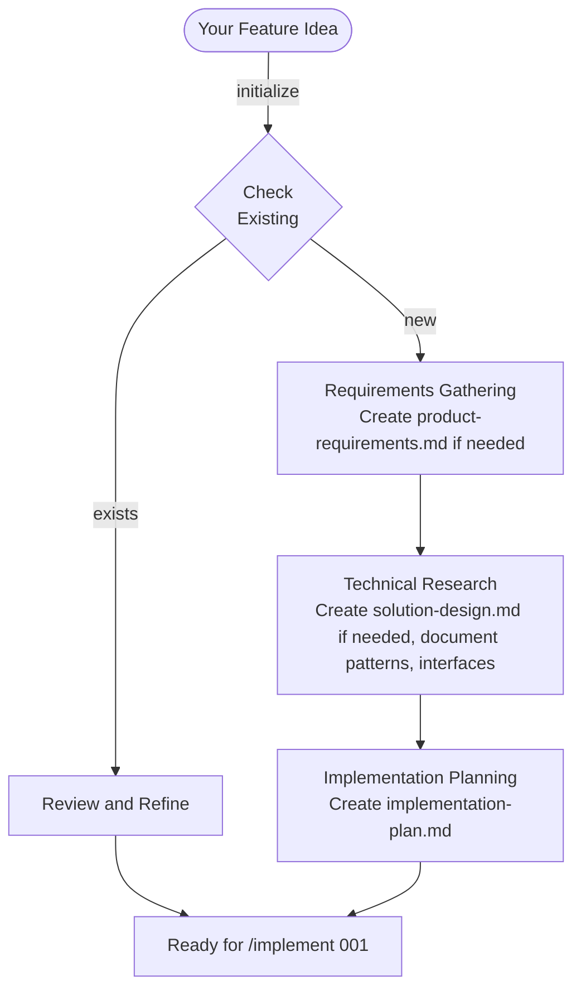
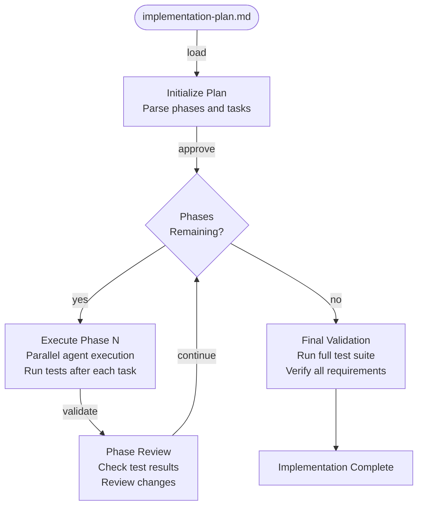
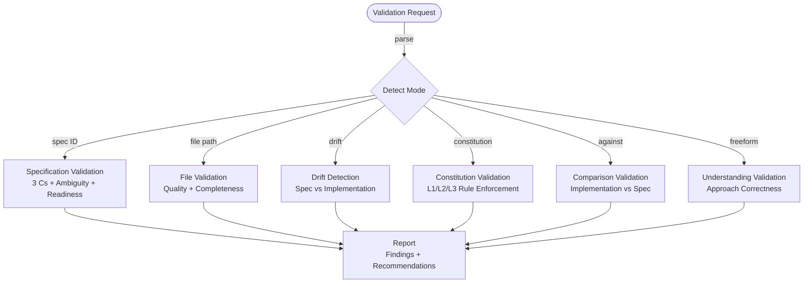
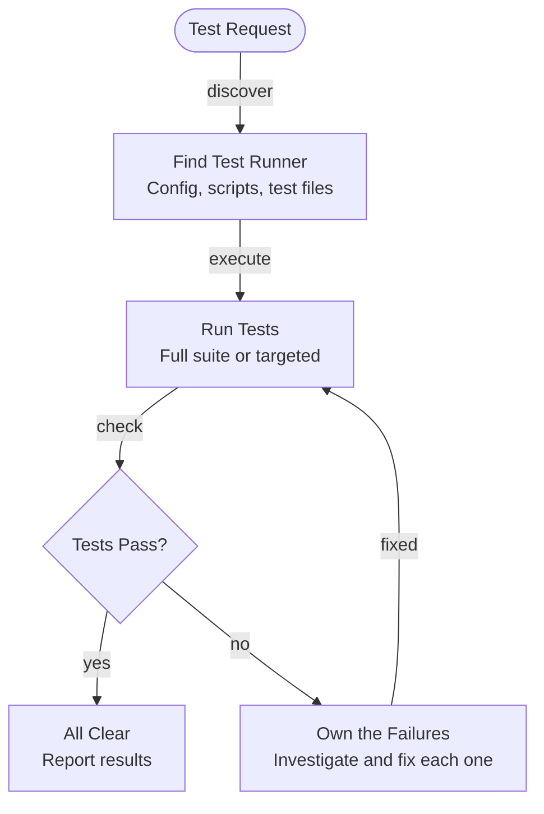
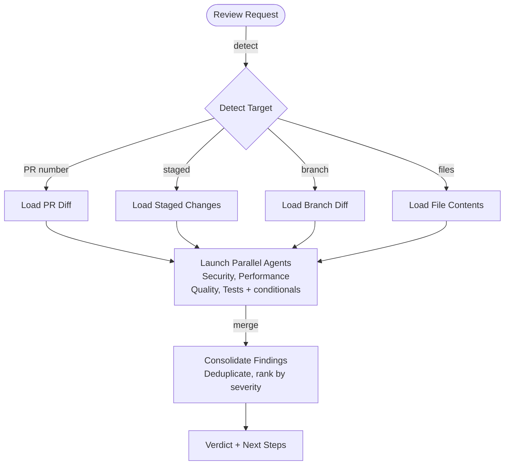
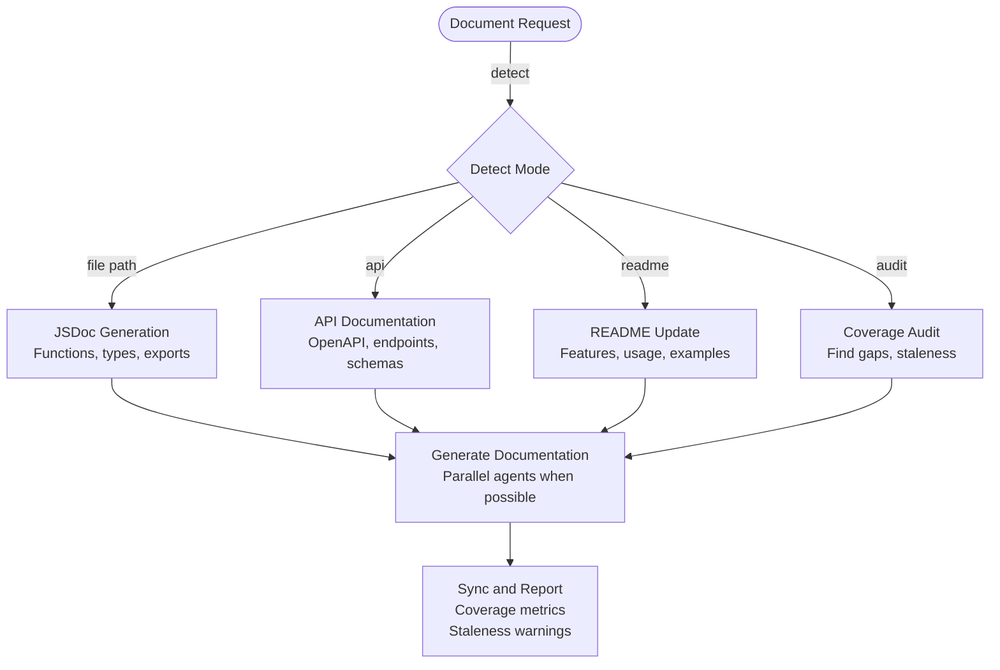
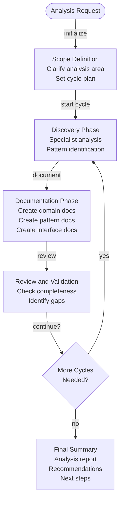
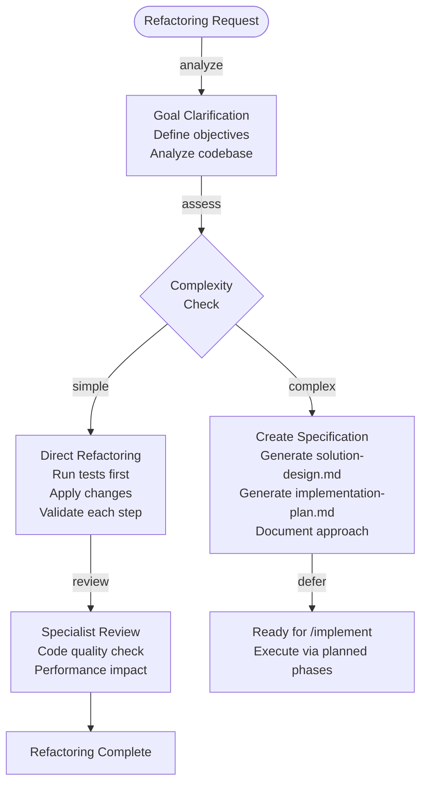
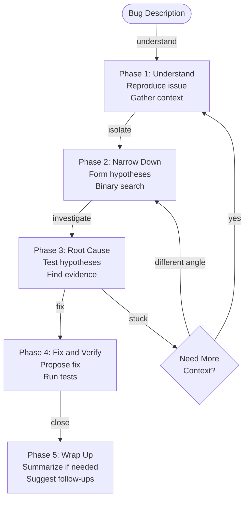
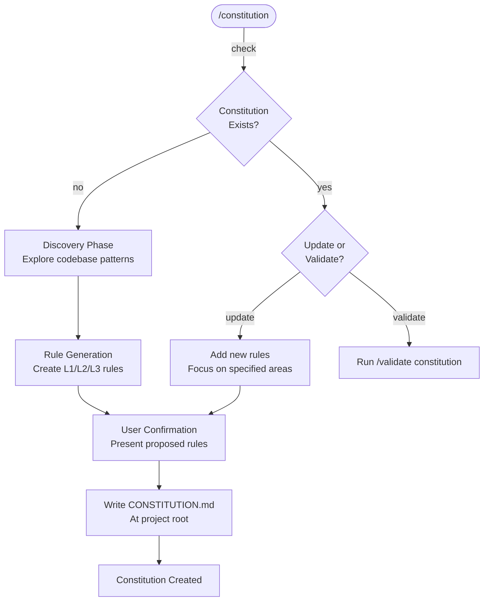

# Start Plugin - The Agentic Startup

**Workflow orchestration plugin for spec-driven development in Claude Code.**

The `start` plugin provides ten user-invocable workflow skills, five autonomous skills, and two output styles to transform how you build software with Claude Code.

**For quick start, workflow guide, and skill selection, see the [main README](../../README.md).**

---

## Table of Contents

- [User-Invocable Skills](#user-invocable-skills) — specify, implement, validate, test, review, document, analyze, refactor, debug, constitution
- [Autonomous Skills](#autonomous-skills) — 5 context-activated skills
- [Documentation Structure](#documentation-structure) — specs, domain, patterns, interfaces
- [Output Styles](#output-styles) — The Startup, The ScaleUp
- [Typical Development Workflow](#typical-development-workflow) — primary and maintenance flows
- [Skills in Action](#skills-in-action) — real-world examples
- [Templates](#templates) — PRD, SDD, PLAN, DOR, DOD
- [Philosophy](#philosophy) — spec-driven development principles

---

## User-Invocable Skills

These skills are invoked by the user via slash commands (e.g., `/specify`). Unlike autonomous skills which activate automatically based on context, user-invocable skills wait for explicit invocation.

### `/specify <description>`

Create comprehensive specifications from brief descriptions through deep research and specialist agent coordination.

**Purpose:** Transform ideas into implementation-ready specifications with product requirements, solution design, and implementation plan documents

**Usage:**
```bash
/specify Build a real-time notification system with WebSocket support
/specify 001  # Resume existing specification work
```

**Key Features:**
- **Auto-incrementing Spec IDs** - Automatically creates numbered directories (001, 002, etc.)
- **Resume Capability** - Can resume work on existing specifications by ID
- **Pattern Documentation** - Automatically documents discovered patterns in `docs/patterns/`
- **Interface Documentation** - Captures external service contracts in `docs/interfaces/`
- **Domain Documentation** - Records business rules in `docs/domain/`
- **Confidence Scoring** - Provides implementation readiness assessment with risk analysis
- **Quality Gates** - Requires user approval between major phases

<details>
<summary><strong>View Details</strong></summary>

**What you get:** Three comprehensive documents in `docs/specs/[NNN]-[name]/`:

- **product-requirements.md** - User stories, feature specifications, success criteria, non-functional requirements
- **solution-design.md** - Technical architecture, system components, data models, technology stack, security and performance considerations
- **implementation-plan.md** - Phased task breakdown, dependencies, acceptance criteria, risk assessment



</details>

---

### `/implement <spec-id>`

Execute implementation plans phase-by-phase with parallel specialist agents and continuous validation.

**Purpose:** Transform validated specifications into working code with quality gates and progress tracking

**Usage:**
```bash
/implement 001
/implement path/to/custom/implementation-plan.md
```

**Key Features:**
- **Parallel Execution** - Multiple agents work simultaneously within phases
- **Sequential Phases** - Phases execute in order with validation gates
- **Rollback on Failure** - Automatic reversion if tests fail
- **Specification Compliance** - Continuous validation against product-requirements.md/solution-design.md
- **Pattern Recognition** - Documents implementation patterns discovered
- **Real-time Updates** - TodoWrite tracking shows live progress
- **Custom Plans** - Can implement any implementation-plan.md file, not just specs

<details>
<summary><strong>View Details</strong></summary>

Loads implementation-plan.md and executes phase-by-phase with approval gates between phases. Multiple specialist agents work in parallel within each phase when tasks are independent. All changes are validated against acceptance criteria and tests run after each task.



</details>

---

### `/validate <target>`

Validate specifications, implementations, or understanding through intelligent context detection and the 3 Cs framework (Completeness, Consistency, Correctness).

**Purpose:** Quality gate that works at any lifecycle stage - during specification, before implementation, or after completion

**Usage:**
```bash
/validate 001                                          # Validate spec by ID
/validate docs/specs/001/solution-design.md            # Validate specific file
/validate Check the auth implementation against SDD    # Compare implementation to spec
/validate drift                                        # Check for spec-implementation drift
/validate constitution                                 # Validate constitution compliance
/validate Is my caching approach correct?              # Validate understanding
```

**Key Features:**
- **Intelligent Mode Detection** - Automatically determines validation type from input
- **The 3 Cs Framework** - Checks Completeness, Consistency, and Correctness
- **Ambiguity Detection** - Scans for vague language ("should", "various", "etc.")
- **Cross-Document Traceability** - Verifies PRD to SDD to PLAN alignment
- **Drift Detection** - Checks spec-implementation alignment
- **Constitution Enforcement** - Validates L1/L2/L3 governance rules
- **Advisory Only** - Provides recommendations without blocking
- **Comparison Validation** - Compares implementations against specifications

<details>
<summary><strong>View Details</strong></summary>

**Six validation modes** automatically detected from input:

| Input Type | Mode | What Gets Validated |
|------------|------|---------------------|
| Spec ID (`005`) | Specification | Full spec quality and readiness |
| File path (`src/auth.ts`) | File | Individual file quality |
| `drift` or `check drift` | Drift Detection | Spec-implementation alignment |
| `constitution` | Constitution | Governance rule compliance |
| "Check X against Y" | Comparison | Implementation vs specification |
| Freeform text | Understanding | Approach correctness |

**The 3 Cs Framework:**

1. **Completeness** - All sections filled, no `[NEEDS CLARIFICATION]` markers, checklists complete
2. **Consistency** - Cross-document traceability, terminology alignment, no contradictions
3. **Correctness** - ADRs confirmed, dependencies valid, acceptance criteria testable



</details>

---

### `/test [target]`

Run tests with strict code ownership enforcement — no "pre-existing failures" excuses allowed.

**Purpose:** Discover and execute tests, ensure the codebase is left in a passing state, and enforce ownership of any failures encountered

**Usage:**
```bash
/test                            # Run full test suite
/test all                        # Run full test suite (explicit)
/test src/auth/                  # Run tests for specific path
/test baseline                   # Capture current test state
```

**Key Features:**
- **Test Discovery** - Automatically finds test runner, config, and test files
- **Code Ownership** - If tests fail, you own the fix — no blaming pre-existing issues
- **Baseline Capture** - Record current passing/failing state before changes
- **Multi-Agent Parallel** - Can distribute test suites across parallel agents
- **Targeted Execution** - Run specific test files, directories, or the full suite

<details>
<summary><strong>View Details</strong></summary>

**The Ownership Mandate:**

When tests fail, the skill enforces strict ownership:
- No "these were pre-existing failures"
- No "not caused by my changes"
- No leaving failing tests for the user

**Test Modes:**

| Input | Mode | What Happens |
|-------|------|--------------|
| (empty) or `all` | Full Suite | Discovers and runs all tests |
| File/directory path | Targeted | Runs tests for specific scope |
| `baseline` | Capture | Records current test state for comparison |



</details>

---

### `/review [target]`

Multi-agent code review with specialized perspectives running in parallel.

**Purpose:** Comprehensive code review before merging, with specialized agents examining different concerns simultaneously

**Usage:**
```bash
/review                          # Review staged changes
/review 123                      # Review PR number
/review feature/auth             # Review branch changes
/review src/auth/ src/users/     # Review specific files/directories
/review staged                   # Explicitly review staged changes
```

**Key Features:**
- **Parallel Specialists** - Security, Performance, Quality, and Test agents review simultaneously
- **Conditional Perspectives** - Concurrency, Dependencies, Compatibility, Accessibility activate when relevant
- **Target Auto-Detection** - Detects PR number, staged changes, file path, or branch diffs
- **Confidence Scoring** - Each finding includes confidence level (HIGH/MEDIUM/LOW)
- **Severity Classification** - CRITICAL, HIGH, MEDIUM, LOW findings
- **Standard or Team Mode** - Fire-and-forget subagents or persistent teammates with coordination

<details>
<summary><strong>View Details</strong></summary>

**Core Review Perspectives (always active):**

| Perspective | Focus Areas |
|-------------|-------------|
| **Security** | SQL injection, XSS, hardcoded secrets, auth bypasses, input validation |
| **Performance** | N+1 queries, missing indexes, memory leaks, inefficient algorithms |
| **Quality** | Code complexity, naming, SOLID principles, error handling, duplication |
| **Tests** | Coverage gaps, missing edge cases, test quality, assertion completeness |

**Conditional Perspectives (activated when relevant):**

| Perspective | Trigger |
|-------------|---------|
| **Concurrency** | async/await, Promise, threading detected |
| **Dependencies** | Dependency file changes |
| **Compatibility** | Public API or schema changes |
| **Accessibility** | Frontend component changes |
| **Constitution** | CONSTITUTION.md exists in project |



</details>

---

### `/document [target]`

Generate and sync documentation including API docs, READMEs, JSDoc comments, and documentation audits.

**Purpose:** Keep documentation current with code, generate missing docs, and identify staleness

**Usage:**
```bash
/document src/api/               # Generate API documentation
/document readme                 # Update project README
/document src/utils/             # Add JSDoc to code files
/document audit                  # Audit documentation coverage
```

**Key Features:**
- **Multiple Documentation Modes** - Code, API, README, Audit, Module
- **Staleness Detection** - Identifies outdated documentation
- **Coverage Metrics** - Reports documentation completeness percentage
- **OpenAPI Generation** - Creates OpenAPI/Swagger specs from API code
- **Multi-Agent Parallel** - Multiple documentation agents work simultaneously

<details>
<summary><strong>View Details</strong></summary>

**Documentation Modes:**

| Input | Mode | Output |
|-------|------|--------|
| File/directory path | Code | JSDoc/TSDoc comments |
| `api` | API | OpenAPI spec, endpoint docs |
| `readme` | README | README.md updates |
| `audit` | Audit | Coverage report |

**Staleness Detection:**

The skill automatically detects when documentation is outdated by:
- Comparing doc timestamps to code changes
- Checking if documented APIs still match implementation
- Identifying undocumented new exports



</details>

---

### `/analyze <area>`

Discover and document business rules, technical patterns, and system interfaces through iterative exploration.

**Purpose:** Extract organizational knowledge from existing codebase and create reusable documentation

**Usage:**
```bash
/analyze security patterns in authentication
/analyze business rules for user permissions
/analyze technical patterns in our microservices architecture
```

<details>
<summary><strong>View Details</strong></summary>

Uses cyclical discovery-documentation-review workflow to extract organizational knowledge. Specialist agents explore the codebase to identify patterns, rules, and interfaces across business, technical, security, performance, integration, data, testing, and deployment areas. Documentation is automatically organized into `docs/domain/`, `docs/patterns/`, and `docs/interfaces/` directories.



</details>

---

### `/refactor <description>`

Improve code quality while strictly preserving all existing behavior through test-validated incremental changes.

**Purpose:** Safe, systematic refactoring with automatic rollback on test failures

**Usage:**
```bash
/refactor Simplify the authentication middleware for better testability
/refactor Improve the WebSocket connection manager
```

<details>
<summary><strong>View Details</strong></summary>

Strictly preserves behavior through test-validated incremental changes. All tests must pass before refactoring begins and after each change. Automatic rollback on test failures. For simple refactorings, applies changes directly with continuous validation. For complex refactorings, creates specification documents and defers to `/implement` for planned execution.



</details>

---

### `/debug <description>`

Diagnose and resolve bugs through conversational investigation with systematic root cause analysis.

**Purpose:** Natural language debugging partner that helps identify and fix issues through dialogue, not rigid procedures

**Usage:**
```bash
/debug The API returns 500 errors when uploading large files
/debug Tests are failing intermittently on CI but pass locally
/debug Users report slow page loads after the latest deployment
```

**Key Features:**
- **Conversational Flow** - Natural dialogue, not rigid checklists or procedures
- **Progressive Disclosure** - Starts with summary, reveals details on request
- **Observable Actions Only** - Reports only what was actually checked and found
- **User-Driven** - Proposes next steps, lets user guide the direction
- **Hypothesis Tracking** - Forms and tests ranked hypotheses systematically
- **Evidence-Based** - Never fabricates reasoning; all conclusions backed by evidence

<details>
<summary><strong>View Details</strong></summary>

Uses a conversational approach through five natural phases: understand the problem, narrow it down, find the root cause, fix and verify, wrap up. The debugger reports only observable actions ("I checked X and found Y") and never fabricates reasoning. Users can ask "what did you check?" at any point and receive honest, verifiable answers.



**The Four Commandments:**
1. **Conversational, not procedural** - It's a dialogue, not a checklist
2. **Observable only** - "I looked at X and found Y" not "This is probably..."
3. **Progressive disclosure** - Start brief, expand on request
4. **User in control** - "Want me to...?" not "I will now..."

</details>

---

### `/constitution [focus-areas]`

Create or update a project constitution with governance rules through discovery-based pattern analysis.

**Purpose:** Establish checkable project rules that are enforced during implementation, review, and validation

**Usage:**
```bash
/constitution                                    # Create new constitution via codebase discovery
/constitution security and testing               # Focus on specific areas
/constitution Add API patterns                   # Update existing constitution
```

**Key Features:**
- **Discovery-Based Rules** - Analyzes actual codebase patterns, never assumes frameworks
- **L1/L2/L3 Level System** - L1 (blocking + autofix), L2 (blocking, manual), L3 (advisory)
- **Three-Layer Enforcement** - Checked during specify (SDD), implement, and review
- **Pattern + Check Rules** - Supports regex patterns and semantic LLM-interpreted checks
- **Graceful Degradation** - System works normally if no constitution exists

<details>
<summary><strong>View Details</strong></summary>

Creates `CONSTITUTION.md` at project root (like README, LICENSE, CODE_OF_CONDUCT). The constitution defines checkable guardrails that detect violations during development.

**Key Distinction:**
- **CLAUDE.md** = Project description, AI guidance ("Use React with TypeScript")
- **CONSTITUTION.md** = Checkable rules that catch violations ("No barrel exports")

**Level Definitions:**

| Level | Name | Blocking | Autofix | Use Case |
|-------|------|----------|---------|----------|
| **L1** | Must | Yes | AI auto-corrects | Security, correctness, critical architecture |
| **L2** | Should | Yes | No | Important rules requiring human judgment |
| **L3** | May | No | No | Style preferences, suggestions |

**Rule Format Example:**

```markdown
### No Hardcoded Secrets

\```yaml
level: L1
pattern: "(api_key|secret|password)\\s*[:=]\\s*['\"][^'\"]{8,}['\"]"
scope: "**/*.{ts,js}"
exclude: "**/*.test.*, .env.example"
message: Hardcoded secret detected. Use environment variables.
\```

Secrets must never be committed to source control.
```

**Three-Layer Enforcement:**

| Phase | Command | Enforcement |
|-------|---------|-------------|
| **Planning** | `/specify` (SDD) | SDD must not violate constitutional principles |
| **Task** | `/implement` | Task ordering respects constitutional priorities |
| **Implementation** | `/implement` | Generated code checked; L1/L2 violations block completion |



</details>

---

### Installation

Install The Agentic Startup framework using the one-line installer:

```bash
curl -fsSL https://raw.githubusercontent.com/rsmdt/the-startup/main/install.sh | sh
```

**What it does:**
- Adds the `rsmdt/the-startup` marketplace
- Installs `team@the-startup` and `start@the-startup` plugins
- Configures `start:The Startup` as the default output style
- Optionally installs the git-aware statusline

**Flags:**
- `--yes` - Skip all confirmation prompts
- `--no-statusline` - Skip statusline installation
- `--help` - Show usage information

**Note:** Output styles are available immediately via `/output-style` - no additional setup required.

---

## Autonomous Skills

The `start` plugin includes five autonomous skills that activate automatically based on context. You never need to explicitly invoke them — they work when needed.

### Specification Skills

| Skill | Purpose |
|-------|---------|
| `specify-meta` | Spec directory creation, README tracking, phase transitions |
| `specify-requirements` | PRD template, validation, requirements gathering |
| `specify-solution` | SDD template, architecture design, ADR management |
| `specify-plan` | PLAN template, task sequencing, dependency mapping |

### Methodology Skills

| Skill | Purpose |
|-------|---------|
| `writing-skills` | Skill authoring, auditing, and verification methodology |

---

## Documentation Structure

The plugin encourages structured knowledge management:

```
docs/
├── specs/
│   └── [3-digit-number]-[feature-name]/
│       ├── product-requirements.md         # What to build
│       ├── solution-design.md              # How to build it
│       └── implementation-plan.md          # Implementation tasks
│
├── domain/                                  # Business rules
│   ├── user-permissions.md
│   ├── order-workflow.md
│   └── pricing-rules.md
│
├── patterns/                                # Technical patterns
│   ├── authentication-flow.md
│   ├── caching-strategy.md
│   └── error-handling.md
│
└── interfaces/                              # External integrations
    ├── stripe-payments.md
    ├── sendgrid-webhooks.md
    └── oauth-providers.md
```

### Auto-Documentation

The `document` skill's Capture perspective automatically creates files in the correct location when patterns, interfaces, or domain rules are discovered during:
- Specification creation (`/specify`)
- Implementation (`/implement`)
- Analysis (`/analyze`)

### Deduplication

The capture workflow always checks existing documentation before creating new files, preventing duplicates.

---

## Output Styles

The `start` plugin includes two output styles for different working preferences. Both share the same operational fundamentals (verification, code ownership, scope management) but express them differently.

**Activate via:** `/output-style start:The Startup` or `/output-style start:The ScaleUp`

---

### The Startup

**High-energy execution with structured momentum.**

| Aspect | Description |
|--------|-------------|
| **Vibe** | Demo day energy, Y Combinator intensity |
| **Voice** | "Let's deliver this NOW!", "BOOM! That's what I'm talking about!" |
| **Mantra** | "Done is better than perfect, but quality is non-negotiable" |

**Personality:**
- **The Visionary Leader** - "We'll figure it out" - execute fast, iterate faster
- **The Rally Captain** - Turn challenges into team victories
- **The Orchestrator** - Run parallel execution like a conductor
- **The Pragmatist** - MVP today beats perfect next quarter

**Best for:**
- Fast-paced development sprints
- High-energy execution mode
- When you want momentum and celebration

---

### The ScaleUp

**Calm confidence with educational depth.**

| Aspect | Description |
|--------|-------------|
| **Vibe** | Professional craft, engineering excellence |
| **Voice** | "We've solved harder problems. Here's the approach.", "This decision matters because..." |
| **Mantra** | "Sustainable speed at scale. We move fast, but we don't break things" |

**Personality:**
- **The Seasoned Leader** - We've been through the fire. Now we build to last.
- **The Strategist** - Think two steps ahead. Today's shortcut is tomorrow's outage.
- **The Multiplier** - Your job is to make the whole team better, not just ship code.
- **The Guardian** - Reliability isn't optional. Customers trust us with their business.

**Unique feature - Educational Insights:**

The ScaleUp provides contextual explanations as it works:

> I've added the retry logic to the API client:
> ```typescript
> await retry(fetchUser, { maxAttempts: 3, backoff: 'exponential' });
> ```
> *Insight: I used exponential backoff here because this endpoint has rate limiting. The existing `src/utils/retry.ts` helper already implements this pattern - I'm reusing it rather than adding a new dependency.*

**Best for:**
- Learning while building
- Understanding codebase patterns
- When you want explanations with your code
- Onboarding to unfamiliar codebases

---

### Comparison

| Dimension | The Startup | The ScaleUp |
|-----------|-------------|-------------|
| **Energy** | High-octane, celebratory | Calm, measured |
| **Explanations** | Minimal - ships fast | Educational insights included |
| **Failures** | "That didn't work. Moving on." | "Here's what failed and why..." |
| **Closing thought** | "What did we deliver?" | "Can the team maintain this without me?" |

---

## Typical Development Workflow

### Setup (Optional)

```
/constitution ──> Create project governance rules
                  L1/L2/L3 rules auto-enforced in BUILD flow
                  CONSTITUTION.md at project root
```

### Primary Workflow: Specify > Validate > Implement > Review

```
/specify ──> /validate ──> /implement ──> /review
   |              |              |              |
Create specs  Check quality  Execute plan  Code review
PRD+SDD+PLAN  3 Cs framework Phase-by-phase Security+Perf
   |              |              |              |
Constitution  Constitution   Constitution   Constitution
checked on    mode available + drift enforced compliance
SDD

Optional: /document after implementation for documentation sync
```

*If `CONSTITUTION.md` exists, rules are automatically checked at each stage.*

**1. Create Specification**

```bash
/specify Add real-time notification system with WebSocket support
```

**What happens:**
- Creates `docs/specs/001-notification-system/`
- Generates product-requirements.md, solution-design.md, implementation-plan.md
- Documents discovered patterns/interfaces
- Optional: Creates `spec/001-notification-system` git branch

**2. Validate Before Implementation (Recommended)**

```bash
/validate 001
```

**What happens:**
- Checks completeness, consistency, correctness (3 Cs)
- Detects ambiguities and vague language
- Security scanning for common vulnerabilities
- Verifies cross-document traceability

**3. Execute Implementation**

```bash
/implement 001
```

**What happens:**
- Optional: Creates `feature/001-notification-system` git branch
- Executes phases sequentially with user approval
- Parallel agent coordination within phases
- Continuous test validation
- Optional: Creates PR at completion

**4. Review Before Merge**

```bash
/review
```

**What happens:**
- Parallel specialists review (Security, Performance, Quality, Tests + conditionals)
- Generates consolidated report with severity rankings

**5. Generate Documentation (Optional)**

```bash
/document src/notifications/
```

**What happens:**
- Adds JSDoc/TSDoc comments
- Updates README if needed
- Reports documentation coverage

---

### Maintenance Workflows

**Understand Existing Code**

```bash
/analyze security patterns in authentication
```

Documents findings in `docs/patterns/`, `docs/domain/`, `docs/interfaces/`

**Refactoring**

```bash
/refactor Restructure the authentication module for better testability
```

For architectural changes - creates specs, plans migration, handles breaking changes.

**Fix Bugs**

```bash
/debug The notification system stops working after 100 concurrent users
```

Conversational investigation with observable evidence and user-driven direction.

**Audit Documentation**

```bash
/document audit
```

Reports documentation coverage and identifies stale or missing docs.

---

## Skills in Action

### Example: Knowledge Capture via Document Skill

**Scenario:** During implementation, an agent discovers a pattern

```
Agent output: "I implemented a retry mechanism with exponential backoff for API calls"
```

**What happens automatically:**
1. Document skill's Capture perspective activates
2. Checks `docs/patterns/` for existing retry patterns
3. Not found — Creates `docs/patterns/api-retry-strategy.md`
4. Uses pattern template
5. Reports: "Created docs/patterns/api-retry-strategy.md"

**You didn't have to:** Manually request documentation or specify the path

---

## Templates

Rich templates for structured documentation, co-located with their skills:

```
plugins/start/skills/
├── specify-requirements/template.md   # Product requirements structure
├── specify-solution/template.md       # Solution design structure
├── specify-plan/template.md           # Implementation plan structure
└── document/templates/                # Knowledge capture templates
    ├── domain-template.md             # Business rules
    ├── pattern-template.md            # Technical patterns
    └── interface-template.md          # External integrations
```

**Usage:** Automatically used by `/specify` and `/document` when creating documentation

---

## Philosophy

### Spec-Driven Development

**The problem:** Features built without clear requirements lead to technical debt, rework, and inconsistency.

**Our approach:**

1. **Specify First** - Comprehensive specifications before code
2. **Review & Refine** - Validate with stakeholders
3. **Implement with Confidence** - Execute validated plans
4. **Document & Learn** - Capture patterns for reuse

### Core Principles

- **Measure twice, cut once** - Upfront planning saves time
- **Documentation as code** - Specs evolve with your codebase
- **Parallel execution** - Multiple specialists, clear boundaries
- **Quality gates** - DOR/DOD enforce standards
- **Progressive disclosure** - Load details only when needed

---

## Further Reading

- **[Main README](../../README.md)** - Project overview and installation
