# Start Plugin - The Agentic Startup

**Workflow orchestration plugin for spec-driven development in Claude Code.**

The `start` plugin provides ten workflow commands, eighteen autonomous skills, and two output styles to transform how you build software with Claude Code.

**📖 For quick start, workflow guide, and command selection, see the [main README](../../README.md).**

---

## Table of Contents

- [Commands](#commands) — specify, implement, validate, review, document, analyze, refactor, debug, constitution, init
- [Autonomous Skills](#autonomous-skills) — 18 context-activated skills
- [Documentation Structure](#-documentation-structure) — specs, domain, patterns, interfaces
- [Output Styles](#-output-styles) — The Startup, The ScaleUp
- [Typical Development Workflow](#typical-development-workflow) — primary and maintenance flows
- [Skills in Action](#skills-in-action) — real-world examples
- [Templates](#templates) — PRD, SDD, PLAN, DOR, DOD
- [Philosophy](#philosophy) — spec-driven development principles

---

## Commands

### `/start:specify <description>`

Create comprehensive specifications from brief descriptions through deep research and specialist agent coordination.

**Purpose:** Transform ideas into implementation-ready specifications with product requirements, solution design, and implementation plan documents

**Usage:**
```bash
/start:specify Build a real-time notification system with WebSocket support
/start:specify 001  # Resume existing specification work
```

**Key Features:**
- **Auto-incrementing Spec IDs** - Automatically creates numbered directories (001, 002, etc.)
- **Resume Capability** - Can resume work on existing specifications by ID
- **Pattern Documentation** - Automatically documents discovered patterns in `docs/patterns/`
- **Interface Documentation** - Captures external service contracts in `docs/interfaces/`
- **Domain Documentation** - Records business rules in `docs/domain/`
- **Confidence Scoring** - Provides implementation readiness assessment with risk analysis
- **Quality Gates** - Requires user approval between major phases

<details>
<summary><strong>View Details</strong></summary>

**What you get:** Three comprehensive documents in `docs/specs/[ID]-[name]/`:

- **product-requirements.md** - User stories, feature specifications, success criteria, non-functional requirements
- **solution-design.md** - Technical architecture, system components, data models, technology stack, security and performance considerations
- **implementation-plan.md** - Phased task breakdown, dependencies, acceptance criteria, risk assessment


</details>

---

### `/start:implement <spec-id>`

Execute implementation plans phase-by-phase with parallel specialist agents and continuous validation.

**Purpose:** Transform validated specifications into working code with quality gates and progress tracking

**Usage:**
```bash
/start:implement 001
/start:implement path/to/custom/implementation-plan.md
```

**Key Features:**
- **Parallel Execution** - Multiple agents work simultaneously within phases
- **Sequential Phases** - Phases execute in order with validation gates
- **Rollback on Failure** - Automatic reversion if tests fail
- **Specification Compliance** - Continuous validation against product-requirements.md/solution-design.md
- **Pattern Recognition** - Documents implementation patterns discovered
- **Real-time Updates** - TodoWrite tracking shows live progress
- **Custom Plans** - Can implement any implementation-plan.md file, not just specs

<details>
<summary><strong>View Details</strong></summary>

Loads implementation-plan.md and executes phase-by-phase with approval gates between phases. Multiple specialist agents work in parallel within each phase when tasks are independent. All changes are validated against acceptance criteria and tests run after each task.

```mermaid
flowchart TD
    A([📄 *implementation-plan.md*]) --> |load| B[**Initialize Plan**<br/>Parse phases & tasks]
    B --> |approve| C{Phases<br>Remaining?}
    C --> |yes| D[**Execute Phase N**<br/>⚡ *Parallel agent execution*<br/>✓ *Run tests after each task*]
    D --> |validate| E[**Phase Review**<br/>Check test results<br/>Review changes]
    E --> |continue| C
    C --> |no| F[**Final Validation**<br/>Run full test suite<br/>Verify all requirements]
    F --> END[✅ **Implementation Complete**]
```



</details>

---

### `/start:validate <target>`

Validate specifications, implementations, or understanding through intelligent context detection and the 3 Cs framework (Completeness, Consistency, Correctness).

**Purpose:** Quality gate that works at any lifecycle stage - during specification, before implementation, or after completion

**Usage:**
```bash
/start:validate 001                                          # Validate spec by ID
/start:validate docs/specs/001/solution-design.md            # Validate specific file
/start:validate Check the auth implementation against SDD    # Compare implementation to spec
/start:validate Is my caching approach correct?              # Validate understanding
```

**Key Features:**
- **Intelligent Mode Detection** - Automatically determines validation type from input
- **The 3 Cs Framework** - Checks Completeness, Consistency, and Correctness
- **Ambiguity Detection** - Scans for vague language ("should", "various", "etc.")
- **Cross-Document Traceability** - Verifies PRD→SDD→PLAN alignment
- **Advisory Only** - Provides recommendations without blocking
- **Comparison Validation** - Compares implementations against specifications
- **Understanding Validation** - Confirms correctness of approach or design

<details>
<summary><strong>View Details</strong></summary>

**Four validation modes** automatically detected from input:

| Input Type | Mode | What Gets Validated |
|------------|------|---------------------|
| Spec ID (`005`) | Specification | Full spec quality and readiness |
| File path (`src/auth.ts`) | File | Individual file quality |
| "Check X against Y" | Comparison | Implementation vs specification |
| Freeform text | Understanding | Approach correctness |

**The 3 Cs Framework:**

1. **Completeness** - All sections filled, no `[NEEDS CLARIFICATION]` markers, checklists complete
2. **Consistency** - Cross-document traceability, terminology alignment, no contradictions
3. **Correctness** - ADRs confirmed, dependencies valid, acceptance criteria testable


</details>

---

### `/start:review [target]`

Multi-agent code review with security, performance, quality, and test coverage specialists running in parallel.

**Purpose:** Comprehensive code review before merging, with specialized agents examining different concerns simultaneously

**Usage:**
```bash
/start:review                                    # Review current PR/staged changes
/start:review --pr 123                           # Review specific PR
/start:review --branch feature/auth              # Review branch changes
/start:review src/auth/ src/users/               # Review specific files/directories
```

**Key Features:**
- **4 Parallel Specialists** - Security, Performance, Quality, and Test agents review simultaneously
- **Target Auto-Detection** - Automatically detects PR, staged changes, or branch diffs
- **Confidence Scoring** - Each finding includes confidence level (HIGH/MEDIUM/LOW)
- **PR Integration** - Posts comments directly to GitHub PRs via `gh` CLI
- **Severity Classification** - CRITICAL, HIGH, MEDIUM, LOW findings

<details>
<summary><strong>View Details</strong></summary>

**Review Agents:**

| Agent | Focus Areas |
|-------|-------------|
| **Security** | SQL injection, XSS, hardcoded secrets, auth bypasses, input validation |
| **Performance** | N+1 queries, missing indexes, memory leaks, inefficient algorithms |
| **Quality** | Code complexity, naming, SOLID principles, error handling, duplication |
| **Tests** | Coverage gaps, missing edge cases, test quality, assertion completeness |

**Output Modes:**

- **PR Mode**: Posts inline comments to GitHub PR
- **Local Mode**: Generates detailed findings report
- **Both include**: Confidence scores, code locations, suggested fixes

```mermaid
flowchart TD
    A([Review Request]) --> |detect| B{Detect Target}
    B --> |PR| C[Load PR Diff]
    B --> |staged| D[Load Staged Changes]
    B --> |branch| E[Load Branch Diff]
    B --> |files| F[Load File Contents]
    C --> G[**Launch 4 Parallel Agents**<br/>🔒 Security<br/>⚡ Performance<br/>✨ Quality<br/>🧪 Tests]
    D --> G
    E --> G
    F --> G
    G --> |merge| H[**Consolidate Findings**<br/>Deduplicate<br/>Rank by severity]
    H --> I{Post to PR?}
    I --> |yes| J[Post Comments via gh CLI]
    I --> |no| K[Generate Report]
    J --> END[✅ Review Complete]
    K --> END
```



</details>

---

### `/start:document [target]`

Generate and sync documentation including API docs, READMEs, JSDoc comments, and documentation audits.

**Purpose:** Keep documentation current with code, generate missing docs, and identify staleness

**Usage:**
```bash
/start:document src/api/                         # Generate API documentation
/start:document --mode readme                    # Update project README
/start:document --mode code src/utils/           # Add JSDoc to code files
/start:document --mode audit                     # Audit documentation coverage
/start:document --mode module src/auth/          # Document entire module
```

**Key Features:**
- **5 Documentation Modes** - Code, API, README, Audit, Module
- **Staleness Detection** - Identifies outdated documentation
- **Coverage Metrics** - Reports documentation completeness percentage
- **OpenAPI Generation** - Creates OpenAPI/Swagger specs from API code
- **Multi-Agent Parallel** - Multiple documentation agents work simultaneously

<details>
<summary><strong>View Details</strong></summary>

**Documentation Modes:**

| Mode | Output | Use Case |
|------|--------|----------|
| `code` | JSDoc/TSDoc comments | Adding inline documentation |
| `api` | OpenAPI spec, endpoint docs | API documentation |
| `readme` | README.md updates | Project documentation |
| `audit` | Coverage report | Finding documentation gaps |
| `module` | Complete module docs | Full module documentation |

**Staleness Detection:**

The skill automatically detects when documentation is outdated by:
- Comparing doc timestamps to code changes
- Checking if documented APIs still match implementation
- Identifying undocumented new exports

```mermaid
flowchart TD
    A([Document Request]) --> |detect| B{Detect Mode}
    B --> |code| C[**JSDoc Generation**<br/>Functions, types, exports]
    B --> |api| D[**API Documentation**<br/>OpenAPI, endpoints, schemas]
    B --> |readme| E[**README Update**<br/>Features, usage, examples]
    B --> |audit| F[**Coverage Audit**<br/>Find gaps, staleness]
    B --> |module| G[**Full Module Docs**<br/>All of the above]
    C --> H[**Generate Documentation**<br/>⚡ Parallel agents when possible]
    D --> H
    E --> H
    F --> H
    G --> H
    H --> I[**Sync & Report**<br/>📊 Coverage metrics<br/>⚠️ Staleness warnings]
    I --> END[✅ Documentation Complete]
```



</details>

---

### `/start:analyze <area>`

Discover and document business rules, technical patterns, and system interfaces through iterative exploration.

**Purpose:** Extract organizational knowledge from existing codebase and create reusable documentation

**Usage:**
```bash
/start:analyze security patterns in authentication
/start:analyze business rules for user permissions
/start:analyze technical patterns in our microservices architecture
```

<details>
<summary><strong>View Details</strong></summary>

Uses cyclical discovery-documentation-review workflow to extract organizational knowledge. Specialist agents explore the codebase to identify patterns, rules, and interfaces across business, technical, security, performance, integration, data, testing, and deployment areas. Documentation is automatically organized into `docs/domain/`, `docs/patterns/`, and `docs/interfaces/` directories.


</details>

---

### `/start:refactor <description>`

Improve code quality while strictly preserving all existing behavior through test-validated incremental changes.

**Purpose:** Safe, systematic refactoring with automatic rollback on test failures

**Usage:**
```bash
/start:refactor Simplify the authentication middleware for better testability
/start:refactor Improve the WebSocket connection manager
```

<details>
<summary><strong>View Details</strong></summary>

Strictly preserves behavior through test-validated incremental changes. All tests must pass before refactoring begins and after each change. Automatic rollback on test failures. For simple refactorings, applies changes directly with continuous validation. For complex refactorings, creates specification documents and defers to `/start:implement` for planned execution.


</details>

---

### `/start:debug <description>`

Diagnose and resolve bugs through conversational investigation with systematic root cause analysis.

**Purpose:** Natural language debugging partner that helps identify and fix issues through dialogue, not rigid procedures

**Usage:**
```bash
/start:debug The API returns 500 errors when uploading large files
/start:debug Tests are failing intermittently on CI but pass locally
/start:debug Users report slow page loads after the latest deployment
```

**Key Features:**
- **Conversational Flow** - Natural dialogue, not rigid checklists or procedures
- **Progressive Disclosure** - Starts with summary, reveals details on request
- **Observable Actions Only** - Reports only what was actually checked and found
- **User-Driven** - Proposes next steps, lets user guide the direction
- **Hypothesis Tracking** - Forms and tests ranked hypotheses systematically
- **Evidence-Based** - Never fabricates reasoning; all conclusions backed by evidence

<details>
<summary><strong>View Details</strong></summary>

Uses a conversational approach through five natural phases: understand the problem, narrow it down, find the root cause, fix and verify, wrap up. The debugger reports only observable actions ("I checked X and found Y") and never fabricates reasoning. Users can ask "what did you check?" at any point and receive honest, verifiable answers.

```mermaid
flowchart TD
    A([Bug Description]) --> |understand| B[**Phase 1: Understand**<br/>Reproduce issue<br/>Gather context]
    B --> |isolate| C[**Phase 2: Narrow Down**<br/>Form hypotheses<br/>Binary search]
    C --> |investigate| D[**Phase 3: Root Cause**<br/>Test hypotheses<br/>Find evidence]
    D --> |fix| E[**Phase 4: Fix & Verify**<br/>Propose fix<br/>Run tests]
    E --> |close| F[**Phase 5: Wrap Up**<br/>Summarize if needed<br/>Suggest follow-ups]
    F --> END[✅ **Bug Resolved**]

    D --> |stuck| G{Need More<br/>Context?}
    G --> |yes| B
    G --> |different angle| C
```



**The Four Commandments:**
1. **Conversational, not procedural** - It's a dialogue, not a checklist
2. **Observable only** - "I looked at X and found Y" not "This is probably..."
3. **Progressive disclosure** - Start brief, expand on request
4. **User in control** - "Want me to...?" not "I will now..."

</details>

---

### `/start:constitution [focus-areas]`

Create or update a project constitution with governance rules through discovery-based pattern analysis.

**Purpose:** Establish checkable project rules that are enforced during implementation, review, and validation

**Usage:**
```bash
/start:constitution                                    # Create new constitution via codebase discovery
/start:constitution "security and testing"             # Focus on specific areas
/start:constitution "Add API patterns"                 # Update existing constitution
```

**Key Features:**
- **Discovery-Based Rules** - Analyzes actual codebase patterns, never assumes frameworks
- **L1/L2/L3 Level System** - L1 (blocking + autofix), L2 (blocking, manual), L3 (advisory)
- **Three-Layer Enforcement** - Checked during specify (SDD), implement, and review
- **Pattern + Check Rules** - Supports regex patterns and semantic LLM-interpreted checks
- **Graceful Degradation** - System works normally if no constitution exists

<details>
<summary><strong>View Details</strong></summary>

Creates `CONSTITUTION.md` at project root (like README, LICENSE, CODE_OF_CONDUCT). The constitution defines checkable guardrails that detect violations during development.

**Key Distinction:**
- **CLAUDE.md** = Project description, AI guidance ("Use React with TypeScript")
- **CONSTITUTION.md** = Checkable rules that catch violations ("No barrel exports")

**Level Definitions:**

| Level | Name | Blocking | Autofix | Use Case |
|-------|------|----------|---------|----------|
| **L1** | Must | ✅ Yes | ✅ AI auto-corrects | Security, correctness, critical architecture |
| **L2** | Should | ✅ Yes | ❌ No | Important rules requiring human judgment |
| **L3** | May | ❌ No | ❌ No | Style preferences, suggestions |

**Rule Format Example:**

```markdown
### No Hardcoded Secrets

\```yaml
level: L1
pattern: "(api_key|secret|password)\\s*[:=]\\s*['\"][^'\"]{8,}['\"]"
scope: "**/*.{ts,js}"
exclude: "**/*.test.*, .env.example"
message: Hardcoded secret detected. Use environment variables.
\```

Secrets must never be committed to source control.
```

**Three-Layer Enforcement:**

| Phase | Command | Enforcement |
|-------|---------|-------------|
| **Planning** | `/start:specify` (SDD) | SDD must not violate constitutional principles |
| **Task** | `/start:implement` | Task ordering respects constitutional priorities |
| **Implementation** | `/start:implement` | Generated code checked; L1/L2 violations block completion |

```mermaid
flowchart TD
    A([/start:constitution]) --> |check| B{Constitution<br>Exists?}
    B --> |no| C[**Discovery Phase**<br/>Explore codebase patterns]
    C --> D[**Rule Generation**<br/>Create L1/L2/L3 rules]
    D --> E[**User Confirmation**<br/>Present proposed rules]
    E --> F[**Write CONSTITUTION.md**<br/>At project root]
    B --> |yes| G{Update or<br>Validate?}
    G --> |update| H[Add new rules<br/>Focus on specified areas]
    H --> E
    G --> |validate| I[Run /start:validate constitution]
    F --> END[✅ Constitution Created]
```



</details>

---

### `/start:init`

Initialize The Agentic Startup framework in your Claude Code environment with interactive setup.

**Purpose:** Configure git-aware statusline for real-time command tracking

**Usage:**
```bash
/start:init
```

<details>
<summary><strong>View Details</strong></summary>

Configures git-aware statusline with real-time command tracking. Interactive setup asks for preferences and confirms each change before applying. Safe to run multiple times.

**Note:** Output styles are available immediately via `/output-style` - no initialization required.

</details>

---

## Autonomous Skills

The `start` plugin includes eighteen skills that activate automatically based on context. You never need to explicitly invoke them - they just work when needed.

### Core Skills

| Skill | Purpose |
|-------|---------|
| `task-delegation` | Task decomposition, FOCUS/EXCLUDE templates, parallel coordination |
| `knowledge-capture` | Auto-document patterns, interfaces, domain rules |
| `specification-management` | Spec directory creation, README tracking, phase transitions |
| `specification-validation` | 3 Cs validation, ambiguity detection, comparison checks |
| `constitution-validation` | Create/validate project constitutions with L1/L2/L3 rules |
| `drift-detection` | Detect spec-implementation divergence during implementation |

### Document Skills

| Skill | Purpose |
|-------|---------|
| `requirements-analysis` | PRD template, validation, requirements gathering |
| `architecture-design` | SDD template, architecture design, ADR management |
| `implementation-planning` | PLAN template, task sequencing, dependency mapping |
| `documentation-sync` | Staleness detection, coverage metrics, doc generation |

### Execution Skills

| Skill | Purpose |
|-------|---------|
| `agent-coordination` | Phase-by-phase execution, TodoWrite tracking, checkpoints |
| `implementation-verification` | Implementation vs spec verification, deviation detection |
| `git-workflow` | Branch creation, commit messages, PR creation |

### Review Skills

| Skill | Purpose |
|-------|---------|
| `code-review` | Multi-perspective review, security/performance/quality/tests |

### Session Skills

| Skill | Purpose |
|-------|---------|
| `context-preservation` | Session context capture and restoration across conversations |

### Methodology Skills

| Skill | Purpose |
|-------|---------|
| `codebase-analysis` | Iterative discovery cycles for pattern/rule extraction |
| `bug-diagnosis` | Scientific debugging, hypothesis tracking, evidence-based |
| `safe-refactoring` | Safe refactoring patterns, behavior preservation |

---

### Skill Details

### `knowledge-capture`

**Activates when:** Patterns, interfaces, or domain rules are discovered

**Trigger terms:** "pattern", "interface", "domain rule", "document", "reusable"

**What it does:**
- Checks for existing documentation (prevents duplicates)
- Categorizes correctly (domain/patterns/interfaces)
- Uses appropriate templates
- Creates cross-references
- Reports what was documented

**Example activation:**
```
Agent discovers: "I found a reusable caching pattern using Redis"
↓
Knowledge-base-capture skill activates automatically
↓
Creates: docs/patterns/caching-strategy.md
```

**Progressive disclosure:**
- `SKILL.md` - Core documentation logic (~7 KB)
- `reference.md` - Advanced protocols (~11 KB, loads when needed)
- `templates/` - Pattern, interface, domain templates (~6 KB each)

---

### `task-delegation`

**Activates when:** Task decomposition, agent coordination, or template generation needed

**Trigger terms:** "break down", "launch agents", "FOCUS/EXCLUDE", "parallel", "coordinate"

**What it does:**
- Decomposes complex tasks into activities
- Determines parallel vs sequential execution
- Generates FOCUS/EXCLUDE templates for agents
- Coordinates file creation (prevents collisions)
- Validates agent responses for scope compliance
- Generates retry strategies for failed agents

**Example activation:**
```
User: "Break down this authentication task"
↓
Parallel-task-assignment skill activates
↓
Outputs:
- Activity breakdown
- Dependency analysis
- Parallel/sequential recommendation
- FOCUS/EXCLUDE templates for each activity
```

**Progressive disclosure:**
- `SKILL.md` - Core delegation logic (~24 KB)
- `reference.md` - Advanced patterns (~19 KB, loads when needed)
- `examples/` - Real-world scenarios (~38 KB, loads when relevant)

---

### `git-workflow`

**Activates when:** Branch creation, commits, or PR operations needed

**Trigger terms:** "create branch", "commit", "pull request", "push"

**What it does:**
- Creates branches with consistent naming (`spec/`, `feature/`, `refactor/`, `migrate/`)
- Generates conventional commit messages with co-author attribution
- Creates PRs with spec-based descriptions
- Handles uncommitted changes (stash, commit, or proceed)

**Example activation:**
```
User: "/start:specify Add authentication"
↓
Git-workflow skill activates (Phase 0)
↓
Offers: Create spec/001-authentication branch? [Y/n]
```

**Integration points:**
- `/start:specify` - Offers `spec/[id]-[name]` branches
- `/start:implement` - Offers `feature/[id]-[name]` branches
- `/start:refactor` - Offers `refactor/[scope]` or `migrate/[from]-to-[to]` branches

---

### `code-review`

**Activates when:** Code review is needed before merging

**Trigger terms:** "review", "code review", "PR review", "check my code"

**What it does:**
- Launches 4 parallel specialist agents (Security, Performance, Quality, Tests)
- Auto-detects review target (PR, staged changes, branch, files)
- Consolidates findings with severity and confidence scores
- Posts comments to GitHub PRs via `gh` CLI

**Example activation:**
```
User: "/start:review --pr 123"
↓
Code-review skill activates
↓
Launches:
  🔒 Security Agent → SQL injection, XSS, secrets
  ⚡ Performance Agent → N+1, memory leaks
  ✨ Quality Agent → SOLID, naming, complexity
  🧪 Tests Agent → Coverage gaps, edge cases
↓
Consolidates findings → Posts to PR #123
```

**Review perspectives:**
- **Security** - Authentication, authorization, input validation, secrets
- **Performance** - Query optimization, caching, memory management
- **Quality** - Code style, design patterns, maintainability
- **Tests** - Coverage, edge cases, test quality

---

### `documentation-sync`

**Activates when:** Documentation generation or audit is needed

**Trigger terms:** "document", "generate docs", "API docs", "README", "coverage"

**What it does:**
- Detects documentation staleness (outdated vs code changes)
- Generates JSDoc/TSDoc, OpenAPI specs, READMEs
- Reports documentation coverage metrics
- Identifies undocumented exports and APIs

**Example activation:**
```
User: "/start:document src/api/"
↓
Documentation-sync skill activates
↓
Actions:
  📊 Analyze current coverage
  🔍 Detect stale documentation
  📝 Generate missing docs
  📈 Report coverage metrics
```

**Modes supported:**
- `code` - JSDoc/TSDoc inline comments
- `api` - OpenAPI/Swagger specifications
- `readme` - Project README updates
- `audit` - Coverage and staleness report
- `module` - Complete module documentation

---

### `context-preservation`

**Activates when:** Session context should be saved or restored

**Trigger terms:** "save context", "resume", "continue", "where were we", end of significant work

**What it does:**
- Captures decisions, progress, blockers, discoveries
- Saves context to `.claude/context/` directory
- Restores context when resuming work
- Merges context across multiple sessions

**Example activation:**
```
End of session with significant work
↓
Context-preservation skill activates
↓
Saves to: .claude/context/session-2024-01-15-auth-implementation.md
↓
Captures:
  - 3 decisions made
  - 5 tasks completed
  - 1 blocker encountered
  - 2 patterns discovered
```

**Context categories:**
- **Decisions** - Architectural choices, trade-offs, rejected alternatives
- **Progress** - Completed tasks, current state, next steps
- **Blockers** - What's blocking, what was tried, potential solutions
- **Discoveries** - Patterns found, gotchas, undocumented behaviors

---

## 🏗️ Documentation Structure

The plugin encourages structured knowledge management:

```
docs/
├── specs/
│   └── [3-digit-number]-[feature-name]/
│       ├── product-requirements.md         # What to build
│       ├── solution-design.md              # How to build it
│       └── implementation-plan.md          # Implementation tasks
│
├── domain/                                  # Business rules
│   ├── user-permissions.md
│   ├── order-workflow.md
│   └── pricing-rules.md
│
├── patterns/                                # Technical patterns
│   ├── authentication-flow.md
│   ├── caching-strategy.md
│   └── error-handling.md
│
└── interfaces/                              # External integrations
    ├── stripe-payments.md
    ├── sendgrid-webhooks.md
    └── oauth-providers.md
```

### Auto-Documentation

The `knowledge-capture` skill automatically creates files in the correct location when patterns, interfaces, or domain rules are discovered during:
- Specification creation (`/start:specify`)
- Implementation (`/start:implement`)
- Analysis (`/start:analyze`)

### Deduplication

The skill always checks existing documentation before creating new files, preventing duplicates.

---

## 🎨 Output Styles

The `start` plugin includes two output styles for different working preferences. Both share the same operational fundamentals (verification, code ownership, scope management) but express them differently.

**Activate via:** `/output-style start:The Startup` or `/output-style start:The ScaleUp`

---

### The Startup 🚀

**High-energy execution with structured momentum.**

| Aspect | Description |
|--------|-------------|
| **Vibe** | Demo day energy, Y Combinator intensity |
| **Voice** | "Let's deliver this NOW!", "BOOM! That's what I'm talking about!" |
| **Mantra** | "Done is better than perfect, but quality is non-negotiable" |

**Personality:**
- **The Visionary Leader** - "We'll figure it out" - execute fast, iterate faster
- **The Rally Captain** - Turn challenges into team victories
- **The Orchestrator** - Run parallel execution like a conductor
- **The Pragmatist** - MVP today beats perfect next quarter

**Best for:**
- Fast-paced development sprints
- High-energy execution mode
- When you want momentum and celebration

---

### The ScaleUp 📈

**Calm confidence with educational depth.**

| Aspect | Description |
|--------|-------------|
| **Vibe** | Professional craft, engineering excellence |
| **Voice** | "We've solved harder problems. Here's the approach.", "This decision matters because..." |
| **Mantra** | "Sustainable speed at scale. We move fast, but we don't break things" |

**Personality:**
- **The Seasoned Leader** - We've been through the fire. Now we build to last.
- **The Strategist** - Think two steps ahead. Today's shortcut is tomorrow's outage.
- **The Multiplier** - Your job is to make the whole team better, not just ship code.
- **The Guardian** - Reliability isn't optional. Customers trust us with their business.

**Unique feature - Educational Insights:**

The ScaleUp provides contextual explanations as it works:

> I've added the retry logic to the API client:
> ```typescript
> await retry(fetchUser, { maxAttempts: 3, backoff: 'exponential' });
> ```
> 💡 *Insight: I used exponential backoff here because this endpoint has rate limiting. The existing `src/utils/retry.ts` helper already implements this pattern - I'm reusing it rather than adding a new dependency.*

**Best for:**
- Learning while building
- Understanding codebase patterns
- When you want explanations with your code
- Onboarding to unfamiliar codebases

---

### Comparison

| Dimension | The Startup | The ScaleUp |
|-----------|-------------|-------------|
| **Energy** | High-octane, celebratory | Calm, measured |
| **Explanations** | Minimal - ships fast | Educational insights included |
| **Failures** | "That didn't work. Moving on." | "Here's what failed and why..." |
| **Closing thought** | "What did we deliver?" | "Can the team maintain this without me?" |

---

## Typical Development Workflow

### Setup (One-Time Per Project)

```
┌─────────────────────────────────────────────────────────────────────────────┐
│                             PROJECT SETUP                                    │
├─────────────────────────────────────────────────────────────────────────────┤
│                                                                              │
│   /start:init ────────────► Configure statusline & environment              │
│                                                                              │
│   /start:constitution ────► Create project governance rules (optional)      │
│        │                    L1/L2/L3 rules auto-enforced in BUILD flow      │
│        │                    CONSTITUTION.md at project root                  │
│                                                                              │
└─────────────────────────────────────────────────────────────────────────────┘
```

### Primary Workflow: Specify → Validate → Implement → Review

```
┌─────────────────────────────────────────────────────────────────────────────┐
│                          PRIMARY DEVELOPMENT FLOW                            │
├─────────────────────────────────────────────────────────────────────────────┤
│                                                                              │
│   /start:specify ──► /start:validate ──► /start:implement ──► /start:review │
│        │                   │                    │                   │        │
│   Create specs      Check quality        Execute plan        Code review    │
│   PRD + SDD + PLAN  3 Cs framework      Phase-by-phase     Security + Perf │
│        │                   │                    │                   │        │
│   ↳ Constitution     ↳ Constitution      ↳ Constitution      ↳ Constitution │
│     checked on SDD     mode available      + drift enforced    compliance   │
│                                                                              │
│   Optional: /start:document after implementation for documentation sync     │
│                                                                              │
└─────────────────────────────────────────────────────────────────────────────┘
```

*If `CONSTITUTION.md` exists, rules are automatically checked at each stage.*

**1. Create Specification**

```bash
/start:specify Add real-time notification system with WebSocket support
```

**What happens:**
- Creates `docs/specs/001-notification-system/`
- Generates product-requirements.md, solution-design.md, implementation-plan.md
- Documents discovered patterns/interfaces
- Optional: Creates `spec/001-notification-system` git branch

**2. Validate Before Implementation (Recommended)**

```bash
/start:validate 001
```

**What happens:**
- Checks completeness, consistency, correctness (3 Cs)
- Detects ambiguities and vague language
- Security scanning for common vulnerabilities
- Verifies cross-document traceability

**3. Execute Implementation**

```bash
/start:implement 001
```

**What happens:**
- Optional: Creates `feature/001-notification-system` git branch
- Executes phases sequentially with user approval
- Parallel agent coordination within phases
- Continuous test validation
- Optional: Creates PR at completion

**4. Review Before Merge**

```bash
/start:review
```

**What happens:**
- 4 parallel specialists review (Security, Performance, Quality, Tests)
- Posts findings to PR if applicable
- Generates consolidated report with severity rankings

**5. Generate Documentation (Optional)**

```bash
/start:document src/notifications/
```

**What happens:**
- Adds JSDoc/TSDoc comments
- Updates README if needed
- Reports documentation coverage

---

### Maintenance Workflows

**Understand Existing Code**

```bash
/start:analyze security patterns in authentication
```

Documents findings in `docs/patterns/`, `docs/domain/`, `docs/interfaces/`

**Improve Code Quality**

```bash
/start:refactor Simplify the WebSocket connection manager
```

Test-validated incremental changes with automatic rollback on failures.

**Fix Bugs**

```bash
/start:debug The notification system stops working after 100 concurrent users
```

Conversational investigation with observable evidence and user-driven direction.

**Audit Documentation**

```bash
/start:document --mode audit
```

Reports documentation coverage and identifies stale or missing docs.

---

## Skills in Action

### Example 1: Knowledge-Base-Capture Skill

**Scenario:** During implementation, an agent discovers a pattern

```
Agent output: "I implemented a retry mechanism with exponential backoff for API calls"
```

**What happens automatically:**
1. Knowledge-base-capture skill recognizes "pattern" trigger
2. Checks `docs/patterns/` for existing retry patterns
3. Not found → Creates `docs/patterns/api-retry-strategy.md`
4. Uses pattern template
5. Reports: "📝 Created docs/patterns/api-retry-strategy.md"

**You didn't have to:** Manually request documentation or specify the path

---

### Example 2: Parallel-Task-Assignment Skill

**Scenario:** Complex task needs breakdown

```
User: "Implement user authentication - break this down into activities"
```

**What happens automatically:**
1. Parallel-task-assignment skill recognizes "break this down"
2. Analyzes task complexity
3. Generates output:

```
Task: Implement user authentication

Activities:
1. Analyze security requirements
2. Design database schema
3. Create API endpoints
4. Build login UI

Dependencies: 1 → 2 → (3 & 4 parallel)

Execution: Sequential (1→2), then Parallel (3&4)

Agent Prompts Generated: ✅
```

**You didn't have to:** Manually create FOCUS/EXCLUDE templates or plan execution strategy

---

## Templates

Rich templates for structured documentation:

```
plugins/start/templates/
├── product-requirements.md      # Product requirements structure
├── solution-design.md            # Solution design structure
├── implementation-plan.md        # Implementation plan structure
├── definition-of-ready.md        # Quality gate
├── definition-of-done.md         # Quality gate
└── task-definition-of-done.md   # Task-level quality gate
```

**Usage:** Automatically used by `/start:specify` when creating specifications

---

## Philosophy

### Spec-Driven Development

**The problem:** Features built without clear requirements lead to technical debt, rework, and inconsistency.

**Our approach:**

1. **Specify First** - Comprehensive specifications before code
2. **Review & Refine** - Validate with stakeholders
3. **Implement with Confidence** - Execute validated plans
4. **Document & Learn** - Capture patterns for reuse

### Core Principles

- **Measure twice, cut once** - Upfront planning saves time
- **Documentation as code** - Specs evolve with your codebase
- **Parallel execution** - Multiple specialists, clear boundaries
- **Quality gates** - DOR/DOD enforce standards
- **Progressive disclosure** - Load details only when needed

---

## Further Reading

- **[Main README](../../README.md)** - Project overview and installation
- **[Claude Code Documentation](https://docs.claude.com/claude-code)** - Official Claude Code docs
- **[Claude Code Skills Guide](https://docs.claude.com/claude-code/skills)** - How to create skills
