# Start Plugin - The Agentic Startup

**Workflow orchestration plugin for spec-driven development in Claude Code.**

The `start` plugin provides seven workflow commands, twelve autonomous skills, and two output styles to transform how you build software with Claude Code.

---

## Quick Reference

| Command | Description |
|---------|-------------|
| `/start:init` | Initialize environment (output style, statusline) |
| `/start:specify` | Create specification documents from brief description |
| `/start:implement` | Execute implementation plan phase-by-phase |
| `/start:validate` | Validate specs, implementations, or understanding |
| `/start:analyze` | Discover and document patterns, rules, interfaces |
| `/start:refactor` | Improve code quality while preserving behavior |
| `/start:debug` | Conversational debugging with systematic root cause analysis |

---

## Commands

### `/start:specify <description>`

Create comprehensive specifications from brief descriptions through deep research and specialist agent coordination.

**Purpose:** Transform ideas into implementation-ready specifications with product requirements, solution design, and implementation plan documents

**Usage:**
```bash
/start:specify Build a real-time notification system with WebSocket support
/start:specify 001  # Resume existing specification work
```

**Key Features:**
- **Auto-incrementing Spec IDs** - Automatically creates numbered directories (001, 002, etc.)
- **Resume Capability** - Can resume work on existing specifications by ID
- **Pattern Documentation** - Automatically documents discovered patterns in `docs/patterns/`
- **Interface Documentation** - Captures external service contracts in `docs/interfaces/`
- **Domain Documentation** - Records business rules in `docs/domain/`
- **Confidence Scoring** - Provides implementation readiness assessment with risk analysis
- **Quality Gates** - Requires user approval between major phases

<details>
<summary><strong>View Details</strong></summary>

**What you get:** Three comprehensive documents in `docs/specs/[ID]-[name]/`:

- **product-requirements.md** - User stories, feature specifications, success criteria, non-functional requirements
- **solution-design.md** - Technical architecture, system components, data models, technology stack, security and performance considerations
- **implementation-plan.md** - Phased task breakdown, dependencies, acceptance criteria, risk assessment

```mermaid
flowchart TD
    A([Your Feature Idea]) --> |initialize| B{Check<br>Existing}
    B --> |exists| C[Review and Refine]
    C --> END[🚀 Ready for /start:implement 001]
    B --> |new| D[📄 **Requirements Gathering**<br/>Create *product-requirements.md* if needed]
    D --> E[📄 **Technical Research**<br/>Create *solution-design.md* if needed, document patterns, interfaces]
    E --> F[📄 **Implementation Planning**<br/>Create *implementation-plan.md*]
    F --> END
```



</details>

---

### `/start:implement <spec-id>`

Execute implementation plans phase-by-phase with parallel specialist agents and continuous validation.

**Purpose:** Transform validated specifications into working code with quality gates and progress tracking

**Usage:**
```bash
/start:implement 001
/start:implement path/to/custom/implementation-plan.md
```

**Key Features:**
- **Parallel Execution** - Multiple agents work simultaneously within phases
- **Sequential Phases** - Phases execute in order with validation gates
- **Rollback on Failure** - Automatic reversion if tests fail
- **Specification Compliance** - Continuous validation against product-requirements.md/solution-design.md
- **Pattern Recognition** - Documents implementation patterns discovered
- **Real-time Updates** - TodoWrite tracking shows live progress
- **Custom Plans** - Can implement any implementation-plan.md file, not just specs

<details>
<summary><strong>View Details</strong></summary>

Loads implementation-plan.md and executes phase-by-phase with approval gates between phases. Multiple specialist agents work in parallel within each phase when tasks are independent. All changes are validated against acceptance criteria and tests run after each task.


</details>

---

### `/start:validate <target>`

Validate specifications, implementations, or understanding through intelligent context detection and the 3 Cs framework (Completeness, Consistency, Correctness).

**Purpose:** Quality gate that works at any lifecycle stage - during specification, before implementation, or after completion

**Usage:**
```bash
/start:validate 001                                          # Validate spec by ID
/start:validate docs/specs/001/solution-design.md            # Validate specific file
/start:validate Check the auth implementation against SDD    # Compare implementation to spec
/start:validate Is my caching approach correct?              # Validate understanding
```

**Key Features:**
- **Intelligent Mode Detection** - Automatically determines validation type from input
- **The 3 Cs Framework** - Checks Completeness, Consistency, and Correctness
- **Ambiguity Detection** - Scans for vague language ("should", "various", "etc.")
- **Cross-Document Traceability** - Verifies PRD→SDD→PLAN alignment
- **Advisory Only** - Provides recommendations without blocking
- **Comparison Validation** - Compares implementations against specifications
- **Understanding Validation** - Confirms correctness of approach or design

<details>
<summary><strong>View Details</strong></summary>

**Four validation modes** automatically detected from input:

| Input Type | Mode | What Gets Validated |
|------------|------|---------------------|
| Spec ID (`005`) | Specification | Full spec quality and readiness |
| File path (`src/auth.ts`) | File | Individual file quality |
| "Check X against Y" | Comparison | Implementation vs specification |
| Freeform text | Understanding | Approach correctness |

**The 3 Cs Framework:**

1. **Completeness** - All sections filled, no `[NEEDS CLARIFICATION]` markers, checklists complete
2. **Consistency** - Cross-document traceability, terminology alignment, no contradictions
3. **Correctness** - ADRs confirmed, dependencies valid, acceptance criteria testable


</details>

---

### `/start:analyze <area>`

Discover and document business rules, technical patterns, and system interfaces through iterative exploration.

**Purpose:** Extract organizational knowledge from existing codebase and create reusable documentation

**Usage:**
```bash
/start:analyze security patterns in authentication
/start:analyze business rules for user permissions
/start:analyze technical patterns in our microservices architecture
```

<details>
<summary><strong>View Details</strong></summary>

Uses cyclical discovery-documentation-review workflow to extract organizational knowledge. Specialist agents explore the codebase to identify patterns, rules, and interfaces across business, technical, security, performance, integration, data, testing, and deployment areas. Documentation is automatically organized into `docs/domain/`, `docs/patterns/`, and `docs/interfaces/` directories.

```mermaid
flowchart TD
    A([Analysis Request]) --> |initialize| B[**Scope Definition**<br/>Clarify analysis area<br/>Set cycle plan]
    B --> |start cycle| C[**Discovery Phase**<br/>⚡ *Specialist analysis*<br/>🔍 *Pattern identification*]
    C --> |document| D[**Documentation Phase**<br/>📄 *Create domain docs*<br/>📄 *Create pattern docs*<br/>📄 *Create interface docs*]
    D --> |review| E[**Review & Validation**<br/>Check completeness<br/>Identify gaps]
    E --> |continue?| F{More Cycles<br>Needed?}
    F --> |yes| C
    F --> |no| G[**Final Summary**<br/>📊 *Analysis report*<br/>🎯 *Recommendations*<br/>📋 *Next steps*]
    G --> END[✅ **Analysis Complete**]
```



</details>

---

### `/start:refactor <description>`

Improve code quality while strictly preserving all existing behavior through test-validated incremental changes.

**Purpose:** Safe, systematic refactoring with automatic rollback on test failures

**Usage:**
```bash
/start:refactor Simplify the authentication middleware for better testability
/start:refactor Improve the WebSocket connection manager
```

<details>
<summary><strong>View Details</strong></summary>

Strictly preserves behavior through test-validated incremental changes. All tests must pass before refactoring begins and after each change. Automatic rollback on test failures. For simple refactorings, applies changes directly with continuous validation. For complex refactorings, creates specification documents and defers to `/start:implement` for planned execution.

```mermaid
flowchart TD
    A([Refactoring Request]) --> |analyze| B[**Goal Clarification**<br/>Define objectives<br/>Analyze codebase]
    B --> |assess| C{**Complexity<br>Check**}
    C --> |simple| D[**Direct Refactoring**<br/>✓ *Run tests first*<br/>🔧 *Apply changes*<br/>✓ *Validate each step*]
    D --> |review| E[**Specialist Review**<br/>Code quality check<br/>Performance impact]
    E --> DONE[✅ **Refactoring Complete**]
    C --> |complex| F[**Create Specification**<br/>📄 *Generate solution-design.md*<br/>📄 *Generate implementation-plan.md*<br/>Document approach]
    F --> |defer| G[🚀 **Ready for /start:implement**<br/>Execute via planned phases]
```



</details>

---

### `/start:debug <description>`

Diagnose and resolve bugs through conversational investigation with systematic root cause analysis.

**Purpose:** Natural language debugging partner that helps identify and fix issues through dialogue, not rigid procedures

**Usage:**
```bash
/start:debug The API returns 500 errors when uploading large files
/start:debug Tests are failing intermittently on CI but pass locally
/start:debug Users report slow page loads after the latest deployment
```

**Key Features:**
- **Conversational Flow** - Natural dialogue, not rigid checklists or procedures
- **Progressive Disclosure** - Starts with summary, reveals details on request
- **Observable Actions Only** - Reports only what was actually checked and found
- **User-Driven** - Proposes next steps, lets user guide the direction
- **Hypothesis Tracking** - Forms and tests ranked hypotheses systematically
- **Evidence-Based** - Never fabricates reasoning; all conclusions backed by evidence

<details>
<summary><strong>View Details</strong></summary>

Uses a conversational approach through five natural phases: understand the problem, narrow it down, find the root cause, fix and verify, wrap up. The debugger reports only observable actions ("I checked X and found Y") and never fabricates reasoning. Users can ask "what did you check?" at any point and receive honest, verifiable answers.


**The Four Commandments:**
1. **Conversational, not procedural** - It's a dialogue, not a checklist
2. **Observable only** - "I looked at X and found Y" not "This is probably..."
3. **Progressive disclosure** - Start brief, expand on request
4. **User in control** - "Want me to...?" not "I will now..."

</details>

---

### `/start:init`

Initialize The Agentic Startup framework in your Claude Code environment with interactive setup.

**Purpose:** Configure git-aware statusline for real-time command tracking

**Usage:**
```bash
/start:init
```

<details>
<summary><strong>View Details</strong></summary>

Configures git-aware statusline with real-time command tracking. Interactive setup asks for preferences and confirms each change before applying. Safe to run multiple times.

**Note:** Output styles are available immediately via `/output-style` - no initialization required.

</details>

---

## Autonomous Skills

The `start` plugin includes twelve skills that activate automatically based on context. You never need to explicitly invoke them - they just work when needed.

### Core Skills

| Skill | Purpose |
|-------|---------|
| `parallel-task-assignment` | Task decomposition, FOCUS/EXCLUDE templates, parallel coordination |
| `knowledge-base-capture` | Auto-document patterns, interfaces, domain rules |
| `specification-lifecycle-management` | Spec directory creation, README tracking, phase transitions |
| `specification-quality-validation` | 3 Cs validation, ambiguity detection, comparison checks |

### Document Skills

| Skill | Purpose |
|-------|---------|
| `requirements-gathering-analysis` | PRD template, validation, requirements gathering |
| `technical-architecture-design` | SDD template, architecture design, ADR management |
| `phased-implementation-planning` | PLAN template, task sequencing, dependency mapping |

### Execution Skills

| Skill | Purpose |
|-------|---------|
| `multi-agent-coordination` | Phase-by-phase execution, TodoWrite tracking, checkpoints |
| `specification-implementation-verification` | Implementation vs spec verification, deviation detection |

### Methodology Skills

| Skill | Purpose |
|-------|---------|
| `codebase-insight-extraction` | Iterative discovery cycles for pattern/rule extraction |
| `systematic-bug-diagnosis` | Scientific debugging, hypothesis tracking, evidence-based |
| `behavior-preserving-refactoring` | Safe refactoring patterns, behavior preservation |

---

### Skill Details

### `knowledge-base-capture`

**Activates when:** Patterns, interfaces, or domain rules are discovered

**Trigger terms:** "pattern", "interface", "domain rule", "document", "reusable"

**What it does:**
- Checks for existing documentation (prevents duplicates)
- Categorizes correctly (domain/patterns/interfaces)
- Uses appropriate templates
- Creates cross-references
- Reports what was documented

**Example activation:**
```
Agent discovers: "I found a reusable caching pattern using Redis"
↓
Knowledge-base-capture skill activates automatically
↓
Creates: docs/patterns/caching-strategy.md
```

**Progressive disclosure:**
- `SKILL.md` - Core documentation logic (~7 KB)
- `reference.md` - Advanced protocols (~11 KB, loads when needed)
- `templates/` - Pattern, interface, domain templates (~6 KB each)

---

### `parallel-task-assignment`

**Activates when:** Task decomposition, agent coordination, or template generation needed

**Trigger terms:** "break down", "launch agents", "FOCUS/EXCLUDE", "parallel", "coordinate"

**What it does:**
- Decomposes complex tasks into activities
- Determines parallel vs sequential execution
- Generates FOCUS/EXCLUDE templates for agents
- Coordinates file creation (prevents collisions)
- Validates agent responses for scope compliance
- Generates retry strategies for failed agents

**Example activation:**
```
User: "Break down this authentication task"
↓
Parallel-task-assignment skill activates
↓
Outputs:
- Activity breakdown
- Dependency analysis
- Parallel/sequential recommendation
- FOCUS/EXCLUDE templates for each activity
```

**Progressive disclosure:**
- `SKILL.md` - Core delegation logic (~24 KB)
- `reference.md` - Advanced patterns (~19 KB, loads when needed)
- `examples/` - Real-world scenarios (~38 KB, loads when relevant)

---

## 🏗️ Documentation Structure

The plugin encourages structured knowledge management:

```
docs/
├── specs/
│   └── [3-digit-number]-[feature-name]/
│       ├── product-requirements.md         # What to build
│       ├── solution-design.md              # How to build it
│       └── implementation-plan.md          # Implementation tasks
│
├── domain/                                  # Business rules
│   ├── user-permissions.md
│   ├── order-workflow.md
│   └── pricing-rules.md
│
├── patterns/                                # Technical patterns
│   ├── authentication-flow.md
│   ├── caching-strategy.md
│   └── error-handling.md
│
└── interfaces/                              # External integrations
    ├── stripe-payments.md
    ├── sendgrid-webhooks.md
    └── oauth-providers.md
```

### Auto-Documentation

The `knowledge-base-capture` skill automatically creates files in the correct location when patterns, interfaces, or domain rules are discovered during:
- Specification creation (`/start:specify`)
- Implementation (`/start:implement`)
- Analysis (`/start:analyze`)

### Deduplication

The skill always checks existing documentation before creating new files, preventing duplicates.

---

## 🎨 Output Styles

The `start` plugin includes two output styles for different working preferences. Both share the same operational fundamentals (verification, code ownership, scope management) but express them differently.

**Activate via:** `/output-style The Startup` or `/output-style The ScaleUp`

---

### The Startup 🚀

**High-energy execution with structured momentum.**

| Aspect | Description |
|--------|-------------|
| **Vibe** | Demo day energy, Y Combinator intensity |
| **Voice** | "Let's deliver this NOW!", "BOOM! That's what I'm talking about!" |
| **Mantra** | "Done is better than perfect, but quality is non-negotiable" |

**Personality:**
- **The Visionary Leader** - "We'll figure it out" - execute fast, iterate faster
- **The Rally Captain** - Turn challenges into team victories
- **The Orchestrator** - Run parallel execution like a conductor
- **The Pragmatist** - MVP today beats perfect next quarter

**Best for:**
- Fast-paced development sprints
- High-energy execution mode
- When you want momentum and celebration

---

### The ScaleUp 📈

**Calm confidence with educational depth.**

| Aspect | Description |
|--------|-------------|
| **Vibe** | Professional craft, engineering excellence |
| **Voice** | "We've solved harder problems. Here's the approach.", "This decision matters because..." |
| **Mantra** | "Sustainable speed at scale. We move fast, but we don't break things" |

**Personality:**
- **The Seasoned Leader** - We've been through the fire. Now we build to last.
- **The Strategist** - Think two steps ahead. Today's shortcut is tomorrow's outage.
- **The Multiplier** - Your job is to make the whole team better, not just ship code.
- **The Guardian** - Reliability isn't optional. Customers trust us with their business.

**Unique feature - Educational Insights:**

The ScaleUp provides contextual explanations as it works:

> I've added the retry logic to the API client:
> ```typescript
> await retry(fetchUser, { maxAttempts: 3, backoff: 'exponential' });
> ```
> 💡 *Insight: I used exponential backoff here because this endpoint has rate limiting. The existing `src/utils/retry.ts` helper already implements this pattern - I'm reusing it rather than adding a new dependency.*

**Best for:**
- Learning while building
- Understanding codebase patterns
- When you want explanations with your code
- Onboarding to unfamiliar codebases

---

### Comparison

| Dimension | The Startup | The ScaleUp |
|-----------|-------------|-------------|
| **Energy** | High-octane, celebratory | Calm, measured |
| **Explanations** | Minimal - ships fast | Educational insights included |
| **Failures** | "That didn't work. Moving on." | "Here's what failed and why..." |
| **Closing thought** | "What did we deliver?" | "Can the team maintain this without me?" |

---

## Typical Development Workflow

### Specify → Validate → Implement

**1. Create Specification**

```bash
/start:specify Add real-time notification system with WebSocket support
```

**What happens:**
- Creates `docs/specs/001-notification-system/`
- Generates product-requirements.md, solution-design.md, implementation-plan.md
- Documents discovered patterns/interfaces
- Duration: 15-30 minutes

**2. Validate Before Implementation (Optional)**

```bash
/start:validate 001
```

**What happens:**
- Checks completeness, consistency, correctness (3 Cs)
- Detects ambiguities and vague language
- Verifies cross-document traceability
- Provides advisory recommendations
- Duration: 2-5 minutes

**3. Execute Implementation**

```bash
/start:implement 001
```

**What happens:**
- Executes phases sequentially with user approval
- Parallel agent coordination within phases
- Continuous test validation
- Duration: Varies by complexity

### Validate (Separate)

Validate at any point during development:

```bash
/start:validate Check the auth service against solution-design.md
```

Compares implementation against specification, reports deviations and coverage.

### Analyze (Separate)

Discover patterns in existing code:

```bash
/start:analyze security patterns in authentication
```

Documents findings in `docs/patterns/`, `docs/domain/`, `docs/interfaces/`

### Refactor (Separate)

Improve code quality without changing behavior:

```bash
/start:refactor Simplify the WebSocket connection manager
```

Test-validated incremental changes with automatic rollback on failures.

### Debug (Separate)

Diagnose and fix bugs through natural conversation:

```bash
/start:debug The notification system stops working after 100 concurrent users
```

Conversational investigation with observable evidence and user-driven direction.

---

## Skills in Action

### Example 1: Knowledge-Base-Capture Skill

**Scenario:** During implementation, an agent discovers a pattern

```
Agent output: "I implemented a retry mechanism with exponential backoff for API calls"
```

**What happens automatically:**
1. Knowledge-base-capture skill recognizes "pattern" trigger
2. Checks `docs/patterns/` for existing retry patterns
3. Not found → Creates `docs/patterns/api-retry-strategy.md`
4. Uses pattern template
5. Reports: "📝 Created docs/patterns/api-retry-strategy.md"

**You didn't have to:** Manually request documentation or specify the path

---

### Example 2: Parallel-Task-Assignment Skill

**Scenario:** Complex task needs breakdown

```
User: "Implement user authentication - break this down into activities"
```

**What happens automatically:**
1. Parallel-task-assignment skill recognizes "break this down"
2. Analyzes task complexity
3. Generates output:

```
Task: Implement user authentication

Activities:
1. Analyze security requirements
2. Design database schema
3. Create API endpoints
4. Build login UI

Dependencies: 1 → 2 → (3 & 4 parallel)

Execution: Sequential (1→2), then Parallel (3&4)

Agent Prompts Generated: ✅
```

**You didn't have to:** Manually create FOCUS/EXCLUDE templates or plan execution strategy

---

## Templates

Rich templates for structured documentation:

```
plugins/start/templates/
├── product-requirements.md      # Product requirements structure
├── solution-design.md            # Solution design structure
├── implementation-plan.md        # Implementation plan structure
├── definition-of-ready.md        # Quality gate
├── definition-of-done.md         # Quality gate
└── task-definition-of-done.md   # Task-level quality gate
```

**Usage:** Automatically used by `/start:specify` when creating specifications

---

## Philosophy

### Spec-Driven Development

**The problem:** Features built without clear requirements lead to technical debt, rework, and inconsistency.

**Our approach:**

1. **Specify First** - Comprehensive specifications before code
2. **Review & Refine** - Validate with stakeholders
3. **Implement with Confidence** - Execute validated plans
4. **Document & Learn** - Capture patterns for reuse

### Core Principles

- **Measure twice, cut once** - Upfront planning saves time
- **Documentation as code** - Specs evolve with your codebase
- **Parallel execution** - Multiple specialists, clear boundaries
- **Quality gates** - DOR/DOD enforce standards
- **Progressive disclosure** - Load details only when needed

---

## Further Reading

- **[Main README](../../README.md)** - Project overview and installation
- **[Claude Code Documentation](https://docs.claude.com/claude-code)** - Official Claude Code docs
- **[Claude Code Skills Guide](https://docs.claude.com/claude-code/skills)** - How to create skills
