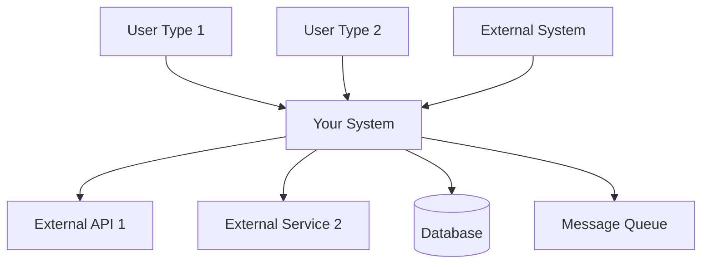
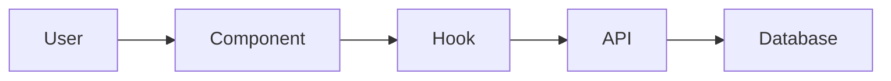
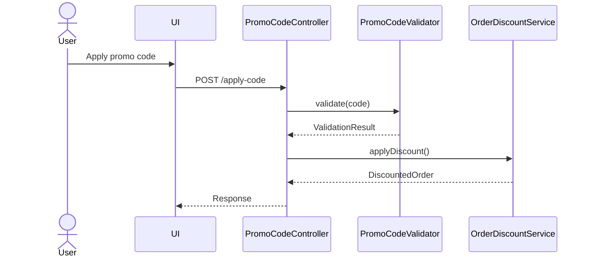
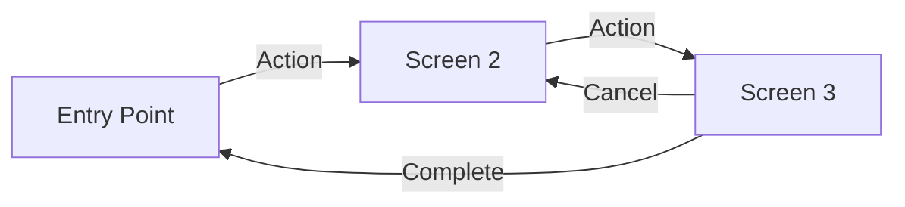
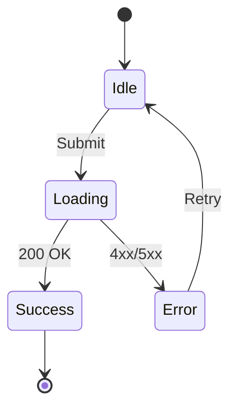

# Solution Design Document

## Validation Checklist

### CRITICAL GATES (Must Pass)

- [ ] All required sections are complete
- [ ] No [NEEDS CLARIFICATION] markers remain
- [ ] Architecture pattern is clearly stated with rationale
- [ ] **All architecture decisions confirmed by user**
- [ ] Every interface has specification

### QUALITY CHECKS (Should Pass)

- [ ] All context sources are listed with relevance ratings
- [ ] Project commands are discovered from actual project files
- [ ] Constraints → Strategy → Design → Implementation path is logical
- [ ] Every component in diagram has directory mapping
- [ ] Error handling covers all error types
- [ ] Quality requirements are specific and measurable
- [ ] Component names consistent across diagrams
- [ ] A developer could implement from this design

---

## Constraints

[NEEDS CLARIFICATION: What constraints limit the solution space?]

CON-1 [Language/framework requirements, performance targets, browser support]
CON-2 [Coding standards, deployment restrictions, team capabilities]
CON-3 [Auth requirements, data protection needs, regulatory compliance]

## Implementation Context

**IMPORTANT**: You MUST read and analyze ALL listed context sources to understand constraints, patterns, and existing architecture.

### Required Context Sources

[NEEDS CLARIFICATION: What documentation, patterns, and external resources apply?]

#### Documentation Context
```yaml
# Internal documentation and patterns
- doc: docs/patterns/pattern-name.md
  relevance: HIGH
  why: "Existing pattern that must be followed"

- doc: docs/interfaces/interface-name.md
  relevance: MEDIUM
  why: "External service integration requirements"

# External documentation and APIs (if applicable)
- url: https://docs.library.com/api
  relevance: MEDIUM
  why: "Third-party API constraints"
```

#### Code Context
```yaml
# Source code files that must be understood
- file: src/components/placeholder/example.tsx
  relevance: HIGH
  why: "Explanation of why this file matters"

- file: @package.json
  relevance: MEDIUM
  why: "Dependencies and build scripts"
```

#### External APIs (if applicable)
```yaml
# Third-party services this feature integrates with
- service: [Service Name]
  doc: [URL or internal reference]
  relevance: [HIGH/MEDIUM/LOW]
  why: "[Integration requirements]"
```

### Implementation Boundaries

[NEEDS CLARIFICATION: What are the boundaries for this implementation?]
- **Must Preserve**: [Critical behavior/interfaces to maintain]
- **Can Modify**: [Areas open for refactoring]
- **Must Not Touch**: [Files/systems that are off-limits]

### External Interfaces

[NEEDS CLARIFICATION: What are all the external communication partners and system boundaries?]

#### System Context Diagram



#### Interface Specifications

```yaml
# Inbound Interfaces (what calls this system)
inbound:
  - name: "User Web Interface"
    type: HTTP/HTTPS
    format: REST/GraphQL
    authentication: [OAuth2/JWT/Session]
    doc: @docs/interfaces/web-api.md
    data_flow: "User actions and queries"

  - name: "Mobile App API"
    type: HTTPS
    format: REST
    authentication: JWT
    doc: @docs/interfaces/mobile-api.md
    data_flow: "Mobile-specific operations"

  - name: "Webhook Receiver"
    type: HTTPS
    format: JSON
    authentication: HMAC signature
    doc: @docs/interfaces/webhook-spec.md
    data_flow: "Event notifications from external systems"

# Outbound Interfaces (what this system calls)
outbound:
  - name: "Payment Gateway"
    type: HTTPS
    format: REST
    authentication: API Key
    doc: @docs/interfaces/payment-gateway.md
    data_flow: "Transaction processing"
    criticality: HIGH

  - name: "Notification Service"
    type: AMQP/HTTPS
    format: JSON
    authentication: Service Token
    doc: @docs/interfaces/notification-service.md
    data_flow: "User notifications"
    criticality: MEDIUM

  - name: "Analytics Platform"
    type: HTTPS
    format: JSON
    authentication: API Key
    doc: @docs/interfaces/analytics.md
    data_flow: "Event tracking"
    criticality: LOW

# Data Interfaces
data:
  - name: "Primary Database"
    type: PostgreSQL/MySQL/MongoDB
    connection: Connection Pool
    doc: @docs/interfaces/database-schema.md
    data_flow: "Application state persistence"

  - name: "Cache Layer"
    type: Redis/Memcached
    connection: Client Library
    doc: @docs/interfaces/cache-strategy.md
    data_flow: "Temporary data and sessions"

  - name: "File Storage"
    type: S3/Azure Blob/GCS
    connection: SDK
    doc: @docs/interfaces/storage-api.md
    data_flow: "Media and document storage"
```

### Cross-Component Boundaries (if applicable)

[NEEDS CLARIFICATION: What are the boundaries between components/teams?]

- **API Contracts**: [Which interfaces are public contracts that cannot break]
- **Team Ownership**: [Which team owns which component]
- **Shared Resources**: [Databases, queues, caches used by multiple components]
- **Breaking Change Policy**: [How to handle changes that affect other components]

### Project Commands

[NEEDS CLARIFICATION: What are the project-specific commands? Discover from package.json, Makefile, or build configs.]

```bash
# Core Commands (discovered from project files)
Install: [npm install / pip install / go mod download]
Dev:     [npm run dev / python manage.py runserver]
Test:    [npm test / pytest / go test]
Lint:    [npm run lint / flake8 / golint]
Build:   [npm run build / python setup.py / go build]

# Database (if applicable)
Migrate: [migration command]
Seed:    [seed command]
```

## Solution Strategy

[NEEDS CLARIFICATION: What is the high-level approach to solving this problem?]

- Architecture Pattern: [Describe the approach (e.g., layered, modular, microservice)]
- Integration Approach: [How this feature integrates with the current system]
- Justification: [Why this approach fits given the constraints and scope]
- Key Decisions: [Major technical decisions and their rationale]

## Building Block View

### Components

[NEEDS CLARIFICATION: What are the main components and how do they interact? Create a component diagram showing the relationships]


### Directory Map

[NEEDS CLARIFICATION: Where will new code be added and existing code modified? For multi-component features, provide directory structure for each component.]

**Component**: [component-name]
```
.
├── src/
│   ├── feature_area/
│   │   ├── [discovered structure] # NEW/MODIFY: Description
│   │   └── [discovered structure] # NEW/MODIFY: Description
│   └── shared/
│       └── [discovered structure] # NEW/MODIFY: Description
```

**Component**: [another-component-name] (if applicable)
```
.
├── [discovered structure]
│   └── [discovered structure]
```

### Interface Specifications

**Note**: Interfaces can be documented by referencing external documentation files OR specified inline. Choose the approach that best fits your project's documentation structure.

#### Interface Documentation References

[NEEDS CLARIFICATION: What interface documentation already exists that should be referenced?]
```yaml
# Reference existing interface documentation
interfaces:
  - name: "User Authentication API"
    doc: @docs/interfaces/auth-api.md
    relevance: CRITICAL
    sections: [authentication_flow, token_management]
    why: "Core authentication flow must be followed"

  - name: "Payment Processing Interface"
    doc: @docs/interfaces/payment-gateway.md
    relevance: HIGH
    sections: [transaction_processing, webhook_handling]
    why: "Integration with payment provider constraints"

  - name: "Event Bus Interface"
    doc: @docs/interfaces/event-bus.md (NEW)
    relevance: MEDIUM
    sections: [event_format, subscription_model]
    why: "New event-driven communication pattern"
```

#### Data Storage Changes

[NEEDS CLARIFICATION: Are database schema changes needed? If yes, specify tables, columns, and relationships. If no, remove this section]
```yaml
# Database/storage schema modifications
Table: primary_entity_table
  ADD COLUMN: new_field (data_type, constraints)
  MODIFY COLUMN: existing_field (new_constraints)
  ADD INDEX: performance_index (fields)

Table: supporting_entity_table (NEW)
  id: primary_key
  related_id: foreign_key
  business_field: data_type, constraints

# Reference detailed schema documentation if available
schema_doc: @docs/interfaces/database-schema.md
migration_scripts: @migrations/v2.1.0/
```

#### Internal API Changes

[NEEDS CLARIFICATION: What API endpoints are being added or modified? Specify methods, paths, request/response formats]

```yaml
# Application endpoints being added/modified
Endpoint: Feature Operation
  Method: HTTP_METHOD
  Path: /api/version/resource/operation
  Request:
    required_field: data_type, validation_rules
    optional_field: data_type, default_value
  Response:
    success:
      result_field: data_type
      metadata: object_structure
    error:
      error_code: string
      message: string
      details: object (optional)

# Reference comprehensive API documentation if available
api_doc: @docs/interfaces/internal-api.md
openapi_spec: @specs/openapi.yaml
```

#### Application Data Models

[NEEDS CLARIFICATION: What data models/entities are being created or modified? Define fields and behaviors]

```pseudocode
# Core business objects being modified/created
ENTITY: PrimaryEntity (MODIFIED/NEW)
  FIELDS:
    existing_field: data_type
    + new_field: data_type (NEW)
    ~ modified_field: updated_type (CHANGED)

  BEHAVIORS:
    existing_method(): return_type
    + new_method(parameters): return_type (NEW)
    ~ modified_method(): updated_return_type (CHANGED)

ENTITY: SupportingEntity (NEW)
  FIELDS: [field_definitions]
  BEHAVIORS: [method_definitions]

# Reference domain model documentation if available
domain_doc: @docs/domain/entity-model.md
```

#### Integration Points

[NEEDS CLARIFICATION: What external systems does this feature connect to? For multi-component features, also document inter-component communication.]

```yaml
# Inter-Component Communication (between your components)
- from: [source-component]
  to: [target-component]
    - protocol: [REST/GraphQL/gRPC/WebSocket/MessageQueue]
    - doc: @docs/interfaces/internal-api.md
    - endpoints: [specific endpoints or topics]
    - data_flow: "Description of what data flows between components"

# External System Integration (third-party services)
External_Service_Name:
  - doc: @docs/interfaces/service-name.md
  - sections: [relevant_endpoints, data_formats]
  - integration: "Brief description of how systems connect"
  - critical_data: [data_elements_exchanged]
```

### Implementation Examples

**Purpose**: Provide strategic code examples to clarify complex logic, critical algorithms, or integration patterns. These examples are for guidance, not prescriptive implementation.

**Include examples for**:
- Complex business logic that needs clarification
- Critical algorithms or calculations
- Non-obvious integration patterns
- Security-sensitive implementations
- Performance-critical sections

[NEEDS CLARIFICATION: Are there complex areas that would benefit from code examples? If not, remove this section]

#### Example: [Complex Business Logic Name]

**Why this example**: [Explain why this specific example helps clarify the implementation]

```typescript
// Example: Discount calculation with multiple rules
// This demonstrates the expected logic flow, not the exact implementation
function calculateDiscount(order: Order, user: User): Discount {
  // Business rule: VIP users get additional benefits
  const baseDiscount = order.subtotal * getBaseDiscountRate(user.tier);

  // Complex rule: Stacking discounts with limits
  const promotionalDiscount = Math.min(
    order.promotions.reduce((sum, promo) => sum + promo.value, 0),
    order.subtotal * MAX_PROMO_PERCENTAGE
  );

  // Edge case: Never exceed maximum discount
  return Math.min(
    baseDiscount + promotionalDiscount,
    order.subtotal * MAX_TOTAL_DISCOUNT
  );
}
```

#### Example: [Integration Pattern Name]

**Why this example**: [Explain why this pattern is important to document]

```python
# Example: Retry pattern for external service integration
# Shows expected error handling approach
async def call_payment_service(transaction):
    """
    Demonstrates resilient integration pattern.
    Actual implementation may use circuit breaker library.
    """
    for attempt in range(MAX_RETRIES):
        try:
            response = await payment_client.process(transaction)
            if response.requires_3ds:
                # Critical: Handle 3D Secure flow
                return await handle_3ds_flow(response)
            return response
        except TransientError as e:
            if attempt == MAX_RETRIES - 1:
                # Final attempt failed, escalate
                raise PaymentServiceUnavailable(e)
            await exponential_backoff(attempt)
        except PermanentError as e:
            # Don't retry permanent failures
            raise PaymentFailed(e)
```

#### Test Examples as Interface Documentation

[NEEDS CLARIFICATION: Can unit tests serve as interface documentation?]

```javascript
// Example: Unit test as interface contract
describe('PromoCodeValidator', () => {
  it('should validate promo code format and availability', async () => {
    // This test documents expected interface behavior
    const validator = new PromoCodeValidator(mockRepository);

    // Valid code passes all checks
    const validResult = await validator.validate('SUMMER2024');
    expect(validResult).toEqual({
      valid: true,
      discount: { type: 'percentage', value: 20 },
      restrictions: { minOrder: 50, maxUses: 1 }
    });

    // Expired code returns specific error
    const expiredResult = await validator.validate('EXPIRED2023');
    expect(expiredResult).toEqual({
      valid: false,
      error: 'PROMO_EXPIRED',
      message: 'This promotional code has expired'
    });
  });
});
```

## Runtime View

### Primary Flow

[NEEDS CLARIFICATION: What is the main user action and how does the system respond? Document the step-by-step flow]

#### Primary Flow: [Main User Action]
1. User triggers [action]
2. System validates [what]
3. Process executes [how]
4. Result displays [where]



### Error Handling

[NEEDS CLARIFICATION: How are different error types handled?]

- Invalid input: [specific error message and user guidance]
- Network failure: [retry strategy or fallback behavior]
- Business rule violation: [user feedback and recovery options]

### Complex Logic (if applicable)

[NEEDS CLARIFICATION: Is there complex algorithmic logic that needs documentation? If yes, detail the algorithm. If no, remove this section]

```
ALGORITHM: Process Feature Request
INPUT: user_request, current_state
OUTPUT: processed_result

1. VALIDATE: input_parameters, user_permissions, system_state
2. TRANSFORM: raw_input -> structured_data
3. APPLY_BUSINESS_RULES:
   - Check constraints and limits
   - Calculate derived values
   - Apply conditional logic
4. INTEGRATE: update_external_systems, notify_stakeholders
5. PERSIST: save_changes, log_activities
6. RESPOND: return_result, update_user_interface
```

## Deployment View

[NEEDS CLARIFICATION: What are the deployment requirements and considerations? For multi-application features, consider coordination and dependencies. If there is no change to existing deployment, them remove sub-sections and just comment it as "no change"]

### Single Application Deployment
- **Environment**: [Where this runs - client/server/edge/cloud]
- **Configuration**: [Required env vars or settings]
- **Dependencies**: [External services or APIs needed]
- **Performance**: [Expected load, response time targets, caching strategy]

### Multi-Component Coordination (if applicable)

[NEEDS CLARIFICATION: How do multiple components coordinate during deployment?]
- **Deployment Order**: [Which components must deploy first?]
- **Version Dependencies**: [Minimum versions required between components]
- **Feature Flags**: [How to enable/disable features during rollout]
- **Rollback Strategy**: [How to handle partial deployment failures]
- **Data Migration Sequencing**: [Order of database changes across services]

## Cross-Cutting Concepts

### Pattern Documentation

[NEEDS CLARIFICATION: What existing patterns will be used and what new patterns need to be created?]
```yaml
# Existing patterns used in this feature
- pattern: @docs/patterns/[pattern-name].md
  relevance: [CRITICAL|HIGH|MEDIUM|LOW]
  why: "[Brief explanation of why this pattern is needed]"

# New patterns created for this feature
- pattern: @docs/patterns/[new-pattern-name].md (NEW)
  relevance: [CRITICAL|HIGH|MEDIUM|LOW]
  why: "[Brief explanation of why this pattern was created]"
```

### User Interface & UX (if applicable)

[NEEDS CLARIFICATION: What UI/UX architecture decisions apply to this feature?]

**Information Architecture:**
- Navigation: [Site structure, menu hierarchy, breadcrumbs]
- Content Organization: [Page layouts, content grouping, user mental models]
- User Flows: [Task completion paths, entry/exit points]

**Design System:**
- Components: [Which design system components to use/extend]
- Tokens: [Colors, typography, spacing from design system]
- Patterns: [Form patterns, feedback patterns, loading states]

**Interaction Design:**
- State Management: [UI state, form state, optimistic updates]
- Feedback: [Loading indicators, success/error states, notifications]
- Accessibility: [WCAG level, keyboard navigation, screen reader support]

#### UI Visualization Guide

**Entry Points** — Use ASCII wireframes to show where features live:
```
┌─────────────────────────────────────────┐
│  Workspace Switcher Dropdown            │
├─────────────────────────────────────────┤
│  ✓ Current Workspace                    │
│    Other Workspace                      │
│  ─────────────────────────────          │
│  ⚙️  Settings                           │
│  🔑 API Keys                  ← NEW     │
└─────────────────────────────────────────┘
```

**Screen Flows** — Use Mermaid flowcharts for navigation:


**Component States** — Use Mermaid state diagrams for interactions:


### System-Wide Patterns

[NEEDS CLARIFICATION: What system-wide patterns and concerns apply to this feature?]
- Security: [Authentication, authorization, encryption patterns]
- Error Handling: [Global vs local strategies, error propagation]
- Performance: [Caching strategies, batching, async patterns]
- i18n/L10n: [Multi-language support, localization approaches]
- Logging/Auditing: [Observability patterns, audit trail implementation]

### Multi-Component Patterns (if applicable)

[NEEDS CLARIFICATION: What patterns apply across multiple components?]
- **Communication Patterns**: [Sync vs async, event-driven, request-response]
- **Data Consistency**: [Eventual consistency, distributed transactions, saga patterns]
- **Shared Code**: [Shared libraries, monorepo packages, code generation]
- **Service Discovery**: [How components find each other in different environments]
- **Circuit Breakers**: [Handling failures between components]
- **Distributed Tracing**: [Correlation IDs, trace propagation across services]

## Architecture Decisions

[NEEDS CLARIFICATION: What key architecture decisions need to be made? Each requires user confirmation.]

- [ ] ADR-1 [Decision Name]: [Choice made]
  - Rationale: [Why this over alternatives]
  - Trade-offs: [What we accept]
  - User confirmed: _Pending_

- [ ] ADR-2 [Decision Name]: [Choice made]
  - Rationale: [Why this over alternatives]
  - Trade-offs: [What we accept]
  - User confirmed: _Pending_

## Quality Requirements

[NEEDS CLARIFICATION: What are the specific, measurable quality requirements?]
- Performance: [Response time targets, throughput, resource limits]
- Usability: [User experience requirements, accessibility standards]
- Security: [Access control, data protection, audit requirements]
- Reliability: [Uptime targets, error recovery, data integrity]

## Acceptance Scenarios

[NEEDS CLARIFICATION: What scenarios verify the PRD acceptance criteria are met?]

Map each critical PRD acceptance criterion to a testable scenario. These scenarios define "done" for direct implementation without a PLAN.

**Scenario: [PRD/AC-X.Y - Brief description]**
```gherkin
Given: [Initial system state]
When: [User/system action]
Then: [Expected outcome]
And: [Additional verifiable result]
```

**Scenario: [PRD/AC-X.Y - Error handling]**
```gherkin
Given: [Pre-condition]
When: [Invalid action or error condition]
Then: [System handles gracefully]
And: [User receives appropriate feedback]
```

**Scenario: [PRD/AC-X.Y - Edge case]**
```gherkin
Given: [Boundary condition]
When: [Edge case operation]
Then: [Correct behavior at limits]
```

## Risks and Technical Debt

### Known Technical Issues

[NEEDS CLARIFICATION: What current bugs, limitations, or issues affect this feature?]
- [Current bugs or limitations that affect the system]
- [Performance bottlenecks and their specific locations]
- [Memory leaks or resource management problems]
- [Integration issues with external systems]

### Technical Debt

[NEEDS CLARIFICATION: What technical debt exists that impacts this feature?]
- [Code duplication that needs refactoring]
- [Temporary workarounds that need proper solutions]
- [Anti-patterns that shouldn't be replicated]
- [Architectural violations or deviations]

### Implementation Gotchas

[NEEDS CLARIFICATION: What non-obvious issues might trip up implementation?]
- [Non-obvious dependencies or side effects]
- [Timing issues, race conditions, or synchronization problems]
- [Configuration quirks or environment-specific issues]
- [Known issues with third-party dependencies]

## Glossary

[NEEDS CLARIFICATION: Define domain-specific and technical terms used throughout this document]

### Domain Terms

| Term | Definition | Context |
|------|------------|---------|
| [Domain Term] | [Clear, concise definition] | [Where/how it's used in this feature] |
| [Business Concept] | [Explanation in plain language] | [Relevance to the implementation] |

### Technical Terms

| Term | Definition | Context |
|------|------------|---------|
| [Technical Term] | [Technical definition] | [How it applies to this solution] |
| [Acronym/Abbreviation] | [Full form and explanation] | [Usage in the architecture] |

### API/Interface Terms

| Term | Definition | Context |
|------|------------|---------|
| [API Term] | [Specific meaning in this context] | [Related endpoints or operations] |
| [Protocol/Format] | [Technical specification] | [Where used in integrations] |
