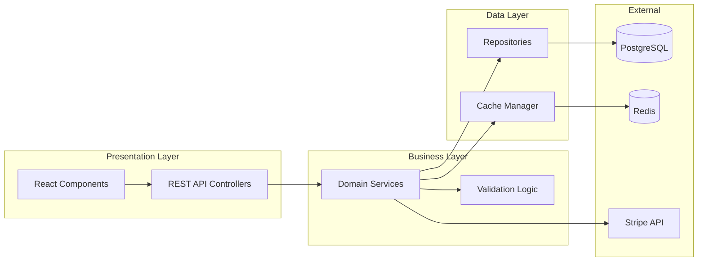
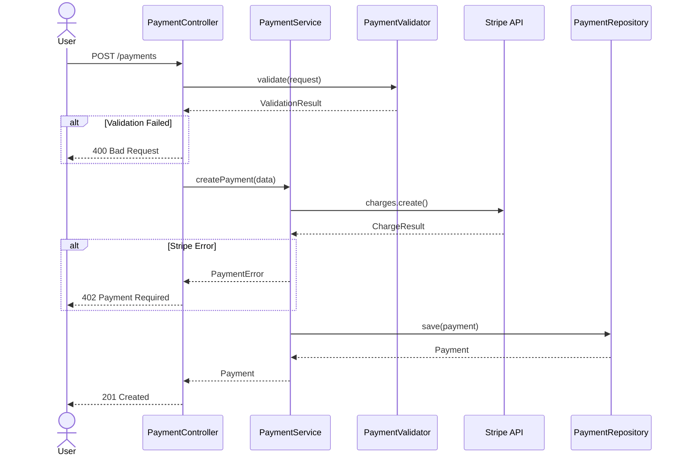

# Architecture Examples

Reference examples for common architectural patterns in SDDs.

## Example: Component Diagram



## Example: Directory Map

```
.
├── src/
│   ├── payments/                    # NEW: Payment feature module
│   │   ├── controllers/
│   │   │   └── PaymentController.ts # NEW: REST API endpoints
│   │   ├── services/
│   │   │   └── PaymentService.ts    # NEW: Business logic
│   │   ├── models/
│   │   │   └── Payment.ts           # NEW: Domain entity
│   │   ├── repositories/
│   │   │   └── PaymentRepository.ts # NEW: Data access
│   │   └── validators/
│   │       └── PaymentValidator.ts  # NEW: Input validation
│   └── shared/
│       └── errors/
│           └── PaymentError.ts      # NEW: Custom errors
```

## Example: Interface Specification

```yaml
Endpoint: Create Payment
  Method: POST
  Path: /api/v1/payments
  Request:
    amount: number, required, min: 0.01
    currency: string, required, enum: [USD, EUR, GBP]
    customer_id: string, required, uuid
    description: string, optional, max: 255
  Response:
    success:
      payment_id: string, uuid
      status: string, enum: [pending, completed, failed]
      created_at: string, ISO8601
    error:
      error_code: string, enum: [INVALID_AMOUNT, CUSTOMER_NOT_FOUND, PAYMENT_FAILED]
      message: string
      details: object, optional
```

## Example: Sequence Diagram



## Example: ADR Format

```markdown
- [x] ADR-1 Use PostgreSQL for Primary Storage: Selected PostgreSQL over MongoDB
  - Rationale: ACID compliance required for financial data, team expertise, existing infrastructure
  - Trade-offs: Less flexible schema, requires migrations, but strong consistency guarantees
  - User confirmed: ✅ Yes

- [x] ADR-2 Stripe for Payment Processing: Selected Stripe over Adyen
  - Rationale: Better developer experience, simpler integration, sufficient for current volume
  - Trade-offs: Slightly higher fees, but faster time-to-market and better documentation
  - User confirmed: ✅ Yes
```

## Example: Error Handling Pattern

```pseudocode
FUNCTION: handle_operation_errors(operation_result)
  CLASSIFY: error_type
    - ValidationError: Invalid input data
    - BusinessRuleError: Domain logic violation
    - IntegrationError: External service failure
    - SystemError: Infrastructure failure

  LOG:
    - error_type, message, context
    - stack_trace for SystemError only
    - correlation_id for tracing

  RESPOND:
    - ValidationError → 400 Bad Request + field errors
    - BusinessRuleError → 422 Unprocessable Entity + business message
    - IntegrationError → 502 Bad Gateway + retry guidance
    - SystemError → 500 Internal Server Error + generic message
```

## Example: Quality Requirements

| Requirement | Target | Measurement |
|-------------|--------|-------------|
| API Response Time | p95 < 200ms | APM monitoring (Datadog) |
| Payment Success Rate | > 99.5% | Success / Total transactions |
| System Availability | 99.9% uptime | Health check monitoring |
| Error Rate | < 0.1% | Errors / Total requests |

## What Makes Good Architecture Documentation

1. **Visual + Text** - Diagrams AND written explanations
2. **Concrete Paths** - Actual file paths, not just concepts
3. **Complete Interfaces** - Request/response with all fields
4. **Decision Rationale** - WHY choices were made
5. **Measurable Quality** - Numbers, not "fast" or "scalable"
6. **Error Coverage** - All error types handled
7. **Implementable** - Developer can start coding from this
